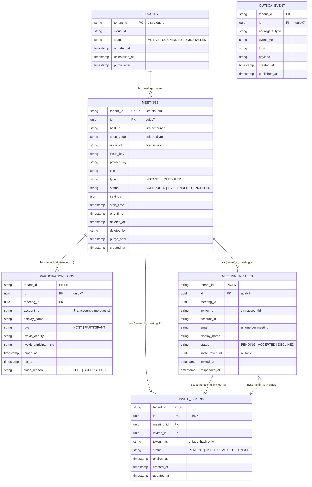

# meet — Service Architecture

> **Current-state architecture.** This document describes what exists in the
> `meet` service today (B1.0.0 phase). For hexagonal layering, DDD patterns, and
> shared conventions see `services/AGENTS.md`. For the system-wide view see
> `docs/architecture.md`.

## 1. Service Identity

- **Name:** meet
- **Package:** `io.github.smiskinext.meet`
- **Bounded Context:** Meeting core — meetings, participation, invitations, and
  join requests, plus LiveKit room/token issuance.
- **Responsibility:** Owns the meeting aggregate and everything around joining a
  meeting (invitees, invite tokens, join requests, participation logs). It is
  the most complete reference service and the primary producer of domain events.

## 2. Context & Dependencies

- **Upstream (callers):** Kong Gateway (REST, once endpoints are built), LiveKit
  (room webhooks, once the receiver is built).
- **Downstream (dependencies):** PostgreSQL (`zms_meetings`), Valkey (token
  cache / read models), Kafka (outbox publishing), LiveKit (token issuance).

### C4 — System Context

> The diagrams below are written in [D2](https://d2lang.com) using C4 shapes. D2
> does not parse Markdown — extract each `d2` block into its own file before
> rendering (`d2 --layout elk <file>.d2 out.svg`).

```d2
vars: {d2-config: {layout-engine: elk}}
direction: down

user: "Jira user\n[Person]\nvia Forge App + Kong" {shape: person}
meet: "meet\n[Software System]\nmeeting core: meetings, invitees,\njoin requests, LiveKit tokens"
livekit: "LiveKit\n[Software System]\nSFU + room webhooks"
tenant: "tenant\n[Software System]"
notification: "notification\n[Software System]"

user -> meet: "manage / join meetings (REST)"
meet -> livekit: "issue tokens / receive webhooks"
tenant -> meet: "tenant.* (projection)"
meet -> notification: "meet.* events (via Kafka)"
```

### C4 — Container

```d2
vars: {d2-config: {layout-engine: elk}}
direction: down

user: "Jira user\n[Person]" {shape: person}
kong: "Kong Gateway\n[Container]" {shape: hexagon}

meet: "meet" {
  app: "meet\n[Spring Boot]"
  db: "zms_meetings\n[PostgreSQL]" {shape: cylinder}
  valkey: "Valkey\n[cache · read models]" {shape: cylinder}
}

kafka: "Kafka\n[CloudEvents · key = tenant_id]" {shape: queue}
livekit: "LiveKit\n[SFU]"

user -> kong: "REST"
kong -> meet.app: "REST (not built yet)"
meet.app -> meet.db: "read / write (meetings, invitees, tokens, logs, outbox)"
meet.app -> meet.valkey: "token cache · join-request state (adapters — target)"
meet.app -> livekit: "token issuance · webhook receiver (target)"
meet.app -> kafka: "publish meet.* (outbox poller — target)"
kafka -> meet.app: "consume tenant.* → projection (target)"
```

## 3. API Surface

- **Endpoint groups:** None implemented yet. The `presentation` layer is empty
  (`.gitkeep` only) and `services/meet/openapi.yaml` currently emits
  `paths: {}`.
- **Full spec:** `services/meet/openapi.yaml` (generated from tests; currently
  empty).

> The domain layer implies future groups (meetings CRUD, join-request flow,
> invitee management, LiveKit webhook receiver), but no controllers exist yet.

## 4. Events

### Published

All 16 events below have concrete `PublishableEvent` classes in `domain/event/`.
`eventType` follows `io.github.smiskinext.meet.<aggregate>.<action>.v1`; the
Kafka topic is listed in the table.

| Topic                                    | Trigger                                | Payload summary                                            |
| ---------------------------------------- | -------------------------------------- | ---------------------------------------------------------- |
| `meet.meeting.scheduled`                 | Meeting created (INSTANT or SCHEDULED) | hostId, shortCode, title?, startTime?                      |
| `meet.meeting.started`                   | Meeting goes LIVE                      | hostId, liveKitRoomName, startedAt                         |
| `meet.meeting.ended`                     | Meeting ends                           | hostId, endedAt                                            |
| `meet.meeting.cancelled`                 | Scheduled meeting cancelled            | hostId, title?, shortCode, startTime?, invitees[]          |
| `meet.meeting.settings-updated`          | Host changes meeting settings          | updatedBy, meetingStatus, old/new settings                 |
| `meet.meeting.invitations-sent`          | Invitations dispatched                 | title?, shortCode, invitees[], inviteeTokens{}             |
| `meet.meeting.invite-tokens-invalidated` | Invite tokens revoked for a meeting    | hostId, shortCode, affectedInvitees[]                      |
| `meet.join-request.created`              | Guest requests to join                 | meetingId, joinRequestId, accountId, displayName, deviceId |
| `meet.join-request.approved`             | Host approves a join request           | joinRequestId, approvedBy, liveKitToken, roomName          |
| `meet.join-request.denied`               | Host denies a join request             | joinRequestId, deniedBy?                                   |
| `meet.join-request.expired`              | Join request times out                 | meetingId, joinRequestId                                   |
| `meet.participant.joined`                | Participant joins the room             | meetingId, accountId, displayName                          |
| `meet.participant.left`                  | Participant leaves the room            | meetingId, accountId, displayName                          |
| `meet.participant.kicked`                | Host removes a participant             | kickedBy, kickedAccountId?, kickedDisplayName?             |
| `meet.invitee.accepted`                  | Invitee accepts an invitation          | aggregateId, meetingId, inviterId                          |
| `meet.invitee.declined`                  | Invitee declines an invitation         | aggregateId, meetingId, inviterId                          |

> All events carry `eventId`, `tenantId`, and an `occurredAt`/timestamp field.
> The transactional outbox poller that publishes these is **not built yet**
> (`infrastructure/messaging/` is `.gitkeep`).

### Consumed

None implemented yet. **Target (per `docs/architecture.md`):** consume
`tenant.*` to maintain the local `tenants` projection.

## 5. Data Stores

- **Database:** PostgreSQL — `zms_meetings`
- **Cache / other:** Valkey (Redis-compatible) — configured via
  `spring.data.redis`; intended for LiveKit token cache, join-request
  state/replay, and the live participant read model. Adapters not yet built.

### Tables

| Table                | Purpose                                       | Notes                                                     |
| -------------------- | --------------------------------------------- | --------------------------------------------------------- |
| `tenants`            | Local projection synced from `tenant` service | PK `tenant_id`; unpartitioned                             |
| `meetings`           | Meeting aggregate                             | `PARTITION BY HASH (tenant_id)` × 16; soft-delete         |
| `participation_logs` | Join/leave history per participant            | Partitioned × 16; UUIDv7 id                               |
| `meeting_invitees`   | Invited people per meeting                    | Partitioned × 16; unique `(tenant_id, meeting_id, email)` |
| `invite_tokens`      | Hashed invite tokens                          | Partitioned × 16; unique `(tenant_id, token_hash)`        |
| `outbox_event`       | Transactional outbox for Kafka                | PK `(tenant_id, id)`; partial index on unpublished        |

### Schema

Transcribed directly from
`services/meet/src/main/resources/db/migration/B1.0.0__baseline.sql` (the source
of truth). Only intra-service foreign keys are shown; `tenants` is a projection.
Foreign keys are composite `(tenant_id, <id>)` so joins prune to one partition.



> Every business table is `PARTITION BY HASH (tenant_id)` × 16 and leads its
> PK/FK/unique constraints with `tenant_id` for partition pruning; `tenants` is
> the unpartitioned projection. `OUTBOX_EVENT` has no foreign key. `*JpaEntity`
> classes under `infrastructure/persistence/` must match this schema
> (`ddl-auto: validate`).

## 6. External Integrations

- **LiveKit (SFU)**
    - Purpose: real-time media room; `meet` mints access tokens and (target)
      receives room webhooks.
    - Method: server SDK for token issuance; webhook receiver (not yet built).
      `LiveKitPort` exists in `domain/port/`; the adapter is not implemented.
- **Valkey**
    - Purpose: token cache, join-request state/replay, live participant read
      model.
    - Method: Spring Data Redis (`spring.data.redis`). Adapters not yet built.

## 7. Operations

- **Configuration** (`src/main/resources/application.yaml`)
    - `spring.datasource.url` — `zms_meetings` PostgreSQL connection (single
      datasource today; the read replica in `docs/architecture.md` is a target).
    - `spring.data.redis.*` — Valkey host/port/password.
    - `app.livekit.*` — LiveKit URL, API key/secret, `webhook-url`,
      `token-expiry-seconds` (1800).
    - `app.sse.timeout-ms` / `app.sse.join-request-timeout-ms` — SSE timeouts.
    - `app.cursor.secret` — keyset pagination cursor signing.
    - `zms.invite.token-secret` / `zms.invite.token-expiry-days` (7) — invite
      token hashing and TTL.
- **Build & Test**
    - Build: `./services/gradlew -p services/meet build`
    - Test: `./services/gradlew -p services/meet test`
    - See `services/AGENTS.md` for the full command reference.
- **Deployment**
    - Manifest: no `meet` manifest yet. `services/k8s/base/services/` ships the
      legacy `meeting-management.yaml`.
    - Notes: read-heavy with write bursts (join/leave); CQRS with a read replica
      is a target design, not current config.

## 8. Service-Specific Notes

### Notable Concerns

- **Domain-complete, wiring pending.** The `domain` layer is fully modeled
  (aggregates, value objects, ports, 16 events) and `JpaEntity` classes exist,
  but the `application`, `presentation`, and `messaging` layers are empty. No
  REST endpoints, no outbox poller, no LiveKit/Valkey adapters yet.
- Every business table is `PARTITION BY HASH (tenant_id)` with 16 partitions;
  `tenant_id` (Jira `cloudId`) leads every PK/FK/unique constraint.
- `meetings.settings` is `JSONB`; `short_code` is unique per tenant among
  non-deleted rows.
- Participants require a Jira `accountId` (no anonymous guests in the schema).

### Glossary

- **short_code:** Human-friendly meeting join code, unique per tenant.
- **Join request:** A guest's request to enter a meeting, approved/denied by the
  host; approval returns a LiveKit token.
- **Invite token:** Hashed, expiring token tying an invitee to a meeting.
- **CQRS:** Command Query Responsibility Segregation — target design uses a read
  replica + Valkey read models; not yet wired.

### Last Updated

- 2026-07-12
