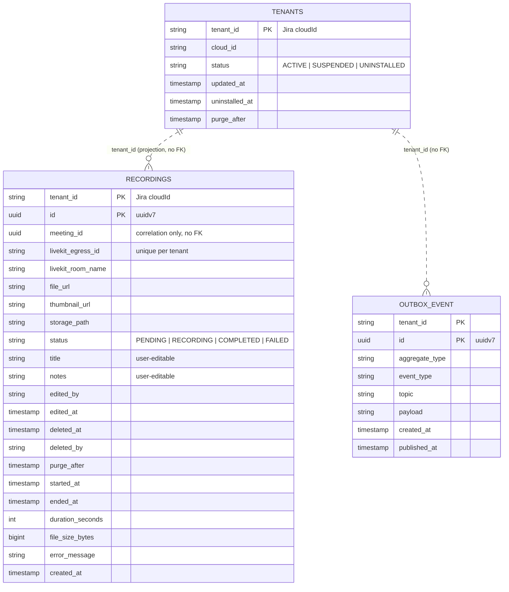

# record — Service Architecture

> **Current-state architecture.** This document describes what exists in the
> `record` service today (B1.0.0 phase). For hexagonal layering, DDD patterns,
> and shared conventions see `services/AGENTS.md`. For the system-wide view see
> `docs/architecture.md`.

## 1. Service Identity

- **Name:** record
- **Package:** `io.github.smiskinext.record`
- **Bounded Context:** Recording lifecycle — driven by LiveKit Egress, stored in
  RustFS (S3-compatible).
- **Responsibility:** Owns the `Recording` aggregate and its status machine
  (`PENDING → RECORDING → COMPLETED / FAILED`). It is fully independent of
  `meet`: there is no cross-service foreign key; `meeting_id` is a plain UUID
  used only for correlation.

## 2. Context & Dependencies

- **Upstream (callers):** Kong Gateway (REST, once endpoints are built), LiveKit
  Egress (webhooks, once the receiver is built).
- **Downstream (dependencies):** PostgreSQL (`zms_recordings`), Kafka (outbox
  publishing), LiveKit Egress, RustFS (S3-compatible object storage).

### C4 — System Context

> The diagrams below are written in [D2](https://d2lang.com) using C4 shapes. D2
> does not parse Markdown — extract each `d2` block into its own file before
> rendering (`d2 --layout elk <file>.d2 out.svg`).

```d2
vars: {d2-config: {layout-engine: elk}}
direction: down

user: "Jira user\n[Person]\nvia Forge App + Kong" {shape: person}
record: "record\n[Software System]\nrecording lifecycle\n(PENDING→RECORDING→COMPLETED/FAILED)"
livekit: "LiveKit Egress\n[Software System]\nserver-side recording"
storage: "RustFS\n[Software System]\nS3-compatible object storage"
tenant: "tenant\n[Software System]"

user -> record: "manage recordings (REST)"
livekit -> record: "egress webhooks"
record -> livekit: "start / stop egress"
livekit -> storage: "upload files"
record -> storage: "read file metadata / URLs"
tenant -> record: "tenant.* (projection)"
```

### C4 — Container

```d2
vars: {d2-config: {layout-engine: elk}}
direction: down

user: "Jira user\n[Person]" {shape: person}
kong: "Kong Gateway\n[Container]" {shape: hexagon}

record: "record" {
  app: "record\n[Spring Boot]"
  db: "zms_recordings\n[PostgreSQL]" {shape: cylinder}
}

kafka: "Kafka\n[CloudEvents · key = tenant_id]" {shape: queue}
livekit: "LiveKit Egress\n[External]"
storage: "RustFS\n[S3-compatible]" {shape: cylinder}

user -> kong: "REST"
kong -> record.app: "REST (not built yet)"
record.app -> record.db: "read / write (recordings, outbox)"
record.app -> livekit: "start/stop egress · webhook receiver (target)"
record.app -> storage: "file URLs / metadata (adapter — target)"
livekit -> storage: "upload recording files"
record.app -> kafka: "publish record.* (outbox poller — target)"
kafka -> record.app: "consume tenant.* → projection (target)"
```

## 3. API Surface

- **Endpoint groups:** None implemented yet. The `presentation` layer is empty
  (`.gitkeep` only) and `services/record/openapi.yaml` currently emits
  `paths: {}`.
- **Full spec:** `services/record/openapi.yaml` (generated from tests; currently
  empty).

## 4. Events

### Published

All three events below have concrete `PublishableEvent` classes in
`domain/event/`. `eventType` follows
`io.github.smiskinext.record.recording.<action>.v1`.

| Topic                        | Trigger                             | Payload summary                                                 |
| ---------------------------- | ----------------------------------- | --------------------------------------------------------------- |
| `record.recording.started`   | Egress starts (PENDING → RECORDING) | aggregateId, meetingId, startedAt                               |
| `record.recording.completed` | Egress finishes successfully        | aggregateId, meetingId, fileUrl, durationSeconds, fileSizeBytes |
| `record.recording.failed`    | Egress fails                        | aggregateId, meetingId, failedAt                                |

> All events carry `eventId` and `tenantId`. The transactional outbox poller
> that publishes these is **not built yet** (`infrastructure/messaging/` is
> `.gitkeep`).

### Consumed

None implemented yet. **Target (per `docs/architecture.md`):** consume
`tenant.*` to maintain the local `tenants` projection.

## 5. Data Stores

- **Database:** PostgreSQL — `zms_recordings`
- **Cache / other:** Valkey configured via `spring.data.redis` (present in
  config; no adapter yet).

### Tables

| Table          | Purpose                                       | Notes                                                                     |
| -------------- | --------------------------------------------- | ------------------------------------------------------------------------- |
| `tenants`      | Local projection synced from `tenant` service | PK `tenant_id`; unpartitioned                                             |
| `recordings`   | Recording aggregate + editable metadata       | `PARTITION BY HASH (tenant_id)` × 16; soft-delete; one active per meeting |
| `outbox_event` | Transactional outbox for Kafka                | PK `(tenant_id, id)`; partial index on unpublished                        |

### Schema

Transcribed directly from
`services/record/src/main/resources/db/migration/B1.0.0__baseline.sql` (the
source of truth). Relationships here are **non-identifying** (dashed `..`): a
recording belongs to a tenant via `tenant_id` and correlates to a meeting via
`meeting_id`, but neither is enforced by a foreign key (`meeting_id` crosses the
service boundary to `meet`; the `tenants` projection carries no FK by design).



> `recordings` is `PARTITION BY HASH (tenant_id)` × 16; `tenants` is the
> unpartitioned projection. A partial unique index
> (`uq_recordings_active_per_meeting`) enforces at most one
> `PENDING`/`RECORDING` recording per meeting. `RecordingJpaEntity` under
> `infrastructure/persistence/` must match this schema (`ddl-auto: validate`).

## 6. External Integrations

- **LiveKit Egress**
    - Purpose: server-side recording of a meeting room.
    - Method: LiveKit Egress API + webhooks (receiver not yet built).
- **RustFS (S3-compatible)**
    - Purpose: stores completed recording files uploaded by Egress.
    - Method: S3 API (`app.livekit.recording.*` — bucket, region, endpoint,
      access/secret keys, `force-path-style`). Adapter not yet built.
- **user-management (gRPC)**
    - Purpose: configured channel exists
      (`spring.grpc.client.channels.user-management`).
    - Method: gRPC. **No domain code references it** — likely vestigial from the
      legacy ZMS snapshot; see Notable Concerns.

## 7. Operations

- **Configuration** (`src/main/resources/application.yaml`)
    - `spring.datasource.url` — `zms_recordings` PostgreSQL connection.
    - `spring.data.redis.*` — Valkey host/port/password.
    - `spring.grpc.client.channels.user-management` — gRPC channel (unused by
      domain code).
    - `app.livekit.recording.*` — bucket, region, public + egress endpoints,
      access/secret keys, `force-path-style`, `pending-max-age` (`PT7M`).
    - `app.cursor.secret` — keyset pagination cursor signing.
- **Build & Test**
    - Build: `./services/gradlew -p services/record build`
    - Test: `./services/gradlew -p services/record test`
    - See `services/AGENTS.md` for the full command reference.
- **Deployment**
    - Manifest: no `record` manifest exists in `services/k8s/base/services/`.
    - Notes: hot paths are transcoding (CPU) and RustFS upload (network), not
      the database; `docs/architecture.md` targets an isolated egress node.

## 8. Service-Specific Notes

### Notable Concerns

- **Domain-complete, wiring pending.** The `Recording` aggregate, 3 events,
  repository port, and `RecordingSummary` projection exist, plus
  `RecordingJpaEntity`. The `application`, `presentation`, and `messaging`
  layers are empty. No REST endpoints, no outbox poller, no Egress/RustFS
  adapters yet.
- **Independent by design:** no foreign key from `recordings` to `meetings`;
  `meeting_id` is a plain UUID for correlation. The service owns its own DB.
- **Retention** is a target policy (soft-delete 15d, hard-delete 30d per
  `docs/architecture.md`). The schema supports it (`deleted_at`, `deleted_by`,
  `purge_after`, `idx_recordings_purge`) but no retention job is built yet.
- **gRPC vestige:** the `user-management` gRPC channel remains in config but is
  unreferenced by domain code. `docs/architecture.md` targets fully
  event-carried identity; this channel is a candidate for removal.

### Glossary

- **Egress:** LiveKit's server-side recording/export pipeline.
- **RustFS:** S3-compatible object storage for completed recording files.
- **purge_after:** Timestamp after which a soft-deleted recording is eligible
  for hard deletion.

### Last Updated

- 2026-07-12
