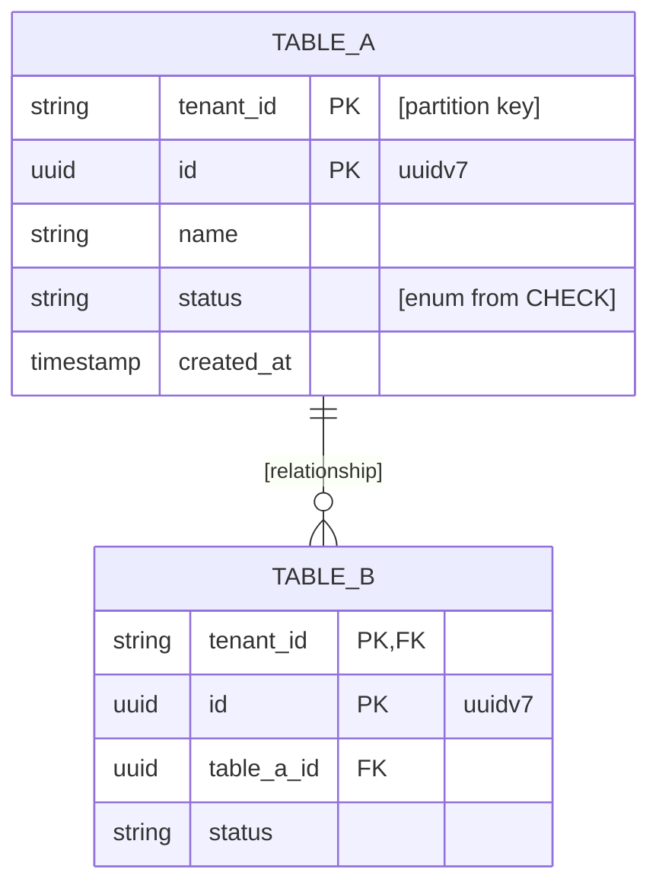

# [Service Name] — Service Architecture

> **Per-service architecture template.** Copy this file into
> `docs/[service-name].architecture.md`, fill in every `[placeholder]`, and
> update it when the service changes. For hexagonal layering, DDD patterns,
> domain model details, and shared conventions see `services/AGENTS.md`.

## 1. Service Identity

- **Name:** [service-name]
- **Package:** `io.github.smiskinext.[name]`
- **Bounded Context:** [bounded context this service owns]
- **Responsibility:** [1-2 sentences describing what this service does and why
  it exists]

## 2. Context & Dependencies

- **Upstream (callers):** [services or external actors that call this service]
- **Downstream (dependencies):** [services, stores, or external systems this
  service calls]

### C4 — System Context

Who and what talks to this service, at the highest level.

> The diagrams below are written in [D2](https://d2lang.com) using C4 shapes. D2
> does not parse Markdown — extract each `d2` block into its own file before
> rendering (`d2 --layout elk <file>.d2 out.svg`).

```d2
vars: {d2-config: {layout-engine: elk}}
direction: down

caller: "[Caller / Actor]\n[Person or System]" {shape: person}
system: "[this service]\n[Software System]\n[1-sentence responsibility]"
dep: "[Downstream System]\n[Software System]"

caller -> system: "[what it asks for]"
system -> dep: "[what it needs]"
```

### C4 — Container

Zoom into this service: its process plus the stores and external systems it
talks to directly. Replace every placeholder with real containers and edges.

```d2
vars: {d2-config: {layout-engine: elk}}
direction: down

caller: "[Caller]\n[Container]" {shape: person}

system: "[this service]" {
  app: "[name]\n[Spring Boot]"
  db: "[db_name]\n[PostgreSQL]" {shape: cylinder}
}

kafka: "Kafka\n[CloudEvents · key = tenant_id]" {shape: queue}
ext: "[External System]\n[e.g. LiveKit / Resend]"

caller -> system.app: "REST / SSE"
system.app -> system.db: "read / write"
system.app -> kafka: "publish [topic.*] (outbox)"
kafka -> system.app: "consume [topic.*]"
system.app -> ext: "[method]"
```

> Keep the Container diagram aligned with the actual process boundaries. Omit
> the Kafka or external nodes if this service does not use them.

## 3. API Surface

- **Endpoint groups:** [list primary REST/SSE groups, e.g. meetings CRUD,
  join-request flow, webhook receiver]
- **Full spec:** `services/[name]/openapi.yaml`

> The OpenAPI spec is generated — reference it directly instead of duplicating
> endpoint details here.

## 4. Events

### Published

| Topic        | Trigger                 | Payload summary |
| ------------ | ----------------------- | --------------- |
| [topic.name] | [what causes the event] | [key fields]    |
| [topic.name] | [what causes the event] | [key fields]    |

> Use "None" if this service does not publish events.

### Consumed

| Topic        | Source service | Action                              |
| ------------ | -------------- | ----------------------------------- |
| [topic.name] | [source]       | [what this service does on receipt] |
| [topic.name] | [source]       | [what this service does on receipt] |

> Use "None" if this service does not consume events.

## 5. Data Stores

- **Database:** [type, e.g. PostgreSQL] — `[db_name]`
- **Cache / other:** [e.g. Valkey — purpose: read models, pub/sub]

### Tables

| Table     | Purpose          | Notes                       |
| --------- | ---------------- | --------------------------- |
| [table_a] | [what it stores] | [partitioning / PK / index] |
| [table_b] | [what it stores] | [partitioning / PK / index] |
| [table_c] | [what it stores] | [partitioning / PK / index] |

### Schema

The schema is transcribed **directly from the SQL migration(s)** in
`services/[name]/src/main/resources/db/migration/` (the source of truth — JPA
`*JpaEntity` classes must match it, never the reverse). Render as a Mermaid
`erDiagram` so table relationships are explicit.



> Use "No database" if the service is stateless. List only stores this service
> owns or directly uses. Copy column names, types, and `CHECK` enum values
> verbatim from the `.sql` baseline; show relationships with crow's-foot
> cardinality (`||--o{`, `||--o|`); keep the diagram in sync when a new `V<n>__`
> migration lands.

## 6. External Integrations

- **[Integration name]**
    - Purpose: [what it provides to this service]
    - Method: [REST API / gRPC / SDK / webhook]
- **[Integration name]**
    - Purpose: [what it provides to this service]
    - Method: [REST API / gRPC / SDK / webhook]

> Omit this section or write "None" if no external integrations exist.

## 7. Operations

- **Configuration**
    - `[notable config key from application.yaml]` — [purpose]
    - `[notable config key]` — [purpose]
- **Build & Test**
    - Build: `./services/gradlew -p services/[name] build`
    - Test: `./services/gradlew -p services/[name] test`
    - See `services/AGENTS.md` for full command reference.
- **Deployment**
    - Manifest: `services/k8s/[name]/`
    - Notes: [any deployment-specific concern, e.g. node isolation, replicas,
      resource limits]

## 8. Service-Specific Notes

### Notable Concerns

- [anything unique to this service: CQRS level, retention policy, no-DB design,
  CPU-bound paths, etc.]

### Glossary

- **[Term]:** [definition specific to this service]
- **[Term]:** [definition specific to this service]

### Last Updated

- [YYYY-MM-DD]
