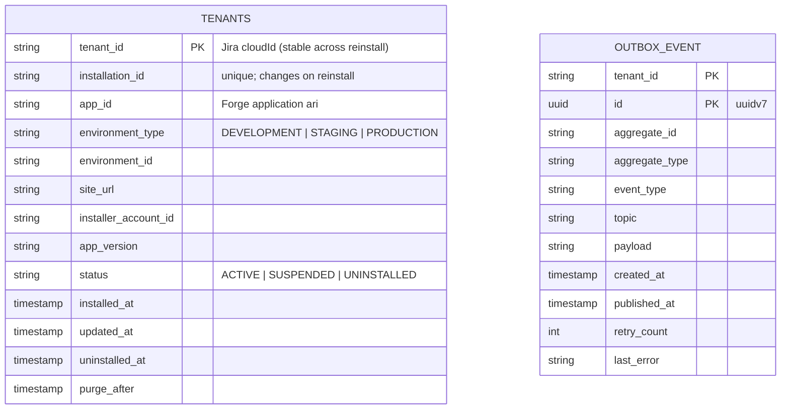

# tenant — Service Architecture

> **Current-state architecture.** This document describes what exists in the
> `tenant` service today (B1.0.0 phase). For hexagonal layering, DDD patterns,
> and shared conventions see `services/AGENTS.md`. For the system-wide view see
> `docs/architecture.md`.

## 1. Service Identity

- **Name:** tenant
- **Package:** `io.github.smiskinext.tenant`
- **Bounded Context:** Tenancy — the source of truth for Forge app
  installations, keyed by Jira `cloudId`.
- **Responsibility:** Owns the lifecycle of a Forge app installation (install /
  upgrade / uninstall) so downstream services can maintain their own tenant
  projection. It exists to decouple every other service from Atlassian's Forge
  lifecycle events.

## 2. Context & Dependencies

- **Upstream (callers):** Atlassian Forge (lifecycle events via Forge Remote),
  Kong Gateway (REST, once endpoints are built).
- **Downstream (dependencies):** PostgreSQL (`zms_tenants`), Kafka (event
  publishing via the transactional outbox).

### C4 — System Context

> The diagrams below are written in [D2](https://d2lang.com) using C4 shapes. D2
> does not parse Markdown — extract each `d2` block into its own file before
> rendering (`d2 --layout elk <file>.d2 out.svg`).

```d2
vars: {d2-config: {layout-engine: elk}}
direction: down

forge: "Atlassian Forge\n[Software System]\napp lifecycle + identity" {
  shape: person
}
tenant: "tenant\n[Software System]\nsource of truth for Forge installations"
downstream: "meet / record / notification\n[Software Systems]\nkeep a tenant projection"

forge -> tenant: "lifecycle events (Forge Remote, JWT/JWKS)"
tenant -> downstream: "tenant.* events (via Kafka)"
```

### C4 — Container

```d2
vars: {d2-config: {layout-engine: elk}}
direction: down

forge: "Atlassian Forge\n[External]" {shape: person}
kong: "Kong Gateway\n[Container]" {shape: hexagon}

tenant: "tenant" {
  app: "tenant\n[Spring Boot]"
  db: "zms_tenants\n[PostgreSQL]" {shape: cylinder}
}

kafka: "Kafka\n[CloudEvents · key = tenant_id]" {shape: queue}

forge -> kong: "Forge Remote (JWT / JWKS)"
kong -> tenant.app: "REST (not built yet)"
tenant.app -> tenant.db: "read / write (tenants, outbox_event)"
tenant.app -> kafka: "publish tenant.* (outbox poller — target)"
```

## 3. API Surface

- **Endpoint groups:** None implemented yet. The `presentation` layer is empty
  (`.gitkeep` only) and `services/tenant/openapi.yaml` currently emits
  `paths: {}`.
- **Full spec:** `services/tenant/openapi.yaml` (generated from tests; currently
  empty).

> The versioned path scheme (`/api/{version}/...`) from `services/AGENTS.md`
> applies once controllers are added.

## 4. Events

### Published

None implemented yet. No `PublishableEvent` classes exist in `domain/event/`
(`.gitkeep` only).

> **Target (per `docs/architecture.md` and the migration baseline comment):**
> `tenant.app.installed` / `tenant.app.uninstalled`, emitted through the
> transactional outbox on each installation state change.

### Consumed

None. The `tenant` service is the source of truth for tenancy and does not
consume tenant state from any other service.

## 5. Data Stores

- **Database:** PostgreSQL — `zms_tenants`
- **Cache / other:** None.

### Tables

| Table          | Purpose                                   | Notes                                                   |
| -------------- | ----------------------------------------- | ------------------------------------------------------- |
| `tenants`      | One row per Forge installation (cloudId)  | PK `tenant_id`; unpartitioned; `installation_id` unique |
| `outbox_event` | Transactional outbox for Kafka publishing | PK `(tenant_id, id)`; partial index on unpublished rows |

### Schema

Transcribed directly from
`services/tenant/src/main/resources/db/migration/B1.0.0__baseline.sql` (the
source of truth). The two tables are independent — no foreign key relates them.



> `tenants` is unpartitioned with `PRIMARY KEY (tenant_id)` and a unique
> constraint on `installation_id`. No `*JpaEntity` classes exist yet, so
> `ddl-auto: validate` has nothing to validate against.

## 6. External Integrations

- **Atlassian Forge**
    - Purpose: identity source and delivery of app lifecycle events
      (`avi:forge:installed:app`, `avi:forge:upgraded:app`, `preUninstall`).
    - Method: Forge Remote (JWT / JWKS). Verification is configured in
      `infrastructure/security/SecurityConfig.java`.

## 7. Operations

- **Configuration** (`src/main/resources/application.yaml`)
    - `spring.datasource.url` — `zms_tenants` PostgreSQL connection.
    - `spring.kafka.producer` — idempotent producer, `acks=all`,
      `CloudEventSerializer` for values.
    - `app.forge.app-id` / `app.forge.jwks-uri` — Forge app identity and JWKS
      endpoint for JWT verification.
    - `app.forge.environment-type` — `DEVELOPMENT` by default.
- **Build & Test**
    - Build: `./services/gradlew -p services/tenant build`
    - Test: `./services/gradlew -p services/tenant test`
    - See `services/AGENTS.md` for the full command reference.
- **Deployment**
    - Manifest: no dedicated manifest exists yet. `services/k8s/base/services/`
      currently ships legacy names (`meeting-management`, `notification`,
      `user-management`, `chat-management`).
    - Notes: to be added when the service is containerized.

## 8. Service-Specific Notes

### Notable Concerns

- **Skeleton service.** Only the Flyway schema, `SecurityConfig` (Forge JWT),
  and Kafka producer config exist. The `domain`, `application`, and
  `presentation` layers are empty (`.gitkeep`).
- `tenant_id` is the Jira `cloudId` — stable across reinstall — while
  `installation_id` changes on reinstall. The `tenants` PK is `tenant_id`;
  `installation_id` carries a unique constraint.
- `purge_after` supports delayed hard-deletion after uninstall; a partial index
  (`idx_tenants_purge`) targets rows scheduled for purge.

### Glossary

- **cloudId:** Jira site identifier, used as `tenant_id` across all services.
- **installation_id:** Forge installation identifier; regenerated on reinstall.
- **Outbox:** Transactional outbox — events written in the same transaction as
  the aggregate, then published to Kafka by a poller (poller not yet built).

### Last Updated

- 2026-07-12
