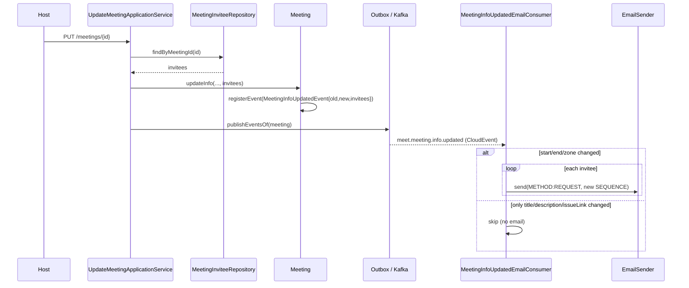

## Context

The meet service already publishes an info-update domain event whenever a host
changes a meeting's `title`, `description`, `issueLink`, `zoneId`, or
`timeRange`, and it increments the iCalendar `SEQUENCE` on that change. However:

- The event (`MeetingInfoUpdatedEvent`) carries only old/new info snapshots, not
  the invitee list. Invitees live in a separate `MeetingInviteeRepository`
  table, not on the `Meeting` aggregate.
- The event's topic and CloudEvent type are `meeting.info.update`, which breaks
  the `meet.*` topic and `io.github.smiskinext.meet.<...>.v1` type convention
  used by every other meet event.
- The notification service has no consumer for this event, so no reschedule
  email is ever sent.

The notification service already has all the machinery to email calendar
invites: `IcsGenerator.buildRequest(InvitationCalendar)` produces a
`METHOD:REQUEST` iCalendar with one `ATTENDEE` per invitee and a given
`SEQUENCE`, `EmailSender` delivers it, and `emailKafkaListenerContainerFactory`
provides bounded retry plus per-topic dead-letter routing. This mirrors the
existing invitations-created flow.

## Goals / Non-Goals

**Goals:**

- Deliver an updated calendar invite to every invitee when a meeting's scheduled
  time (start, end, or time zone) changes, so their calendar clients reschedule
  automatically.
- Carry the invitee list on the info-update event so the notification service
  needs no reverse call back to meet.
- Bring the info-update event's topic and type in line with the project
  convention.

**Non-Goals:**

- Emailing the organizer on info update (only invitees receive the updated
  invite).
- Emailing on non-time changes (title/description/issue-link only) — those
  produce the event but no email.
- Changing when the domain event is published — the event still fires for any
  info change; the time-change gate lives in the notification consumer.
- Emailing on meeting settings changes (`MeetingSettingsUpdatedEvent` is
  untouched).

## Decisions

### Decision 1: Enrich the event in meet rather than reverse-call from notification

The notification service has no database and only calls the identity service
over gRPC. Two options to get invitee emails:

- **A (chosen): Meet loads invitees and embeds them in the event.** Consistent
  with `MeetingInvitationsCreatedEvent` and `MeetingCanceledEvent`, which
  already embed invitee lists. No new runtime coupling; the consumer stays a
  pure Kafka consumer.
- **B (rejected): Notification calls meet over gRPC to fetch invitees.** Adds a
  new runtime dependency (notification → meet), breaks the established "event
  carries everything" pattern, and creates an availability coupling at send
  time.

`UpdateMeetingApplicationService` will inject `MeetingInviteeRepository`, load
the meeting's invitees by id, and pass them into `Meeting.updateInfo(...)`,
which registers them on `MeetingInfoUpdatedEvent`. This follows the exact
pattern of `AddMeetingInviteesApplicationService`.

### Decision 2: Gate the email in the consumer by comparing old vs new snapshots

The event carries both `oldInfo` and `newInfo`. The consumer compares
`startTime`, `endTime`, and `zoneId` between the two snapshots and sends only
when at least one differs. This keeps the domain event semantics unchanged (it
still represents any info change) while confining the "time changed" business
rule to the notification side, where the email is actually produced. The
`scheduledFieldsChanged` notion in `Meeting.updateInfo()` already treats
time-range + zone as the scheduled fields, so the consumer's gate mirrors
existing domain semantics.

### Decision 3: Rename topic and type to the project convention

- Topic: `meeting.info.update` → `meet.meeting.info.updated`
- CloudEvent type: `meeting.info.update` →
  `io.github.smiskinext.meet.meeting.info.updated.v1`
- Proto data schema: unchanged package path but the mapper's `dataSchema()`
  stays a stable URI; the new consumer keys off the CloudEvent type string.

This is a breaking change to the wire contract, but the topic currently has no
consumer, so no live subscriber breaks. The meet integration test asserting the
old string is updated in the same change.

### Decision 4: Reuse existing notification email machinery

The new `MeetingInfoUpdatedEmailConsumer` reuses `IcsGenerator.buildRequest`,
`InvitationCalendar`, `EmailSender`, and `emailKafkaListenerContainerFactory`
(retry + dead-letter). It subscribes under a new fixed consumer group so exactly
one replica emails each event, matching the invitations-created and
invitee-responded consumers.

## Event flow

## Risks / Trade-offs

- **Wire-contract rename breaks any undocumented subscriber** → No consumer
  currently subscribes to `meeting.info.update`; the meet integration test is
  updated in the same change. Deploy meet and notification together.
- **Invitee list adds payload size to the event** → Bounded by meeting invitee
  count, same as the already-shipped invitations-created event; acceptable.
- **Duplicate emails if the consumer reprocesses** → The fixed consumer group
  plus the stable `UID`/incremented `SEQUENCE` mean calendar clients treat a
  re-sent invite as the same event update, not a new meeting; idempotent from
  the recipient's view.
- **Time-change gate misses a field** → The gate explicitly compares start, end,
  and zone; a unit-style consumer test asserts non-time changes produce no
  email.

## Migration Plan

1. Update the proto and regenerate (`bufFormatApply`, `pnpm run openapi` if
   specs emit).
2. Deploy meet (new topic/type + enriched event) and notification (new consumer)
   together.
3. The legacy `meeting.info.update` topic is abandoned; no drain needed since it
   had no consumer. Its `.dlt` companion, if any, can be removed later.

## Open Questions

_None — all scope decisions resolved during exploration._
