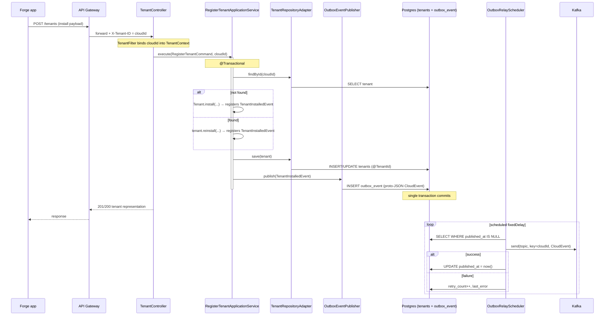

## Context

The `tenant` service is scaffolding: every layer under
`io.github.smiskinext.tenant` is empty (`.gitkeep`) except `SecurityConfig` and
the Spring Boot entry point. The database baseline (`B1.0.0__baseline.sql`)
already defines the `tenants` and `outbox_event` tables, and `application.yaml`
already configures a Kafka producer with
`io.cloudevents.kafka.CloudEventSerializer`. Tenant context is delivered by the
shared `TenantFilter`, which binds the `X-Tenant-ID` header (the Jira cloudId)
into `TenantContext` (a virtual-thread-safe `ThreadLocal`), and the shared
`TenantIdentifierResolver` feeds that value to Hibernate's `@TenantId`.

This change is the **first complete vertical slice in the monorepo**. No service
yet has a controller → use case → service → repository → event chain, and the
shared application-layer contracts the AGENTS guide references
(`UseCase<I, O, E>`, `Command`, `Query`) do not exist. There is no Kafka
publisher or outbox poller anywhere. The decisions here therefore set patterns
for every future service.

Constraints (from `openspec/specs/`):

- **api-convention**: global `/api/{version}` prefix (controllers declare only
  the resource path); `201 Created` + `Location` for creation, `200 OK` for
  updates that return a body, raw representation with no envelope; errors as RFC
  9457 `application/problem+json` with `code`/`traceId`, localized by
  `Accept-Language`; validation failures as `VALIDATION_ERROR` 400 with
  per-field `errors`.
- **db-schema**: the `tenants` table is the unpartitioned projection source,
  keyed by cloudId (`VARCHAR`), not a UUID; `outbox_event` uses
  `PRIMARY KEY (tenant_id, id)` with UUIDv7 `id` and a partial index on
  unpublished rows; migrations are additive after baseline and JPA entities must
  match the schema exactly under `ddl-auto: validate`.

## Goals / Non-Goals

**Goals:**

- Deliver `POST /tenants` that records a Forge install event idempotently and
  returns the tenant representation.
- Emit `TenantInstalled` through the transactional outbox and relay it to Kafka
  as a CloudEvent, with the payload schema defined by a shared proto contract.
- Establish reusable patterns: shared `UseCase`/`Command`/`Query`, a
  `Result`-based application service, `@TenantId` persistence, a proto event
  contract, and an outbox-relay scheduler.

**Non-Goals:**

- `avi:forge:upgraded:app` and pre-uninstall lifecycle handling.
- Forge app wiring (`app/src/index.ts`, `manifest.yml`) that forwards the event.
- Any downstream consumer / projection (only the publisher side).
- A generic reusable outbox library extracted to `shared` (kept in `tenant` for
  this slice; extraction is a later refactor once a second service needs it).
- Changing `outbox_event.payload` to a binary column.

## Decisions

### D1: cloudId from context, not the body

The controller reads `TenantContext.getCurrentTenant()` and rejects the request
when it equals the default `system` tenant (no header). The body never carries
the tenant identifier. Rationale: the gateway is the trust boundary for tenant
identity (per the shared tenancy design); accepting a body-supplied tenant would
let a caller write across tenants. Alternative (trust a body field) rejected for
that reason.

### D2: Idempotent upsert keyed by cloudId

`RegisterTenantApplicationService` loads the tenant by cloudId; if absent it
creates (`Tenant.install(...)`, `201`), else it updates in place
(`tenant.reinstall(...)`, `200`), replacing `installation_id`, reactivating
`status = ACTIVE`, and refreshing `updated_at` while preserving `installed_at`.
Both paths register `TenantInstalledEvent`. Rationale: Forge redelivers install
events and reinstalls reuse the cloudId with a new `installation_id`; upsert is
the only behavior that is correct under both. Alternative (insert-only → 409 on
conflict) rejected: it breaks retries and reinstalls.

### D3: Aggregate keyed by String cloudId

`Tenant extends AggregateRoot<String>` (the cloudId is the identity), unlike
`meet`/`record` whose aggregates are UUID-keyed. This matches the db-schema
natural-key requirement for `tenants`. Consequently the tenant's
`PublishableEvent.aggregateId()` returns `String`, so the tenant service defines
its **own** `PublishableEvent` and `OutboxEventJpaEntity` (`aggregate_id` is
`VARCHAR`) rather than reusing meet's UUID-based ones. The baseline schema
already declares `aggregate_id VARCHAR(255)`, so no migration is needed.

### D4: Proto as the shared event contract, proto-JSON in the TEXT outbox

The event schema is `tenant_installed.proto`
(`package io.github.smiskinext.event.tenant.v1`). The publisher maps the domain
event → proto message → CloudEvent whose `data` is proto rendered by
`com.google.protobuf.util.JsonFormat` (`datacontenttype: application/json`); the
full CloudEvent is serialized to a JSON string and stored in
`outbox_event.payload` (TEXT). CloudEvent `type` =
`io.github.smiskinext.tenant.v1.installed`; `dataschema` = the proto FQN.
Rationale (from research): CloudEvents' official proto binary format needs the
`cloudevents-protobuf` module (not in the catalog), whereas proto-JSON fits the
existing TEXT column, is debuggable in logs/SQL, is parseable by any consumer,
and is spec-compliant via `application/json` + `dataschema`. Alternatives:
base64 proto-binary in TEXT (33% overhead, not debuggable) and a BYTEA migration
(edits freshly-created baseline) both rejected.

### D5: Proto lives at the infrastructure boundary; domain stays pure

Domain raises a plain `TenantInstalledEvent` record (framework- and proto-free,
enforced by ArchUnit `domain_must_not_depend_on_spring_or_jpa`). A
`messaging/TenantEventProtoMapper` converts it to the proto message; the
`OutboxEventPublisher` builds and stores the CloudEvent. Rationale: hexagonal
rules forbid domain dependence on generated proto/Spring types. Alternative
(build proto directly in the aggregate) rejected — it couples domain to
generated code.

### D6: Outbox relay via `@Scheduled` poller

`OutboxRelayScheduler` (`@Scheduled(fixedDelay)`, enabled by
`@EnableScheduling`) selects unpublished rows ordered by `created_at`, parses
each `payload` back to a `CloudEvent`, sends it via
`KafkaTemplate<String, CloudEvent>` keyed by `aggregate_id`, and sets
`published_at`; on failure it increments `retry_count` and records `last_error`.
Rationale: satisfies the db-schema outbox requirement and guarantees
at-least-once delivery without a dual-write. Alternative (publish directly after
commit, no poller) rejected: loses events if Kafka is down.
`KafkaTemplate<String, CloudEvent>` is provided by a `KafkaProducerConfig` bean
since the producer is configured for CloudEvents.

### D7: Shared application contracts

Add `UseCase<I, O, E>` (single `execute`/`handle` method returning
`Result<O, E>`), `Command` (marker for write inputs), and `Query` (marker for
read inputs) in `io.github.smiskinext.shared.application`.
`RegisterTenantUseCase` extends `UseCase`; `RegisterTenantCommand` implements
`Command`. Rationale: the AGENTS guide already mandates this shape and this is
the first slice to need it, so define it once in `shared`. Alternative (define
locally in `tenant`) rejected — it would force every later service to reinvent
the contract.

### Endpoint & flow

Route: `POST /api/{version}/tenants` (controller maps `/tenants`). Success:
`201 Created` + `Location: /api/{version}/tenants/{cloudId}` on create, `200 OK`
on update; body is the tenant representation. Mapped through the shared
`ResultResponder`.

## Risks / Trade-offs

- **Outbox relay adds infrastructure and a Kafka test dependency** → Integration
  tests add a `KafkaContainer` to `TestcontainersConfiguration`; unit tests keep
  ports mocked so the fast suite needs no Docker.
- **Proto-JSON is ~25% larger than binary and not the CloudEvents-preferred
  proto format** → Accepted: fits the existing TEXT column, stays spec-compliant
  via `application/json` + `dataschema`, and a future switch to
  `cloudevents-protobuf` can change only the encoder without touching callers.
- **Scheduler and HTTP paths both mutate `outbox_event`** → The poller sets
  `published_at` under its own transaction and selects only unpublished rows;
  ordering by `created_at` with the existing partial index bounds the working
  set. At-least-once delivery means consumers must dedupe on CloudEvent `id` (a
  consumer-side concern, out of scope here).
- **First-slice patterns may need revision** → Contracts live in `shared`; if a
  second service reveals a better shape, it is a follow-up refactor, not a
  blocker for this slice.
- **`JsonFormat` can emit characters needing care in TEXT** → Postgres TEXT
  handles them; only JSON/JSONB columns reject null bytes, and the column is
  TEXT.

## Migration Plan

No schema migration: `B1.0.0__baseline.sql` already defines `tenants` and
`outbox_event`. Deployment adds application code plus the `protobuf-java-util`
dependency and enables scheduling. Rollback is code-only (no destructive DDL);
disabling the scheduler or reverting the deployment leaves the schema intact.

## Open Questions

None — endpoint shape, payload shape, idempotency, event encoding, proto
organization, and contract placement were resolved during discovery.
