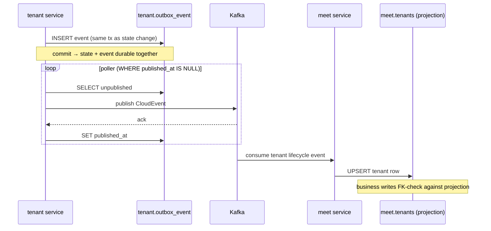

## Context

The `tenant`, `meet`, and `record` services each own an independent Postgres
database initialised from a `B1.0.0__baseline.sql` Flyway baseline. They share a
consistent but undocumented set of persistence conventions: hash partitioning by
`tenant_id`, UUIDv7 composite keys, soft-delete + purge lifecycle, a tenant
read-model projection, and a transactional outbox. `notification` has no
database. `openspec/specs/db-schema/spec.md` is empty even though
`openspec/config.yaml` mandates reading it before any schema change. This change
captures the existing contract as a spec; it introduces no schema changes.

## Goals / Non-Goals

**Goals:**

- Turn the implicit persistence contract already present in the baselines into
  an authoritative, testable spec.
- Cover ownership boundaries, partitioning, identifiers, soft-delete/retention,
  the tenant projection, the outbox, and Flyway governance.
- Keep the spec behavioral (what the schema guarantees) rather than restating
  DDL line by line.

**Non-Goals:**

- No changes to any `B1.0.0__baseline.sql`, JPA entity, or migration.
- No new tables, columns, indexes, or partitions.
- Not documenting `notification` (no DB) or non-Postgres stores (Kafka, Valkey,
  RustFS/S3) beyond their interaction with the outbox and projection.
- Not defining API/HTTP behavior — that is owned by `api-convention`.

## Decisions

**Document the contract, not the DDL.** The spec states guarantees (e.g. "every
business table is hash-partitioned on `tenant_id` with 16 partitions") rather
than copying `CREATE TABLE` statements, which already live in the baselines and
would drift. Alternative considered: embedding full DDL in the spec — rejected
because it duplicates the source of truth and violates the "specs describe
behavior, not code" rule.

**One `db-schema` capability, not one per service.** The three services share
the same conventions, so a single cross-service capability spec is the contract;
per-service specifics (which tables exist) stay in each baseline. Alternative:
`tenant-schema` / `meet-schema` / `record-schema` capabilities — rejected as it
fragments a shared contract and creates three near-identical specs.

**`tenant_id` as the leading key column everywhere.** This is the load-bearing
decision that makes hash partition pruning and single-partition joins work; the
spec elevates it to a normative requirement rather than an incidental column
order. Alternative: `id`-first keys with `tenant_id` as an ordinary column —
rejected because it defeats partition pruning and cross-partition joins become
expensive.

**No cross-service foreign keys; correlate by plain UUID.** Ownership isolation
is preserved by storing `meeting_id` in `record` as a bare `UUID`. Alternative:
a shared schema with real FKs — rejected because it couples deploy/migration
lifecycles across services.

**Outbox for exactly-once-ish delivery.** Events are written in the same
transaction as state changes and drained by a poller, guaranteeing atomicity
between state and intent. The projection sync flow spans three components
(publisher DB, Kafka, consumer), shown below.

**Flyway `B` baseline + additive `V` migrations under `ddl-auto: validate`.**
The spec codifies the never-edit-applied-migrations rule and entity/schema
parity so drift fails fast at startup. Alternative: Hibernate `ddl-auto: update`
— rejected as non-deterministic and unsafe for production.

## Risks / Trade-offs

- [Spec drifts from baselines as services evolve] → Requirements are behavioral
  and partition/key rules are stable; new tables must conform rather than the
  spec chasing each DDL edit. Reviews cite this spec.
- [16 partitions is a fixed choice that may not fit every table's cardinality] →
  Documented as the current convention; changing modulus is a future migration
  concern, out of scope here.
- [Cross-service correlation by plain UUID loses referential integrity] →
  Accepted trade-off for service autonomy; consistency is eventual via events.
- [Outbox poller adds latency and requires idempotent consumers] → Documented as
  part of the contract (retry_count/last_error, at-least-once semantics);
  consumers must dedupe.

## Migration Plan

Documentation-only. Writing `openspec/specs/db-schema/spec.md` (via archive of
this change) has no runtime effect and needs no deploy or rollback. Rollback is
reverting the spec file.

## Open Questions

- None blocking. Partition count tuning and any future `V` migration policy for
  re-partitioning can be addressed in a separate change if needed.
