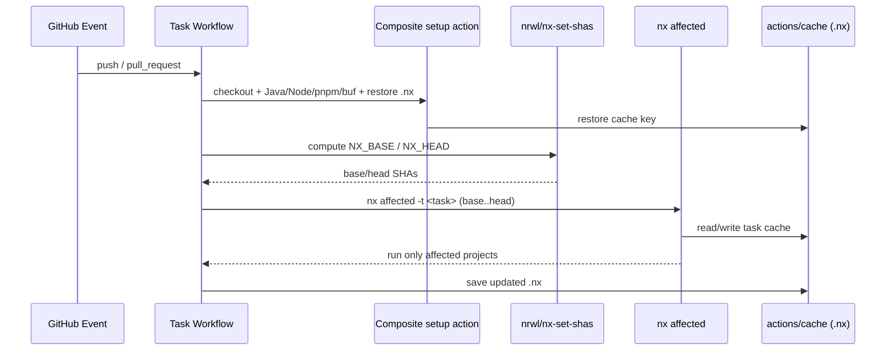

## Context

The monorepo hosts Spring Boot 4 / Java 25 microservices under `services/` and a
pnpm workspace (`app/` Forge app, `scripts/` CLI). The Gradle layout is a
**two-level nested composite build**:

```
root settings.gradle.kts
  ├─ includeBuild("build-logic")
  └─ includeBuild("services")
        services/settings.gradle.kts
          ├─ includeBuild("proto")
          ├─ includeBuild("shared")     (via each service)
          ├─ includeBuild("tenant")
          ├─ includeBuild("meet")
          ├─ includeBuild("record")
          └─ includeBuild("notification")
```

Each service is a standalone Gradle build with its own `settings.gradle.kts`,
`rootProject.name`, and `gradlew`. Cross-build wiring uses `includeBuild` +
`dependencySubstitution`. Gradle already enables `configuration-cache`,
`parallel`, and `build-cache` in every `gradle.properties`. Gradle wrapper is
9.6.0.

Current CI (`.github/workflows/ci.yml`) is a single workflow of 8 jobs, uses
`jdx/mise-action` to install the toolchain from `.mise.toml`,
`dorny/paths-filter` for change detection, and references actions by tag.
`.mise.toml` pins `java=25, node, pnpm, gitleaks, lefthook, buf, npm:mongosh`;
`lefthook` and `mongosh` are local-only and unused in CI.

The `ci-pipeline` spec (`openspec/specs/ci-pipeline/spec.md`) already documents
the current path-filter + mise + component-job model, so this change edits that
capability and adds a new `nx-orchestration` capability.

## Goals / Non-Goals

**Goals:**

- One Nx project graph spanning the Gradle composite builds and the pnpm
  packages.
- `nx affected` scopes CI work; results cached in `.nx`, restored across runs
  via `actions/cache`.
- CI provisions each tool with a dedicated action; no `mise` on runners.
- CI split into task-oriented workflows (`lint`, `test`, `build`, `security`,
  `proto`) sharing one composite setup action.
- Every third-party action pinned to a full commit SHA with a version comment,
  kept current by Renovate.
- Preserve existing Gradle behavior: build/test source sets, JaCoCo gate,
  OpenAPI drift check, buf lint/breaking, forge validation.

**Non-Goals:**

- No Nx Cloud (local + GHA cache only).
- No flattening of composite builds into a single multi-project build.
- No change to test/coverage/mutation thresholds or Gradle build logic.
- No removal of `.mise.toml` (retained for local development).
- No changes under `zms/` (legacy, read-only).
- No Forge deploy/install in CI.

## Decisions

### D1 — @nx/gradle with full project-graph discovery over nested composite builds

Use `@nx/gradle` plus the companion Gradle plugin `dev.nx.gradle.project-graph`,
and add a bridging `projectReportAll` task to **every** Gradle build file (root,
`services`, `build-logic`, and each service) that fans out to
`gradle.includedBuilds`. This lets the graph traversal cross both composite
levels.

**Why over alternatives:**

- _Nx run-commands wrappers_ (manual `project.json` per service): keeps caching
  but loses the automatic graph — rejected because the user requires the Gradle
  plugin integration.
- _Flattening to `include(...)`_: makes `@nx/gradle` trivial but destroys the
  independent-build topology and `dependencySubstitution` wiring — rejected as
  out of scope and high blast radius.

Requires Nx ≥ 20.7 (fixes graph discovery for non-standard build layouts).

### D2 — Graph discovery is validated before wiring CI

The nested composite build is the primary risk. Implementation MUST run
`nx show projects` and confirm all six Gradle builds (`proto`, `shared`,
`tenant`, `meet`, `record`, `notification`) plus `app`, `scripts`, `docs` appear
before any workflow is switched to `nx affected`. If a build is missing, fix the
`projectReportAll` bridging first.

### D3 — Toolchain via dedicated actions; only CI-relevant tools

Replace `mise-action` with: `actions/setup-java` (Temurin, Java 25),
`actions/setup-node` (+ `cache: pnpm`) with `pnpm/action-setup`,
`bufbuild/buf-action`, and a direct gitleaks binary install. `lefthook` and
`mongosh` are dropped from CI (local-only). Version numbers live in the setup
action, not `.mise.toml`.

### D4 — Task-oriented workflows sharing a composite setup action

Split into `lint.yml`, `test.yml`, `build.yml`, `security.yml`, `proto.yml`. A
composite action `.github/actions/setup/action.yml` centralizes checkout depth,
tool setup, and `.nx` cache restore. Each workflow computes affected via
`nrwl/nx-set-shas` then runs `nx affected -t <task>`, except `security.yml`.

### D5 — gitleaks is always-on, outside affected

Secret scanning is a security gate over the diff itself, not a project. It runs
on every change regardless of `nx affected`, preserving the current
`--log-opts BASE..HEAD` behavior on PRs and full scan otherwise.

### D6 — SHA pinning + Renovate automation

Every third-party action is pinned to a full commit SHA with a trailing `# vX.Y`
comment. `renovate.json` uses `helpers:pinGitHubActionDigests` +
`helpers:pinGitHubActionDigestsToSemver` to keep pins current via scheduled PRs.

### CI affected flow



## Risks / Trade-offs

- **@nx/gradle may not fully traverse nested composite builds** → Mitigated by
  D2 gate (`nx show projects` before CI switch) and per-file `projectReportAll`
  bridging over `gradle.includedBuilds`; fallback to run-commands wrapper for
  any build that refuses to appear.
- **Duplicate work between Nx caching and Gradle's own caches** → Accept; Nx
  caches at task granularity, Gradle keeps its build/config cache. They compose;
  no attempt to make Nx own Gradle's internal cache.
- **`nx affected` base detection on protected-branch pushes** →
  `nrwl/nx-set-shas` with `fetch-depth: 0`; on first run it falls back to a
  configured base.
- **Losing the single `ci-success` required check when splitting workflows** →
  Retain an aggregate success gate so branch protection still targets one check.
- **buf-action / gitleaks binary version drift** → Both pinned by SHA/version
  and covered by Renovate.
- **Security scan cost on unrelated changes** → Accepted deliberately (D5); the
  gate must never be skipped by affected logic.

## Migration Plan

1. Add Nx root config + companion Gradle plugin + `projectReportAll` bridging.
2. Validate graph (`nx show projects`) — D2 gate.
3. Add pnpm-side Nx projects and proto buf targets.
4. Author composite setup action + task workflows in parallel to existing
   `ci.yml` (do not delete yet).
5. Verify affected runs locally (`act`) and on a draft PR.
6. Delete `ci.yml`, update branch protection to the new aggregate gate.
7. Add `renovate.json`; let it open the first SHA-pin PR.

Rollback: restore `ci.yml` from git history and remove new workflows; Nx/Gradle
graph additions are inert without the workflows.

## Open Questions

None — all four decision points (integration depth, cache location, affected
replacement, pinning tool) and the CI split axis are locked.
