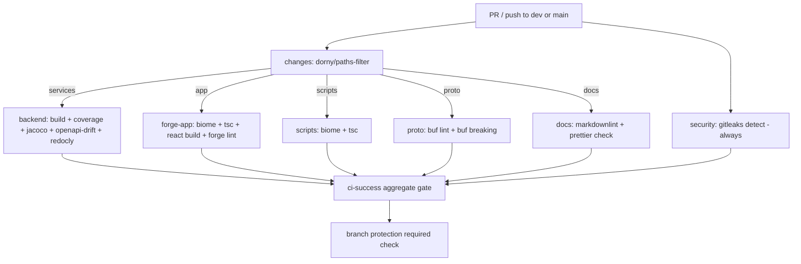

## Context

The monorepo (`github.com/SmiskiNext/smiski`, default branch `dev`, `main`
protected) has three independent components plus proto and docs:

- `services/` — Spring Boot 4 / Java 25, Gradle 9.6.0 composite build
  (`includeBuild`). Two source sets: fast `test` (unit + ArchUnit, no Docker)
  and `integrationTest` (Testcontainers + `@SpringBootTest`, needs Docker).
  `check`/`build` run both. Coverage (`jacocoTestCoverageVerification`, line ≥
  70% / branch ≥ 60%) and mutation (`pitest`, 60%) are opt-in. Each service
  emits `openapi.yaml` via `generateOpenApiDocsFromTests`, linted by Redocly.
- `app/` — Atlassian Forge app: TS resolver (Biome + `tsc`) + a nested
  `static/hello-world` React 16 / react-scripts UI with its own lockfile.
  `manifest.yml` validated by `forge lint`.
- `scripts/` — citty + zx CLI, Biome + `tsc`.
- `services/proto` — Buf (`buf lint`, `buf breaking`).
- Root — markdown (markdownlint) + `md/json/toml/yaml/yml/sh` (Prettier).

All tool versions are pinned in `.mise.toml` (Java 25, node, pnpm, gitleaks,
lefthook, buf). Local gates run via `lefthook.yml`; `pre-push` blocks direct
pushes to `main` and runs full verification. `.actrc` is present for local
workflow testing with `act`. There is currently **no** `.github/workflows`
directory. This design is CI-only per the locked decision (no GHCR publish, no
k8s deploy).

## Goals / Non-Goals

**Goals:**

- One `.github/workflows/ci.yml` validating every PR and push to `dev`/`main`.
- Only run jobs for components that changed (monorepo path filtering).
- Reproduce local gates exactly by installing tools from `.mise.toml`.
- Enforce: backend build (test + integrationTest), coverage gate, OpenAPI drift;
  Forge app lint/typecheck/UI-build/`forge lint`; scripts lint/typecheck; proto
  lint + breaking; gitleaks; docs lint.
- DevOps hardening: SHA-pinned actions, least-privilege permissions, concurrency
  cancel-in-progress, Gradle + pnpm caching.
- A single `ci-success` aggregate check suitable for branch protection.

**Non-Goals:**

- Building/pushing Docker images to GHCR (`bootBuildImage` stays local/manual).
- Deploying to Kubernetes.
- Wiring PIT mutation testing into CI (stays opt-in).
- Changing coverage/mutation thresholds or the ratchet policy.
- Configuring GitHub branch-protection settings (manual follow-up; documented).
- Modifying any application/build source or tool-pin files.

## Decisions

### D1 — Single workflow with a `changes` filter job (not per-component workflows)

A single `ci.yml` starts with a `changes` job using `dorny/paths-filter` that
emits boolean outputs (`services`, `app`, `scripts`, `proto`, `docs`).
Downstream jobs gate on `needs.changes.outputs.<x> == 'true'`.

- **Why**: one place to reason about the pipeline; shared concurrency/permission
  posture; avoids duplicated setup across many workflow files.
- **Alternatives**: (a) separate workflow per component — more files, harder to
  aggregate a single required check; (b) always run everything — wastes runner
  minutes on a monorepo. Rejected for cost/maintainability.

### D2 — Toolchain via `jdx/mise-action` reading `.mise.toml`

Each job installs tools with `jdx/mise-action`, which reads the repo's
`.mise.toml`. No duplicated version numbers in workflow YAML.

- **Why**: single source of truth; CI == local versions; adding a tool in
  `.mise.toml` automatically flows to CI.
- **Alternatives**: `actions/setup-java` + `pnpm/action-setup` + `setup-node` —
  requires manually mirroring versions, risking drift. Rejected.

### D3 — Gradle runs from `services/` composite root

Backend commands use `./services/gradlew ...` (composite `includeBuild`).
`gradle/actions/setup-gradle` provides build caching + dependency caching keyed
on Gradle files. The backend job runs on `ubuntu-latest` (Docker preinstalled),
so `integrationTest` Testcontainers work with no extra service containers.

- **Why**: matches `services/AGENTS.md` exactly; Testcontainers manages its own
  containers, so no `services:` block or Docker-in-Docker setup is needed.

### D4 — OpenAPI drift check

For changed backend, run `pnpm run openapi:generate` (regenerates
tenant/meet/record `openapi.yaml`) then
`git diff --exit-code -- 'services/**/openapi.yaml'`. A non-empty diff fails the
job with a message to run `pnpm run openapi` locally and commit. Redocly lint
runs via `pnpm run openapi:lint`.

- **Why**: API-first repo — committed specs must match code. Drift is a silent
  correctness bug otherwise.
- **Note**: generation runs `@SpringBootTest` (needs Docker) — same runner as
  integrationTest, so no extra infra. Requires `pnpm install --frozen-lockfile`
  before running the pnpm openapi scripts.

### D5 — Coverage gate is required; mutation is not

Backend job runs `jacocoTestCoverageVerification` (line ≥ 70% / branch ≥ 60%) as
a required gate and uploads the JaCoCo HTML/XML report as an artifact
(`if: always()` so the report is retained even on failure). `pitest` is not
invoked in CI.

- **Why**: coverage gate exists in build-logic and gives a hard, objective
  signal; mutation is slow and explicitly opt-in per `services/AGENTS.md`.
- **Trade-off**: see R1.

### D6 — Forge app: build the nested UI, do not deploy

App job runs Biome check, `tsc --noEmit` (app root), installs
`static/hello-world` deps (`npm ci`) and runs its `react-scripts build`
(`CI=true`), installs the Forge CLI (`npm i -g @forge/cli`, not pinned in
`.mise.toml`), then `forge lint` on `manifest.yml`. No `forge deploy`/`install`
(needs credentials + is CD).

- **Why**: catches UI build breakage and manifest errors without any Forge
  auth/secrets. `forge lint` is offline-safe.

### D7 — `ci-success` aggregate gate

A final job `needs` all component + security jobs, runs `if: always()`, and
fails if any dependency result is `failure` or `cancelled` (checked via
`contains(needs.*.result, ...)`); it passes when every dependency is `success`
or `skipped`. Branch protection requires only `ci-success`.

- **Why**: path-filtered jobs report `skipped`, which GitHub treats as not
  satisfying a required check. A single aggregate gate solves this cleanly.
- **Alternative**: mark each job required — brittle, breaks whenever filtering
  skips a job. Rejected.

### D8 — Hardening posture

- All non-GitHub actions pinned to a full commit SHA (with a `# vX.Y.Z`
  comment).
- Workflow-level `permissions: contents: read` (least privilege); no job needs
  write for CI-only.
- `concurrency: group: ci-${{ github.workflow }}-${{ github.ref }}`,
  `cancel-in-progress: true`.
- Caching: `gradle/actions/setup-gradle` (Gradle) + `actions/cache` for the pnpm
  store (path from `pnpm store path`, keyed on `pnpm-lock.yaml`) in every job
  that runs pnpm (backend, forge-app, scripts, docs).

## CI flow

## Risks / Trade-offs

- **R1 — Coverage gate may fail on current code** → The
  `jacocoTestCoverageVerification` gate is opt-in today; enabling it as required
  could immediately fail if existing suites are below thresholds. Mitigation:
  this is the intended "ratchet" signal (surfaces real debt); if it blocks the
  initial merge, the fallback is to run the report first, confirm current
  numbers, and only then flip the gate to required — thresholds themselves are
  never lowered.
- **R2 — mise-action tool availability** → A tool pinned to `latest` in
  `.mise.toml` could resolve to different versions over time. Mitigation:
  mise-action caches installs; versions are still centralized in one file, so
  any pinning tightening happens in `.mise.toml`, not the workflow.
- **R3 — First run cold caches are slow** → Gradle/pnpm caches are empty on the
  first run. Mitigation: acceptable one-time cost; subsequent runs reuse caches.
- **R4 — `buf breaking` base ref** → Comparing against `dev` requires fetching
  it. Mitigation: `buf breaking --against '.git#branch=dev'` with a full-history
  checkout (`fetch-depth: 0`) on the proto job.
- **R5 — react-scripts + Node/OpenSSL** → react-scripts 5 can need
  `NODE_OPTIONS=--openssl-legacy-provider` on newer Node. Mitigation: build with
  `CI=true`; if the build fails on the pinned Node, set the legacy provider env
  for that step only.
- **R6 — gitleaks full scan cost** → `detect` scans history. Mitigation: keep it
  a standalone always-on job with `fetch-depth: 0`; it mirrors the `pre-push`
  behavior locally.

## Migration Plan

1. Add `.github/workflows/ci.yml` on the `feat-ci-cd` branch; open a PR to
   `dev`.
2. Observe the first run; if the coverage gate (R1) blocks, apply the documented
   fallback (report-first) rather than lowering thresholds.
3. After the workflow is green, manually configure branch protection on `dev`
   and `main` to require the `ci-success` check (out-of-scope follow-up, noted).

Rollback: delete or disable `ci.yml`; no application code is affected.

## Open Questions

- None blocking. Branch-protection required-check configuration is intentionally
  a manual follow-up and not part of this change.
