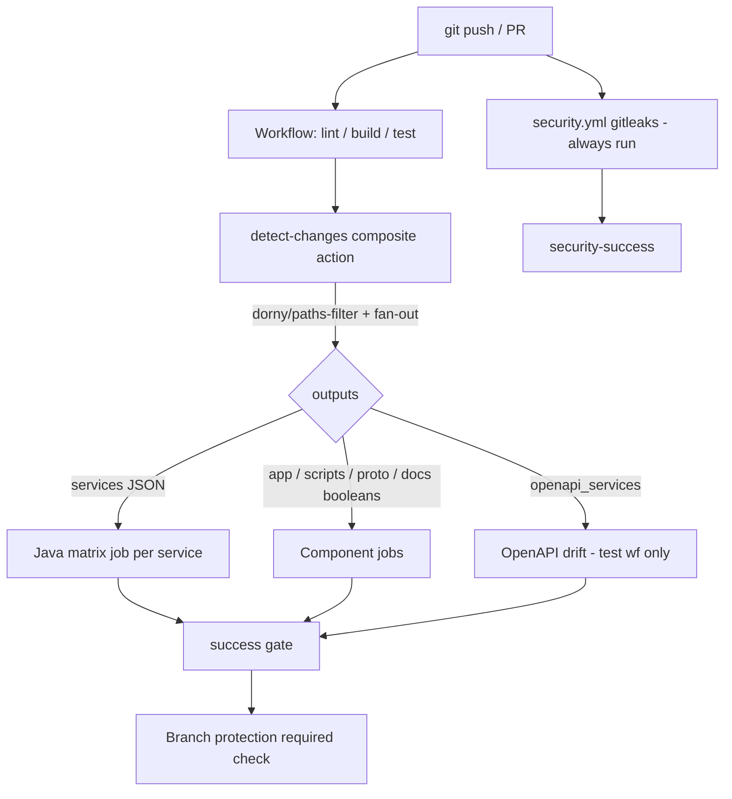

## Context

CI today is a single `.github/workflows/ci.yml` with a `changes` job feeding
component jobs (`backend`, `forge-app`, `scripts`, `proto`, `security`, `docs`)
and one `ci-success` gate. The backend job runs the full Gradle composite build
(`./services/gradlew build` = compile + `test` + `integrationTest`) plus
coverage and OpenAPI drift, and treats `services/` as one unit — a change to any
single microservice rebuilds and retests all of them.

The backend is a set of independent Gradle builds wired via `includeBuild`:
`proto` and `build-logic/` are consumed by `shared`, and `shared` is consumed by
`tenant`, `meet`, `record`, and `notification`. The version catalog lives at the
repo root `gradle/libs.versions.toml`. Local hooks run through `lefthook.yml`,
which currently mixes format, lint, and typecheck across both pre-commit and
pre-push. Secret scanning (`gitleaks`) already runs at commit, push, and CI.

This design covers splitting CI into four workflows with per-service change
detection and reworking the lefthook stages. It does not change any Gradle build
logic, coverage thresholds, proto/buf configuration, or migration SQL content.

## Goals / Non-Goals

**Goals:**

- Four independent workflows — `lint.yml`, `build.yml`, `test.yml`,
  `security.yml` — each with its own aggregate success gate.
- Per-service Java matrix for build and test, driven by a shared composite
  action, with fan-out from shared inputs (`services/shared`, `services/proto`,
  `build-logic/`, `gradle/libs.versions.toml`) to all services.
- Clean separation: `build` = `assemble` (compile only), `test` = `test` +
  `integrationTest` + coverage; `tsc --noEmit` in build; OpenAPI drift in test.
- Lefthook: pre-commit = gitleaks (staged) + auto-fix/format only; pre-push =
  gitleaks (full) + typecheck (app, scripts) + Java `assemble` per changed
  service.
- Prettier formats `.sql` via `prettier-plugin-sql`.

**Non-Goals:**

- Changing Gradle convention plugins, coverage thresholds, or build-logic.
- Running the heavy react-scripts build (`static/hello-world`) at pre-push.
- Deploying or installing the Forge app.
- Rewriting proto/buf or migration SQL semantics.

## Decisions

### D1: Composite action for change detection (not a reusable workflow)

Each of the four workflows needs the same path-classification logic. A
`workflow_call` reusable workflow would spin up a separate runner VM per call
(extra queue + boot latency). A composite action at
`.github/actions/detect-changes/action.yml` runs inline as a step inside an
existing job, so it adds no runner overhead and stays DRY.

- **Alternatives considered**: (a) duplicate a `changes` job in every workflow —
  rejected, four copies to maintain; (b) reusable `workflow_call` — rejected,
  per-call VM cost undercuts the speed goal.

The action wraps `dorny/paths-filter` and outputs:

- `services`: JSON array of changed service names (post fan-out) for the matrix.
- `app`, `scripts`, `proto`, `docs`: boolean strings.
- `openapi_services`: subset of `services` limited to `tenant`, `meet`, `record`
  (the spec-emitting services; `notification` has no OpenAPI).

### D2: Fan-out mapping

Filters build each service entry from its own directory plus the shared inputs,
so shared changes select every service:

```
tenant  ← services/tenant/**  + FANOUT
meet    ← services/meet/**     + FANOUT
record  ← services/record/**   + FANOUT
notification ← services/notification/** + FANOUT
FANOUT = services/shared/** | services/proto/** | build-logic/** | gradle/libs.versions.toml
```

`proto` (buf lint/breaking) and `docs` remain independent booleans.

### D3: Build vs test split for Java

`./services/gradlew build` runs tests, so it cannot represent "build only". The
build workflow runs `-p services/<svc> assemble` (compile, no tests); the test
workflow runs `-p services/<svc> test integrationTest` then
`jacocoTestCoverageVerification` and uploads the JaCoCo report. `assemble`'s
`compileJava` is the Java "typecheck".

- **Alternative**: keep `build` full and move only coverage/mutation to `test` —
  rejected, build workflow would still run tests, defeating the split.

### D4: Workflow routing of non-Java checks

- `tsc --noEmit` (app, scripts) → build workflow (it proves code compiles).
- OpenAPI drift + Redocly lint → test workflow (requires `@SpringBootTest`
  generation, only for `openapi_services`).
- `buf lint` + `buf breaking` → lint workflow.
- markdownlint + Prettier `--check` (incl. `sql`) → lint workflow (docs).
- `forge lint` + `static/hello-world` react build → build workflow (app).
- `gitleaks detect` → standalone `security.yml`, always-run.

### D5: Per-workflow success gates

Each workflow ends with its own gate (`lint-success`, `build-success`,
`test-success`, `security-success`) using `if: always()` +
`contains(needs.*.result, 'failure'|'cancelled')`. Branch protection requires
the four gates instead of a single `ci-success`.

### D6: Lefthook stage rework

- **pre-commit** (staged files): gitleaks protect + spotlessApply, buf format,
  prettier `--write` (incl. sql), markdownlint `--fix`, biome `check --write`
  (scripts, app). Remove lint (no-fix) and typecheck from this stage.
- **pre-push** (pushed range): block-main, gitleaks detect (full), tsc
  `--noEmit` (scripts, app), Java `assemble` per changed service. Remove lint
  (no-fix) and format-verify; no react build.

### D7: prettier-plugin-sql

Add to root `package.json` devDependencies and `.prettierrc.json` `plugins`;
extend Prettier globs (`format` script, CI docs check, lefthook format-general)
to include `sql`. Validate against the three Flyway baseline migrations so
formatting does not alter SQL semantics (whitespace only).

## Detection-to-execution flow



## Risks / Trade-offs

- **Branch protection breakage** → After merge, update required checks from
  `ci-success` to the four gates; document in proposal Impact. Until updated,
  PRs may show as passing without the new gates enforced.
- **Empty matrix on docs-only change** → Java matrix job must be skipped cleanly
  when `services` is `[]`; gate handles `skipped` as success.
- **prettier-plugin-sql reformats migrations** → Restrict to whitespace, verify
  the three baselines with `prettier --check`; never edit applied migrations'
  logic; if plugin output is unstable for Postgres/Flyway syntax, keep `sql` out
  of the write glob and revisit.
- **Fan-out over-triggers** → Shared changes rebuild all services (correct but
  slower); accepted, correctness over speed for shared code.
- **Duplicate detect-changes runs across workflows** → Each workflow runs its
  own detection step; cost is negligible vs a separate VM, accepted.

## Migration Plan

1. Add composite action + four workflows; remove `ci.yml`.
2. Rework `lefthook.yml`; add prettier-plugin-sql and globs.
3. Open a PR; confirm all four gates report and behave per path filtering.
4. After merge to `dev`, update branch protection required checks.
5. Rollback: restore `ci.yml` from git history and revert branch protection.

## Open Questions

None — all routing, fan-out, and stage decisions are locked.
