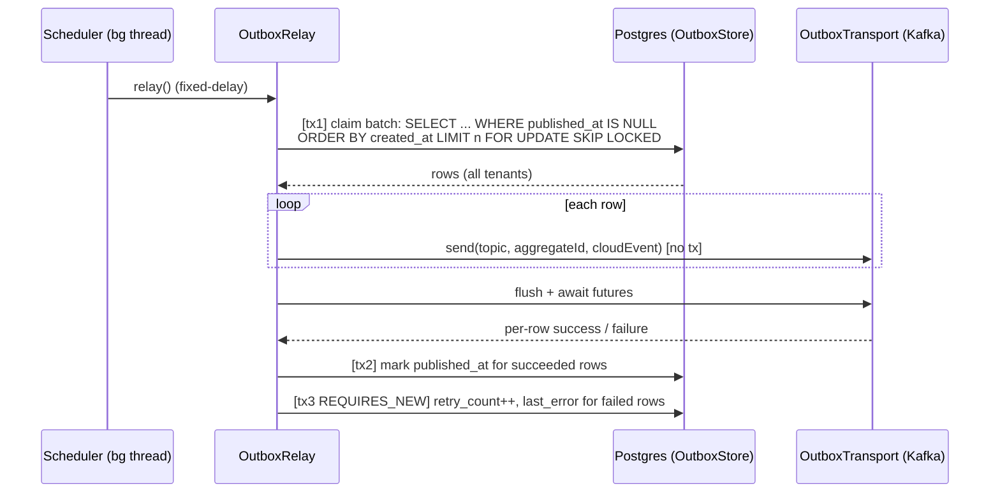

## Context

The tenant service implements a transactional outbox to publish
`TenantInstalled` CloudEvents to Kafka. The current implementation has a
correctness bug and several design limitations discovered during review:

- `OutboxEventJpaEntity` carries Hibernate `@TenantId`. Hibernate appends
  `WHERE tenant_id = ?` to every query using `TenantIdentifierResolver`
  (`services/shared`), which reads a request-scoped `ThreadLocal`
  (`TenantContext`). The `@Scheduled` relay runs with no request bound, so the
  resolver returns `TenantContext.DEFAULT_TENANT` (`"system"`). The poll query
  becomes `WHERE tenant_id = 'system'` and never matches real tenant rows, so
  **no event is ever relayed**. Existing integration tests hide this by calling
  `TenantContext.setCurrentTenant(...)` on the test thread.
- `OutboxRelayScheduler.relay()` is a single `@Transactional` method that loops
  every unpublished row and calls `kafkaTemplate.send(...).get()` synchronously
  inside the transaction — holding a pooled DB connection across blocking
  network I/O, with the whole batch committed once.
- The poll query is a plain `SELECT` with no locking and no `LIMIT`, unsafe for
  multiple replicas (double-publish) and unbounded in memory.
- `OutboxEventPublisher` hardcodes `instanceof TenantInstalledEvent` and a
  literal `dataschema`, and hand-builds the CloudEvent JSON; the relay
  hand-parses it back. Adding `TenantUninstalled` (or any second event) would
  throw.
- Kafka is wired directly (`KafkaTemplate<String, CloudEvent>`),
  bootstrap-server is a bare `@Value`, and `KafkaProducerConfig` duplicates the
  `spring.kafka.producer.*` settings already in `application.yaml`.
- All of the above lives inside the tenant service; `meet`/`record` would have
  to copy it.

Constraints (verified):

- `openspec/specs/db-schema/spec.md` (Transactional outbox) mandates
  `PRIMARY KEY (tenant_id, id)` with UUIDv7 `id` and a partial index on
  `WHERE published_at IS NULL`. The DDL must not change.
- `services/AGENTS.md`: hexagonal + DDD, ArchUnit-enforced layering; domain must
  stay free of Spring/JPA/proto; CloudEvents 1.0 over Kafka; UUIDv7 keys;
  `open-in-view: false` already set.
- Services run with virtual threads enabled and may scale to multiple pods.

## Goals / Non-Goals

**Goals:**

- The relay reliably publishes every committed outbox row in production,
  independent of any request tenant context.
- Safe horizontal scaling: no double-publish across replicas, bounded batches.
- No DB transaction/connection held during Kafka network calls.
- Publisher is open for extension: new event types are added by registering a
  bean, with no edits to the generic publisher/relay.
- Transport is pluggable via configuration (Kafka today; MSK is config-only; a
  non-Kafka transport is possible later without touching the relay).
- All tuning lives in one validated `@ConfigurationProperties` class.
- Generic machinery lives in `shared` and is reused by future services.

**Non-Goals:**

- No new product capability, no new event types shipped (e.g. no
  `TenantUninstalled` proto/event in this change — only the seams to add one).
- No schema/DDL change; the `(tenant_id, id)` PK and partial index stay.
- No switch to CDC/Debezium or `LISTEN/NOTIFY`; polling relay is retained.
- No exactly-once delivery; at-least-once with idempotent consumers remains the
  contract.
- No migration of `meet`/`record` in this change (shared code is prepared, not
  wired into other services).

## Decisions

### D1 — Outbox is a global infrastructure table (drop `@TenantId`)

Remove `@TenantId` from the outbox entity. Keep the `tenant_id` column and the
`(tenant_id, id)` primary key (satisfies `db-schema`), but Hibernate no longer
filters by tenant. The publisher sets `tenant_id` explicitly from
`TenantContext.getCurrentTenant()` at write time; the relay reads across all
tenants.

- **Why**: Outbox/audit/job-queue are infrastructure, not tenant domain data.
  Removing the discriminator eliminates the root cause for every current and
  future background job, with zero DDL change.
- **Alternatives**:
    - _`isRoot()` on `TenantIdentifierResolver`_ (Hibernate bypasses the filter
      in a "root" context): keeps `@TenantId` but adds a special mode to a
      shared resolver used by all tables; more moving parts, easy to misuse.
    - _Iterate all tenants + `TaskDecorator`_: O(N) tenants per poll, does not
      scale, rejected by research.

### D2 — Claim batches with `FOR UPDATE SKIP LOCKED` + `LIMIT`

The read phase selects unpublished rows ordered by `created_at` with a bounded
`LIMIT` and pessimistic write lock using skip-locked semantics
(`@Lock(PESSIMISTIC_WRITE)` + `jakarta.persistence.lock.timeout = -2`, or a
native `... FOR UPDATE SKIP LOCKED`).

- **Why**: Multiple pods claim disjoint batches without waiting or
  double-publishing; `LIMIT` bounds memory. The existing
  `idx_outbox_event_unpublished` partial index serves the scan.
- **Ordering**: per-tenant ordering is preserved because the Kafka key is the
  aggregate id (cloudId), so a tenant's events share a partition. Global
  ordering is intentionally not guaranteed.

### D3 — Three transaction boundaries in the relay

Split `relay()` into: (1) a short `@Transactional` read that claims a batch; (2)
a transaction-free publish phase that fires async transport sends and awaits
them; (3) short write transactions to mark published rows and to record failures
with `Propagation.REQUIRES_NEW`.

- **Why**: Never hold a DB connection across blocking Kafka I/O (avoids pool
  exhaustion and long-running-transaction bloat in Postgres). Failure
  bookkeeping must persist independently of the publish outcome.
- **Trade-off**: at-least-once means a crash between send and mark re-publishes;
  bounded by the batch size and handled by consumer idempotency on CloudEvent
  `id`.

### D4 — Per-event-type mapper registry (remove `instanceof`/hardcoded schema)

Define `OutboxEventProtoMapper<E extends PublishableEvent>` with
`Class<E> eventType()`, `String dataSchema()`, and
`com.google.protobuf.Message toProto(E event)`. A registry resolves the mapper
by `event.getClass()`. Each event's `eventType`, `topic`, `source`, and
`dataSchema` are properties of the event/its mapper, not constants in the
publisher. CloudEvent encode/decode uses the CloudEvents Jackson data format
(`EventFormatProvider` / `PojoCloudEventDataMapper`) rather than hand-built
JSON.

- **Why**: Adding `TenantUninstalled` later is a new proto message + a new
  mapper bean; the generic publisher/relay are untouched (Open/Closed). Fixes
  the `dataschema`-is-not-a-URI issue and removes duplicated JSON
  assembly/parsing.

### D5 — `OutboxTransport` port, Kafka adapter selected by config

Introduce
`OutboxTransport { void send(String topic, String key, CloudEvent e); }`.
`KafkaOutboxTransport` is the default, guarded by
`@ConditionalOnProperty(prefix = "smiski.outbox", name = "transport", havingValue = "kafka", matchIfMissing = true)`.
The relay depends only on the port.

- **Why**: MSK Serverless is still Kafka protocol — handled by bootstrap + IAM
  SASL config, no new transport needed. A genuinely different transport
  (EventBridge/SNS/SQS) can be added later as another adapter without changing
  the relay.

### D6 — Single validated `@ConfigurationProperties`

Add `OutboxProperties` (record, `@Validated`, prefix `smiski.outbox`) covering
`relay.enabled`, `relay.fixed-delay`, `relay.batch-size`, `cloudevent.source`,
and `transport`. Remove the hand-built `KafkaProducerConfig` producer settings
that duplicate `application.yaml`; keep `spring.kafka.producer.*` as the single
source of Kafka producer tuning (the `KafkaTemplate<String, CloudEvent>` bean is
retained only where auto-config does not already provide it).

### D7 — Generic outbox lives in `shared` auto-configuration

`shared` hosts: `OutboxProperties`, `OutboxTransport` + `KafkaOutboxTransport`,
`CloudEventEncoder`, `OutboxEventProtoMapper` + registry, the relay
orchestration, and an `OutboxStore` port (claim batch / mark published / record
failure). Each service provides an adapter implementing `OutboxStore` over its
own `*JpaEntity`/`*JpaRepository`, plus its event→proto mapper beans. Domain
stays free of proto/messaging (mappers live in infrastructure).

- **Why**: Reuse across services; keeps the ArchUnit layering intact per
  service.
- **Alternative considered**: put the JPA entity itself in `shared`. Rejected —
  each service owns its schema/migrations and entity-scanning; a shared entity
  complicates Flyway/`ddl-auto: validate` ownership.

### Relay flow

## Risks / Trade-offs

- **Dropping `@TenantId` weakens automatic isolation on the outbox** →
  Mitigation: publisher always sets `tenant_id` from `TenantContext`; column +
  `(tenant_id, id)` PK retained for traceability; only the auto-filter is
  removed. Business tables keep `@TenantId` unchanged.
- **`SKIP LOCKED` breaks global ordering across pods** → Mitigation: Kafka key =
  aggregate id (cloudId) preserves per-tenant ordering, which is the contract;
  global ordering is a non-goal.
- **At-least-once duplicates on crash between send and mark** → Mitigation:
  bounded by batch size; CloudEvent `id` enables idempotent consumers; producer
  keeps `acks=all` + `enable.idempotence=true`.
- **Shared auto-config could activate in services without an outbox** →
  Mitigation: relay/transport beans are `@ConditionalOnBean(OutboxStore.class)`
  and `@ConditionalOnProperty`; a service opts in by providing an `OutboxStore`
  adapter.
- **Native `SKIP LOCKED` vs JPA lock-hint portability** → Mitigation: target
  Postgres only (all three DB services are Postgres); pin the Hibernate
  skip-locked hint and cover it with an integration test.
- **Regressed test that previously passed via manual tenant set** → Mitigation:
  new relay integration test runs the poll on a thread with no bound tenant and
  asserts cross-tenant rows are relayed.
