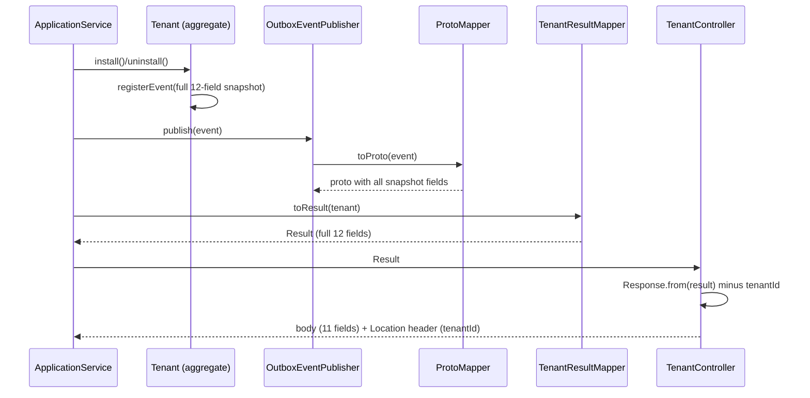

## Context

The tenant service (Spring Boot 4 / Java 25, hexagonal DDD) records Forge app
install and uninstall lifecycle. The `Tenant` aggregate has twelve fields:
`cloudId`, `installationId`, `appId`, `appVersion`, `environmentId`, `siteUrl`,
`installerAccountId`, `status`, `installedAt`, `updatedAt`, `uninstalledAt`,
`purgeAfter`. Today its outward projections are partial:

- `TenantInstalledEvent` carries 9 fields (no `status`, `updatedAt`,
  `uninstalledAt`, `purgeAfter`).
- `TenantUninstalledEvent` carries 6 fields (no install metadata, no
  `installedAt`, no `updatedAt`, no `status`).
- `TenantResponse` carries `tenantId` + 4 fields; `UninstallTenantResponse`
  carries `tenantId` + 3 fields.

Events flow through a transactional outbox: domain event → per-type
`OutboxEventProtoMapper` → proto message → CloudEvents proto-JSON →
`outbox_event` row → scheduled relay → Kafka. Responses flow: `Tenant` →
`TenantResultMapper` → `*Result` → `*Response.from(result)` → controller body.
The proto contract lives in the shared `services/proto` module and is consumed
by other services.

## Goals / Non-Goals

**Goals:**

- Both lifecycle events carry a complete 12-field snapshot of the aggregate.
- Both POST/PUT responses carry the full snapshot minus `tenantId` and minus any
  field marked sensitive (none today).
- Keep the domain framework-agnostic; proto mapping stays at the infrastructure
  boundary.
- Preserve backward compatibility of the Kafka proto contract.

**Non-Goals:**

- No change to `outbox_event` / `tenants` table schema (both keep `tenant_id`).
- No change to the outbox relay, transport, CloudEvent encoding, or message key.
- No new sensitive-field classification mechanism beyond documenting the
  concept; no field is sensitive today.
- No change to the request DTOs or use-case inputs.

## Decisions

### D1 — Snapshot is projected from the aggregate, not assembled ad hoc

`Tenant.registerInstalledEvent()` and `Tenant.uninstall()` construct events from
the aggregate's current field values. Both events receive all twelve values;
values not yet set (e.g. `uninstalledAt` at install) are passed as `null`. This
keeps the aggregate the single source of truth for a snapshot.

### D2 — Proto fields added with new field numbers, proto3 defaults for null

`tenant_installed.proto` reserves number 6 (legacy `environment_type`) and uses
1–5, 7–9. New fields `status`, `updated_at`, `uninstalled_at`, `purge_after`
take numbers 10–13. `tenant_uninstalled.proto` uses 1–5; new fields
`app_version`, `environment_id`, `site_url`, `installer_account_id`, `status`,
`installed_at`, `updated_at` take numbers 6–12. `status` is encoded as a
`string` (the enum name) to match the existing string-based encoding of
timestamps and to avoid coupling the proto to the Java enum ordinal. Null domain
values map to the proto3 default (empty string), consistent with how
`appVersion` is handled today.

### D3 — Results carry the full snapshot; responses scrub `tenantId`

`RegisterTenantResult` and `UninstallTenantResult` expand to all twelve fields
so presentation has everything it needs. `TenantResponse` and
`UninstallTenantResponse` include all fields **except** `tenantId`. The
controller keeps `resultValue.tenantId()` (from the result, not the response) to
build the `201 Location` header.

### D4 — Sensitive-field rule is documented, not enforced by code yet

No `Tenant` field is classified sensitive today, so the response scrub only
removes `tenantId`. The api-convention spec records the sensitive-field
exclusion so future sensitive fields are handled consistently.

### Event/response snapshot flow

## Risks / Trade-offs

- **Semantically constant fields in events**: `TenantInstalled.status` is always
  the active status and `uninstalled_at`/`purge_after` are always empty at
  install. Consumers receive fields that are invariant for that event type. This
  is an accepted trade-off chosen for snapshot uniformity over minimalism.
- **proto3 null ambiguity**: empty string cannot be distinguished from a real
  empty value. Acceptable because these fields are identifiers/URLs that are
  never legitimately empty strings.
- **Contract surface grows**: more fields to keep in sync across proto, mappers,
  results, responses, and tests. Mitigated by projecting everything from the
  aggregate in one place (D1).
- **OpenAPI regeneration required**: the `openapi.yaml` diff will be large due
  to added response fields and removed `tenantId`.
