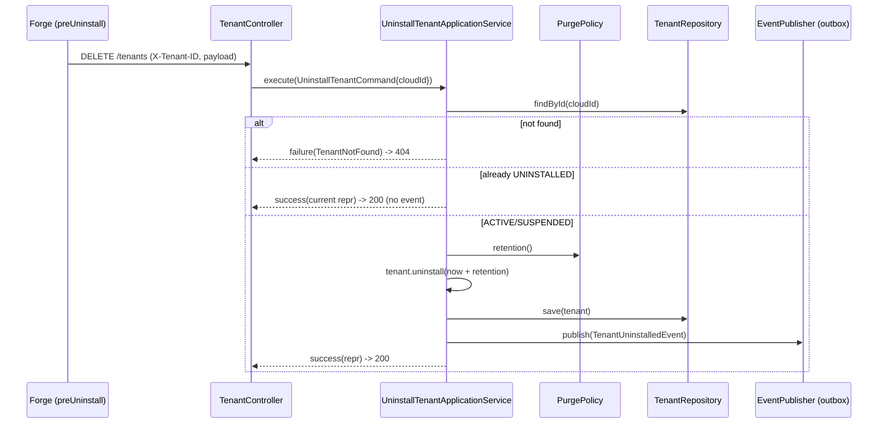

## Context

The tenant service records Forge app installs via `POST /tenants` (see
`install-app`), persisting a `Tenant` aggregate keyed by Jira cloudId and
emitting a `TenantInstalled` event through the transactional outbox. The
aggregate and the `B1.0.0__baseline.sql` schema already define an `UNINSTALLED`
status plus `uninstalled_at` and `purge_after` columns (and an
`idx_tenants_purge` partial index), but nothing sets them and no uninstall event
exists. Forge signals removal through the `preUninstall` life-cycle trigger,
which delivers a payload shaped like the install payload and may be redelivered.

## Goals / Non-Goals

**Goals:**

- Expose `DELETE /tenants` that records an uninstall using the context cloudId
  and the `preUninstall` payload body.
- Transition an active tenant to `UNINSTALLED`, stamp `uninstalled_at`, and
  schedule `purge_after` from a configurable retention window.
- Publish a `TenantUninstalled` event via the existing outbox + proto-mapper
  pipeline.
- Return `200` with the tenant representation; `404` for unknown cloudId;
  idempotent `200` no-op when already uninstalled.

**Non-Goals:**

- The actual purge/deletion job that acts on `purge_after` (only the deadline is
  scheduled here).
- Handling `avi:forge:installed:app` / `avi:forge:upgraded:app` events.
- Any database migration (the required columns and status check already exist).

## Decisions

### DELETE /tenants with cloudId from context

Following `install-app`, the cloudId is resolved from `TenantContext`
(`X-Tenant-ID`), not the body. Uninstall maps to the standard REST `DELETE` on
the `tenants` resource per api-convention. The `preUninstall` payload is
accepted in the body for parity with Forge's trigger contract, but the
authoritative tenant data used for the event comes from the persisted row.

_Alternative considered:_ `POST /tenants:uninstall` action-style. Rejected —
api-convention reserves `:action` for non-CRUD verbs, and uninstall maps cleanly
to `DELETE` on the resource.

### Soft-delete + scheduled purge, not hard delete

The row is retained with `status = UNINSTALLED`, `uninstalled_at`, and
`purge_after` so downstream consumers can react and a later purge job can act on
the deadline. Aligns with the existing schema and the outbox contract.

### Retention window via properties record + domain port

The retention window is read from `smiski.tenant.retention.purge-after`
(ISO-8601 `Duration`, default `P30D`) into a `@ConfigurationProperties` record
`TenantRetentionProperties`. ArchUnit forbids `application` from depending on
the tenant's own `infrastructure`, so the record implements a domain port
`PurgePolicy`. The application service injects the port, computes
`purgeAfter = now + retention`, and passes the resolved `Instant` into
`Tenant.uninstall(...)`, keeping the domain free of framework config types.

_Alternative considered:_ inject the properties record directly into the
service. Rejected — violates the ArchUnit
`application_must_not_depend_on_infrastructure` rule.

### New TenantUninstalled event through the existing outbox pipeline

A new `TenantUninstalledEvent` (implementing the tenant `PublishableEvent`
marker) is registered on the aggregate and mapped to a new `TenantUninstalled`
proto by a `TenantUninstalledEventProtoMapper`. The mapper is auto-registered in
the `OutboxEventProtoMapperRegistry` by runtime type — no publisher change
needed. Event type `io.github.smiskinext.tenant.v1.uninstalled`, topic
`tenant.tenant.uninstalled`.

### Idempotency and not-found in the application service

The `@Transactional` service loads the tenant by cloudId:

- absent → `Result.failure(TenantNotFound)` → HTTP `404` via `ResultResponder`
- already `UNINSTALLED` → return current representation, no state change, no
  event
- otherwise → `tenant.uninstall(purgeAfter)`, save, publish registered events

### Flow

## Risks / Trade-offs

- **DELETE with a request body is uncommon** and some intermediaries strip it →
  Mitigation: the body is non-authoritative; cloudId comes from the header, so a
  stripped body does not break the operation.
- **Redelivered preUninstall could double-publish** → Mitigation: already-
  `UNINSTALLED` tenants are a no-op with no event.
- **Misconfigured retention duration** (invalid ISO-8601) → Mitigation:
  `@Validated` properties record with a `Duration` type + `P30D` default fails
  fast at startup rather than silently.
- **Outbox mapper not registered for the new event** → Mitigation: the registry
  throws on unmapped types and the integration test asserts a row is enqueued.

## Migration Plan

No schema migration. Deploy is additive (new endpoint, new event type, new
config key with a safe default). Rollback is removing the endpoint; no data
shape changes. New proto requires regenerating generated sources; existing
`TenantInstalled` consumers are unaffected.
