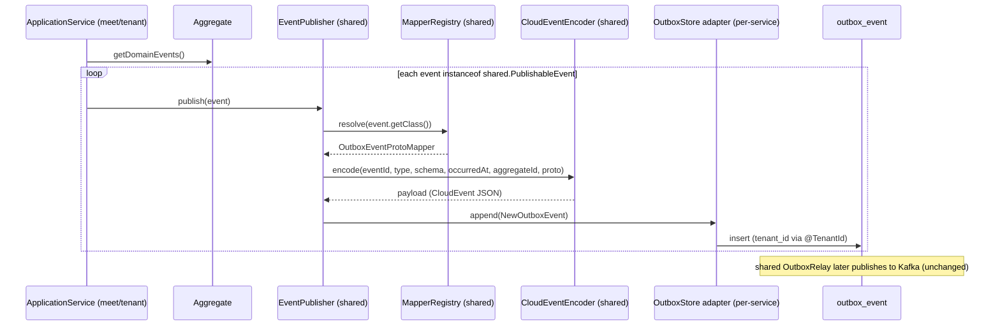

## Context

The shared library already owns the reusable outbox relay, `CloudEventEncoder`,
`OutboxEventProtoMapperRegistry`, `OutboxTransport`/`KafkaOutboxTransport`, and
`OutboxProperties`, auto-wired by `OutboxAutoConfiguration` on the presence of
an `OutboxStore` bean. Only the **write path** is duplicated: each service
declares its own `PublishableEvent`, its own `EventPublisher` port, and its own
`OutboxEventPublisher` that writes rows straight to a service-specific JPA
repository. `OutboxStore` (`shared/.../outbox/OutboxStore.java`) currently
exposes only read/relay operations (`claimBatch`, `markPublished`,
`recordFailure`) — no write operation — which is why the publisher cannot be
shared.

Current divergences (verified):

- `tenant.domain.event.PublishableEvent` is an empty marker;
  `meet.domain.PublishableEvent` adds `meetingAggregateId(): UUID` plus a
  default `aggregateId()` bridge.
- meet's 3 proto mappers implement `OutboxEventProtoMapper<PublishableEvent>`
  with raw types, `(Object)`/`(Class<?>)` casts, and `@SuppressWarnings`;
  tenant's mappers are typed to the concrete event and are cast-free.
- tenant writes `tenant_id` manually via `TenantContext.getCurrentTenant()`;
  meet relies on Hibernate `@TenantId` on its `OutboxEventJpaEntity`.

Constraints: hexagonal + DDD layering is ArchUnit-enforced; the domain stays
framework-agnostic; `outbox_event` keeps `PRIMARY KEY (tenant_id, id)` with a
UUIDv7 `id` (db-schema "Transactional outbox"); `ddl-auto: validate` means
`*JpaEntity` mappings must match the migrated schema exactly.

## Goals / Non-Goals

**Goals:**

- One event contract: `shared.domain.PublishableEvent` used by every service.
- One shared write path: a shared `EventPublisher` port + `OutboxEventPublisher`
  implementation writing through an `OutboxStore.append(...)` operation.
- Restore compile-time type safety in the meet proto mappers.
- Keep `tenant_id` population out of the publisher by standardizing on Hibernate
  `@TenantId` in both services.

**Non-Goals:**

- No change to `outbox_event` schema, no Flyway migration.
- No change to proto messages under `event/meet/v1` or `event/tenant/v1`.
- No change to relay behavior, batching, retry, transport, or CloudEvent
  encoding.
- No new publishable events; only the existing ones are migrated.

## Decisions

### D1: Single `PublishableEvent` contract (delete both local interfaces)

Delete `meet.domain.PublishableEvent` and
`tenant.domain.event.PublishableEvent`. Every domain event implements
`shared.domain.PublishableEvent` directly, whose `aggregateId()` returns
`String`.

_Why:_ removes duplication and the empty tenant marker; a single contract is
what the shared publisher and registry already operate on. _Alternative
rejected:_ keep `meet.PublishableEvent` for the `meetingAggregateId()` accessor
— the user explicitly chose one interface, accepting the per-event
`aggregateId()` cost.

### D2: Meet events expose `meetingId(): UUID`, implement `aggregateId()`

Each meet event keeps a UUID field named `meetingId` (rename the current
`meetingAggregateId` record components; drop the manual `meetingAggregateId()`
overrides on the events that used a `meetingId` field) and implements
`aggregateId()` as `meetingId().toString()`. Proto mappers read the concrete
`meetingId()` accessor.

_Why:_ keeps the domain UUID-typed while satisfying the String contract; naming
is uniform across all 16 events. _Alternative rejected:_ store `aggregateId` as
a String field on events — pushes a presentation concern into the domain.

### D3: Add `append(...)` to `OutboxStore`; move publisher to shared

Extend the `OutboxStore` port with `void append(NewOutboxEvent event)` and a
`NewOutboxEvent` record (eventId, aggregateId, aggregateType, eventType, topic,
payload, occurredAt). Introduce a shared `EventPublisher` port and a shared
`OutboxEventPublisher` (typed to `shared.domain.PublishableEvent`) that resolves
the mapper, encodes the CloudEvent, and calls `outboxStore.append(...)`. Delete
both per-service `EventPublisher` ports and both `OutboxEventPublisher`
adapters.

_Why:_ the write path becomes reusable exactly like the read path; a new service
supplies only an `OutboxStore` adapter and mappers. _Alternative rejected:_ keep
per-service publishers — the duplication this change targets.

### D4: `tenant_id` via Hibernate `@TenantId` in both services

Add `@TenantId` to tenant's `OutboxEventJpaEntity` and drop the constructor
`tenantId` parameter and the `TenantContext` read in the (now-removed)
publisher. meet already uses `@TenantId`. The shared publisher never touches
tenant.

_Why:_ the shared publisher stays tenant-agnostic; Hibernate fills `tenant_id`
on insert. The relay's `claimBatch` is native SQL and scans across tenants, so
the discriminator does not hide rows from the background relay (event-driven
"Scheduled relay across tenants"). _Alternative rejected:_ pass `tenantId` into
`append(...)` — re-introduces the manual `TenantContext` read the shared
publisher must avoid.

### D5: Unchecked casts confined to the registry-resolution boundary

The registry resolves mappers by `event.getClass()` at runtime (typesafe
heterogeneous container). Two unchecked casts remain, both at this boundary and
both forced by type erasure: narrowing `event.getClass()` to
`Class<PublishableEvent>` inside the shared publisher's private `resolveMapper`
helper, and narrowing the stored `OutboxEventProtoMapper<?>` back to the event
type inside `OutboxEventProtoMapperRegistry.resolve(...)`. Every proto mapper
and the rest of the publisher body are cast-free.

_Why:_ Java's type system cannot make runtime `Class<?>` lookup statically safe;
confining the casts to the resolution boundary restores mapper type safety
everywhere else.

### Sequence

## Risks / Trade-offs

- **16 meet events each gain a 1-line `aggregateId()`** → accepted cost of a
  single interface; uniform `meetingId` naming keeps it mechanical and
  reviewable.
- **Moving `EventPublisher` to shared changes application-layer dependencies** →
  Mitigation: application already depends on shared (`UseCase`, `Result`); run
  the ArchUnit `CleanArchitectureTest` for both services to confirm layering
  passes.
- **tenant `@TenantId` filter could hide outbox rows** → Mitigation: the relay
  uses native `claimBatch` (`FOR UPDATE SKIP LOCKED`) that bypasses the
  discriminator, as already proven in meet; add/keep an integration test
  asserting cross-tenant relay.
- **Renaming `meetingAggregateId` record components touches constructors** →
  Mitigation: grep all `new <Event>(...)` call sites (aggregate factories,
  tests) and update in lockstep; compiler catches misses.
- **Behavioral regressions in publish semantics** → Mitigation: no relay/encoder
  changes; existing outbox integration tests for meet and tenant must stay
  green.

## Migration Plan

1. Shared: add `OutboxStore.append(...)` + `NewOutboxEvent`; add shared
   `EventPublisher` port + `OutboxEventPublisher`.
2. Adapters: both `OutboxStoreRepositoryAdapter`s implement `append` (meet does
   `UUID.fromString(aggregateId)`; tenant stores the String directly).
3. tenant: add `@TenantId` to `OutboxEventJpaEntity`, drop `tenantId` ctor
   param.
4. Events: migrate meet (16) + tenant (2) events to `shared.PublishableEvent`;
   rename to `meetingId`; add `aggregateId()`.
5. Mappers: retype meet's 3 mappers to concrete generics; remove casts.
6. Delete `meet.domain.PublishableEvent`,
   `tenant.domain.event.PublishableEvent`, both per-service `EventPublisher`
   ports and `OutboxEventPublisher`s.
7. Update event-filter imports in app services; update tests referencing removed
   types.
8. Build both services (unit + ArchUnit + integration) green; regenerate OpenAPI
   is not required (no endpoint change).

Rollback: revert the change set; no data or schema migration means rollback is a
code-only revert.

## Open Questions

- None blocking. `record`/`notification` services do not currently provide an
  `OutboxStore` write path; if a later slice adds one, it reuses the new shared
  publisher unchanged.
