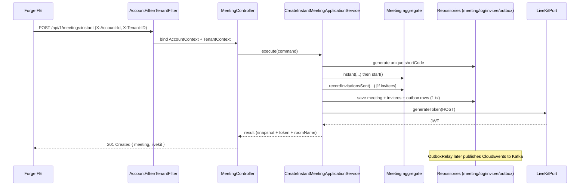

## Context

The `meet` service currently ships only its domain layer (aggregates, value
objects, events, and outbound ports). Its `application`, `presentation`, and
infrastructure adapter packages are empty scaffolding, so no HTTP endpoint can
be served. This change builds the first end-to-end vertical slice — "create an
instant meeting" — and stands up the reusable infrastructure it needs, closely
following the fully-built `tenant` service as the reference implementation.

Cross-cutting facts established during exploration:

- Hexagonal + DDD layering is ArchUnit-enforced
  (`domain → application → infrastructure → presentation`).
- Tenant is resolved from the `X-Tenant-ID` header into `TenantContext` by the
  shared `TenantFilter`; Hibernate applies it as a discriminator via
  `@TenantId`.
- The baseline migration already defines `meetings`, `participation_logs`,
  `meeting_invitees`, and `outbox_event` (all hash-partitioned by `tenant_id`).
- The shared library already provides the full outbox relay machinery
  (`OutboxRelay`, `CloudEventEncoder`, `OutboxEventProtoMapperRegistry`,
  `KafkaOutboxTransport`), activated by `@ConditionalOnBean(OutboxStore.class)`.
  Each service supplies only an `OutboxStore` adapter, a
  `KafkaTemplate<String, CloudEvent>` producer, per-event proto mappers, and an
  `EventPublisher` that writes rows.
- The `service.base` convention plugin puts `libs.proto`, JJWT, BouncyCastle,
  the LiveKit server SDK, security, validation, and Kafka on every service's
  classpath.
- The `Meeting` aggregate already exposes `instant(...)` (registers
  `MeetingCreatedEvent`) and `start()` (registers `MeetingStartedEvent`);
  `MeetingInvitee` supports `create(...)` + `assignToken(hash, expiresAt)`;
  `ParticipationLog.join(...)` records a host session.

## Goals / Non-Goals

**Goals:**

- Serve `POST /api/1/meetings:instant`: create an INSTANT meeting, auto-start it
  to LIVE, register invitees with invite tokens, and return a snapshot + LiveKit
  HOST token.
- Introduce a reusable shared account-identity filter/context (`X-Account-Id` →
  `AccountContext`) analogous to the tenant machinery.
- Publish `MeetingCreatedEvent`, `MeetingStartedEvent`, and (when invitees
  exist) `MeetingInvitationsCreatedEvent` transactionally via the outbox →
  Kafka. Both `MeetingCreatedEvent` and `MeetingStartedEvent` carry a full
  aggregate snapshot (via a shared `MeetingSnapshot` proto message). The
  invitations event embeds the invite token directly in each `InviteeInfo`
  entry.
- Keep the domain framework-agnostic; map to proto/CloudEvents only at the
  infrastructure boundary.

**Non-Goals:**

- Schedule endpoint, join/`requestJoin` flow, LiveKit webhooks, invite
  accept/decline, and email delivery (notification service consumes the event).
- Implementing repository query methods not needed by this slice (cursor
  pagination, participant/invitee summaries) — those throw
  `UnsupportedOperationException` with a TODO until a later slice needs them.
- Any schema migration (baseline tables suffice).

## Decisions

### D1: Host identity via a shared `AccountFilter` + `AccountContext`

Add `infrastructure/identity` to the shared library: an `AccountContext`
(virtual-thread-safe `ThreadLocal`), an `AccountFilter` binding a configurable
header (default `X-Account-Id`) per request and clearing it in a `finally`, an
`AccountProperties` record, and an `AccountAutoConfiguration` registered in
`META-INF/spring/org.springframework.boot.autoconfigure.AutoConfiguration.imports`.
The controller reads `AccountContext.getCurrentAccount()` and passes it into the
command — never from the request body.

_Why:_ mirrors the proven `TenantFilter`/`TenantContext` pattern, keeps host
identity out of the body (trusted gateway boundary), and is reusable by future
services. _Alternative rejected:_ a Spring Security `Authentication` principal
(zms `HeaderAuthFilter`) — heavier and inconsistent with how tenant is handled.

### D2: Endpoint shape and request/response contract

`POST /meetings:instant` (action suffix per api-convention, effective route
`/api/1/meetings:instant`). Request body: required `title`, required
`description`, required `issueLink` (`issueId`/`issueKey`/`projectKey`),
required `settings` (admissionPolicy, maxParticipants ≤100, allowScreenShare,
chatEnabled, allowMicrophone, allowVideo), required `host` (`displayName` +
`deviceId`), optional `invitees[]` (`email` + required `accountId` + required
`displayName`). The host `accountId` (from header) is carried inside the command
`Host` record — never a top-level command field. Response `201 Created` with
`Location`, body `{ meeting: <snapshot>, livekit: { token, roomName } }`. The
snapshot excludes `tenantId` per api-convention; `wsUrl` is not returned.
Response fields `title`, `description`, and `issueLink` are always non-null.

_Why:_ host `displayName`/`deviceId` are required to build the LiveKit identity
(`accountId:deviceId`) and the LiveKit token request; the frontend already
resolves invitees so the backend performs no gRPC user lookup.

### D7: Non-null contract for title, description, and issueLink

The `meetings` table columns `title`, `description`, `issue_id`, `issue_key`,
and `project_key` are `NOT NULL` (baseline migration). The domain aggregate,
events, entity, and response guarantee these fields are always present. This is
enforced because the Forge issue-panel always operates in the context of a
specific Jira issue, so every meeting inherently has an issue link, a title
(derived from or entered alongside the issue), and a description.

### D3: `Meeting.recordInvitationsSent(...)` domain method

Add a method to the `Meeting` aggregate that registers
`MeetingInvitationsCreatedEvent` (built from the invitee snapshots with embedded
tokens). The application service creates invitees + tokens first, then calls it.

_Why:_ keeps event registration on the aggregate (consistent with every other
meet/tenant event). _Alternative rejected:_ publishing directly from the service
(zms style) — diverges from the established `registerEvent()` pattern.

### D4: Invite-token generation port at the domain boundary

Add a domain outbound port `InviteTokenGenerator` returning a raw token plus its
SHA-256 hash; the infrastructure `InviteTokenJwtGenerator` implements it with
JJWT using the existing `zms.invite.token-secret` / `token-expiry-days` config.
Only the hash is stored (`MeetingInvitee.assignToken`); the raw token is
embedded directly in each `MeetingInvitationsSentEvent.InviteeInfo` entry (the
invitee's accountId is always present — invitees must be resolved to a Jira
account).

_Why:_ domain stays free of JWT libraries; matches the InviteToken VO which
stores only the hash.

### D5: Outbox wiring reuses shared machinery

Provide `OutboxEventJpaRepository` (with `claimBatch` + `markPublished`),
`OutboxStoreRepositoryAdapter implements OutboxStore`,
`OutboxEventPublisher implements EventPublisher` (writes rows via the proto
mapper + CloudEvent encoder, tenant from `TenantContext`), `KafkaProducerConfig`
(CloudEvent producer/template), and three `OutboxEventProtoMapper` impls. Add
three proto messages under `event/meet/v1`. Config adds `smiski.outbox` with
`cloudevent.source: meet-service`.

_Why:_ the shared relay/encoder/registry/trigger already exist and
auto-configure on the presence of an `OutboxStore` bean.

### D6: Single-transaction application service

`CreateInstantMeetingApplicationService` (`@Service @Transactional`)
orchestrates: generate unique `ShortCode` (retry on `existsByShortCode`, bounded
attempts → `ShortCodeExhausted`); `Meeting.instant(...)`; `meeting.start()`;
build host `LiveKitIdentity` for the token request; for each invitee create
`MeetingInvitee` + generate/assign token; `meeting.recordInvitationsSent(...)`
when invitees exist (each `InviteeInfo` carries its own token); persist meeting
and invitees; enqueue every registered `PublishableEvent` to the outbox; mint
the LiveKit HOST token via `LiveKitPort`; return the result. LiveKit token
failure returns `LiveKitUnavailable` and rolls back.

_Why:_ events and state commit atomically; token issuance inside the transaction
means a LiveKit outage fails the whole create rather than returning a meeting
the host cannot join.

### Sequence

## Risks / Trade-offs

- **Partial ports left unimplemented** → adapters throw
  `UnsupportedOperationException` for query methods this slice does not use;
  documented and localized so ArchUnit/build stay green and later slices fill
  them in without redesign.
- **LiveKit inside the create transaction** → a media outage fails creation;
  acceptable because an instant meeting is worthless without a joinable host
  token. Mitigation: map SDK failures to `LiveKitUnavailable` (503-category).
- **New shared `AccountFilter` affects all services** → default header only
  binds when present and clears per request; no existing service reads
  `AccountContext`, so behavior is additive only.
- **Three new proto messages must pass Buf STANDARD lint** → follow the existing
  `event/tenant/v1` layout and naming; run `pnpm run openapi`/buf before commit.
- **`@TenantId` + outbox exemption** → `outbox_event` must not be filtered by
  the tenant discriminator (per event-driven spec); reuse the shared/tenant
  approach and set `tenant_id` explicitly from `TenantContext`.

### D8: Host avatar as real LiveKit participant attribute

Participant attributes (role, avatarUrl) are set on the `AccessToken` via
`token.getAttributes().putAll(participantAttributes.toMap())` — real LiveKit
participant attributes rather than a serialized metadata string. The host
`avatarUrl` is optional and nullable; it flows from `Request.Host.avatarUrl` →
`Command.Host.avatarUrl` → `ParticipantAttributes` → `toMap()` (only emitted
when non-blank) → `AccessToken` attributes.

_Why:_ real attributes are queryable by LiveKit clients and webhooks; metadata
is an opaque blob. The `toMap()` already conditionally includes `avatarUrl` only
when present, so no extra null-handling is needed at the adapter layer.

### D9: Host participation log deferred to webhook

Host `ParticipationLog` creation is NOT performed at meeting creation time. Only
the HOST LiveKit token is issued so the host can join the room. The actual
participation session is recorded when the `participant_joined` LiveKit webhook
fires — this ensures the log reflects real presence rather than intent. The
webhook slice is out of scope for this change (documented in Non-Goals).
