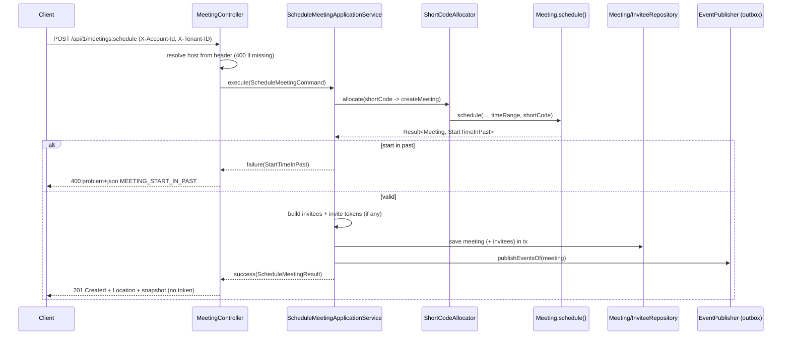

## Context

The `meet` service exposes `POST /api/1/meetings:instant` for INSTANT meetings:
it auto-starts the meeting to RUNNING and issues a LiveKit HOST token in the
response. The domain already supports scheduled meetings — `Meeting.schedule()`
builds a `SCHEDULED`/`SCHEDULED` aggregate, `MeetingType.SCHEDULED` and
`MeetingStatus.SCHEDULED` exist, `MeetingTimeRange` enforces `start < end`, and
the `meetings` table plus `MeetingJpaEntity` already carry nullable
`start_time`/`end_time`. However, no command, use case, service, request,
response, or controller endpoint wires this up, so scheduling is unreachable.

Two latent domain issues exist:

1. `Meeting.schedule()` (domain/model/Meeting.java) passes `timeRange.start()`
   for the created event but `null` for `endTime`, dropping the scheduled end
   from the `meeting.created.v1` snapshot.
2. `MeetingError.InvalidMeetingDuration` and `MeetingTimeRange` provide no
   future-time validation; nothing prevents scheduling in the past.

Research against Zoom, Google Meet, and Microsoft Teams confirmed that scheduled
start/end are calendar metadata: none of them terminate a live call at the
scheduled end, and duration caps are enforced at runtime by time-in-call, not by
the scheduled window. Microsoft's Graph docs state `endDateTime` "is used for
scheduling purposes only and carries no enforcement behavior once the meeting is
in progress." This directly informs the decision to skip max-duration checks.

Constraints: hexagonal + DDD layering (ArchUnit-enforced), `Result<T, Error>` at
boundaries (no business exceptions), RFC 9457 problem+json errors, API-first
OpenAPI generation, UUIDv7 keys, transactional outbox for events.

## Goals / Non-Goals

**Goals:**

- Add `POST /api/1/meetings:schedule` that creates a `SCHEDULED` meeting from
  title, description, issue link, settings, time range, and optional invitees.
- Resolve host from the `X-Account-Id` header; no host object in the body.
- Do not issue or return a LiveKit token; leave the meeting in `SCHEDULED`.
- Validate `start < end` and `start` not in the past with a clock-skew grace
  window; do not cap duration.
- Reuse the instant invitee/invite-token mechanism and publish
  `meeting.created.v1` (with start+end) and `meeting.invitations-sent.v1`.
- Fix the `Meeting.schedule()` event `endTime` bug.

**Non-Goals:**

- Starting, canceling, or updating a scheduled meeting.
- Enforcing min/max meeting duration or a schedule-ahead upper bound.
- Changing the instant-meeting flow or issuing a scheduled-meeting join token.
- Sending invitation emails (downstream consumer concern).

## Decisions

### Decision: Follow the instant-meeting vertical slice, minus LiveKit

Mirror the existing `CreateInstantMeeting*` classes as `ScheduleMeeting*`
(command, result, use case, application service, request, response) and add the
endpoint to the existing `MeetingController`. The service reuses
`ShortCodeAllocator`, `MeetingRepository`, `MeetingInviteeRepository`,
`InviteTokenGenerator`, and `EventPublisher`, but injects **no** `LiveKitPort`
and never calls `meeting.start()`.

- Rationale: consistency with the reference service's most-complete flow,
  minimal cognitive load, ArchUnit naming satisfied out of the box.
- Alternative considered: generalize a shared `CreateMeeting` service
  parameterized by type. Rejected — the two flows diverge on token issuance,
  status transition, and response shape; premature abstraction over three
  similar files.

### Decision: Endpoint path `POST /meetings:schedule`

Use the action-suffix style consistent with the existing `:instant` endpoint
rather than a plain `POST /meetings`.

- Rationale: matches the established pattern in the same controller; avoids
  ambiguity about which creation semantics a bare `POST /meetings` implies.
- Per api-convention, the `/api/1` prefix is applied globally; the mapping is
  declared at method level as `/meetings:schedule`.

### Decision: Time validation lives in the domain factory, with clock-skew grace

Move future-time validation into `Meeting.schedule()`, which changes its return
type to `Result<Meeting, MeetingError>`. It validates
`startTime >= now - CLOCK_SKEW_TOLERANCE` (a fixed constant on the domain, e.g.
2 minutes) and returns `MeetingError.StartTimeInPast` otherwise. The
`start < end` invariant stays in `MeetingTimeRange`'s compact constructor.

- Rationale: the factory is the single entry point for new scheduled meetings,
  so the rule cannot be bypassed; keeping it out of `MeetingTimeRange` avoids
  breaking `reconstitute()` for historical rows loaded from the database.
- Clock-skew grace addresses the user's latency concern the industry-standard
  way (reject past, tolerate small skew) instead of forcing callers/tests to add
  an arbitrary future offset.
- Alternative considered: strict `start > now` with caller-side padding.
  Rejected — flaky under latency and pushes correctness onto every caller.

### Decision: New error `MEETING_START_IN_PAST` (category VALIDATION → 400)

Add `MeetingError.StartTimeInPast` and `MeetingErrorCode.MEETING_START_IN_PAST`
(category `VALIDATION`), plus `error.meeting-start-in-past.title/.detail` keys
in `meet.properties` and `meet_vi.properties`. The existing `ResultResponder` /
`ProblemDetailMapper` maps VALIDATION to HTTP 400.

- Rationale: reuses the established error → problem+json pipeline; a dedicated
  code lets clients distinguish "past start" from other validation failures.
- The pre-existing unused `InvalidMeetingDuration` code is left untouched (out
  of scope).

### Decision: Token-free response shape

`ScheduleMeetingResponse` contains only the meeting snapshot plus `startTime`
and `endTime`; there is no `livekit` object. `ScheduleMeetingResult` likewise
omits any LiveKit fields.

- Rationale: no room is provisioned at scheduling; returning a token would imply
  a joinable session that does not exist yet.

### Flow

## Risks / Trade-offs

- **Changing `Meeting.schedule()` return type to `Result`** → It currently has
  no callers, so no production regression; verify no test references the old
  `Meeting`-returning signature and update if present.
- **Clock-skew tolerance makes the factory time-dependent** → domain unit tests
  must construct start times relative to `Instant.now()` (e.g. `now + 1h` for
  the happy path, `now - 1h` for the past case) rather than fixed literals,
  keeping them deterministic across runs.
- **Fixing the event `endTime` bug alters `meeting.created.v1` payload for
  scheduled meetings** → additive (a previously-null field is now populated);
  the proto mapper already null-guards `endTime`, so no consumer breaks.
- **No max-duration cap** → intentional per platform research; if a product rule
  later needs a cap it can wire the existing `InvalidMeetingDuration` without
  touching this endpoint's contract.

## Migration Plan

No database migration: `start_time`/`end_time` columns already exist and
`MeetingPersistenceMapper` already maps them. Deployment is additive (new
endpoint + new error code + message keys). Rollback is removal of the new
endpoint/classes; no schema or data changes to revert. Regenerate
`services/meet/openapi.yaml` from the OpenAPI generation test after wiring.

## Open Questions

None — scope, validation rules, path, and response shape are decided.
