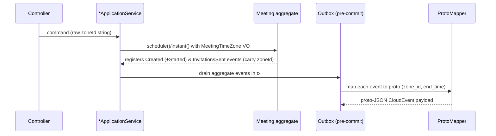

## Context

Meeting start/end are stored purely as UTC `Instant` values across the `meet`
service (`MeetingTimeRange`, `MeetingJpaEntity.start_time/end_time`, all
events). No time-zone context is captured anywhere, and the `notification`
service — the consumer that will render invitation emails — receives only a UTC
`start_time` in the `MeetingInvitationsCreated` proto. To show recipients a
well-defined meeting time, the system needs one authoritative reference zone.
The host's IANA time zone, captured at creation, is that reference.

The `meet` service is hexagonal + DDD with an ArchUnit-enforced layering, a
transactional outbox that maps domain events to shared Protocol Buffers at the
infrastructure boundary, and Flyway migrations governed by additive `V<n>`
files.

## Goals / Non-Goals

**Goals:**

- Capture a required host `zoneId` (IANA region id) on every meeting, both
  `SCHEDULED` and `INSTANT`, validated and persisted NOT NULL.
- Keep UTC `Instant` start/end as the single authoritative moment — zone is
  additive display metadata, never a replacement.
- Propagate `zoneId` (and `endTime` on the invitations event) through the domain
  events and the shared proto contracts so `notification` can consume them.

**Non-Goals:**

- Implementing email rendering / sending in the `notification` service.
- Per-invitee time zones (Model 1: a single meeting-level zone only).
- Separate start/end zones (Google-Calendar-style cross-zone events).
- Converting stored instants to `ZonedDateTime`/`OffsetDateTime`.

## Decisions

### D1 — `MeetingTimeZone` value object wrapping `java.time.ZoneId`

A new domain VO `MeetingTimeZone` in `domain/model/valueobject/` validates its
input in the compact constructor and stores the canonical IANA id string.
Validation SHALL require membership in `ZoneId.getAvailableZoneIds()` (region
ids), which rejects unknown ids and bare offsets like `+07:00`.

- **Why**: Matches the existing VO pattern (`MeetingTitle`, `Email`) and keeps
  the invariant in the domain, framework-agnostic.
- **Alternative considered**: plain `String` column — rejected: loses the domain
  invariant and scatters validation.

### D2 — Two-layer validation producing a clean `400 VALIDATION_ERROR`

Presence is enforced at the request boundary (`@NotBlank zoneId`). IANA-format
validity is enforced by a custom Jakarta constraint `@IanaZoneId` on the request
field so an invalid zone surfaces through the shared `GlobalExceptionHandler` as
`400 VALIDATION_ERROR` (matching the spec scenarios). The domain
`MeetingTimeZone` VO remains the invariant guard (defense in depth).

- **Why**: The spec requires `400 VALIDATION_ERROR`; a Jakarta constraint yields
  that automatically and uniformly. The VO still protects the aggregate.
- **Alternative considered**: only VO validation, translating the thrown
  exception in the application service into a `MeetingError` — more plumbing and
  risks a `500` if a path forgets to translate.

### D3 — Request placement: top-level `zoneId` on both endpoints

Both `ScheduleMeetingRequest` and `CreateInstantMeetingRequest` gain a top-level
required `zoneId` (sibling of `timeRange`/`host`).

- **Why**: Time zone is a meeting-level attribute, not a LiveKit participant
  attribute, so it does not belong inside the instant `host` object. Keeping it
  top-level makes both endpoints symmetric.

### D4 — Persistence: additive `V2` migration, NOT NULL with backfill

Add `zone_id VARCHAR(64) NOT NULL` to `meetings` via
`V2__add_meetings_zone_id.sql`. To satisfy NOT NULL for any pre-existing rows,
add the column with a temporary `DEFAULT 'UTC'`, then `DROP DEFAULT` so the
application must always supply the value explicitly. `MeetingJpaEntity` gains a
non-null `zoneId` field to keep `ddl-auto: validate` green.

- **Why**: Flyway governance forbids editing the baseline; NOT NULL columns on
  partitioned tables need a backfill value; dropping the default prevents silent
  wrong-zone data going forward.

### D5 — Events and proto contracts (backward-compatible)

- `MeetingCreatedEvent` gains `zoneId`. `MeetingInvitationsCreatedEvent` gains
  `zoneId` and `endTime`.
- `meeting_snapshot.proto` gains `zone_id`; `meeting_invitations_created.proto`
  gains `zone_id` and `end_time`, each using **new field numbers** (the
  invitations proto already reserves `7`, so use `8`, `9`) to stay
  backward-compatible per the event-driven shared-contract requirement.
- Proto mappers (`MeetingCreatedEventProtoMapper`,
  `MeetingInvitationsCreatedEventProtoMapper`, and any mapper building
  `MeetingSnapshot`) set the new fields. For instant meetings the invitations
  `start_time`/`end_time` stay at proto3 default (absent).

### Flow

## Risks / Trade-offs

- **Breaking API change** (clients must now send `zoneId`) → Mitigation: this is
  pre-release backend; update Forge app + integration fixtures in the same
  change; OpenAPI regenerated so consumers see the new required field.
- **DEFAULT 'UTC' backfill could mask a real host zone for old rows** →
  Mitigation: dropping the default immediately after backfill; only affects rows
  created before this change (dev data).
- **Proto field-number reuse mistake breaks consumers** → Mitigation: only add
  new field numbers, never reuse; respect existing `reserved 7`; Buf STANDARD
  lint gate in pre-commit/CI.
- **`ZoneId.getAvailableZoneIds()` varies with the JVM/tzdata** → Mitigation:
  Java 25 bundles a current tzdata; region ids for real cities are stable; the
  check is intentionally strict to reject offsets.

## Migration Plan

1. Add `V2__add_meetings_zone_id.sql` (add column NOT NULL DEFAULT 'UTC', drop
   default) and matching `MeetingJpaEntity.zoneId`.
2. Extend domain VO, aggregate, events; extend commands/requests/responses.
3. Extend proto + mappers; regenerate proto and `openapi.yaml`.
4. Deploy `meet` (schema + producers) before wiring any `notification` consumer.
   Rollback: the added column is additive; reverting code leaves an unused NOT
   NULL column — a follow-up `V` migration would drop it if needed.

## Open Questions

- _None._ Scope, validation strategy, persistence, and contract propagation are
  all decided above.
