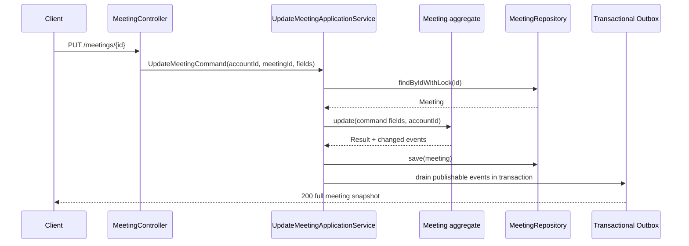

## Context

The meet service currently supports meeting creation and lifecycle transitions,
but it has no update endpoint or application flow. The aggregate already owns
meeting status, host identity, mutable meeting information, settings, time
range, and time zone, and publishable domain events are persisted through the
transactional outbox.

The update operation must preserve the existing versioned REST convention, RFC
9457 error responses, Result-based business error handling, and aggregate-driven
event publication. The main design constraint is that mutability depends on both
the meeting status and the field being changed.

## Goals / Non-Goals

**Goals:**

- Expose `PUT /api/1/meetings/{id}` with a full update request and full meeting
  snapshot response.
- Enforce host-only authorization in the application/domain flow.
- Enforce the status matrix for information, settings, time zone, and time range
  changes.
- Persist only actual changes and publish no-op-free information/settings events
  through the existing outbox mechanism.
- Keep the API and event contracts explicit and testable.

**Non-Goals:**

- Changing meeting lifecycle transitions, participant moderation, invitees, or
  LiveKit room behavior.
- Adding partial-update semantics or a separate PATCH endpoint.
- Adding a database migration; the existing meeting columns and JSON settings
  storage are sufficient.

## Decisions

### Use a single full update endpoint

The API will use `PUT /meetings/{id}` and a request containing the mutable
meeting fields. The application service will load the aggregate with a lock,
validate authorization and status rules through aggregate behavior, save the
aggregate, and return the full meeting snapshot. This follows the existing REST
convention and avoids multiple endpoints with inconsistent authorization rules.

### Keep field mutability in the aggregate

The aggregate will compare incoming values with current values and apply only
actual changes. It will reject all changes for `COMPLETED` and `CANCELED`, allow
`title`, `description`, `issueLink`, and `settings` in `SCHEDULED` and
`RUNNING`, and allow `zoneId` and `timeRange` only in `SCHEDULED`. This keeps
lifecycle invariants close to the state they protect rather than duplicating
them in the controller.

### Use separate publishable events by concern

Changed information will register one `meeting.info.update` event containing old
and new information snapshots. Changed settings will register one
`meeting.settings.update` event containing old and new settings. If both groups
change, both events are registered in one transaction; if only one group
changes, only its event is registered. No event is registered for an unchanged
group.

The event `eventType` and `topic` values will be exactly `meeting.info.update`
and `meeting.settings.update` as requested. The existing outbox and typed
infrastructure mapping pattern remains responsible for durable publication.

### Return domain errors through existing responders

Missing meetings, non-host requests, terminal statuses, and invalid update
values will use `MeetingError` variants and the existing
`ResultResponder`/Problem Details mapping. No controller-specific business
exception path will be introduced.

### Update persistence through the existing mapper

The existing meeting persistence entity and mapper will be extended only where
required to write changed aggregate fields. No schema migration is planned
because `title`, `description`, `issueLink`, `timeRange`, `timeZone`, and
settings already exist in the baseline schema.

### Update flow

## Risks / Trade-offs

- [Risk] A full `PUT` request can accidentally overwrite a field if a client
  sends stale data. → Mitigation: require the complete mutable representation
  and return the latest full snapshot; optimistic concurrency is out of scope
  for this change.
- [Risk] Event consumers may rely on the existing settings event type/topic. →
  Mitigation: preserve the event payload shape where possible, explicitly change
  the metadata to the requested names, and add contract tests for both event
  types.
- [Risk] Updating a scheduled time range to a past start could create invalid
  scheduling state. → Mitigation: reuse the existing time-range validation and
  clock-skew rules for any supplied scheduled range.
- [Risk] Updating zone and time range independently can leave a valid but mixed
  calendar representation. → Mitigation: validate each value object at the
  request/domain boundary and apply both atomically when supplied.
