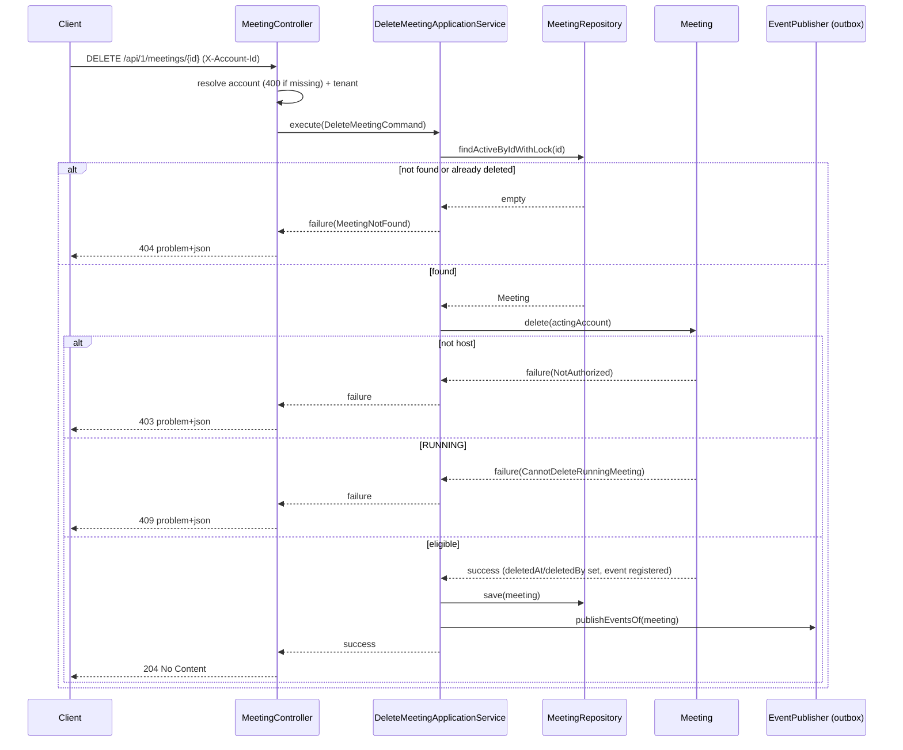

## Context

The `meet` service (Spring Boot 4 / Java 25, hexagonal + DDD) manages the
meeting lifecycle: `SCHEDULED → RUNNING → COMPLETED`, or `SCHEDULED → CANCELED`.
The `Meeting` aggregate already declares soft-delete state (`deletedAt`,
`deletedBy`, `purgeAfter`) with accessors and full `reconstitute(...)` support,
and the `meetings` table (`B1.0.0__baseline.sql`) already has `deleted_at`,
`deleted_by`, `purge_after` columns plus a partial index
`idx_meetings_purge ON (tenant_id, purge_after) WHERE deleted_at IS NOT NULL`.
The meeting list query (`MeetingRepositoryAdapter.searchSummaries`) already
filters `deleted_at IS NULL`.

What is missing: a domain behavior to perform the deletion, use cases,
endpoints, a deletion event, and a repository lookup that excludes soft-deleted
rows for the delete path. This design follows the existing update-meeting slice
as its template.

## Goals / Non-Goals

**Goals:**

- Host-only single and batch soft-delete of meetings via
  `DELETE /api/1/meetings/{id}` and `POST /api/1/meetings:batchDelete`.
- Reject deletion of `RUNNING` meetings with a dedicated conflict error.
- Treat already-deleted meetings as `404` (consistent with list hiding them).
- Atomic (all-or-nothing) batch semantics.
- Publish `MeetingDeletedEvent` per deletion via the transactional outbox.

**Non-Goals:**

- Physical/hard deletion or a purge job. `purge_after` is left null; a future
  purge job will compute retention.
- Restoring (undeleting) a meeting.
- Cascading behavior changes to `participation_logs` / `meeting_invitees`
  (existing FK `ON DELETE CASCADE` only applies to hard deletes, which are out
  of scope).
- Changing the `update` or `cancel` behaviors.

## Decisions

### Decision: Reuse existing soft-delete fields; no migration

The aggregate and schema already model soft delete. The new
`Meeting.delete(...)` behavior sets `deletedAt = now`,
`deletedBy = actingAccount`, and updates `updatedAt`, leaving `purgeAfter` null
per the confirmed product decision. _Alternative considered_: set
`purgeAfter = now + retention`. Rejected for this slice because no purge job
consumes it yet; a later change owns retention policy.

### Decision: New domain error `CannotDeleteRunningMeeting` (category CONFLICT)

Deleting a `RUNNING` meeting is a state conflict, mapped to HTTP `409` by the
shared `ErrorCategory.CONFLICT`, matching how `INVALID_STATUS_TRANSITION` and
`MEETING_NOT_RUNNING` are handled. Authorization reuses the existing
`MeetingError.NotAuthorized` (host check), identical to `update()`. _Alternative
considered_: reuse `INVALID_STATUS_TRANSITION`. Rejected — deletion is not a
status transition and the message would be misleading.

### Decision: Already-deleted meeting → not found via repository-level filter

The delete path uses a new repository method that loads a meeting **with a
pessimistic write lock and excludes soft-deleted rows** (`deleted_at IS NULL`).
When absent, the service returns `MeetingError.MeetingNotFound`. This keeps
already-deleted meetings indistinguishable from non-existent ones, consistent
with the list endpoint. _Alternative considered_: load then check `deletedAt` in
the service and return a distinct "already deleted" error. Rejected — leaks
deletion state and adds a redundant error code; product chose `404`.

### Decision: Atomic batch via validate-all-then-mutate under lock

The batch service loads and locks every requested meeting, validates each
(existence + not-deleted, host authorization, not `RUNNING`), and only if
**all** pass does it perform the soft-delete + event registration. Any failure
returns the corresponding `MeetingError` and the `@Transactional` boundary rolls
back, guaranteeing no partial deletion. _Alternative considered_: per-item
partial success (like `PartialApprovalFailure`). Rejected per product decision
favoring all-or-nothing simplicity.

### Decision: `MeetingDeletedEvent` carries a full meeting snapshot

A `PublishableEvent` record `MeetingDeletedEvent` (topic `meet.meeting.deleted`,
eventType `io.github.smiskinext.meet.meeting.deleted.v1`) carries a full
aggregate snapshot — the same field set as `MeetingCreatedEvent` and
`MeetingStartedEvent` (identity, tenant, host, short code, type, status, title,
description, issue link, nullable start/end time, settings, zone, organizer,
calendar fields, `createdAt`) — plus the delete-specific `deletedBy` and
`deletedAt`. The wire event reuses the shared `MeetingSnapshot` proto message
(`MeetingDeleted { MeetingSnapshot snapshot = 1; string deleted_by = 2; string deleted_at = 3; }`),
so downstream consumers receive the complete meeting state. It is registered on
the aggregate in `delete(...)` and published via the existing outbox
`EventPublisher` after `save`, exactly as the update slice does.

### Decision: Endpoints and DTOs follow existing controller patterns

- `DELETE /meetings/{id}` — no body; resolves account header (400 if missing)
  and tenant context; returns `responder.noContent(result)`.
- `POST /meetings:batchDelete` — `:action` suffix per api-convention;
  `BatchDeleteMeetingsRequest` with a `@NotEmpty` list of UUIDs and a
  `toCommand(accountId, tenantId)`; returns `responder.noContent(result)`.

Use cases return minimal result records (`DeleteMeetingResult`,
`BatchDeleteMeetingsResult`) to satisfy `UseCase<I, O, E>`; the HTTP layer
ignores the value and emits `204`.

## Sequence: single delete

## Risks / Trade-offs

- **[Purge index unused]** Leaving `purge_after` null means `idx_meetings_purge`
  has no rows to serve until a purge job sets it. → Accepted per product; the
  future purge change owns setting `purge_after`.
- **[Batch lock contention]** Locking many meetings in one transaction could
  increase contention for large batches. → Mitigate by keeping the batch scoped
  to a single tenant partition (tenant_id leads every key) and documenting a
  reasonable client-side batch size; no hard limit added in this slice unless
  tests reveal a need.
- **[Soft-deleted meetings still updatable elsewhere]** Other endpoints (e.g.
  `update`) do not currently exclude soft-deleted rows. → Out of scope here; the
  delete path uses its own not-deleted lookup. Flag for a follow-up if updating
  a deleted meeting proves reachable.

## Migration Plan

No database migration. Deploy is additive (new endpoints, event topic, error
code, i18n keys). Rollback is safe: removing the endpoints leaves the schema and
existing behavior untouched. Consumers of `meet.meeting.deleted` are optional.
