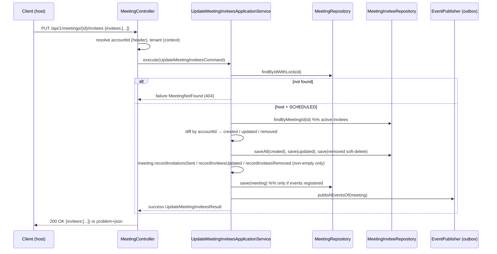

## Context

The `meet` service (Spring Boot 4 / Java 25, hexagonal + DDD) lets a host attach
an invitee list only when creating a scheduled or instant meeting
(`ScheduleMeetingApplicationService` /
`CreateInstantMeetingApplicationService`). Invitees are persisted as
`MeetingInvitee` aggregates in the `meeting_invitees` table with soft-delete
semantics (`removed_at`). Once a meeting exists, there is no endpoint to change
its invitee list.

Existing building blocks this change reuses:

- `MeetingInvitee.create(...)`, `MeetingInvitee.remove()` (soft delete), and the
  `MeetingInviteeRepository` port (`saveAll`, `findByMeetingId`).
- `Meeting.recordInvitationsSent(List<InviteeInfo>)`, which registers
  `MeetingInvitationsCreatedEvent` (topic `meet.meeting.invitations.created`).
- The transactional-outbox pipeline: aggregates register `PublishableEvent`s,
  `EventPublisher.publishEventsOf(aggregate)` drains them, and a typed
  `OutboxEventProtoMapper` per event maps the domain event to a proto message
  (`event-driven` spec). Adding a new event type requires a new proto message
  and a new mapper — no publisher change.
- The `PUT /api/1/meetings/{id}` pattern in `MeetingController`: resolves the
  account from `AccountContext`, tenant from `TenantContext`, maps a
  `Result<_, MeetingError>` through `ResultResponder`.

Constraints: API-convention spec (versioned path, host-only mutation, RFC 9457
errors, full-snapshot body without tenant id); ArchUnit layering
(`domain → application → infrastructure → presentation`, domain framework-free);
proto must pass Buf `STANDARD` lint.

## Goals / Non-Goals

**Goals:**

- Expose `PUT /api/1/meetings/{id}/invitees` for host-only full replacement of a
  `SCHEDULED` meeting's invitee list.
- Diff by `accountId` and emit three change-sensitive batch events (created /
  updated / deleted), each only when non-empty.
- Keep the change atomic: invitee writes and outbox events commit together.
- Preserve existing invitee lifecycle (accepted/declined) events untouched.

**Non-Goals:**

- Notification consumers or email delivery (none exist yet).
- Changing an existing invitee's `email`, `role`, or `rsvp`.
- Editing invitees while the meeting is `RUNNING`, `COMPLETED`, or `CANCELED`.
- Per-invitee (non-batch) events; DB schema changes; calendar sequence bump.

## Decisions

### D1: Match invitees by `accountId`

`accountId` is always present (frontend-resolved, `NOT NULL`) and the repository
already offers `findByMeetingIdAndAccountId`. It is the stable per-meeting
identity for diffing. **Alternative** — match by `email`: rejected because a
single account may change email and email is only the "invite key", not the
identity. Duplicate `accountId` values in one request are a client error and
SHALL be rejected with `VALIDATION_ERROR`.

### D2: Batch events on the `Meeting` aggregate

The three events carry a list of affected invitees plus meeting-level context
(title, short code, time range, organizer, calendar uid), mirroring the existing
`MeetingInvitationsCreatedEvent`. They are registered on `Meeting` — reusing
`recordInvitationsSent` for the created group and adding `recordInviteesUpdated`
/ `recordInviteesRemoved` for the other two. **Alternative** — register on each
`MeetingInvitee` like accepted/declined: rejected because those are single-actor
events (aggregate type `meeting-invitee`), whereas these are batch,
meeting-level events (aggregate type `meeting`). Naming stays in the
`invitations` family for consistency.

### D3: `displayName` is the only mutable field → `updated`

`accountId`/`email` are identity keys; `role`/`rsvp` are fixed at creation
(`REQ_PARTICIPANT` / `true`). Only `displayName` can meaningfully change for an
existing invitee, so only a `displayName` diff produces an `updated` entry.
`MeetingInvitee.displayName` becomes mutable with an `updateDisplayName`
behavior. Requests that change email for the same accountId are treated as
no-change on that field (ignored) to avoid ambiguous key semantics.

### D4: Full-replacement (PUT) semantics

The endpoint is a `PUT` on the nested `invitees` sub-resource, expressing "make
the invitee set equal to this list". An empty array removes all current
invitees. A request whose effective diff is empty publishes no event and returns
the current list with `200 OK`. This matches the api-convention nested
sub-resource rule (`/meetings/{id}/invitees`) and PUT's idempotent replacement
intent. Response body is `{ "invitees": [...] }` (full snapshot of active
invitees, no tenant id), consistent with the successful-response requirement.

### D5: Status gate = `SCHEDULED` only

Invitee management is a pre-meeting activity. `RUNNING`, `COMPLETED`, and
`CANCELED` are rejected with an invalid-status error. This keeps the diff and
event semantics simple and matches the user's decision. The service loads the
meeting with a lock (`findByIdWithLock`) so concurrent invitee edits serialize.

### Flow

## Risks / Trade-offs

- **Re-adding a previously removed invitee creates a new row** (new `InviteeId`)
  because active queries filter `removed_at IS NULL` and there is no unique
  `(meeting_id, account_id)` constraint. → Acceptable: prior RSVP history stays
  as a removed row; the fresh invite restarts at `NEEDS_ACTION`. Documented as
  intended behavior.
- **New Kafka topics with no consumer yet** → Producer-only; events are durable
  in the outbox and harmless until a consumer subscribes. Topics follow the
  existing `meet.meeting.invitations.*` naming so future consumers align.
- **Lost RSVP on removal** → Removal is a soft delete; an accepted invitee who
  is removed keeps their historical row. No hard delete, so it is auditable.
- **Two events in one request (created + updated + deleted possible together)**
  → All registered on the same aggregate and drained in one `publishEventsOf`
  call, so they enqueue atomically within the same transaction.

## Migration Plan

No DB migration. Deploy is additive: new endpoint, new proto messages, new
mappers. Rollback is safe — removing the endpoint and mappers leaves existing
data and the `meeting_invitees` table untouched; any already-published new-topic
events are simply unconsumed.

## Open Questions

None — all decisions confirmed in conversation.
