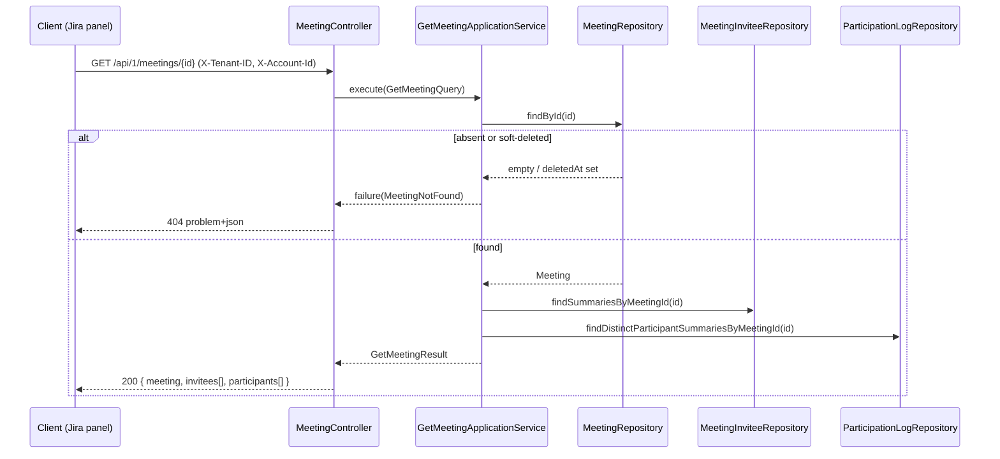

## Context

The meet service (Spring Boot / Java 25, hexagonal + DDD) already exposes
`POST /api/1/meetings` (list), `PUT`/`DELETE /api/1/meetings/{id}`, and the
creation/action endpoints. There is no single-meeting retrieval endpoint. Two
read models relevant to this change already exist:

- `MeetingInviteeRepository.findSummariesByMeetingId(UUID)` →
  `List<InviteeSummary>` — fully implemented; returns active (non-removed)
  invitees with RSVP `status`.
- `ParticipationLogRepository.findDistinctParticipantSummariesByMeetingId(UUID)`
  → `List<ParticipantSummary>` — declared but **stubbed**; the adapter throws
  `UnsupportedOperationException` and `ParticipationLogJpaRepository` has no
  backing query.

`participation_logs` is append-only: one row per join session, so a rejoin adds
a new row. Rows carry `account_id`, `display_name`, `role`, `joined_at`, and a
nullable `left_at`.

Per `api-convention`, `GET /meetings/{id}` is the standard resource retrieval,
returns `200` with the raw representation (no envelope), never echoes the tenant
id, and maps a `NOT_FOUND` domain error to a `404 application/problem+json`.

## Goals / Non-Goals

**Goals:**

- Add `GET /api/1/meetings/{id}` returning
  `{ meeting, invitees[], participants[] }` in a single call for the Jira issue
  panel.
- Collapse participation logs to one entry per account, including people who
  have left.
- Implement the stubbed distinct-participant read path with a real query.
- Enforce tenant isolation; allow any authenticated tenant member to read.

**Non-Goals:**

- No pagination of the invitee or participant lists (bounded by
  `maxParticipants`).
- No host-only authorization on this endpoint.
- No implementation of the other stubbed `ParticipationLogRepositoryAdapter`
  methods beyond the one this endpoint needs.
- No new database schema or migration (`participation_logs` already exists).
- No changes to existing endpoints.

## Decisions

### Decision: Single aggregated payload

`GET /meetings/{id}` returns one JSON body with a `meeting` snapshot (mirroring
`UpdatedMeetingSnapshot` fields, tenant id excluded), an `invitees` array
(mirroring `MeetingInviteeSnapshot`), and a `participants` array. Alternative —
separate `/invitees` and `/participants` sub-resource endpoints — was rejected
because the panel needs all three in one round trip and the lists are small and
bounded.

### Decision: Distinct participant collapsing rule

`findDistinctParticipantSummariesByMeetingId` collapses all sessions of one
`account_id` within the meeting into a single `ParticipantSummary`:

- `joinedAt` = earliest `joined_at` across the account's sessions.
- `leftAt` = `null` if any session is still open (`left_at IS NULL`); otherwise
  the latest `left_at`.
- `displayName`, `role`, `id` = taken from the most recent session (max
  `joined_at`).

Rationale: "người đã tham gia" is a per-person list; showing every rejoin row
would confuse it. Keeping earliest-join / latest-leave gives an accurate
presence window; `leftAt == null` cleanly marks "still in the room".

Implementation: a JPQL/derived query on `ParticipationLogJpaRepository` returns
the meeting's rows (tenant-filtered automatically by the `@TenantId` column);
the adapter groups by account in memory and maps to `ParticipantSummary`.
Grouping in the adapter (not SQL) keeps the query portable and the collapsing
logic unit-testable without a database.

### Decision: Access = any authenticated tenant member

The handler requires the `X-Account-Id` header (returns `400` when absent,
matching sibling handlers) but does not compare the caller to the host. Tenant
scoping is enforced by Hibernate's `@TenantId` filter plus `X-Tenant-ID`, so a
meeting from another tenant is invisible and yields `404`. Host-only was
rejected: invitees and participants legitimately need to view the meeting.

### Decision: Not-found semantics

Unknown id, other-tenant id, and soft-deleted meetings all return
`404 MEETING_NOT_FOUND`. The application service loads via
`MeetingRepository.findById`; when empty **or** `deletedAt` is present it
returns `MeetingError.MeetingNotFound`, so deleted and non-existent meetings are
indistinguishable to the caller (consistent with `delete`/`list` behavior).

### Flow

## Risks / Trade-offs

- In-memory grouping of participation logs → for meetings with an unusually
  large number of sessions the row set could be large. Mitigation: rows are
  bounded by `maxParticipants` × rejoins; acceptable for the panel use case. A
  SQL-side aggregation can replace it later without changing the port contract.
- Reusing `findSummariesByMeetingId` (active invitees only) means declined/
  removed invitees are shown per their status but removed ones are excluded →
  matches existing invitee read behavior; no divergence introduced.
- Implementing only one stub method leaves the adapter partially stubbed →
  acceptable and scoped; other methods remain `UnsupportedOperationException`
  until their own slices land.
