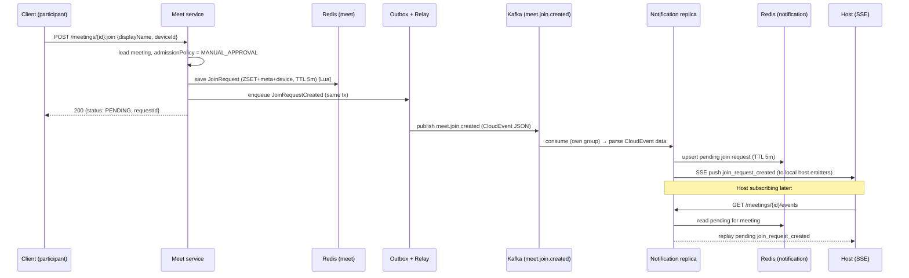
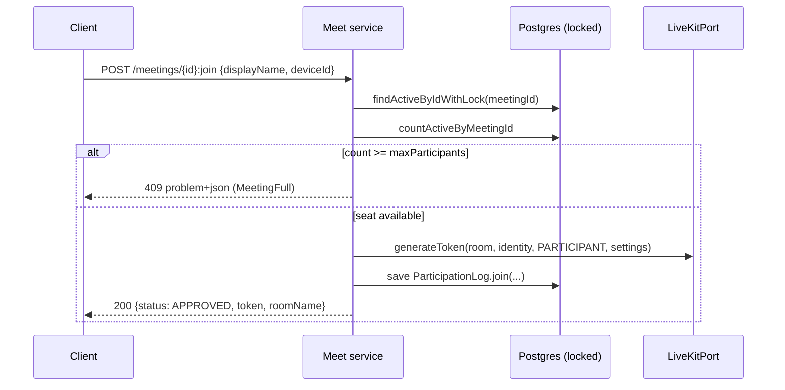

## Context

The meet service already contains the full join domain model (`JoinRequest`,
`JoinRequestStatus`, `AdmissionPolicy`, `ParticipationLog`, `LiveKitIdentity`,
`LiveKitTokenRequest`, `ParticipantAttributes`), the `JoinRequestRepository` and
`JoinRequestResultStore` ports, the `LiveKitPort`, and the
`JoinRequestCreated`/`Approved`/`Denied`/`Expired` domain events. What is
missing is everything that turns the model into a working feature: the Redis
adapter, the use case, the HTTP endpoint, the outbox proto mapper for the join
event, and the notification-side real-time delivery.

The notification service is currently an empty skeleton (only
`NotificationApplication.java` plus config). Its former SSE/email code was
removed. Per `services/AGENTS.md`, notification has no database. All required
Spring starters (data-redis, webmvc, kafka, security, proto) are provided
transitively by the `service.base` convention plugin.

Events flow through the shared transactional outbox: a domain event is enqueued
to `outbox_event` in the same transaction as the state change, a per-event-type
proto mapper renders it to a proto message, the payload is stored as a
CloudEvents 1.0 structured-JSON document (`data` = proto rendered as proto-JSON,
`datacontenttype: application/json`), and a scheduled relay publishes it to
Kafka keyed by aggregate id. The registry throws when an event type has no
mapper, so a mapper is mandatory to publish.

The runtime auth model: an upstream API gateway is the trust boundary; it
injects `X-Account-Id` (bound to `AccountContext`) and `X-Tenant-Id` (bound to
`TenantContext`). Services run stateless `permitAll` security and do not verify
tokens themselves.

Reference: the legacy `zms/services/meeting-management` implements the
equivalent flow (endpoint `:requestJoin`, Redis ZSET + Lua adapter,
`MeetingSseManager`). It is read-only reference; SSE there lived inside
meeting-management, whereas here SSE is a separate notification service, so
there is no in-process `@TransactionalEventListener` path — delivery is
Kafka-only.

## Goals / Non-Goals

**Goals:**

- Expose `POST /meetings/{id}:join` handling both `ALLOW_ALL` and
  `MANUAL_APPROVAL` admission policies.
- Persist manual-approval join requests in Redis with a TTL using Spring Data
  Redis 4.0 (Jackson 3) correctly.
- Enforce `maxParticipants` without over-admission under concurrency.
- Publish `meet.join.created` through the existing outbox (new proto + mapper).
- Deliver `meet.join.created` to the meeting host in real time via SSE from the
  notification service, correct across multiple notification replicas, with
  replay for late-subscribing hosts.

**Non-Goals:**

- Host approve/deny endpoints and the approved→client SSE flow.
- `JoinRequestResultStore` adapter, deny/expire flows, TTL cleanup job.
- Meeting auto-start when a host joins.
- Guest (unauthenticated) join.
- Publishing `ParticipantJoined` on the `ALLOW_ALL` path.
- Renaming the not-yet-used approved/denied/expired events (deferred to the
  approve/deny change).

## Decisions

### D1. Endpoint path `POST /meetings/{id}:join` returning 200 for both paths

Join is not a standard CRUD verb, so per api-convention it is a `:action`
`POST`. `ResultResponder` only offers 200/201/204 (no 202). Both admission paths
therefore return `200 OK`; the client distinguishes outcomes by the response
body `status` field (`APPROVED` with token+roomName, or `PENDING` with
requestId). Errors use RFC 9457 problem+json via the existing
`ProblemDetailMapper`.

Alternatives considered: literal `/meetings/{id}/join` (rejected — sub-path
implies a sub-resource collection, violating the action-suffix convention);
returning 202 for PENDING (rejected — `ResultResponder` has no 202 and adding
one is out of scope; body `status` is sufficient and matches zms semantics).

### D2. Redis adapter mirrors the zms key layout, ported to Spring Data Redis 4.0 / Jackson 3

Keys: `join_request:{meetingId}` (ZSET, score = `expiresAt` epoch ms, member =
requestId) for the pending queue; `join_request_meta:{requestId}` (STRING JSON)
for the full request; `join_request_device:{meetingId}:{deviceId}` (STRING) for
duplicate detection. Writes/removes/status-updates use atomic Lua scripts so the
three keys never diverge. Request-scoped keys get the caller's TTL (5 minutes);
the ZSET gets TTL + a 120s buffer.

Serialization uses Jackson 3 (`tools.jackson.databind.json.JsonMapper`) via
`GenericJacksonJsonRedisSerializer`/`JacksonJsonRedisSerializer` — the
`Jackson2*` variants are deprecated-for-removal in Spring Data Redis 4.0. The
`JsonMapper` registers a `PolymorphicTypeValidator` restricted to the meet
domain package to keep default typing safe. `application.yaml` continues to use
`spring.data.redis.*` keys (unchanged in Boot 4.0). Config is guarded by
`@ConditionalOnProperty("spring.data.redis.host")`, matching the existing shared
`CacheConfig` pattern.

Alternatives considered: Spring Data Redis `@RedisHash` repositories (rejected —
the ZSET queue + device index + atomic multi-key writes need explicit template +
Lua control); keeping Jackson 2 serializers (rejected — deprecated for removal,
and Boot 4 ships Jackson 3).

### D3. Capacity enforced under a pessimistic meeting lock

`ALLOW_ALL` counts active participants
(`ParticipationLogRepository.countActiveByMeetingId`) and inserts a
`ParticipationLog` while holding the meeting row lock via the existing
`MeetingRepository.findActiveByIdWithLock`, so concurrent joins cannot exceed
`maxParticipants` (`MeetingError.MeetingFull`). The `MANUAL_APPROVAL` path only
creates a Redis request and does not consume a seat (the seat is taken at
approval time, which is out of scope here).

Alternatives considered: optimistic count-then-insert (rejected — race admits
over-limit); Redis-based counter (rejected — participation truth lives in
Postgres; the lock is already available and consistent).

### D4. Event rename to `meet.join.created` with new proto `JoinCreated`

Per user direction, the created event uses topic `meet.join.created` and
CloudEvent type `io.github.smiskinext.meet.join.created.v1`. This edits
`JoinRequestCreatedEvent#topic()`/`#eventType()` and adds
`services/proto/.../meet/v1/join_created.proto` (message `JoinCreated`, package
`io.github.smiskinext.event.meet.v1`) plus a `JoinCreatedEventProtoMapper` in
meet. The proto carries the event fields needed for host display and replay:
meetingId, joinRequestId, tenantId, accountId, displayName, deviceId,
occurredAt. Absent optional values use proto3 defaults (empty string). The event
has no live consumer today, so the rename breaks nothing in flight.

### D5. Notification SSE — per-replica consumer group + Redis replay store

Each notification replica subscribes to `meet.join.created` under its **own**
consumer group (group id derived from a per-instance identifier), so every
replica receives every join event and pushes to the emitters it holds locally.
Join volume is human-triggered and low, making per-replica delivery correct and
simple with no extra relay infrastructure.

Because a host's SSE connection is pinned to one replica, a request that arrives
before the host subscribes (or on a different replica) is handled by a
notification-owned Redis pending store (`PendingJoinRequestStore`, keyed per
meeting with a matching TTL). On subscribe, the replica replays the meeting's
pending requests to the new emitter. On consume, each replica both pushes to
local emitters and upserts the Redis pending store.

Alternatives considered: shared consumer group (rejected — event may land on a
replica without the host's emitter); Redis Pub/Sub relay (deferred — viable when
volume grows, does not break this contract); gateway sticky routing (rejected —
highest coupling/complexity).

### D6. Notification consumes CloudEvent JSON with Jackson, not proto

The outbox stores/publishes CloudEvents structured JSON whose `data` is proto
rendered as JSON. Notification only needs a few scalar fields, so it
deserializes the CloudEvent (cloudevents-kafka, already a dependency) and reads
the `data` JSON with Jackson. Notification therefore takes no proto dependency
for this flow, keeping it decoupled from the meet proto schema.

Alternatives considered: parse `data` back through generated proto `JsonFormat`
(rejected — needs the proto module and buys nothing for a handful of fields).

### D7. SSE lifecycle: heartbeat, timeout, cleanup

`SseConnectionManager` keeps
`ConcurrentHashMap<meetingId, CopyOnWriteArrayList<SseEmitter>>`. Each emitter
is created with a configurable timeout (`SseProperties`, default 5 minutes for
host streams), sends an initial heartbeat comment, and a single shared daemon
scheduler emits a heartbeat comment every 15s to defeat idle-proxy timeouts.
Completion/timeout/error callbacks remove the emitter and cancel its heartbeat.
Virtual threads (already enabled) keep per-connection cost low.

## Sequence — join (MANUAL_APPROVAL) to host SSE

## Sequence — join (ALLOW_ALL)

## Risks / Trade-offs

- Per-replica consumer groups mean every replica deserializes every join event →
  Mitigation: join volume is low (human-triggered); cost is negligible and the
  design can migrate to a Redis Pub/Sub relay without changing the client
  contract.
- SSE connection pinned to one replica; host reconnect may hit a different
  replica with no local state → Mitigation: Redis pending store replays on every
  subscribe, so reconnects recover the current pending set.
- Redis multi-key consistency (queue/meta/device) under failure → Mitigation:
  all mutations are single atomic Lua scripts; TTLs guarantee eventual cleanup
  even if a client abandons the flow.
- Jackson 3 default typing can raise security errors on deserialize →
  Mitigation: restrict the `PolymorphicTypeValidator` to the meet domain
  package.
- Duplicate SSE pushes if the same event is processed twice → Mitigation: pushes
  are idempotent for the host (the host UI keys by requestId); heartbeat/cleanup
  prevents emitter leaks.
- Notification cannot verify the subscriber is truly the meeting host (no DB,
  event lacks hostId) → Mitigation: authorization is the gateway's
  responsibility per the established trust-boundary model; streams are scoped by
  meetingId only. If stricter checks are needed later, add hostId to the event
  and validate against `X-Account-Id`.

## Migration Plan

- Additive on the meet side except the event rename (D4); no schema migration
  (join requests are Redis-only, `ParticipationLog` table already exists).
  Deploy meet first so `meet.join.created` is produced with the new name.
- Notification is additive (new endpoint, consumer, config). Deploy after or
  alongside meet. Requires `spring.data.redis.*` and
  `spring.kafka.bootstrap-servers` configured for notification.
- Rollback: revert both services; the event rename is safe to revert because no
  consumer depended on the old name before this change.

## Open Questions

- None blocking. Host-identity verification in notification is intentionally
  deferred to the gateway per D5/Risks.
