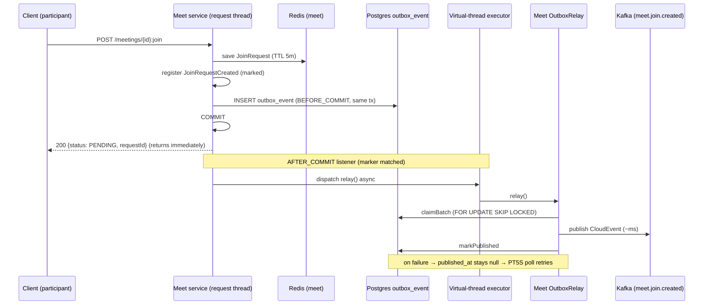

## Context

Manual-approval join requests are surfaced to the meeting host through an SSE
stream served by the notification service. The end-to-end path is:

`POST /meetings/{id}:join` → save `JoinRequest` in Redis → register
`JoinRequestCreated` (pre-commit) → `outbox_event` INSERT in the same
transaction → **scheduled outbox relay** publishes CloudEvent to Kafka topic
`meet.join.created` → notification consumer pushes SSE to the host.

Every leg except the relay is millisecond-scale. The relay is driven by
`OutboxRelayTrigger` with
`@Scheduled(fixedDelayString = "${smiski.outbox.relay.fixed-delay:PT5S}")` (meet
config: `PT5S`). A row can therefore wait up to ~5s (avg ~2.5s) before it is
even published to Kafka. That poll interval is the sole cause of the host-facing
lag.

Key facts verified in the codebase that shape this design:

- `OutboxRelay` is a **per-service bean**
  (`@ConditionalOnBean(OutboxStore.class)` in shared `OutboxAutoConfiguration`).
  Meet's `OutboxRelay` operates only on meet's `outbox_event` table.
- `claimBatch` uses
  `SELECT ... WHERE published_at IS NULL ORDER BY created_at ASC LIMIT :n FOR UPDATE SKIP LOCKED`
  (`OutboxEventJpaRepository`), and the relay reads/publishes/marks across three
  short transaction boundaries with independent failure recording
  (`retry_count`/`last_error`).
- The outbox write path is triggered by `OutboxDomainEventListener` at
  `@TransactionalEventListener(BEFORE_COMMIT)`, so the row is durably enqueued
  within the same transaction as the state change.
- Meet already runs on virtual threads (`spring.threads.virtual.enabled=true`).
- The notification consumer is idempotent per request id (Redis upsert keyed by
  `requestId`), so at-least-once redelivery is already safe.

## Goals / Non-Goals

**Goals:**

- Cut host SSE latency for marked events from up to ~5s to ~milliseconds after
  commit.
- Scope the change entirely to the meet service; leave the shared outbox module
  untouched.
- Preserve at-least-once delivery, ordering, retry, and exactly-once-effective
  publishing.
- Make the mechanism extensible: future SSE events opt in without editing the
  trigger.
- Keep the request thread unblocked by transport I/O.

**Non-Goals:**

- Changing the shared outbox module, the scheduled poll, or the poll interval
  value.
- Switching to direct-to-Kafka publishing (bypassing the outbox) or Debezium
  CDC.
- Changing the `meet.join.created` topic, CloudEvent encoding, or event
  contract.
- Changing the notification consumer, SSE delivery, or other services.
- Changing the join idempotency model (server-generated UUIDv7 request id +
  `(meetingId, deviceId)` natural-key dedup).

## Decisions

### D1. Marker interface selects which events trigger the immediate relay

Add a meet-internal marker `SseTriggeringEvent` in `meet/domain/event`.
`JoinRequestCreatedEvent` implements it. The `AFTER_COMMIT` listener listens for
the marker type, so adding a future real-time event (e.g. approve/deny) is a
one-line `implements` on that event — no edit to the listener.

- **Why not listen for `JoinRequestCreatedEvent` directly?** It works today but
  forces a listener edit for every new SSE event, which contradicts the
  extend/maintain goal.
- **Why meet-internal, not a shared marker?** Only meet needs this behavior
  right now; putting it in shared would push a real-time-delivery concern onto
  every service (over-reach). The marker is framework-agnostic (no Spring/Kafka
  imports), satisfying the domain layer's ArchUnit constraints.

### D2. `AFTER_COMMIT` transactional listener triggers the service-local relay

Add `SseRelayKickListener` in `meet/infrastructure/messaging` annotated
`@TransactionalEventListener(phase = AFTER_COMMIT)` for `SseTriggeringEvent`. On
commit, it invokes meet's `OutboxRelay.relay()`.

- The outbox row is still written pre-commit by the existing
  `OutboxDomainEventListener`; this listener only fires after the same
  transaction commits, so the row is guaranteed visible and durable before any
  immediate publish attempt.
- **Why `AFTER_COMMIT` (not `BEFORE_COMMIT`/`AFTER_COMPLETION`)?** The relay
  opens its own transactions to claim/publish/mark; it must run after the
  writing transaction has committed and its row is visible. `AFTER_COMMIT`
  guarantees exactly that and never runs on rollback.
- **Why reuse `OutboxRelay.relay()` rather than publish the single row
  directly?** Reusing the relay preserves identical semantics — `SKIP LOCKED`
  claiming, aggregate-id keying, `published_at` marking, retry/`last_error`
  recording. It also means the kick simply "runs the poll early." The relay
  claiming a bounded batch (not just this row) is harmless and beneficial: any
  other pending meet rows are delivered sooner.

### D3. Asynchronous execution on a virtual thread

The listener dispatches `relay()` asynchronously (virtual-thread executor) so
the request thread returns immediately after commit and does not wait for the
Kafka send. Since latency optimization targets the **host**, the joining
participant's response must not be coupled to Kafka round-trip time.

- Prefer reusing Spring Boot's `applicationTaskExecutor` (already
  virtual-thread-backed) via `@Async` or an injected `Executor`. Add a minimal
  `@EnableAsync` + executor bean in `meet/infrastructure/config` only if the
  auto-configured executor is not directly injectable for this use.
- **Failure semantics:** if async dispatch is rejected or the relay throws
  before publishing, the row stays `published_at IS NULL` and the scheduled poll
  publishes it on its next run. The async kick is a best-effort accelerator
  layered on a durable fallback.

### D4. Scheduled poll remains the durable fallback, unchanged

The shared `OutboxRelayTrigger` (`PT5S`) is not modified. It is the safety net
that guarantees eventual delivery if the immediate kick never runs or fails.
Concurrency between kick and poll is safe by construction because both claim
rows with `FOR UPDATE SKIP LOCKED` and mark `published_at`, so any row is
published by at most one path.

## Sequence — join (MANUAL_APPROVAL) with immediate relay

## Risks / Trade-offs

- **Async kick swallows failures** → Mitigation: the row remains unpublished on
  failure and the unchanged `PT5S` poll republishes it; delivery is never lost,
  only occasionally delayed to the old behavior.
- **Kick + poll race / double-publish** → Mitigation: existing
  `FOR UPDATE SKIP LOCKED` + `published_at` marking guarantees at-most-one
  publisher per row; consumer is idempotent per `requestId` regardless.
- **Batch relay does more than the one row** → Mitigation: intended and harmless
  — it accelerates other pending meet rows; batch size is bounded by existing
  config.
- **Executor saturation under load** → Mitigation: virtual threads make per-task
  cost negligible; join volume is human-triggered and low; worst case degrades
  to poll-driven delivery.
- **ArchUnit boundaries** → Mitigation: marker lives in `domain/event` (no
  framework imports); listener lives in `infrastructure/messaging` (allowed to
  depend on relay + Spring), matching existing outbox listener placement.

## Migration Plan

- Additive only; no schema change, no proto change, no API change. Deploy meet
  alone.
- Rollback: remove the marker `implements` and the listener/executor bean;
  behavior reverts to poll-only delivery with zero data impact (rows are still
  written and relayed by the poll).
- Housekeeping: delete the empty, misnamed
  `openspec/changes/switch-join-notification-to-redis-pubsub` stub.

## Open Questions

- None blocking. Whether to reuse `applicationTaskExecutor` directly or add a
  dedicated `@EnableAsync` executor bean is an implementation detail resolved
  during apply; both satisfy the non-blocking requirement.
