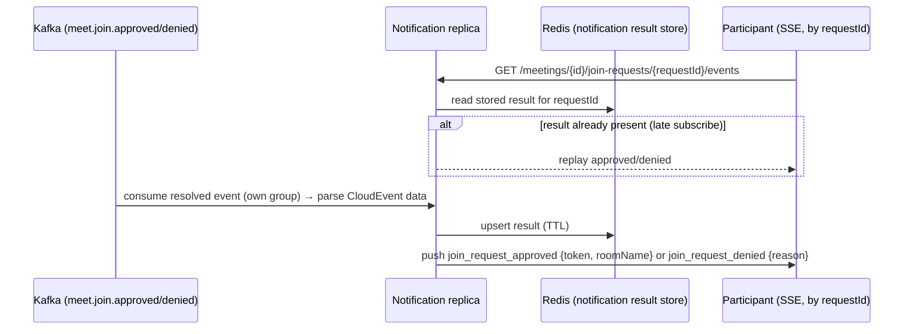

## Context

Under `MANUAL_APPROVAL` admission, `POST /meetings/{id}:join` already creates a
`PENDING` `JoinRequest` in Redis and publishes `meet.join.created`, which the
notification service is meant to relay to the host over SSE. The join domain is
fully modelled — `JoinRequest.approve()`/`deny()`, `JoinRequestStatus`,
`JoinRequestApprovedEvent`/`DeniedEvent`, `JoinRequestResultStore` port,
`JoinRequestResult`, `JoinRequestSummary`, and the `PartialApprovalFailure`,
`JoinRequestNotFound`, `JoinRequestExpired`, `InvalidJoinRequestTransition`
errors — but the host decision path was explicitly deferred in the archived
`add-meeting-join-endpoint` design ("Non-Goals: Host approve/deny endpoints…
`JoinRequestResultStore` adapter, deny/expire flows… Renaming the not-yet-used
approved/denied/expired events (deferred to the approve/deny change)").

Two gaps compound this: (1) the `JoinRequestResultStore` port has no adapter,
and (2) on this branch the notification service's `meet.join.created` consumer
is absent (`infrastructure/messaging/` holds only `.gitkeep`; no
`@KafkaListener` exists), so its host SSE stream is dark even though
`SseConnectionManager`, `PendingJoinRequestStore`, and the controller exist.

Constraints: hexagonal + DDD layering (ArchUnit-enforced); `Result<T,E>` at
boundaries (no business exceptions); RFC 9457 problem+json; api-convention
action suffix (`POST /resource:action`) with raw (envelope-free) success bodies;
events flow through the shared transactional outbox with a mandatory per-event
proto mapper; gateway is the trust boundary injecting `X-Account-Id` /
`X-Tenant-Id`; join requests are Redis-only (no Postgres).

## Goals / Non-Goals

**Goals:**

- Expose host `POST /meetings/{id}/join-requests:accept` and `:decline` taking a
  list body, authorized to the meeting host only, processing items best-effort
  and returning a per-item result list.
- Enforce `maxParticipants` capacity on accept under the existing pessimistic
  meeting-row lock; issue a `PARTICIPANT` LiveKit token per approval.
- Persist terminal outcomes (with token/room for approvals) via a new
  `JoinRequestResultStore` Redis adapter, remove decided requests from the
  pending queue, and publish `meet.join.approved` / `meet.join.denied` through
  the outbox (new protos + mappers), marked `SseTriggeringEvent`.
- Restore the notification `meet.join.created` consumer, add an approved/denied
  consumer, and add a requester-facing SSE stream keyed by `requestId` with a
  result-replay store for late subscribers.

**Non-Goals:**

- Guest (unauthenticated) join; meeting auto-start on host join.
- TTL-expiry cleanup job / `JoinRequestExpiredEvent` publication (expiry stays
  passive via Redis TTL as today).
- Email notifications; changes to the host SSE stream contract beyond restoring
  its consumer.
- Recording a `ParticipationLog` at approval time (participation truth stays
  deferred to the `participant_joined` webhook, consistent with the join path).

## Decisions

### D1. Endpoints and payloads

Accept/decline are non-CRUD actions on the pending-request set, so per
api-convention they are `POST` with an `:action` suffix on the sub-resource:
`POST /meetings/{id}/join-requests:accept` and `.../join-requests:decline`.
Body: `{ "requestIds": ["<uuid>", ...] }`, `@NotEmpty`, each a UUID. A single
decision is a one-element list; deciding the whole queue sends every id. The
account and tenant come from context, never the body.

Response (`200 OK`, raw body):
`{ "results": [ { "requestId", "status", "token"?, "roomName"?, "reason"? } ] }`
where `status` ∈ `APPROVED | DENIED | FAILED`. `token`/`roomName` are present
only for `APPROVED`; `reason` (machine code, e.g. `MEETING_FULL`,
`JOIN_REQUEST_NOT_FOUND`, `JOIN_REQUEST_EXPIRED`,
`INVALID_JOIN_REQUEST_TRANSITION`) is present only for `FAILED`.

Alternatives: separate single-item endpoints (rejected — list subsumes single
and matches the "accept all" need); PATCH on each request (rejected — decision
is an action, not a field edit).

### D2. Best-effort per-item processing, whole request never 4xx for item faults

The batch returns `200` with per-item outcomes; individual failures (unknown id,
already terminal, expired, meeting full) surface as `FAILED` items with a
`reason`, not as a top-level error. Top-level errors are reserved for
request-level faults: missing account header / validation (`400`), not the host
(`403` `NOT_OWNER`), meeting not found (`404`). This keeps "accept all" useful
when only some seats remain. The existing `PartialApprovalFailure` error is
therefore **not** used as a terminal Result failure; the per-item result list
carries partiality instead. (It remains available for any future all-or-nothing
caller; this change leaves it unused rather than removing it.)

Capacity is evaluated per item **inside** the loop while holding the meeting
lock, decrementing remaining seats as approvals succeed, so a batch cannot
over-admit.

Alternatives: all-or-nothing batch (rejected by user — unforgiving for
accept-all); return `207 Multi-Status` (rejected — `ResultResponder` offers no
207 and api-convention success codes are 200/201/204; body `status` per item is
sufficient).

### D3. Approve/decline use cases orchestrate lock → token → transition → persist → publish → dequeue

`AcceptJoinRequestsApplicationService` and
`DeclineJoinRequestsApplicationService` implement inbound `*UseCase` ports.
Accept: load meeting via `MeetingRepository.findActiveByIdWithLock` (host +
existence checks first, returning `Result.failure` for request-level faults),
count active participants once, then for each id: load request, validate it is
PENDING and belongs to the meeting, check remaining capacity, generate a
`PARTICIPANT` token exactly as `RequestJoinApplicationService.admitImmediately`
does (room `meeting-<id>`, tenant in room metadata), call `request.approve()`,
`resultStore.save(JoinRequestResult.approved(...))`, `registerApprovedEvent`,
`publishEventsOf`, `removeFromQueue`. Decline: `request.deny()`,
`resultStore.save(denied)`, `registerDeniedEvent`, publish, `removeFromQueue`.
All within one `@Transactional` so outbox rows and Redis mutations commit
together with the request thread.

The domain `JoinRequest` gains
`registerApprovedEvent(tenantId, token, roomName, approvedBy)` and
`registerDeniedEvent(tenantId, deniedBy)` helpers mirroring the existing
`registerCreatedEvent` (tenant/actor live outside the Redis-only aggregate).

### D4. `JoinRequestResultStore` Redis adapter

New `JoinRequestResultStoreRedisAdapter` (`infrastructure/persistence`) keys
`join_request_result:{requestId}` (STRING JSON) with a TTL aligned to the SSE
requester-stream timeout (5 min) plus a small buffer, mirroring the existing
`JoinRequestRedisRepositoryAdapter` serializer setup (Jackson 3 `JsonMapper`
from `RedisConfig`, restricted `PolymorphicTypeValidator`). Stores
`JoinRequestResult` (status + optional token/room/denyReason).

### D5. Event rename + new protos + mappers (event-driven delta)

Rename in `JoinRequestApprovedEvent`/`JoinRequestDeniedEvent`:

- topic `meet.join.approved` / `meet.join.denied`
- CloudEvent type `io.github.smiskinext.meet.join.approved.v1` /
  `io.github.smiskinext.meet.join.denied.v1`

Both `implements PublishableEvent, SseTriggeringEvent` (so the post-commit
`SseRelayKickListener` fast-relays them, like `meet.join.created`). Add
`services/proto/.../meet/v1/join_approved.proto` (`JoinApproved`: meetingId,
joinRequestId, tenantId, accountId, deviceId, liveKitToken, roomName,
approvedBy, occurredAt) and `join_denied.proto` (`JoinDenied`: meetingId,
joinRequestId, tenantId, accountId, deviceId, deniedBy, occurredAt); proto3
defaults for absent optionals; must pass Buf `STANDARD`. Add
`JoinApprovedEventProtoMapper` / `JoinDeniedEventProtoMapper` mirroring
`JoinCreatedEventProtoMapper`. No live consumer depended on the old names, so
the rename breaks nothing in flight.

Note: `deviceId` is carried on the approved/denied events so the requester
stream (keyed by requestId) and any device-scoped client can correlate. It is
sourced from the loaded `JoinRequest`.

### D6. Notification: restore created consumer, add resolved consumer, add requester stream

- Restore `JoinCreatedEventConsumer` (`infrastructure/messaging`) on the
  existing `cloudEventKafkaListenerContainerFactory`,
  `topics = meet.join.created`, decoding the CloudEvent `data` JSON with Jackson
  (no proto dep, per archived D6), upserting `PendingJoinRequestStore` and
  calling `sseConnectionManager.pushJoinRequestCreated`. Malformed messages are
  logged and skipped without terminating the consumer.
- Add `JoinResolvedEventConsumer` subscribing to `meet.join.approved` and
  `meet.join.denied`. On consume it (a) pushes an outcome event to the requester
  emitter(s) held for that `requestId`, and (b) upserts a
  `JoinRequestResultStore` (notification-side) for replay.
- Extend `SseConnectionManager` with a second registry keyed by `requestId`
  (`emittersByRequest`) plus `subscribeRequest(requestId)`,
  `pushJoinResolved(requestId, data)`, and requester replay on subscribe. Host
  and requester registries share the heartbeat scheduler and timeout config.
- New `GET /meetings/{id}/join-requests/{requestId}/events`
  (`text/event-stream`) on the notification `MeetingEventsController` (or a
  sibling), returning the requester emitter. SSE event names:
  `join_request_approved` (data: token, roomName) and `join_request_denied`
  (data: reason?).

Per-replica own-consumer-group model (D5 of the archived design) is preserved:
every replica consumes every resolved event and pushes to whatever requester
emitters it holds; the notification-side result store covers the pin/reconnect
race for late subscribers.

### D7. Authorization and error mapping

Host check uses `meeting.getHostId().value().equals(accountId)`; mismatch →
`MeetingError.NotOwner(accountId, hostId)` (403), matching the update/invitees
flows (delete uses `NotAuthorized`; accept/decline align with the "owner of this
meeting resource" semantics → `NOT_OWNER`). Per-item reasons reuse existing
`MeetingErrorCode`s. No new error codes are required.

## Sequence — host accepts (best-effort, capacity-guarded)

```mermaid
sequenceDiagram
    participant H as Host
    participant MC as Meet Controller
    participant UC as AcceptJoinRequests service
    participant DB as Postgres (meeting, locked)
    participant R as Redis (join requests + results)
    participant LK as LiveKitPort
    participant OB as Outbox + Relay
    participant K as Kafka

    H->>MC: POST /meetings/{id}/join-requests:accept {requestIds:[...]}
    MC->>UC: AcceptJoinRequestsCommand (accountId, tenantId from context)
    UC->>DB: findActiveByIdWithLock(meetingId)
    alt not found
        UC-->>MC: failure MeetingNotFound → 404
    else not host
        UC-->>MC: failure NotOwner → 403
    else authorized
        UC->>DB: countActiveByMeetingId → seatsLeft
        loop each requestId
            UC->>R: findById(requestId)
            alt missing / not PENDING / wrong meeting / expired
                UC->>UC: record FAILED item (reason)
            else seatsLeft == 0
                UC->>UC: record FAILED item (MEETING_FULL)
            else ok
                UC->>LK: generateToken(PARTICIPANT)
                UC->>R: approve + save result + removeFromQueue
                UC->>OB: enqueue meet.join.approved (same tx)
                UC->>UC: record APPROVED item (token, roomName); seatsLeft--
            end
        end
        UC-->>MC: success (per-item results) → 200
    end
    OB->>K: publish meet.join.approved (post-commit fast relay)
```

## Sequence — resolved event to waiting participant



## Risks / Trade-offs

- Per-item capacity under one lock serializes a batch → Mitigation: batches are
  host-triggered and small; the lock is already used by the join path and the
  count is read once then decremented in memory.
- Token generated inside the transaction; a later Redis/outbox failure rolls
  back the DB but the LiveKit token was already minted → Mitigation: tokens are
  stateless JWTs with no server-side allocation, so an unused token is harmless
  (same property the ALLOW_ALL join relies on).
- Restoring the notification consumer touches "done"-marked archived tasks →
  Mitigation: treat the archived tasks as reference only; this change re-adds
  the consumer as new work and covers it with an integration test.
- Requester stream keyed by requestId is unauthenticated at the service (gateway
  trust boundary) → Mitigation: requestId is an unguessable UUIDv7 and the
  stream only ever emits that one request's outcome; consistent with the host
  stream's meetingId-only scoping.
- Event rename is a breaking contract change → Mitigation: no consumer depends
  on the old approved/denied names yet; deploy meet before notification.

## Migration Plan

- Additive except the event rename (D5); no DB schema change (Redis-only).
- Deploy meet first (produces `meet.join.approved`/`.denied` with new names and
  the restored `meet.join.created` remains compatible), then notification (new
  consumers + requester endpoint). Requires `spring.data.redis.*` and
  `spring.kafka.bootstrap-servers` configured for notification.
- Rollback: revert both services; the rename is safe to revert because no
  consumer depended on the old approved/denied names.

## Open Questions

- None blocking. Requester-identity verification stays deferred to the gateway,
  consistent with the host stream's established model.
