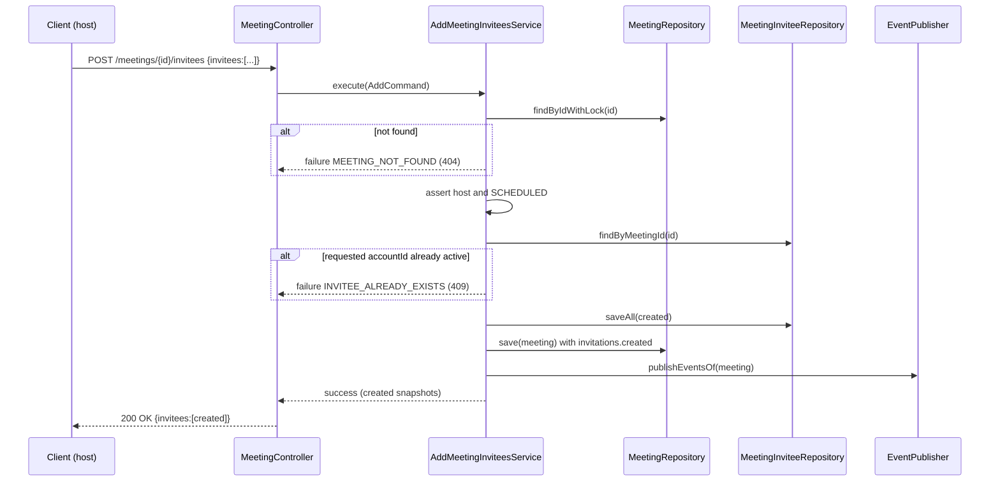
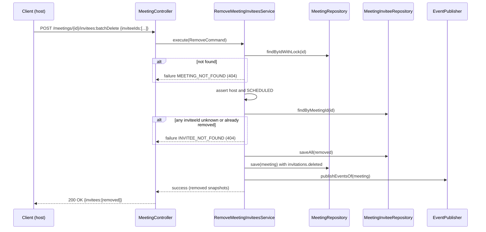

## Context

The meet service currently exposes `PUT /api/1/meetings/{id}/invitees`, a single
replace-all endpoint implemented by `UpdateMeetingInviteesApplicationService`.
It loads all active invitees, diffs the submitted list against them by
`accountId`, then creates, updates (display name only), or soft-deletes invitees
and publishes up to three events (`invitations.created`, `invitations.updated`,
`invitations.deleted`) in one transaction.

Investigation of the codebase established:

- `MeetingInvitee.updateDisplayName` and `Meeting.recordInviteesUpdated` are
  called only from the replace-all service.
- No service consumes `meet.meeting.invitations.updated`; the notification
  service listens only to join topics.
- The meeting-detail read path (`InviteeSummary` projection → `GetMeetingMapper`
  → `GetMeetingResult.Invitee` → `GetMeetingResponse.Invitee`) does not expose
  the invitee id. The `meeting_invitees` table already stores the invitee id as
  its primary key, so exposing it is a read-path change only — no schema change.
- Errors flow as `Result<T, MeetingError>`; each `MeetingError` maps to an
  `ErrorCategory` that the shared infrastructure maps to an HTTP status
  (`CONFLICT` → 409, `NOT_FOUND` → 404, `VALIDATION` → 400, `FORBIDDEN` → 403).
- The service already uses the `:batchDelete` action shape for
  `POST /api/1/meetings:batchDelete` returning `200 OK`.

## Goals / Non-Goals

**Goals:**

- Replace one replace-all `PUT` with two explicit endpoints: `POST` to add
  invitees and `POST .../invitees:batchDelete` to remove invitees by id.
- Remove all display-name update behavior and the `invitations.updated` event
  and its proto.
- Preserve host-only authorization, `SCHEDULED`-only gating, atomic semantics,
  and change-sensitive event publishing (`created` on add, `deleted` on remove).
- Expose invitee `id` in the meeting-detail response so clients can call
  `:batchDelete`.

**Non-Goals:**

- No change to how invitees are created at meeting scheduling/instant creation
  time (those paths keep publishing `invitations.created`).
- No change to RSVP/accept/decline behavior or the `role`/`rsvp` model.
- No frontend (Forge app) change — the stale `PUT` reference is left for a
  separate change.
- No database schema migration.

## Decisions

### D1: Two endpoints — `POST` add and `POST :batchDelete` remove

Add is a standard collection create: `POST /meetings/{id}/invitees`. Remove is a
batch action on the collection: `POST /meetings/{id}/invitees:batchDelete`.

- **Why `:batchDelete` (POST) over `DELETE /invitees/{id}`**: The service
  already establishes `POST /meetings:batchDelete` as the atomic multi-delete
  precedent. Batch removal in a single atomic request matches that precedent and
  avoids DELETE-with-body, which some proxies strip. The user explicitly chose
  this shape.
- **Alternative considered**: `DELETE /invitees/{inviteeId}` (single). Rejected
  because it forces N calls for N removals and cannot be atomic across a set.

### D2: Both endpoints return `200 OK` with the affected-invitee snapshot

Both return `200 OK`; the body lists the full snapshot of only the invitees
affected by that call (created invitees for add, removed invitees for remove).
Each snapshot entry carries `id`, `accountId`, `email`, `displayName`, `role`,
`status`, `invitedAt`, `respondedAt`.

- **Why not `201 Created` + `Location` for add**: A batch add targets the
  collection and produces multiple resources with no single created-resource
  URI, so a `Location` header is ill-defined. Returning `200 OK` keeps the two
  endpoints symmetric and mirrors the existing `:batchDelete` action. This is a
  deliberate, documented deviation from the api-convention "creation returns
  201 + Location" rule, captured as a `MODIFIED` requirement in the
  `api-convention` delta.
- **Why affected-only over full active list**: The client learns exactly what
  changed, the payload stays small, and it matches the "affected resource"
  intent of a mutation response. The user chose this.

### D3: Atomic all-or-nothing with typed conflicts

Add: build a request map keyed by `accountId`; reject in-request duplicates with
`INVALID_SETTINGS` (400, existing behavior). If any requested `accountId` is
already an active invitee, fail the whole batch with a new
`INVITEE_ALREADY_EXISTS` error (`CONFLICT` → 409) and persist nothing.

Remove: resolve every submitted invitee id against the meeting's active
invitees. If any id is unknown, belongs to another meeting, or is already
removed, fail the whole batch with `INVITEE_NOT_FOUND` (`NOT_FOUND` → 404,
existing code) and persist nothing.

- **Why atomic**: Consistent with `meetings:batchDelete` and with the add path;
  partial application of a batch is surprising for a host editing an invite set.
  The user chose atomic for both.
- **New error code**: `INVITEE_ALREADY_EXISTS(CONFLICT)` is added to
  `MeetingErrorCode` with a matching `MeetingError.InviteeAlreadyExists` record
  and an i18n bundle key, following the existing error pattern.

### D4: Expose invitee `id` on the read path

Add `id` to `InviteeSummary`, the JPQL projection query,
`GetMeetingResult.Invitee`, and `GetMeetingResponse.Invitee`. This is additive
to the meeting-detail response.

### D5: Remove update machinery

Delete `MeetingInvitationsUpdatedEvent`,
`MeetingInvitationsUpdatedEventProtoMapper`,
`meeting_invitations_updated.proto`, `MeetingInvitee.updateDisplayName`,
`Meeting.recordInviteesUpdated`, and their tests. Split the existing
`UpdateMeetingInvitees*` classes into `AddMeetingInvitees*` and
`RemoveMeetingInvitees*` (use case, service, command, result, request,
response), then delete the `UpdateMeetingInvitees*` classes.

### Add flow

### Remove flow

## Risks / Trade-offs

- **Breaking API change** → The `PUT` endpoint is removed. Mitigation: this is
  captured as a `BREAKING` change and the affected-only response is documented
  in specs and the regenerated OpenAPI; the frontend caller is not wired at
  runtime, so no live break, and its migration is explicitly deferred.
- **200 vs 201 deviation from api-convention** → Could confuse a reviewer.
  Mitigation: encoded as a `MODIFIED` requirement in the `api-convention` delta
  with rationale, matching the pre-existing `:batchDelete` shape.
- **Dropping `invitations.updated` is irreversible for consumers** → Mitigation:
  verified no consumer subscribes to the topic; the proto field numbers of the
  remaining messages are untouched, so `created`/`deleted` consumers are
  unaffected.
- **Atomic 404/409 hides which specific id/account failed** → Acceptable:
  matches existing batch semantics; the problem+json `detail` can name the
  offending identifier via message args.
