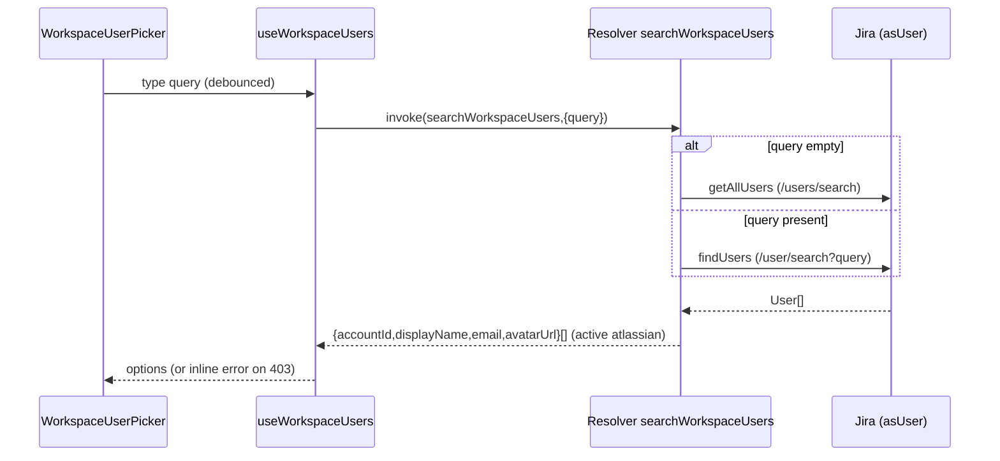
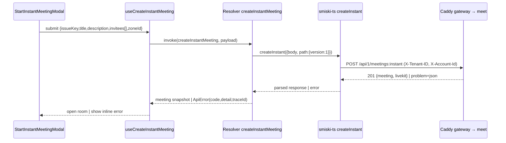

## Context

The Smiski Forge app is a Custom UI client (Vite + React + TypeScript + Tailwind

- TanStack Query) embedded in Jira. It renders two module surfaces from one
  bundle: `jira:issueContext` (Issue Panel) and `jira:projectPage` (dashboard +
  meeting room). Today:

* The invite picker (`useProjectMembers`) calls Jira's `/user/assignable/search`
  directly from the browser via `@forge/bridge` `requestJira` — it lists
  project-assignable users, not all site users.
* `StartInstantMeetingModal` is a hand-rolled Tailwind form using
  `MultiSelectDropdown` (no search).
* `useCreateInstantMeeting` writes to the in-memory mock (`mocks/db.ts`); the
  real `POST /meetings:instant` is not wired.
* The Issue Panel "Start instant" button creates a meeting immediately with no
  invitee selection.

Two repo-local SDKs are available and both use the `@hey-api` fetch client
family (custom `fetch(Request)`, reading `.ok/.status/.headers.get()/.json()`):

- `@smiskinext/sdks-jira` — Jira Cloud REST SDK (declared in
  `app/package.json`).
- `@smiskinext/smiski-ts` (`sdks/typescript`) — the Smiski backend SDK with a
  zod-validated `createInstant` bound to `POST /api/{version}/meetings:instant`.

The backend contract (see `create-instant-meeting` spec and `api-convention`):
`POST /api/1/meetings:instant` requires `title`, `description`, `issueLink`,
`settings`, `host {displayName, deviceId, avatarUrl?}`, `organizerEmail`,
`organizerDisplayName`, `zoneId`, optional
`invitees[] {email, accountId, displayName}`; returns `201` with
`{meeting, livekit}`. Business requests carry `X-Tenant-ID` (Jira `cloudId`) and
`X-Account-Id` (Jira `accountId`); errors are RFC 9457 `problem+json`.

## Goals / Non-Goals

**Goals:**

- Invite anyone in the Jira site via an Ant Design searchable multi-select,
  sourced from the resolver using `sdks-jira` `.asUser()`.
- Create instant meetings against the real `meet` backend from the resolver
  using `smiski-ts` `createInstant`, from both dashboard and Issue Panel.
- Standardize the create-instant UI on Ant Design and a shadcn-style `cn`.
- Keep tenant/account identity server-side (resolver injects headers).

**Non-Goals:**

- No `meet` backend service changes.
- No changes to scheduled/list/update/delete/room-token flows, the creator
  filter, or `useMeetingParticipants` (they keep the existing adapter + mock).
- No shadcn/ui component library (only the `cn` utility convention).
- No new Jira scopes; no new egress beyond the existing Caddy gateway origin.

## Decisions

### D1: Both SDKs run in the resolver, not the browser

`sdks-jira` and `smiski-ts` execute in the Forge function. Rationale: only the
resolver has trusted access to the invocation context (`cloudId`, `accountId`);
keeping SDKs server-side avoids shipping them (and secrets/headers) to the
browser and matches where `sdks-jira`/`@forge/api` already live. The frontend
talks to the resolver via `invoke(...)`.

Alternatives: SDK in browser with `requestJira` fetch adapter (rejected — leaks
call surface to client, needs client egress/CSP for the backend); direct browser
→ Caddy (rejected — cannot attach tenant/account safely).

### D2: Jira user search — `getAllUsers` (seed) + `findUsers` (typeahead)

`findUsers` (`GET /user/search`) requires a non-empty `query` (empty → 400), so
the resolver uses `getAllUsers` (`GET /users/search`) to seed the initial list
and `findUsers` when a query is present. Results are filtered to `active`
accounts with `accountType === 'atlassian'` and mapped to
`{accountId, displayName, email, avatarUrl}`. Both run through
`api.asUser().requestJira(assumeTrustedRoute(url))` so the invoking user's
"Browse users" permission is enforced by Jira.

### D3: `smiski-ts` fetch adapter forwards to Caddy with identity headers

The `smiski-ts` client is configured with `baseUrl = SMISKI_API_BASE_URL` and a
`fetch` that runs inside the resolver, attaching `X-Tenant-ID` (from
`context.cloudId`) and `X-Account-Id` (from `context.accountId`), `Accept` and
`Content-Type: application/json`. This mirrors the resolver-transport described
in `api/README.md`. Version path segment is `1` (`/api/1/...`).

### D4: Instant create replaces the mock (BREAKING)

`useCreateInstantMeeting` calls `invoke('createInstantMeeting', ...)`; the mock
branch is removed for this flow. Standalone `vite dev` (no bridge) cannot create
instant meetings — accepted per prior decision. The picker still shows mock
users in `vite dev` so the form remains inspectable.

### D5: Ant Design adoption + `ConfigProvider` theming

Add `antd`, `@ant-design/icons`, `clsx`, `tailwind-merge`. Rewrite
`StartInstantMeetingModal` fully in Ant Design and convert `IssuePicker`
internals to `Select` (keeping props, so `ScheduleMeetingModal` inherits).
`App.tsx` wraps children in `ConfigProvider` with a brand token (`#3385f0`) and
`theme.darkAlgorithm` selected from the existing color mode. `cn` becomes
`twMerge(clsx(inputs))` (superset of today's signature — 15 call sites keep
working).

### D6: Forge CSP allowance for Ant Design (BREAKING)

Ant Design v5 injects runtime CSS-in-JS. Forge Custom UI blocks inline styles by
default, so `manifest.yml` gains
`permissions.content.styles: ['unsafe-inline']`. This is a major-version upgrade
(redeploy + `forge install --upgrade`) and may forfeit "Runs on Atlassian"
eligibility. Accepted per prior decision.

### D7: Issue Panel button opens the shared modal

The Issue Panel "Start instant" button keeps its host-conflict gate, then opens
the shared `StartInstantMeetingModal` (prefilled `issueKey`) as a Forge platform
modal — reusing the existing `useIssuePanel*Modal` + `*ModalRoot` + `App.tsx`
modal-surface pattern. `vite dev` falls back to an in-page modal.

### Flow: workspace-user search

### Flow: instant meeting creation

## Risks / Trade-offs

- **`unsafe-inline` CSP → loses "Runs on Atlassian"** → Accepted; document in
  proposal; single manifest entry, reversible if Ant Design is dropped.
- **`smiski-ts` not built / not a dependency yet** → Add as `app` dependency and
  build `dist` (or source-resolve) before the resolver imports it; verified same
  ESM pattern as `sdks-jira` already runs in the resolver.
- **Instant create no longer works in `vite dev`** → Accepted; test via Forge
  tunnel; picker still renders mock users for form inspection.
- **User lacks "Browse users" (403)** → Show inline notice, disable/empty the
  picker, still allow creating a meeting with no invitees.
- **Large workspaces / rate limits (429 on user search)** → Server-side
  typeahead
    - debounce; bounded `maxResults`; surface a soft error, keep prior results.
- **Ant Design visual drift from Tailwind surfaces** → `ConfigProvider` tokens +
  dark algorithm aligned to existing color mode.
- **Instant modal ↔ mutation cache across Forge iframes** → Reuse the
  established `view.close(result)` +
  `queryClient.invalidateQueries(['meetings'])` handoff.

## Migration Plan

1. Add deps (`antd`, `@ant-design/icons`, `clsx`, `tailwind-merge`) and
   `@smiskinext/smiski-ts` to `app`; build the SDK.
2. Add `content.styles: ['unsafe-inline']` to `manifest.yml`; `forge lint`.
3. Implement resolver clients + resolvers; wire frontend; rewrite components.
4. Verify: typecheck, lint, test, build (smiski-ui + app root + sdk).
5. Deploy: `forge deploy` then `forge install --upgrade` (major upgrade).
6. Rollback: revert manifest CSP + deps and restore the mock instant-create
   branch; the changes are additive and localized to the instant flow.

## Open Questions

- None blocking. `SMISKI_API_BASE_URL` (resolver) and the Caddy `/api/1` route
  must be configured in the target environment before instant-create works
  end-to-end; this is an environment concern, not a code decision.
