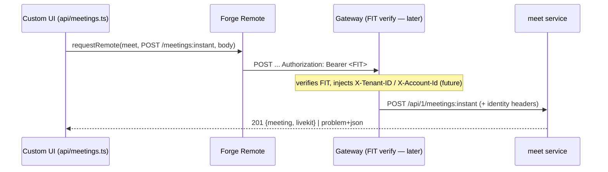

## Context

The Smiski Forge app is a Custom UI client that must reach the self-hosted
`meet` Spring Boot backend. Today the instant-create flow works like this:

```
Custom UI ──invoke('createInstantMeeting')──► resolver (app/src/index.ts)
   └─ createMeetClient({tenantId, accountId}) [meetSdkClient.ts]
        └─ plain fetch → backend, self-setting X-Tenant-ID / X-Account-Id
```

This contradicts the Forge Remote reference
(`requirements/references/forgeapp-remote-backend.md`):

- A Forge app must call a self-hosted backend through **Forge Remote**, which
  makes Atlassian attach a signed **FIT** (`Authorization: Bearer <JWT>`) plus
  optional `x-forge-oauth-*` tokens.
- The client must not assert tenant/account identity — those are unsigned and
  spoofable. Identity is derived by verifying the FIT at the trusted boundary.

The backend already assumes the gateway-injects-identity model:

- `meet` `SecurityConfig` states services "perform no token verification of
  their own" and trust gateway-injected headers.
- `meet` `application.yaml` reads `app.tenancy.header: X-Tenant-ID` and
  `app.identity.header: X-Account-Id`.

The identity bridge is an explicitly deferred decision:
`requirements/ROADMAP.md` Phase 2 ("Auth Bridge — spike first, decide later")
and `AGENTS.md` both mark it unresolved. The current Kong config still validates
a legacy `zms` user-management HS256 JWT and injects `X-User-ID` — it does not
yet verify a FIT nor inject `X-Tenant-ID`/`X-Account-Id`.

`@forge/bridge` exposes
`requestRemote(remoteKey, { path, method, headers, body })` returning a
`Response`, callable directly from Custom UI. `@smiskinext/smiski-ts` (the
backend SDK) is only linked into the `app` root package and is **not**
resolvable from the Custom UI bundle, so it cannot run in the browser.

## Goals / Non-Goals

**Goals:**

- Make the app-side contract correct per Forge Remote: outbound calls to `meet`
  carry a FIT that Forge attaches; the app asserts no tenant/account identity.
- Call the backend via `requestRemote` directly from Custom UI for instant
  creation, keeping the request body and response mapping unchanged.
- Remove the self-attached `X-Tenant-ID`/`X-Account-Id` headers and the now-dead
  resolver + backend-SDK path from the app.

**Non-Goals:**

- Gateway work: verifying the FIT and injecting `X-Tenant-ID`/`X-Account-Id`.
  Deferred to a later change (Phase 2 spike outcome).
- Any change to the `meet` backend service or Kong configuration.
- `getRoomToken`, `searchWorkspaceUsers`, and schedule/list/update/delete flows.
- Making instant-create work end-to-end now (it cannot until the gateway lands).

## Decisions

### D1: Call the backend with `requestRemote` from Custom UI

The instant-create flow calls
`requestRemote(<remoteKey>, { path, method: 'POST', headers: { 'Content-Type': 'application/json' }, body })`
from `api/meetings.ts`. Rationale: the user chose the Custom UI entry point; it
is the fewest layers, and Forge attaches the FIT automatically. The frontend
keeps `buildInstantMeetingPayload` (pure JSON body builder) and
`meetingFromBackend` (response mapper) unchanged.

Alternatives: `invokeRemote` via the resolver (rejected — extra hop and keeps
the backend SDK in the function for no benefit now that identity is
gateway-derived).

### D2: The app attaches no tenant/account identity

Remove all `X-Tenant-ID`/`X-Account-Id` header setting. Forge attaches the FIT;
tenant/account are derived from the FIT downstream. Rationale: unsigned
client-asserted identity is the core defect being fixed.

### D3: Remove the dead resolver + backend-SDK path

Delete the `createInstantMeeting` resolver from `app/src/index.ts`, delete
`app/src/meetSdkClient.ts`, and drop `@smiskinext/smiski-ts` from `app`
dependencies (only that resolver path used it). Rationale: with Custom UI
calling `requestRemote` directly, the resolver and browser-unusable backend SDK
are unnecessary.

### D4: Declare `meet` as a Forge remote in the manifest

Add a `remotes` entry (backend `baseUrl`, `operations: [compute]`) and a
`modules.endpoint` binding the remote with `auth` token flags so Forge issues
the FIT (and, if needed later, `x-forge-oauth-*`). Reconcile the existing
`external.fetch.backend` placeholder.

### Target flow



## Risks / Trade-offs

- **[Instant-create breaks end-to-end until the gateway lands]** → Intentional
  and documented. The app-side contract is correct; the gateway FIT bridge is a
  separate change. `vite dev` already cannot create instant meetings (no
  bridge).
- **[Removing `@smiskinext/smiski-ts` from `app` might affect another
  importer]** → Verified current usage is only the removed resolver path; the
  apply step must re-grep before removing to confirm no other importer.
- **[`requestRemote` error shape differs from the resolver's thrown Error]** →
  `createInstantMeeting` must map a non-2xx `Response` (problem+json) to an
  error the existing modal already renders, preserving the "validation shown in
  form" behavior.
- **[Manifest `remotes`/`endpoint` misconfig blocks all backend calls]** →
  Validate with `forge lint`; keep the remote key and route path consistent with
  `api/meetings.ts`.

## Migration Plan

1. Add `remotes` + `endpoint` to `manifest.yml`; `forge lint`.
2. Switch `createInstantMeeting` to `requestRemote`; remove header attachment.
3. Delete resolver `createInstantMeeting`, `meetSdkClient.ts`, and the app
   dependency on `@smiskinext/smiski-ts`.
4. Update the instant-create test to mock `requestRemote`.
5. Verify: typecheck, test, build (smiski-ui) + typecheck (app root) + forge
   lint.
6. Rollback: restore the resolver + `meetSdkClient.ts` + dependency and revert
   `api/meetings.ts` — the change is localized to the instant flow and manifest.

## Open Questions

- None blocking. The remote `baseUrl` value is environment configuration, set
  when the gateway origin is finalized; it does not change the app-side
  contract.
