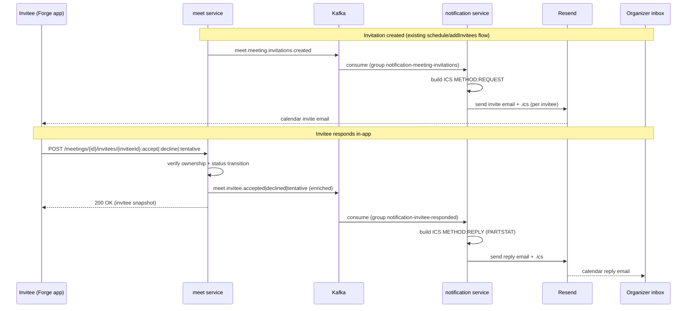

## Context

The meet service already models iCalendar-aligned invitation state: `Meeting`
carries `organizerEmail`, `organizerDisplayName`, `calendarUid` (RFC 5545 UID),
and `calendarSequence` (SEQUENCE); `MeetingInvitee` carries `accountId`,
`email`, `displayName`, `role` (RFC 5545 ROLE), `rsvp`, and `status`
(`InviteeStatus`: `NEEDS_ACTION`/`ACCEPTED`/`DECLINED`/`TENTATIVE`). The
`MeetingInvitee.accept()` and `.decline()` domain methods exist and register
`InviteeAcceptedEvent`/`InviteeDeclinedEvent`, but they have **zero callers** —
no application service, no controller endpoint. `tentative()` does not exist.

The notification service is a Kafka-consumer-only service (no DB, no Flyway)
that currently relays join-request SSE. It has **no email capability and no ICS
generation**. Consumer groups for invitations and invitee-responses are
pre-declared in `application.yaml` but unused. Invitee and organizer emails are
carried inside the meet events, so no cross-service identity lookup is needed.

Constraints:

- API convention (`openspec/specs/api-convention/spec.md`): non-CRUD actions use
  `POST` with a `:action` suffix; the `/api/{version}` prefix is applied
  globally; errors are RFC 9457 `application/problem+json`.
- Event-driven (`openspec/specs/event-driven/spec.md`): publishable events go
  through the transactional outbox via
  `EventPublisher.publishEventsOf(aggregate)`, are mapped to proto by a
  per-event-type mapper, and encoded as CloudEvents 1.0 structured JSON. New
  proto fields use new field numbers (backward compatible) and must pass Buf
  `STANDARD` lint.
- notification has no database — email delivery must be stateless and idempotent
  enough to tolerate at-least-once redelivery.

## Goals / Non-Goals

**Goals:**

- Let an invitee accept, decline, or tentatively respond to their own invitation
  through meet endpoints, with ownership authorization and the existing
  status-transition rules enforced in the domain.
- Add the missing `tentative()` domain behavior and its event/proto so "maybe"
  is a first-class response.
- Email each invitee a `METHOD:REQUEST` calendar invite when invitations are
  created, and email the organizer a `METHOD:REPLY` when an invitee responds.
- Keep response events self-contained (enriched with meeting context) so the
  notification service builds ICS replies without querying meet.

**Non-Goals:**

- `METHOD:CANCEL`/`METHOD:REQUEST`-update emails for invitee removal, meeting
  cancellation, or reschedule (full lifecycle is out of scope for this change).
- Inbound iMIP processing (parsing replies mail clients send back). Responses
  come only through the in-app endpoints.
- Persisting sent-email history in the notification service.
- Rich HTML email theming beyond a simple readable body plus the ICS attachment.

## Decisions

### D1: RSVP endpoint shape — inviteeId on the path with ownership check

`POST /api/1/meetings/{id}/invitees/{inviteeId}:accept`, `:decline`,
`:tentative`. This matches the api-convention `:action` rule and mirrors the
existing `/meetings/{id}/join-requests:accept`. The acting account is resolved
from the account header (`AccountContext`), and the application service loads
the target invitee and rejects the request when `invitee.accountId` differs from
the acting account (authorization error → `403`). Chosen over an
account-inferred endpoint (no `inviteeId`) because it is RESTful, unambiguous
for auditing, and consistent with sibling endpoints; the ownership check closes
the "respond on someone else's behalf" gap the explicit id would otherwise open.

### D2: Enrich response events rather than query back into meet

The RSVP application service already loads the `Meeting` aggregate to validate
status/context, so it has the title, time range, timezone, organizer, and
`calendarUid`/`calendarSequence` on hand. Domain methods `accept()`/`decline()`/
`tentative()` will accept the meeting context needed for the reply and embed it
in the event. This keeps the notification consumer self-contained and avoids a
new gRPC/REST client and its coupling. New proto fields are added with new field
numbers, preserving backward compatibility per the event-driven spec.

### D3: `tentative()` added symmetric to `accept()`/`decline()`

New `InviteeTentativeEvent`, new `InviteeTentative` proto message, new proto
mapper, new topic `meet.invitee.tentative` and CloudEvent type
`io.github.smiskinext.meet.invitee.tentative.v1`. Transition rules already
present in `InviteeStatus` (`NEEDS_ACTION→TENTATIVE`, `ACCEPTED→TENTATIVE`) are
reused; an invalid transition yields `InvalidInviteeTransition` → `409`.

### D4: ICS generation with biweekly

biweekly is added to the version catalog and to the notification build. It
produces RFC 5545 calendars with correct line folding, escaping, and CRLF, and
has first-class `METHOD:REQUEST`/`REPLY`/`CANCEL` and PARTSTAT support with a
small pure-Java API compatible with Java 25 / Spring Boot 4. Chosen over ical4j
(heavier, more complex API) and hand-written strings (fragile against RFC
folding/escaping rules).

- REQUEST calendar: `UID=calendarUid`, `SEQUENCE=calendarSequence`, `DTSTART`/
  `DTEND` from the meeting time range in the meeting timezone, `SUMMARY=title`,
  `ORGANIZER`, one `ATTENDEE` per invitee with `ROLE`/`RSVP`/`PARTSTAT`.
- REPLY calendar: same `UID`/`SEQUENCE`, single `ATTENDEE` line for the
  responding invitee with the mapped PARTSTAT (`ACCEPTED`→`ACCEPTED`,
  `DECLINED`→`DECLINED`, `TENTATIVE`→`TENTATIVE`), `ORGANIZER` set to the
  meeting organizer.

### D5: Email delivery with Resend, fail-fast configuration

`resend-java` (already in the version catalog) is added to the notification
build. `RESEND_API_KEY` and a sender address are bound to a validated
`@ConfigurationProperties` type; a missing/blank key fails application startup
(fail-fast) so a misconfigured deployment never silently drops calendar mail. An
`EmailSender` domain port abstracts delivery; `ResendEmailSender` is the
infrastructure adapter. The email carries a human-readable body and the `.ics`
as a `text/calendar` attachment (with the appropriate `method=` parameter).

### D6: Fixed consumer groups + retry/dead-letter, not broadcast

Unlike the SSE relay (which broadcasts to every replica via random group ids),
email consumers use the fixed, pre-declared consumer groups
(`notification-meeting-invitations`, `notification-invitee-responded`) so each
event is delivered to exactly one replica and each email is sent once. Send
failures are handled with a Spring Kafka retry topic and a dead-letter topic;
after exhausting retries the message lands in the DLT rather than blocking the
partition. Malformed events are logged and skipped without terminating the
consumer.

## Flow

## Risks / Trade-offs

- **At-least-once delivery → duplicate emails** → notification has no dedup
  store; fixed consumer groups already avoid per-replica fan-out, and duplicate
  calendar mail with the same UID/SEQUENCE is coalesced by calendar clients, so
  the impact is low. Accepted for this change; a dedup store is a future option.
- **Enriched events grow the payload / touch three existing producers**
  (schedule, instant, add-invitees for REQUEST are unchanged; only the three
  response events change) → new proto fields use new field numbers, so existing
  consumers keep working and the change is backward compatible.
- **Resend fail-fast blocks local dev without a key** → documented env var; the
  key can be a Resend test key locally. Chosen deliberately so production never
  silently drops invites.
- **ICS correctness across clients (Gmail/Outlook/Apple)** → biweekly handles
  RFC folding/escaping; PARTSTAT and METHOD are validated in generator unit
  tests against known-good fixtures.
- **DLT accumulation on sustained Resend outage** → messages park in the DLT for
  later reprocessing; monitored via existing logging aspect. No automatic DLT
  drain in this change.

## Migration Plan

- Additive only. New proto fields (new field numbers), new topic
  (`meet.invitee.tentative`), new consumers, new notification dependencies. No
  DB schema change (notification has none; meet's invitee schema already
  supports `TENTATIVE`).
- Deploy order: proto → meet → notification. Older notification replicas ignore
  the new fields until upgraded. `RESEND_API_KEY` and sender must be set in the
  notification environment before that service is deployed (fail-fast).
- Rollback: revert notification (email stops; no state to unwind) then meet;
  proto additions are backward compatible and can remain.

## Open Questions

None — all scope decisions were resolved during exploration (email scope,
interaction model, enrichment strategy, ICS library, endpoint shape, consumer
group strategy, failure handling, and Resend configuration).
