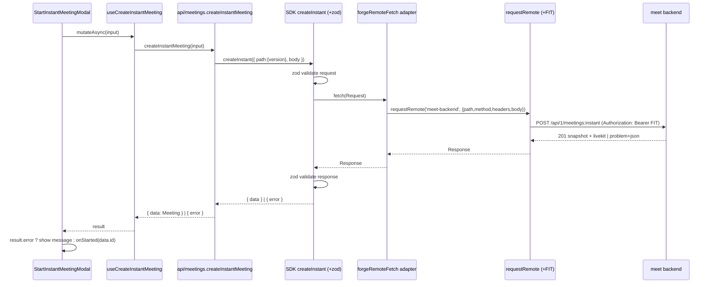

## Context

`app/static/smiski-ui/src/api/meetings.ts` currently hand-builds the instant and
scheduled create request bodies (`buildInstantMeetingPayload`,
`buildScheduleMeetingPayload`) and hand-declares response/error types, then
sends them via `requestRemote('meet-backend', ...)`. The repo already generates
a contract-accurate client `@smiskinext/smiski-ts` from `services/openapi.yaml`
(via `@hey-api/openapi-ts` with the `@hey-api/client-fetch` plugin and zod
request/response validators), but nothing consumes it.

Two contract drifts exist today: the instant body sends flat `issueKey`/
`issueId`/`projectKey` and omits `settings`, whereas the OpenAPI
`MeetCreateInstantMeetingRequest` requires a nested `issueLink` and a `settings`
object; the scheduled body omits `organizerEmail`/`organizerDisplayName` that
`MeetScheduleMeetingRequest` requires. The `meet` backend origin is still a
placeholder in `manifest.yml`, so these drifts have not surfaced at runtime yet.

A second, independent problem: `api/client.ts#apiRequest` routes through
`invoke('backendRequest')`, but no `backendRequest` resolver exists in
`app/src/index.ts`. Every `api/meetings.ts` function built on `apiRequest`
(list/get/update/cancel/start/end/hostConflict) plus `api/recordings.ts`,
`api/participants.ts`, `api/permissions.ts` is therefore dead — real hooks read
from `mocks/db` instead.

Per `api-convention`, the backend uses RFC 9457 `application/problem+json` for
errors and raw representation bodies for success; the SDK's generated types
already model these (`MeetProblemDetail`, `Meet*Response`).

## Goals / Non-Goals

**Goals:**

- Instant-create and scheduled-create use the generated SDK (`createInstant`,
  `schedule`) for typing, URL building, and zod validation.
- Keep Forge Remote transport: Forge attaches the FIT; the app asserts no
  tenant/account identity headers.
- Align outbound bodies to the OpenAPI contract.
- Surface backend problem+json through the SDK `{ data, error }` result.
- Delete the dead `apiRequest` transport path and its orphaned modules.

**Non-Goals:**

- Replacing or removing the `mocks/db` layer.
- Wiring update/cancel/start/end or any list/detail/host-conflict/participant/
  recording flow to the backend.
- Any backend, resolver, or `manifest.yml` change.

## Decisions

### D1: Bridge the SDK's `fetch` seam to `requestRemote`

The `@hey-api/client-fetch` client resolves its transport as
`options.fetch ?? _config.fetch ?? globalThis.fetch` and calls it with a single
`Request`. We inject a `fetch`-shaped adapter that translates that `Request`
into a `requestRemote('meet-backend', { path, method, headers, body })` call and
returns the Response-compatible result requestRemote already yields.

- **Why**: keeps the SDK's type-safety and zod validation while preserving the
  Forge FIT transport. The seam is a documented, first-class config option.
- **Alternatives**: (a) keep hand-written payloads — rejected, perpetuates
  contract drift; (b) call the SDK with `globalThis.fetch` + `external.fetch`
  egress — rejected, loses the FIT and needs manifest egress the app avoids.

### D2: `version` path parameter from `apiConfig.apiVersion`

The SDK URL template is `/api/{version}/meetings:instant`. The SDK fills
`{version}` from `path.version`; we pass `apiConfig.apiVersion` (default 1). The
adapter forwards the SDK-built path (pathname + search) to `requestRemote`.

### D3: `{ data, error }` result contract at the api boundary

`createInstantMeeting`/`scheduleMeeting` return the SDK result object
(`throwOnError` left false) rather than throwing. The React Query mutation
`onSuccess` invalidation guards on `result.data` presence; the create/schedule
modals read `result.error` (mapped to a message) instead of a `try/catch` around
`mutateAsync`.

- **Why**: the user chose the SDK-native contract. React Query mutations do not
  set `isError` when the function resolves, so invalidation and the modals are
  adjusted to branch on `result.data` / `result.error` explicitly.
- **Trade-off**: modal error handling changes from exception-based to
  result-based; covered by rewritten tests.

### D4: Response mapping stays in `mappers.ts`

The SDK returns `MeetCreateInstantMeetingResponse` /
`MeetScheduleMeetingResponse` snapshots; `mappers.ts#meetingFromBackend` maps
them to the app `Meeting` domain type. Mapper helpers only used by deleted
functions (`meetingsFromBackend`, `roomTokenFromBackend`,
`updateMeetingRequest`) are removed.

### D5: SDK as a build-time dependency

`@smiskinext/smiski-ts` is added to `smiski-ui` dependencies. Vite bundles it
into `static/smiski-ui/dist`, which is the only artifact Forge deploys, so no
runtime dependency reaches Forge. The package is a member of the root
pnpm-workspace alongside `smiski-ui`, so it resolves via the workspace.

## Sequence: instant-create via SDK over Forge Remote

## Risks / Trade-offs

- **SDK `buildUrl` needs a baseUrl even though we ignore it** → set a harmless
  placeholder in the client config; the adapter only forwards pathname+search to
  `requestRemote`, whose real origin is the Forge remote binding.
- **Adapter receives a `Request`, not `(url, init)`** → read `req.method`,
  `req.headers`, and `await req.text()` for the body; wrong assumption would
  drop the body. Covered by adapter unit tests.
- **SDK path must match the Forge remote route** → the SDK emits
  `/api/1/meetings:instant` and `/api/1/meetings:schedule`; the instant path
  matches the existing `manifest.yml` endpoint binding. Verified against
  `services/openapi.yaml` operation paths.
- **`{ data, error }` diverges from React Query's throw model** → invalidation
  guards on `data`; modals branch on `error`. Rewritten tests lock this in.
- **Deleting shared modules could orphan imports** → `api/index.ts` re-exports
  are pruned; a full `typecheck` + `build` is the gate before completion.
