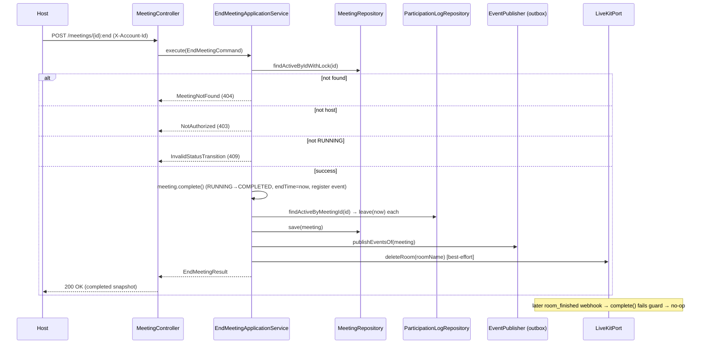

## Context

The meet service (Spring Boot 4 / Java 25, hexagonal + DDD) drives meeting
status through the `MeetingStatus` state machine:
`SCHEDULED → RUNNING → COMPLETED`, with `SCHEDULED → CANCELED` as the alternate
terminal path. Today the only path into `COMPLETED` is the LiveKit
`room_finished` webhook, processed asynchronously by
`LiveKitWebhookProcessingApplicationService.handleRoomFinished`. There is no
application-driven way for a host to end a running meeting.

The codebase already anticipates this feature: `Meeting.complete()` exists and
registers `MeetingCompletedEvent`;
`ParticipationLogRepository.findActiveByMeetingId` is documented as being used
by both `room_finished` and a "CompleteMeetingUseCase" to bulk-close sessions;
`LiveKitPort.deleteRoom` exists. This change wires those existing pieces behind
a new host-only endpoint, following the established
`CancelMeetingApplicationService` pattern.

Constraints: hexagonal layering is ArchUnit-enforced
(`domain → application → infrastructure → presentation`); errors flow through
`Result<T, MeetingError>` (no business exceptions); action endpoints use the
`:action` suffix and stay `POST` under the `/api/{version}` prefix; success
bodies are raw representations, errors are RFC 9457 `application/problem+json`.

## Goals / Non-Goals

**Goals:**

- Add `POST /api/1/meetings/{id}:end` for host-initiated completion of a
  `RUNNING` meeting.
- Transition `RUNNING → COMPLETED` synchronously in the request, close active
  participation logs, and publish `MeetingCompletedEvent` atomically via the
  outbox.
- Delete the LiveKit room as a best-effort side effect that never rolls back the
  completed status.
- Keep the `room_finished` webhook a natural idempotent no-op.

**Non-Goals:**

- No new domain event, protobuf message, or proto mapper.
- No change to `MeetingStatus`, `Meeting.complete()`, or the LiveKit webhook
  processing path.
- No notification-service change and no email dispatch.
- No database migration.
- No participant-initiated "leave" or auto-complete-when-empty behavior.

## Decisions

### Decision: Synchronous transition in the request (not wait-for-webhook)

The use case transitions the meeting to `COMPLETED` inside its own transaction
and returns the completed snapshot, mirroring `CancelMeetingApplicationService`.

- **Why**: Deterministic and consistent with the existing cancel flow. If we
  waited for `room_finished`, a lost or delayed webhook would leave the meeting
  stuck in `RUNNING` indefinitely, and the host would get an ambiguous response.
- **Alternative considered**: Return `202 Accepted` and only delete the room,
  letting `room_finished` drive the state change. Rejected due to
  non-determinism and the stuck-state risk.

### Decision: Reuse `MeetingCompletedEvent` (no new event)

`Meeting.complete()` already registers `MeetingCompletedEvent`; the use case
relies on that rather than introducing a host-specific event.

- **Why**: Backward-compatible with existing consumers; zero new
  proto/mapper/topic surface. The user explicitly scoped notifications out, so
  there is no consumer that needs to distinguish "host ended" from "room
  finished".
- **Alternative considered**: A dedicated `MeetingEndedByHostEvent` carrying the
  participant list. Rejected as unnecessary given notifications are out of
  scope; can be added later without breaking this change.

### Decision: Best-effort LiveKit room deletion after commit-worthy state

`liveKitPort.deleteRoom(roomName)` is invoked after the domain mutation. A
failure is logged and swallowed — it does not fail the request or roll back the
transaction.

- **Why**: The application status is the source of truth. The `room_finished`
  webhook (fired when the room actually ends) will arrive as a no-op regardless.
  Blocking the completion on media-server availability would reduce reliability.
- **Alternative considered**: Delete the room first and only complete on
  success. Rejected — couples authoritative state to an external system's
  availability.

### Decision: Idempotency via the existing `MeetingStatus` guard

No new idempotency code. Once the meeting is `COMPLETED`,
`MeetingStatus.canTransitionTo(COMPLETED)` returns `false`, so the
`room_finished` webhook's `meeting.complete()` call fails fast and
`handleRoomFinished` returns early without publishing or closing anything.

- **Why**: The guard already exists and is covered by the livekit-webhook spec's
  "room_finished on an already completed meeting is a no-op" scenario.

### Decision: Layering / new artifacts

Follow the `CancelMeeting*` shape exactly:

- `application/command/EndMeetingCommand` —
  `(UUID meetingId, String tenantId, String accountId)`
- `application/usecase/EndMeetingUseCase` —
  `UseCase<EndMeetingCommand, EndMeetingResult, MeetingError>`
- `application/result/EndMeetingResult` — meeting snapshot (framework-agnostic)
- `application/mapper/EndedMeetingMapper` — domain → result
- `application/service/EndMeetingApplicationService` — `@Service @Transactional`
- `presentation/response/EndMeetingResponse` — DTO with `from(...)`
- `presentation/MeetingController` — inject `EndMeetingUseCase`, add `:end`
  mapping

### Flow

## Risks / Trade-offs

- **[LiveKit room not deleted after failure]** → Participants stay connected
  until the room idles out and LiveKit emits `room_finished` on its own; that
  webhook is a no-op for status but confirms cleanup. Acceptable: the meeting is
  already authoritatively `COMPLETED`.
- **[Race: `room_finished` arrives between `complete()` and commit]** → The
  webhook processing runs in its own transaction; with `findActiveByIdWithLock`
  taking a row lock in the end flow, the webhook either reads pre-commit state
  and no-ops on the transition guard, or reads committed `COMPLETED` and no-ops.
  Either way no duplicate event. Acceptable.
- **[Best-effort delete swallows errors]** → Mitigation: log at warn/error with
  meeting ID and room name so operators can detect systemic LiveKit issues.
