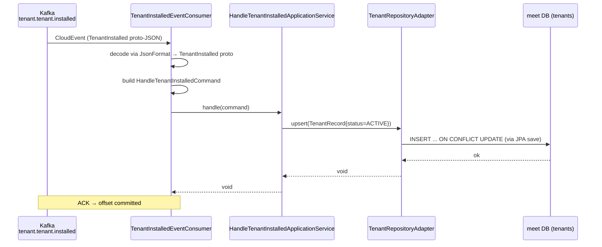
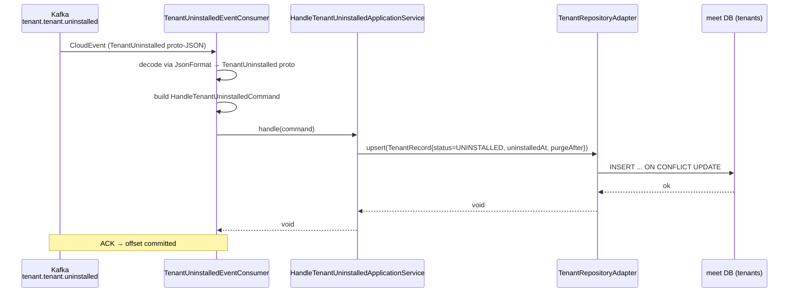
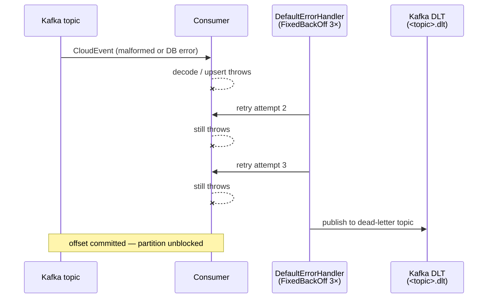

## Context

The `meet` service stores every meeting row under a `tenant_id` (Jira cloudId).
Its `B1.0.0__baseline.sql` already defines a `tenants` projection table — a
small, non-partitioned table keyed by `tenant_id` — intended to be synchronised
from the tenant service via Kafka (per `db-schema` spec, Requirement: Tenant
read-model projection). However, no code yet populates that table in `meet`. The
tenant service publishes `TenantInstalled` and `TenantUninstalled` events to
`tenant.tenant.installed` and `tenant.tenant.uninstalled` as CloudEvents 1.0
over Kafka, encoded with protobuf-JSON data (per `event-driven` spec). The
`notification` service is the existing reference cross-service consumer; it uses
`CloudEventDeserializer`, `JsonFormat` for proto-JSON decoding, a fixed consumer
group, retry with Dead Letter Topic, and no domain aggregate.

## Goals / Non-Goals

**Goals:**

- Consume `tenant.tenant.installed` in `meet` and upsert the local `tenants` row
  with `status = ACTIVE`.
- Consume `tenant.tenant.uninstalled` in `meet` and upsert the local `tenants`
  row with `status = UNINSTALLED`, `uninstalled_at`, and `purge_after`.
- Follow the hexagonal DDD layering enforced by ArchUnit: domain model + port,
  application use-case + service, infrastructure persistence + messaging +
  config.
- Mirror the `notification` service's error-handling strategy: fixed consumer
  group, bounded retry (3 attempts), Dead Letter Topic on exhaustion.

**Non-Goals:**

- No purge / cleanup logic (storing `purge_after` only; scheduling purge jobs is
  a separate change).
- No HTTP API for tenant data in `meet`.
- No schema migration (the `tenants` table already exists in the baseline).
- No soft-delete of meetings when a tenant is uninstalled (separate change).

## Decisions

### Decision 1: Reuse CloudEvent + proto-JSON decoding (same as `notification`)

The `tenant` outbox publishes CloudEvents 1.0 structured JSON whose `data` is
the proto message rendered as proto-JSON via `JsonFormat`. The `notification`
service already demonstrates consuming this format with `CloudEventDeserializer`
and `JsonFormat.parser().ignoringUnknownFields()`. We follow the same pattern
exactly — no alternative (e.g. raw JSON, Avro) is considered because it would
diverge from the established shared contract.

### Decision 2: Two independent consumer beans, one shared Kafka config

Each topic (`tenant.tenant.installed`, `tenant.tenant.uninstalled`) gets its own
`@KafkaListener` bean and its own fixed consumer group, mirroring how
`notification` separates `MeetingInvitationsCreatedEmailConsumer`,
`MeetingInfoUpdatedEmailConsumer`, etc. A single `TenantKafkaConfig` wires one
`ConsumerFactory<String, CloudEvent>` and one
`ConcurrentKafkaListenerContainerFactory` shared by both consumers (both use
identical deserializer and error handler settings). This avoids a factory per
consumer while keeping the consumers independent.

**Alternative considered:** One consumer handling both topics via a topics-array
`@KafkaListener`. Rejected — mixing two event types with different proto shapes
in one method requires a type switch and complicates testing.

### Decision 3: Retry + Dead Letter Topic (not log-and-skip)

Tenant lifecycle events affect referential integrity in `meet` (the
`fk_meetings_tenant` foreign key requires the tenant row to exist). A failed
upsert must not be silently dropped. We use Spring Kafka's `DefaultErrorHandler`
with `FixedBackOff` (3 attempts, 1 s interval) and
`DeadLetterPublishingRecoverer` — the same pattern as `EmailKafkaConfig` in
`notification`. Log-and-skip (used by `KafkaConfig` for SSE relay in
`notification`) is not appropriate here because a missed upsert could allow
orphaned meetings or block future meeting creation.

### Decision 4: Upsert via `save()` on `TenantJpaRepository` (Spring Data JPA)

The `tenants` table has `PRIMARY KEY (tenant_id)` — a natural VARCHAR key. An
upsert is modelled as a Spring Data `save()` call after finding or constructing
the entity. No native `INSERT ... ON CONFLICT` query is needed because the
consumer processes one event at a time and is under a fixed consumer group (no
concurrent writes from the same consumer). The installed event always sets
`status = ACTIVE`; the uninstalled event always sets `status = UNINSTALLED` and
populates `uninstalled_at` / `purge_after`.

### Decision 5: No domain aggregate — projection-only model

`TenantRecord` is a plain immutable record (not an `AggregateRoot`) because
`meet` has no business logic over tenant state — it is a read-model projection.
The application services invoke `TenantRepository.upsert()` directly, without
domain events or an outbox. This matches how `notification` models its domain
objects (`PendingJoinRequest` is a plain record, not an aggregate).

## Sequence Diagrams

### Tenant installed flow

### Tenant uninstalled flow

### Error / DLT flow

## Risks / Trade-offs

- **Out-of-order delivery** → The tenant service uses `cloudId` as the Kafka
  message key; all events for one tenant are ordered within a partition.
  Out-of-order delivery across the two topics (installed vs uninstalled) is
  impossible by design. Risk: low.
- **DLT message rot** → Messages sent to `.dlt` require manual intervention.
  Mitigation: operators should monitor DLT lag; a future change may add
  automated alerting.
- **Cold-start gap** → If `meet` starts before the tenant's installed event was
  published (or the event is on the DLT), `fk_meetings_tenant` will reject the
  first meeting insertion. Mitigation: operators replay from `earliest` offset
  on first deployment; the `auto.offset.reset = earliest` default is set for
  both consumer groups.
- **No idempotency guard beyond DB upsert** → Redelivered events produce the
  same upsert; no extra deduplication table is needed because the upsert is
  naturally idempotent.

## Migration Plan

1. Deploy updated `meet` service with the new consumer beans.
2. Both consumer groups start with `auto.offset.reset = earliest`, so they
   replay all past tenant events on first start and populate `tenants`.
3. No schema migration required (`tenants` table exists in baseline).
4. No rollback concern: removing the consumers has no schema impact and does not
   affect existing meetings.
