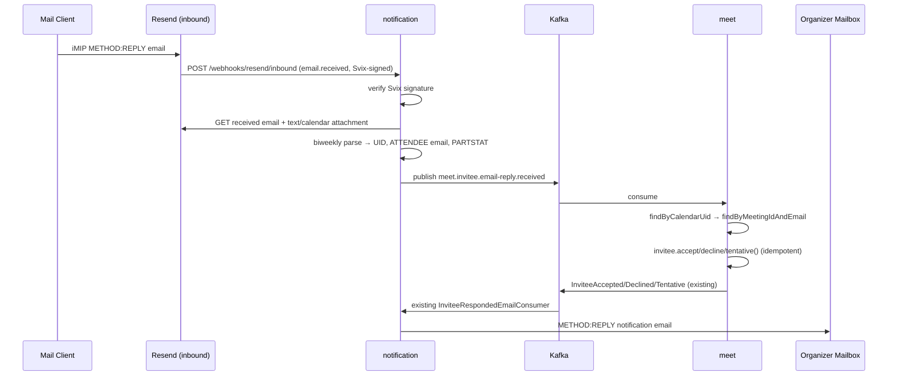

## Context

The `notification` service consumes meeting events from Kafka and sends calendar
emails via Resend (outbound only). Invitation emails carry an iCalendar
`METHOD:REQUEST`; mail clients (Gmail/Outlook) render Yes/Maybe/No controls
that, on click, emit an iMIP `METHOD:REPLY` email back to the sender. Today that
reply is discarded — the authoritative invitee status only changes through the
three in-app REST endpoints (`:accept`/`:decline`/`:tentative`) which authorize
by `X-Account-Id` ownership. Instant meetings additionally have no scheduled
time range, so their invitation emails carry no `DTSTART`/`DTEND`.

Current facts confirmed in code:

- `notification` already has a `KafkaTemplate<String, CloudEvent>` producer
  (`EmailKafkaConfig`) used for DLT; no Svix dependency yet.
- `biweekly` is already a dependency (used by `IcsGenerator`).
- `meet` `MeetingRepository` has `findByShortCode` but no `findByCalendarUid`;
  `MeetingInviteeRepository` has `findByMeetingIdAndAccountId` but no by-email
  lookup.
- The `meetings` table is hash-partitioned by `tenant_id`; `calendar_uid` is
  `NOT NULL` but not indexed.
- `MeetingInvitee` domain already exposes `accept()/decline()/tentative()` with
  status-transition rules and emits `InviteeAccepted/Declined/Tentative` events,
  which the existing `InviteeRespondedEmailConsumer` turns into an organizer
  REPLY.
- Resend inbound email is GA (Nov 2025): `email.received` webhook is Svix-signed
  and metadata-only; full content + attachments are fetched via the
  Received-Emails / Attachments API.

## Goals / Non-Goals

**Goals:**

- Ingest iMIP `METHOD:REPLY` emails and synchronize invitee RSVP status in
  `meet`.
- Verify inbound webhook authenticity (Svix signature) and constrain trust to
  sender email matching an existing invitee of the resolved meeting.
- Handle redelivered/duplicate replies idempotently.
- Give instant meetings a valid scheduled time range so invitation emails are
  well-formed calendar objects.
- Keep the domain free of protobuf/messaging types; keep the outbound REPLY-to-
  organizer behavior intact (no new loop).

**Non-Goals:**

- Changing the three in-app RSVP REST endpoints or the RBAC permission model.
- Fixing the "invitee lacking `view-meeting` cannot reach the in-app RSVP UI"
  gap (analysis only; documented under Risks).
- Guaranteeing delivery for mail clients that do not emit iMIP replies (Gmail's
  support is limited) — email RSVP is best-effort, not a replacement for in-app.
- Building an outbox for the notification-side email-reply event (it is derived
  from an external webhook, not a persisted aggregate mutation).

## Decisions

### D1: Transport = Kafka event (notification → meet)

`notification` publishes a new CloudEvent `meet.invitee.email-reply.received`
(type `io.github.smiskinext.meet.invitee.email-reply.received.v1`) via its
existing `KafkaTemplate<String, CloudEvent>`. `meet` adds a consumer that
applies the change.

- **Why**: matches the established event-driven boundary; avoids new
  service-to-service auth and synchronous coupling. `notification` has no DB and
  is not a trust authority for meeting state — emitting an event lets `meet`
  (the owner) enforce all invariants.
- **Alternative rejected**: direct REST/gRPC call from `notification` to a new
  `meet` internal endpoint — adds coupling, a second auth model, and a
  synchronous failure path with no natural retry/DLT.

### D2: Reply → invitee mapping = `calendarUid` + sender email

The iMIP reply's VCALENDAR carries the original `UID` (= meeting `calendarUid`)
and an `ATTENDEE` line for the responder. `meet` resolves the meeting by
`calendarUid` (new `findByCalendarUid`), then the invitee by meeting id + sender
email (new `findByMeetingIdAndEmail`).

- **Why**: these are the only stable identifiers actually present in a
  standards- compliant iMIP reply; no dependency on the client preserving a
  custom field.
- **Alternative rejected**: embedding `inviteeId` as an ICS X-property/parameter
  — more precise but clients may strip/alter custom fields, and it leaks
  internal ids.
- **Data model**: add an index on `calendar_uid`. Because the table is
  partitioned by `tenant_id` and the lookup has no tenant, the index is
  `(calendar_uid)` spanning partitions; `calendarUid` is a random UUID so
  cross-tenant collision risk is negligible, and the resolved meeting supplies
  the tenant thereafter.

### D3: Email-based trust model (no `X-Account-Id`)

A new `meet` application use case (e.g. `ApplyEmailInviteeResponseUseCase`)
accepts `(calendarUid, inviteeEmail, status)` and authorizes purely by email
match — it does NOT read `AccountContext`. Layered controls:

1. Svix signature verification on the webhook (reject unsigned/invalid).
2. Provider SPF/DKIM (Resend delivers only authenticated inbound mail).
3. Sender email MUST match an existing, non-removed invitee of the resolved
   meeting; otherwise the event is ignored (logged, no state change).

- **Why**: iMIP has no notion of a Jira account; the email address is the only
  identity. This is a deliberately separate, weaker trust channel from the
  in-app path — documented as best-effort.
- **Alternative rejected**: resolving an account from the email via the identity
  service — brittle (email≠account mapping not guaranteed) and over-trusts
  email.

### D4: Idempotency

The consumer applies the domain transition and treats a no-op transition as
success (no error, no event). Because `InviteeStatus.canTransitionTo` already
rejects same-state transitions (e.g. `ACCEPTED→ACCEPTED` fails and `DECLINED` is
terminal), a redelivered reply that would re-apply the current status is
swallowed rather than surfaced as an error, so no duplicate `InviteeAccepted/…`
event is published.

- **Why**: Svix redelivery and repeated client clicks are expected; the
  transition guard is the idempotency key. No new dedup store needed.

### D5: Instant meeting time range at the domain

`Meeting.instant(...)` constructs
`MeetingTimeRange.of(now, now.plus(defaultDuration))` instead of `null`. The
default duration is a configurable property on the `create-instant-meeting` path
(e.g. `app.meet.instant.default-duration`, default `PT1H`).
`MeetingCreatedEvent` and `MeetingInvitationsCreatedEvent` then carry real
start/end, and the ICS gets valid `DTSTART`/`DTEND`.

- **Why**: chosen by the user over relaxing `MeetingTimeRange` (which forbids a
  null end) or emitting start-only at the ICS layer. Keeps the invariant
  `start < end` intact and makes downstream projections/sorting consistent
  without special-casing.
- **Alternative rejected**: allow `MeetingTimeRange.end == null` — large blast
  radius across projections, sort keys, and the `start < end` invariant.

### D6: Webhook endpoint shape

Add `POST /webhooks/resend/inbound` in `notification`. It is not a CRUD resource
and follows the existing unauthenticated-but-verified pattern of
`/webhooks/livekit` in `meet`: permitted in `SecurityConfig`, with authenticity
enforced inside the handler via Svix signature (not by Spring Security).
Metadata-only payload → the handler calls the Resend Received-Emails/Attachments
API to fetch the `text/calendar` part, then parses with `biweekly`.

## Flows

## Risks / Trade-offs

- **iMIP client coverage is partial (esp. Gmail)** → Document as best-effort;
  in-app RSVP remains the primary, authoritative path. No behavior removed.
- **Email spoofing / forged replies** → Mitigate with Svix signature + provider
  SPF/DKIM + strict invitee-email match on the resolved meeting; a mismatch is
  ignored, never applied.
- **Cross-tenant `calendarUid` lookup** → `calendarUid` is a random UUID; index
  on `(calendar_uid)`; tenant is derived from the resolved meeting. Negligible
  collision risk, no tenant leakage because only exact-UID matches proceed.
- **Duplicate/redelivered webhooks** → Transition guard makes re-application a
  no-op (D4); no duplicate downstream events.
- **Instant meetings now have a start/end** → **Spec-level breaking** for
  `create-instant-meeting`; existing tests asserting absent start/end must
  change. Mitigate by updating specs + integration/unit tests in the same
  change.
- **Invitee without `view-meeting` can't reach in-app RSVP** → Out of scope; the
  email channel partially compensates. Flagged for a future change.
- **Resend inbound provider dependency** → New failure surface; the webhook
  handler fails closed (invalid signature → reject) and logs-and-skips
  unparseable mail so the endpoint stays available.

## Migration Plan

1. Add proto event + regenerate (`bufFormatApply`, build).
2. `meet`: add `calendar_uid` index migration (`V<n>__...sql`), repository
   lookups, domain time-range change, email-response use case + consumer.
3. `notification`: add `svix` dependency, webhook controller + verifier, Resend
   received-email client, iMIP parser, event producer wiring.
4. Update `create-instant-meeting` spec + tests for non-null start/end.
5. Deploy `meet` consumer before enabling the `notification` webhook so events
   have a consumer. Rollback: disable the Resend inbound route / webhook; the
   new consumer and index are inert without events.

## Open Questions

- None blocking. Default instant duration defaults to `PT1H` unless configured.
