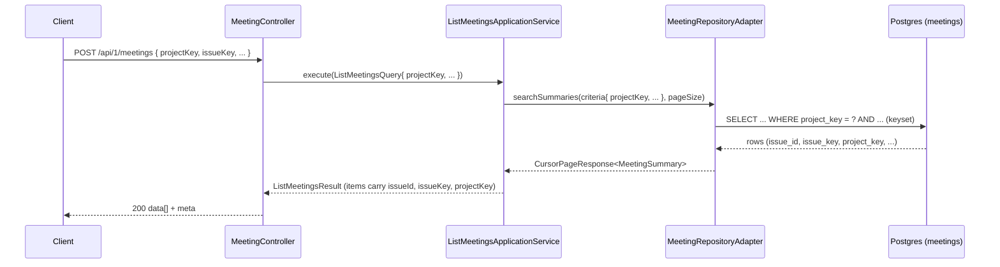

## Context

`POST /api/1/meetings` (capability `list-tenant-meetings`) already supports
`creatorId`, `search`, `statuses`, `issueKey`, and `sort` filters with keyset
pagination. The `meetings` table already persists `issue_id`, `issue_key`, and
`project_key` (all `VARCHAR(64) NOT NULL`), and the `JiraIssueLink` value object
carries all three. However, the list request cannot filter by project, and the
meeting summary projection exposes only `issueKey` — not `issueId` or
`projectKey`. The Forge app's `listProjectMeetings` is a stub that throws
because no backend project-wide filter exists yet.

This change adds a `projectKey` filter to the request and returns the full Jira
linkage (`issueId`, `issueKey`, `projectKey`) on every summary item. It is
confined to the `meet` service; no schema migration is required because the
columns already exist.

## Goals / Non-Goals

**Goals:**

- Accept an optional `projectKey` filter on the list request, alongside the
  existing `issueKey` filter.
- Return `issueId`, `issueKey`, and `projectKey` on every meeting summary item.
- Preserve existing filter, sort, and keyset-pagination behavior unchanged.

**Non-Goals:**

- Frontend wiring (`app/`), SDK regeneration, or replacing the
  `listProjectMeetings` stub.
- Per-project RBAC scoping of `view-meeting` (an existing backend gap, not
  addressed here).
- Extending free-text `search` to match `projectKey` (the project prefix is
  already contained in `issueKey`, which `search` already covers).
- Any database schema migration.

## Decisions

**Decision: `projectKey` uses exact, case-sensitive matching.** Mirrors the
existing `issueKeyIs` specification (`cb.equal`). Jira project keys are
uppercase by convention, so case normalization is unnecessary and would diverge
from the established `issueKey` filter. Alternative (case-insensitive
`lower(...)` match) rejected for inconsistency with `issueKey` and added query
cost.

**Decision: `projectKey` filter follows the `issueKey` null/blank guard.**
`searchSpecification` applies the predicate only when the value is non-null and
non-blank, identical to `issueKey`. Filters compose with logical AND, so
`projectKey` + `issueKey` naturally narrows (and yields an empty page on
conflict) with no special handling.

**Decision: `projectKey` is not validated for length on the request.** It is a
filter predicate, not persisted input; an over-long or unknown value simply
matches nothing. This matches the current treatment of `issueKey`, which carries
no `@Size` constraint on the request.

**Decision: `issueId` and `projectKey` are added as non-null response fields.**
Backed by `NOT NULL` columns, so they are always present. Threaded through
`MeetingSummary` (projection) → `ListMeetingsResult.Item` → `MeetingSummary`
response DTO, matching the existing pipeline for `issueKey`. Fields are grouped
in `issueId`, `issueKey`, `projectKey` order for readability.

**Decision: The keyset cursor is unaffected.** The opaque cursor encodes only
the sort field and keyset position, never filters. Adding a filter changes which
rows match but not cursor encoding or sort semantics, so no cursor-compatibility
concern arises.

## List flow (post-change)

## Risks / Trade-offs

- [Response shape grows with `issueId`/`projectKey`] → Purely additive fields;
  existing clients ignore unknown fields. The Forge mapper already reads
  `snapshot.projectKey` as a fallback, so it transparently upgrades to the real
  value.
- [OpenAPI snapshot / presentation tests may assert exact summary fields] →
  Regenerate `services/meet/openapi.yaml` via `generateOpenApiDocsFromTests` and
  update any field-level assertions in the same change.
- [Absence of per-project RBAC means `projectKey` is a filter, not a security
  boundary] → Explicitly out of scope and unchanged from today; documented so it
  is not mistaken for access control.
