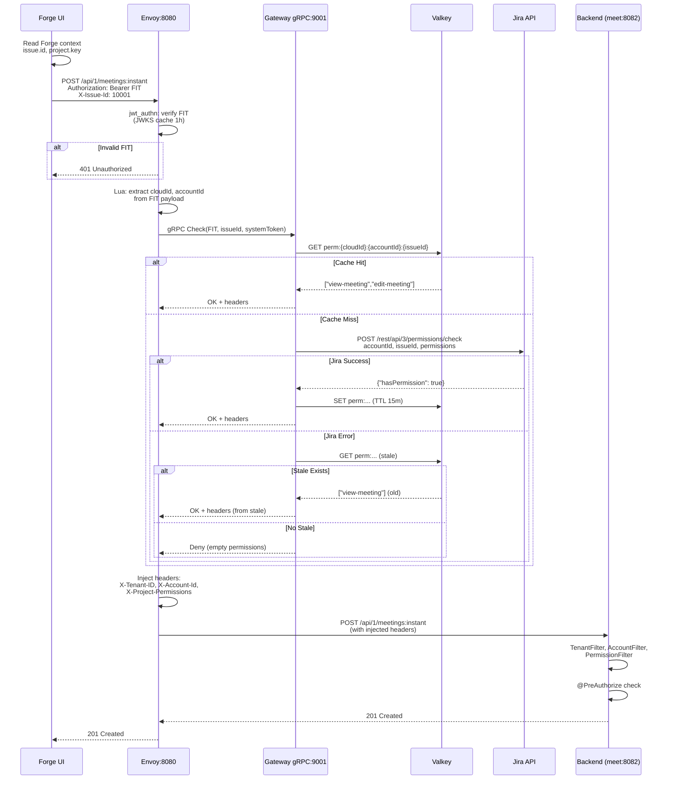

## Context

**Current State:**

- Backend services (tenant, meet, notification) expose REST APIs directly
- Services have `TenantFilter`, `AccountFilter`, `PermissionFilter` that read
  identity headers (`X-Tenant-ID`, `X-Account-Id`, `X-Project-Permissions`)
- `SecurityConfig` configured with `permitAll()` — services trust upstream to
  provide valid headers
- `@PreAuthorize("hasAuthority('edit-meeting')")` annotations on controllers
  enforce authorization
- Forge Custom UI calls backend via `forgeRemoteFetch.ts` with FIT (Forge
  Invocation Token) in `Authorization` header
- No component currently validates FIT signatures or checks Jira permissions

**Problem:** Without a gateway validating FIT and checking permissions, any
request with a valid FIT can access any resource. Backend services blindly trust
headers that could be spoofed.

**Constraints:**

- Backend services cannot change (trust model already implemented)
- Must use FIT provided by Forge (cannot switch to different auth)
- Custom Jira permissions (`view-meeting`, `edit-meeting`) defined in Forge app
  manifest
- Jira `permissions/check` API requires context (issueId or projectKey) to
  return accurate results
- AWS deployment planned (optimize for cold-start, memory)

**Stakeholders:**

- Backend services: consume identity/permission headers
- Forge UI: must provide issue/project context
- Gateway service: validates tokens, checks permissions, injects headers

## Goals / Non-Goals

**Goals:**

- Validate FIT signature via Atlassian JWKS before forwarding requests to
  backend
- Extract tenant (cloudId) and user (accountId) from FIT claims
- Check user's Jira project permissions on specific issues using
  `POST /rest/api/3/permissions/check`
- Cache permission results in Valkey for 15 minutes to reduce Jira API load
- Inject `X-Tenant-ID`, `X-Account-Id`, `X-Project-Permissions` headers that
  backend services trust
- Deploy as lightweight Go service optimized for AWS Lambda/Fargate
- Maintain <10ms p99 latency overhead for cached permission checks

**Non-Goals:**

- Kubernetes deployment (Docker Compose only)
- TLS/mTLS between gateway and backend services (trust local network)
- Permission refresh on Jira scheme changes (rely on cache TTL)
- Audit logging every permission decision (log errors only)
- Confused-deputy protection layer 2 in backend services (backend trusts gateway
  completely)
- HTTP/1.1 compatibility (gRPC requires HTTP/2)

## Decisions

### D1: Envoy Proxy as Gateway (not custom Go HTTP server)

**Decision:** Use Envoy with ext_authz filter calling Go authorization service.

**Rationale:**

- Envoy provides production-grade routing, retries, circuit breaking, metrics
  out of box
- JWT validation filter handles FIT signature verification natively (RS256 +
  JWKS fetch)
- ext_authz is standard pattern — Go service focuses only on permission logic
- Envoy HTTP cache filter for GET responses (free optimization)
- Widely deployed in production (Istio, Kong, AWS App Mesh use Envoy)

**Alternatives Considered:**

- Custom Go HTTP server doing everything: Would need to reimplement routing,
  retries, metrics, healthchecks — duplicate Envoy's work
- Spring Cloud Gateway: Requires JVM (~200MB memory, 1-3s cold-start) — not
  AWS-optimized
- Kong: Heavier than Envoy, Lua plugins harder to test than Go

### D2: gRPC ext_authz Protocol (not HTTP)

**Decision:** Go service implements `envoy.service.auth.v3.Authorization` gRPC
interface.

**Rationale:**

- Lower latency: Protobuf binary vs JSON (~30% faster serialization)
- HTTP/2 multiplexing: single connection for all auth checks
- Type safety: Go structs generated from `.proto` definitions
- Envoy native: gRPC ext_authz is the recommended approach in Envoy docs
- Production examples: Istio external authz, Ory Oathkeeper use gRPC

**Alternatives Considered:**

- HTTP ext_authz: Simpler (standard HTTP handlers), but adds 2-5ms per request
  due to JSON serialization
- Embedded Envoy WASM: More complex deployment, harder to debug, limited Go
  stdlib support

### D3: Go Language for Authorization Service (not Java/Node)

**Decision:** Write gateway service in Go.

**Rationale:**

- Cold-start: <50ms vs Java 1-3s, Node 200-500ms (critical for AWS Lambda)
- Memory: 20-50MB vs Java 200-400MB, Node 100-150MB (lower AWS cost)
- Single binary: no JVM or node_modules (~15MB binary vs 100-200MB fat jar)
- Ecosystem: `go-control-plane` provides official Envoy proto definitions
- Concurrency: goroutines handle high RPS with low overhead

**Alternatives Considered:**

- Java/Spring Boot: Reuse monorepo stack, but cold-start and memory unsuitable
  for AWS
- Node/TypeScript: Team familiar, but cold-start slower and memory higher than
  Go

**Trade-off:** Team must learn Go (if unfamiliar). Mitigated by: task is small
(HTTP client + Redis cache + gRPC server), extensive examples available.

### D4: Client Provides Context Headers (not server-side resolution)

**Decision:** Forge UI sends `X-Issue-Id` or `X-Project-Key` headers extracted
from Forge context.

**Rationale:**

- Forge context (`context.extension.issue.id`) is authoritative — UI has direct
  access
- Avoids gateway calling backend to resolve meetingId → issueId (extra hop)
- Simple implementation: add 2 lines to `forgeRemoteFetch.ts`
- Jira validates context: if client sends wrong issueId, Jira returns
  `hasPermission: false`

**Alternatives Considered:**

- Gateway queries backend for meetingId → issueId mapping: Adds latency, tight
  coupling, requires new backend endpoint
- Backend re-checks permissions: Correct for defense-in-depth, but out of scope
  (backend unchanged)

**Security consideration:** Client can lie about issueId, but gateway asks Jira
"does user have permission on _this_ issueId?" — Jira answers based on real
project permissions. If client sends issueId they don't have access to, Jira
denies. Confused-deputy attack (request resource A with context B) not fully
prevented at gateway level — requires backend validation (future work).

### D5: Jira `permissions/check` with App System Token (not user token)

**Decision:** Use `x-forge-oauth-system` (app system token) with `accountId`
parameter to check other user's permissions.

**Rationale:**

- Forge Remote apps can call `permissions/check` with system token (verified in
  community thread)
- No need for `appUserToken` or user impersonation
- System token stable (TTL ≥2h), better cache key than short-lived user tokens
- Only requires `read:jira-work` scope (app already has it)

**Alternatives Considered:**

- `mypermissions` with user token: Requires `appUserToken.enabled: true` + user
  session — more complex, token refresh logic

### D6: Valkey Cache with 15-Minute TTL and Stale-While-Error

**Decision:** Cache `(cloudId, accountId, issueId) → permissions[]` in Valkey
for 15 minutes. On Jira API failure, serve stale cache if available.

**Rationale:**

- 15 minutes matches Atlassian's recommended cache duration in Connect authz
  guide
- Jira permissions rarely change (project admin edits schemes infrequently)
- Expected cache hit ratio >90% for active issues
- Stale-while-error prevents cascading failures when Jira API is down

**Cache key design:**

```
perm:{cloudId}:{accountId}:{issueId} → ["view-meeting","edit-meeting"]
```

**Alternatives Considered:**

- 5-minute TTL: More accurate permissions, but 3x higher Jira API load
- No cache: Jira API rate limits would be hit immediately (hundreds of
  calls/minute)
- Per-project cache: Less accurate (user might have different permissions on
  different issues in same project)

### D7: FIT Validation in Envoy JWT Filter (not in Go service)

**Decision:** Envoy `jwt_authn` filter validates FIT signature, audience,
issuer. Go service receives validated token payload.

**Rationale:**

- Envoy jwt_authn is battle-tested (used in production by thousands of
  deployments)
- JWKS caching (1 hour) handled by Envoy
- Go service doesn't need JWT libraries — just parses claims from Envoy metadata
- Early rejection: invalid tokens never reach Go service (saves CPU)

**Configuration:**

```yaml
jwt_authn:
    providers:
        forge_fit:
            issuer: 'forge/invocation-token'
            audiences: ['ari:cloud:ecosystem::app/{appId}']
            remote_jwks:
                uri: https://forge.cdn.prod.atlassian-dev.net/.well-known/jwks.json
                cache_duration: 3600s
            payload_in_metadata: 'fit_payload'
```

**Alternatives Considered:**

- Validate in Go service: Duplicate work, need JWT library, manual JWKS cache
  management

### D8: Two Capabilities Split by Question Answered (not by component)

**Decision:** Model this change as exactly two capabilities —
`envoy-gateway-routing` and `permission-checking` — split by the question each
answers, not by which process or file implements it.

| Capability              | Question                                              | Owns                                                                                                                                                                                    |
| ----------------------- | ----------------------------------------------------- | --------------------------------------------------------------------------------------------------------------------------------------------------------------------------------------- |
| `envoy-gateway-routing` | _Is this a real Forge request, and where does it go?_ | Listener, FIT validation (signature/iss/aud/exp), JWKS cache, header stripping, ext_authz delegation, response cache, routing                                                           |
| `permission-checking`   | _What is this user allowed to do here?_               | Claim parsing, context resolution, Jira `permissions/check`, Valkey cache, allow/deny decision, identity header values, plus the Forge UI and manifest contracts that supply its inputs |

**Rationale:**

- The earlier nine-capability split fragmented one decision across many files:
  `identity-extraction`, `jira-permission-check`, `permission-caching`,
  `header-injection` and `grpc-ext-authz` were all steps of a single `Check()`
  call and could not be specified, tested or archived independently.
- The boundary is a real trust boundary. Everything in `envoy-gateway-routing`
  is _authentication and transport_ — it decides whether a request is genuine.
  Everything in `permission-checking` is _authorization_ — it decides what a
  genuine caller may do. These change for different reasons and at different
  rates.
- The Forge UI context headers and manifest `appSystemToken` are inputs to the
  permission decision, not independent features. Grouping them with the decision
  they feed keeps the contract legible: if the permission check changes shape,
  its client contracts are in the same spec.
- FIT validation lives with routing rather than with permissions because Envoy
  performs it, and because it gates _every_ request including ones that need no
  permission check.

**Alternatives Considered:**

- Split by component (`envoy-*` vs `gateway-go-*`): Mirrors the deployment
  topology, but topology is an implementation detail. Moving FIT validation into
  the Go service later would force a spec reshuffle for zero behavioural change.
- Keep nine capabilities: Maximum granularity, but `header-injection` had no
  meaning without `jira-permission-check` producing the values, and both were
  emitted by the same `CheckResponse`.
- Single capability: Would bury the authentication/authorization boundary, and
  make the routing rules unreadable inside a large permission spec.

**Note:** `forge-remote-integration` and `forge-manifest-auth` were previously
drafted as `## MODIFIED Requirements` against baseline capabilities that do not
exist in `openspec/specs/`. Folding them into `permission-checking` as `ADDED`
requirements corrects that — there is no prior baseline to modify.

## Architecture



## Component Details

### Envoy Configuration

**Filters (in order):**

1. `jwt_authn`: Validate FIT signature
2. `lua`: Extract claims (cloudId, accountId) from FIT payload
3. `ext_authz`: Call gateway gRPC service
4. `cache`: HTTP response cache (GET only)
5. `router`: Route to backend services

**Routes:**

- `/api/1/tenants*` → `tenant:8081`
- `/api/1/meetings*` → `meet:8082`
- `/api/1/notifications*` → `notification:8083`

### Gateway Go Service

**Structure:**

```
services/gateway/
├── cmd/gateway/main.go              # gRPC server
├── internal/
│   ├── authz/
│   │   ├── server.go                # Check() method
│   │   └── service.go               # Permission logic
│   ├── jira/
│   │   └── client.go                # POST /permissions/check
│   ├── cache/
│   │   └── redis.go                 # Valkey wrapper
│   └── config/
│       └── config.go                # Env config
```

**Dependencies:**

- `github.com/envoyproxy/go-control-plane` (Envoy proto definitions)
- `github.com/redis/go-redis/v9` (Valkey client)
- `google.golang.org/grpc` (gRPC server)

**Environment Variables:**

- `REDIS_ADDR`: Valkey address (default: `valkey:6379`)
- `REDIS_PASSWORD`: Valkey password (default: empty)
- `JIRA_API_BASE`: Jira API base URL (default: `https://api.atlassian.com`)
- `CACHE_TTL`: Permission cache TTL (default: `15m`)

### Forge UI Changes

**File:** `app/static/smiski-ui/src/api/forgeRemoteFetch.ts`

**Changes:**

```typescript
const context = await view.getContext();
const headers = Object.fromEntries(request.headers);

if (context.extension?.issue?.id) {
    headers['X-Issue-Id'] = context.extension.issue.id;
}
if (context.extension?.project?.key) {
    headers['X-Project-Key'] = context.extension.project.key;
}
```

### Forge Manifest Changes

**File:** `app/manifest.yml`

**Changes:**

```yaml
endpoint:
    - key: meet-endpoint
      remote: meet-backend
      route:
          path: /api/1/meetings:instant
      auth:
          appSystemToken:
              enabled: true # ← Enable system token
```

## Risks / Trade-offs

**[Risk: Single Point of Failure]**

- Envoy gateway failure blocks all requests
- **Mitigation:** Deploy multiple Envoy replicas (docker-compose scale),
  implement health checks, circuit breakers

**[Risk: Cache Staleness]**

- User loses permission in Jira, but cache still grants access for up to 15
  minutes
- **Mitigation:** Acceptable for MVP (admins can revoke access by disabling
  Forge app entirely). Future: implement cache invalidation webhook.

**[Risk: Confused Deputy Attack]**

- Client sends `X-Issue-Id: A` but requests meeting for issue B. Gateway checks
  permission on A, backend operates on B.
- **Mitigation:** Out of scope for gateway (backend unchanged). Future work:
  backend validates meeting.issueId matches header.

**[Risk: Jira API Rate Limits]**

- Cold cache (server restart) causes burst of Jira API calls
- **Mitigation:** Stale-while-error keeps serving cached data during
  revalidation. Jira rate limits are per-tenant, unlikely to hit with 15-minute
  cache.

**[Risk: FIT Audience Mismatch]**

- FIT audience is Forge app ID — changes if app is reinstalled or moved
  environments
- **Mitigation:** Make audience configurable in Envoy config, document in
  deployment guide.

**[Trade-off: No HTTP/1.1 Support]**

- gRPC requires HTTP/2, older clients incompatible
- **Mitigation:** Non-issue (Forge UI is modern browser, always supports HTTP/2)

**[Trade-off: Go Learning Curve]**

- Team unfamiliar with Go must learn basics
- **Mitigation:** Task is small (~500 lines), extensive examples from Envoy
  community, strong documentation.

**[Trade-off: CloudId Extraction Complexity]**

- FIT `app.apiBaseUrl` format is
  `https://api.atlassian.com/ex/{product}/{cloudId}` — parsing brittle
- **Mitigation:** Use URL path splitting (last segment), add unit tests for
  known formats, log warnings on parse failure.

## Migration Plan

### Phase 1: Local Development

1. Implement gateway Go service (gRPC server + permission logic)
2. Write unit tests (mock Jira client, Redis cache)
3. Configure Envoy with jwt_authn, lua, ext_authz
4. Update docker-compose.yaml (add envoy, gateway, valkey)
5. Update Forge manifest (enable appSystemToken)
6. Update Forge UI (inject context headers)
7. Test full flow locally: Forge UI → Envoy → Gateway → Backend

### Phase 2: Forge Deployment

1. Deploy updated Forge app: `forge deploy -e development`
2. Install with upgrade: `forge install --upgrade --site <site>`
3. Verify system token appears in request headers
4. Test permission checks from Jira UI

### Phase 3: Verification

1. Check gateway logs for FIT validation, cache hits/misses
2. Verify Valkey contains cached permissions
3. Test permission denial (user without access)
4. Load test with multiple concurrent users

### Rollback Strategy

If gateway fails:

1. Remove Envoy from docker-compose (direct backend access)
2. Revert Forge manifest changes, redeploy app
3. Backend services continue working (permissive `permitAll()`)

**Safe rollback window:** Gateway is additive — backend services don't depend on
it yet. Can rollback anytime before enforcing `SecurityConfig` changes.

## Open Questions

**Q1: How to handle anonymous users?**

- FIT always includes `principal` (accountId) — anonymous users not supported in
  Forge Remote
- Resolution: Not applicable for this use case

**Q2: Should we cache JWKS locally in gateway?**

- Envoy already caches JWKS for 1 hour
- Resolution: No additional cache needed

**Q3: What happens if multiple permissions exist with same name across
projects?**

- Custom permissions are app-scoped, not project-scoped (same key everywhere)
- Resolution: Not an issue, permissions are consistent across projects

**Q4: Should we implement retry logic for Jira API calls?**

- Yes, add exponential backoff (3 retries max)
- Resolution: Implement in `jira/client.go` using standard Go retry library
