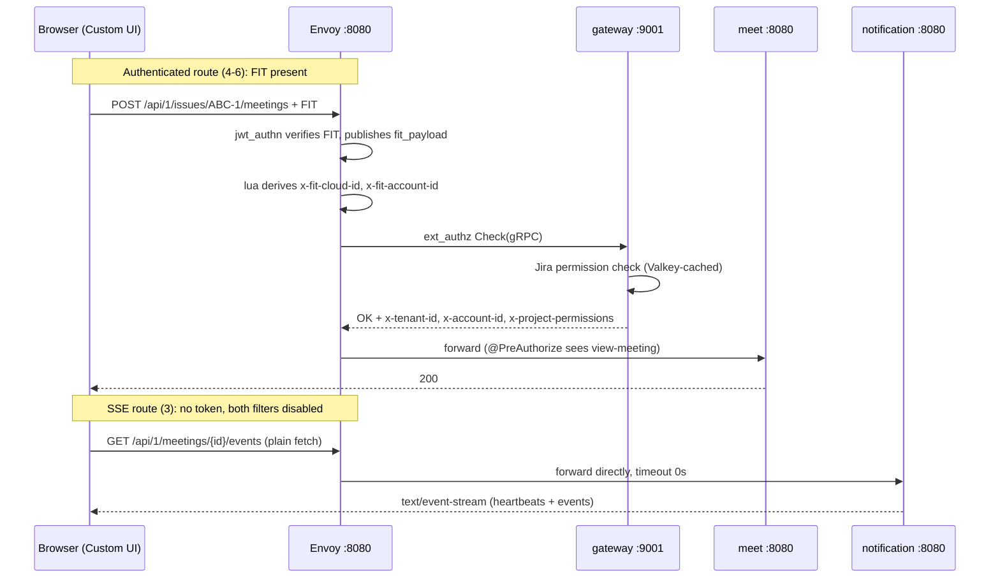

## Context

`services/docker/` contains only `envoy/envoy.yaml` and
`envoy/lua/extract_claims.lua`. The compose file, environment template, and
README were deleted in `2f57ec6abb26` when Caddy was replaced by Envoy, and the
`pnpm smiski` CLI that wrapped them was deleted in `63478870da25`. There is
currently no supported way to start the system locally.

The Envoy configuration was written but never exercised against a running stack.
Enumerating every `@*Mapping` annotation across the three Spring services and
diffing it against `envoy.yaml`'s three prefix routes shows the gateway cannot
serve the product's primary flows. Separately, `tenant` cannot start at all
under the default profile.

Current endpoint inventory, derived from controller annotations:

| Endpoint (after `/api/1`)                                                                                                                            | Owning service   |
| ---------------------------------------------------------------------------------------------------------------------------------------------------- | ---------------- |
| `/tenants`                                                                                                                                           | tenant           |
| `/meetings`, `/meetings:instant`, `/meetings:schedule`, `/meetings:batchDelete`                                                                      | meet             |
| `/meetings/{id}` and its `:cancel`, `:end`, `:join`, `/settings`, `/invitees**`, `/join-requests`, `/join-requests:accept`, `/join-requests:decline` | meet             |
| `/issues/{issueId}/meetings`                                                                                                                         | meet             |
| `/webhooks/livekit`                                                                                                                                  | meet             |
| `/meetings/{id}/events`                                                                                                                              | **notification** |
| `/meetings/{id}/join-requests/{requestId}/events`                                                                                                    | **notification** |
| `/webhooks/resend/inbound`                                                                                                                           | notification     |

Two `notification` endpoints sit under the `/meetings` path space that `meet`
also occupies. Prefix routing alone cannot separate them.

Constraints taken as fixed:

- `openspec/specs/api-convention/spec.md` mandates the global `/api/{version}`
  prefix and states framework endpoints such as Actuator stay unprefixed — so
  `/actuator/health` is reachable without the version prefix, and every
  `SecurityConfig` is `permitAll()`, making it usable for container health
  checks.
- No service overrides `server.port`; all three listen on `8080`.
- `envoy.yaml` resolves upstreams by `STRICT_DNS` hostname `tenant`, `meet`,
  `notification`, `gateway` — compose service names must match exactly.
- Java images are produced by `bootBuildImage` as
  `ghcr.io/smiskinext/<name>:<version>`; `.github/workflows/release.yml`
  publishes the same coordinates.

## Goals / Non-Goals

**Goals:**

- One command starts a complete, working local system reachable by the Forge app
  at `http://localhost:30000`.
- Every backend endpoint that exists in code is routable through the gateway to
  its owning service at the correct authentication level.
- `tenant` starts successfully.
- Local and CI images share a single build path.
- The environment variable contract is explicit, including which variables block
  startup when unset.
- Known gaps are documented in the repository rather than discovered at runtime.

**Non-Goals:**

- Authenticating the SSE streams. Deliberately deferred; see Decision 7.
- Proxying LiveKit through the gateway. WebRTC media cannot traverse an HTTP
  proxy; see Decision 4.
- Restoring the `pnpm smiski` CLI. Only the documentation that references it is
  corrected.
- A staging or production compose topology.
- Changing Java or Go source, the Forge app, `services/k8s/`, or
  `services/record/`.
- Adding Jira permission enforcement to backends, which `app/AGENTS.md` records
  as outstanding.

## Decisions

### Decision 1: Full-stack containers rather than infra-only

All eleven containers run under compose, including the three Spring services.

`envoy.yaml` already resolves upstreams by Docker service name on port `8080`.
An infra-only stack — services running natively via `bootRun` — would require
rewriting every cluster to `host.docker.internal` plus `extra_hosts`
declarations, diverging local configuration from the committed gateway
configuration. Running everything in containers means `envoy.yaml` needs no
host-specific edits, and its route table stays the single description of how
requests reach services.

The trade-off is a rebuild step for code changes. `application-dev.yaml` remains
untouched and functional for native runs against the same infrastructure, so
hot-reload development is still available; the container path is for verifying
the full request chain through the gateway.

Alternative considered: compose profiles offering both modes. Rejected for this
change — two topologies means two sets of routing assumptions to keep correct,
and the routing defects being fixed here originate precisely from configuration
that was never exercised.

### Decision 2: Three Postgres instances

Each service gets its own container: `tenant-postgres` (`8281`), `meet-postgres`
(`8282`), `notification-postgres` (`8283`).

`application.yaml` points all three at `localhost:5432` with distinct database
names, implying one shared instance, while `application-dev.yaml` points at
three distinct ports, implying separate instances. The files contradict each
other. Separate instances resolve the contradiction in the direction that
matches service isolation: each service owns its schema, migrates independently
via Flyway, and cannot reach another service's tables even accidentally. It also
mirrors `services/k8s/base/databases/`, which provisions one StatefulSet per
service.

Dev ports are normalised to match. `tenant`'s `8283` is corrected to `8281`:
`8283` was the deleted `chat-mongo` port, so the current value is a copy-paste
artifact that would collide with `notification-postgres`.

Alternative considered: one instance with an init script creating three
databases. Uses less memory, but keeps every service's credentials pointed at
one superuser instance and does not match either the k8s topology or the dev
profile.

### Decision 3: Images from `bootBuildImage`

Compose references `ghcr.io/smiskinext/<name>:${VERSION:-0.0.1-SNAPSHOT}`.
Developers run `./services/gradlew -p services/<name> bootBuildImage` first;
`AGENTS.md` documents the step.

This is the exact artifact CI publishes, so an image that works locally is the
image that ships. Hand-written Dockerfiles would introduce a second build path —
different base image, different JVM flags, different layering — and any
divergence between local and released images would surface only in production.
`bootBuildImage` is already configured centrally in
`build-logic/.../service.base.gradle.kts` with `BP_JVM_VERSION=25`.

The Go gateway keeps its existing `services/gateway/Dockerfile` and is built by
compose from source, matching how `release.yml` builds it.

Alternative considered: multi-stage Dockerfiles invoking Gradle inside the
container. Self-contained but re-downloads the dependency graph on each build,
and still diverges from CI.

### Decision 4: LiveKit published directly, not proxied

LiveKit's `7880` (HTTP/WebSocket), `7881` (ICE/TCP), and `7882` (ICE/UDP mux)
are published to the host. `meet` reaches signalling at `livekit-server:7880`
inside the network; browsers reach media directly.

LiveKit's port reference marks `7880` as belonging behind a load balancer but
`7881`, `7882`, and the `50000-60000` range as requiring direct exposure —
WebRTC media is not HTTP and cannot pass through an HTTP proxy. Proxying only
signalling would split transport across two ingress paths while media still
needs direct host ports, adding an Envoy WebSocket upgrade route and a second
LiveKit URL scheme for no local benefit.

Alternative considered: `/livekit*` → `livekit-server:7880` with
`upgrade_configs: [{upgrade_type: websocket}]`, restoring the deleted Caddy
behaviour (`LIVEKIT_WS_URL=ws://localhost:30000/livekit`). Technically sound and
closer to a production topology where LiveKit sits behind a load balancer, but
it does not remove the need for direct media ports. Recorded here so the
reasoning is available if a production compose topology is built later.

### Decision 5: Route ordering and match types in Envoy

Envoy evaluates `virtual_hosts[].routes` in order, first match wins. Because two
services share the `/meetings` path space, ordering carries correctness — not
merely efficiency.

| #   | Match                                                               | Cluster      | jwt_authn | ext_authz | timeout |
| --- | ------------------------------------------------------------------- | ------------ | --------- | --------- | ------- |
| 1   | `path: /api/1/webhooks/livekit`                                     | meet         | off       | off       | default |
| 2   | `path: /api/1/webhooks/resend/inbound`                              | notification | off       | off       | default |
| 3   | `safe_regex: ^/api/1/meetings/[^/]+(/join-requests/[^/]+)?/events$` | notification | off       | off       | `0s`    |
| 4   | `prefix: /api/1/issues`                                             | meet         | on        | on        | default |
| 5   | `prefix: /api/1/tenants`                                            | tenant       | on        | on        | default |
| 6   | `prefix: /api/1/meetings`                                           | meet         | on        | on        | default |

Exact `path` matches for webhooks prevent a prefix from unintentionally widening
the unauthenticated surface. The SSE entry uses `safe_regex` anchored with `$`
so only the two real stream paths match — a prefix such as
`/api/1/meetings/{id}/events` cannot be expressed, and an unanchored pattern
would capture unrelated paths. It precedes route 6 so streams reach
`notification`; placed after, `meet` would answer and return 404.

`prefix: /api/1/notifications` is removed. No controller declares that path.

### Decision 6: Per-route bypass must disable both filters

Routes 1–3 carry `typed_per_filter_config` disabling `jwt_authn` **and**
`ext_authz`.

`ext_authz` is declared under `http_filters`, so it executes for every route
regardless of `jwt_authn`'s own `rules`. The gateway denies any request lacking
an `Authorization` header (`server.go:48-50`), returning 401 before the upstream
is selected, and `failure_mode_allow: false` means there is no fallthrough.
Disabling only `jwt_authn` therefore leaves the route still failing — the single
most likely implementation error in this change.

The diagram shows why route 3 cannot simply reuse the authenticated path: no FIT
exists to verify, so `lua` produces no identity headers and `ext_authz` has
nothing to authorise.

### Decision 7: SSE served unauthenticated, scoped to local development

Routes 3 bypasses authentication entirely. This is a deliberate, bounded
acceptance of an access-control gap.

Forge offers no way to authenticate these streams today. `requestRemote`
documents "Response body streaming is not supported. The entire response must be
received before processing," so a stream cannot flow through the FIT-carrying
transport. `EventSource` cannot set an `Authorization` header. The frontend
consequently calls the gateway with a plain `fetch`
(`app/static/smiski-ui/src/api/sseClient.ts:57`), and no token is attached.

The exposure is concrete. `/meetings/{id}/join-requests/{requestId}/events`
delivers a LiveKit room token in its payload, identifiers are UUIDv7 and
therefore time-ordered and partially predictable, and
`MeetingEventsController.java:25-26` states host identity verification is the
gateway's responsibility — so opening the route removes the only check the
design relies on.

Containment: `AGENTS.md` carries an explicit warning, the specification records
the constraint as a requirement rather than an omission, and the stack is
declared local-development-only. Two closure paths were identified and are
deferred:

- Short-lived stream tickets. Client obtains a single-use JWT (~60s, bound to
  meeting and account) over `requestRemote`, then opens the stream with
  `?ticket=`. Envoy `jwt_authn` supports `from_params`, so the gateway can
  verify it. Requires a new backend endpoint and ticket issuance logic.
- Forge Realtime. `POST /forge/realtime/v1/publish` lets a remote backend
  publish and `realtime.subscribe()` lets the UI subscribe, with Atlassian
  handling authentication. Removes SSE from the gateway entirely, but requires
  rewriting `SseConnectionManager` and the UI join flow, depends on a UI-context
  invocation id, and is rate-limited.

The webhook routes are **not** debt. Each verifies its own signature — LiveKit
via `WebhookReceiver`, Resend via Svix inside `ProcessInboundEmailReplyUseCase`
— so bypassing gateway authentication removes no protection. External callers
can never present a FIT, making bypass the only workable configuration.

### Decision 8: Streaming timeouts

Route 3 sets `route.timeout: 0s`, disabling Envoy's 15-second default that would
otherwise terminate every stream mid-flight. `stream_idle_timeout` on the HTTP
connection manager is raised above the application's heartbeat interval
(`SSE_HEARTBEAT_INTERVAL_SECONDS`, default 15) and stream lifetime
(`SSE_HOST_STREAM_TIMEOUT_MS`, default 300000), so idle detection never fires
before the application closes the stream itself. Envoy streams response bodies
without buffering by default, so no buffering filter needs disabling.

### Decision 9: Startup ordering via health checks, with a documented gap

Spring services declare `depends_on` with `condition: service_healthy` on their
Postgres, Kafka, and Valkey dependencies.
`spring.jpa.hibernate.ddl-auto: validate` means a service fails at startup if
Flyway has not yet created the schema, so waiting for a merely-started database
is insufficient.

Datastore probes use a binary the image actually ships: `pg_isready` for
Postgres, `kafka-broker-api-versions.sh` for Kafka, `valkey-cli ping` for
Valkey, and `wget` against the LiveKit signalling port.

**Two container groups cannot express a probe, so none is declared for them.**
Compose requires `healthcheck.test` to begin with `CMD`, `CMD-SHELL`, or `NONE`,
so every probe is ultimately a command executed inside the image:

- The `gateway` image is `FROM scratch` (`services/gateway/Dockerfile:12`),
  containing only the binary and CA certificates. It exposes a gRPC health
  service (`internal/authz/health.go`), but nothing in the image can call it.
- The Spring images use Paketo's `ubuntu-noble-run-tiny` run image, which has no
  shell and neither `curl` nor `wget`, so `/actuator/health` is unreachable from
  inside the container even though the endpoint exists and is unauthenticated.

Declaring a probe anyway would produce a check that always fails, or one written
to always pass — worse than no probe, because it would misreport readiness. The
compensation is at the gateway: a `retry_policy` on
`connect-failure,refused-stream,unavailable` with three retries absorbs the
window where a container is listening but still initialising. Envoy retries only
failures where no response has begun, so a stream is never replayed.

Closing the gap requires adding a probe binary — `grpc-health-probe` for the
gateway, and a Paketo health-check buildpack or a fuller run image for the
Spring services. Both mean modifying build inputs outside this change's scope,
so the gap is documented in `../../../../services/docker/AGENTS.md` alongside
the fix.

Alternative considered: declaring `/actuator/health` probes anyway on the
assumption the run image includes `curl`. Rejected after verifying it does not —
`docker run --entrypoint /bin/sh` against the built image fails with
`stat /bin/sh: no such file or directory`.

### Decision 10: Kafka dual listener

Kafka runs KRaft single-node advertising `PLAINTEXT://kafka:9092` for containers
and `PLAINTEXT_HOST://localhost:9094` for the host.

`application.yaml` defaults to `9092` and `application-dev.yaml` hardcodes
`localhost:9094`. Both must keep working: containers use the default profile,
native runs use `dev`. A single listener would break one of them.

### Decision 11: `record` and recording configuration excluded

`record` is absent from `services/settings.gradle.kts` and no service consumes
`record.*` topics, so it is excluded from compose.

Its residue in `meet` is removed. The ten `app.livekit.recording.*` keys bind to
nothing: `LiveKitProperties` declares no `recording` component, no
`@ConfigurationProperties` prefix matches, and no `software.amazon`, `S3Client`,
or `Egress` reference exists under `services/meet/src`. `libs.aws.s3` in
`meet/build.gradle.kts:20` is likewise unused. Removing them means compose needs
no RustFS, no `livekit-egress`, and no bucket initialisation.

`meet`'s integration tests do not construct a Minio container, so removal cannot
affect the test suite.

## Risks / Trade-offs

**[Unauthenticated SSE routes exposing LiveKit room tokens]** → Local-only scope
declared in the specification and `AGENTS.md`; identifiers are UUIDv7 and
partially predictable, so this must not reach a network-reachable environment.
Two closure paths are documented in Decision 7 and tracked as follow-up.

**[Rewriting `envoy.yaml` could break routes that currently work]** →
`/api/1/tenants` and `/api/1/meetings` already function; both are preserved with
unchanged match semantics and only reordered relative to new, more specific
entries. Validation runs `envoy --mode validate` before the stack starts, and
verification exercises one endpoint per route.

**[Per-route filter bypass applied to only one of the two filters]** → Called
out as Decision 6 because the failure is silent: the route looks configured but
returns 401 from the gateway rather than from `jwt_authn`. Verification asserts
a `200`/`text/event-stream` response on an SSE path, which cannot pass if either
filter remains active.

**[Regex route unintentionally widening the unauthenticated surface]** → The
pattern is anchored at both ends and constrains identifier segments to `[^/]+`,
so it cannot match nested or sibling paths. Only the two known stream paths
match.

**[Removing recording configuration breaks something undetected]** → Removal is
justified by four independent negative checks (no properties class component, no
`@Value`, no AWS SDK import, no egress client).
`./services/gradlew -p services/meet build` runs unit, ArchUnit, and integration
suites as the gate.

**[`tenant` gaining `app.cursor.secret` masks a design question]** → `tenant`
has no cursor-paginated endpoint; the bean exists only because the service scans
`io.github.smiskinext.shared`. Supplying the property is the minimal fix that
makes the service start. Whether `CursorEncoder` should be conditional on the
property is a separate concern, not addressed here.

**[Resource footprint of eleven containers]** → Three Postgres instances plus
Kafka, Valkey, LiveKit, and LiveKit's Redis is heavier than an infra-only stack.
Accepted: `application-dev.yaml` remains valid, so a lighter native workflow is
still available for day-to-day coding.

**[LiveKit requires a real host LAN IP]** → ICE candidates cannot advertise
loopback under rootless Docker. The variable has no default and `.env.example`
documents it as required, so the failure is explicit at startup rather than
manifesting as media that never connects.

**[Images must be built before starting]** → Compose does not build Java images.
`AGENTS.md` documents the `bootBuildImage` step, and a missing image fails
immediately with a clear pull error rather than degrading at runtime.
