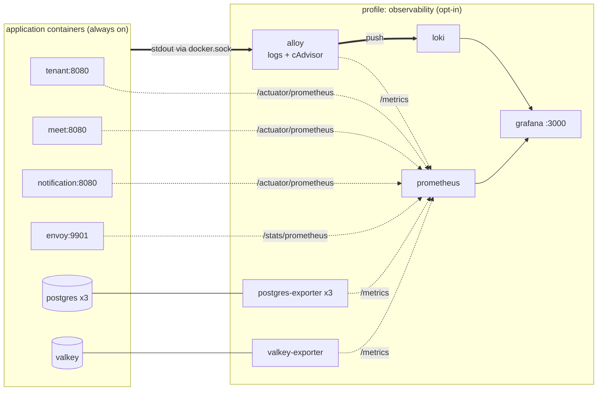

## Context

The local stack defined in `services/docker/compose.yaml` runs twelve
containers. None of them can be observed beyond `docker compose logs`. Three
facts about the current state constrain the design.

**Actuator is present but inert.** `service.base.gradle.kts` puts
`spring-boot-starter-actuator` on the classpath of all three Java services, yet
no `application.yaml` contains a `management` block and no metrics registry is
on the classpath. Inspecting the AOT output confirms what this means in
practice:

```text
services/tenant/build/generated/aotSources/.../actuate/
  HealthEndpointConfiguration__BeanDefinitions.java     present
  WebEndpointAutoConfiguration__BeanDefinitions.java    present
  PrometheusScrapeEndpoint*                             absent
```

Compose starts every Java service with `-Dspring.aot.enabled=true`. Spring AOT
evaluates `@Conditional` at build time, and `PrometheusScrapeEndpoint` is gated
by `@ConditionalOnAvailableEndpoint`, which reads
`management.endpoints.web.exposure.include`. The endpoint therefore cannot be
enabled by any runtime environment variable — the configuration must be compiled
in and the image rebuilt. The repository already documents this class of trap
for `CacheConfig` in `.env.example`.

**Logs are unstructured under the profiles compose uses.**
`services/shared/src/main/resources/log4j2-spring.xml` has exactly two branches:

| Branch                    | Layout                                  |
| ------------------------- | --------------------------------------- |
| `local \| default \| dev` | `PatternLayout` — plain text            |
| `k8s`                     | `JsonTemplateLayout` → `EcsLayout.json` |

Compose sets no `SPRING_PROFILES_ACTIVE`, so all three services fall to
`default` and emit plain text. There is no fallback branch: a profile matching
neither expression attaches no appender and produces no log output at all.

**The Kubernetes PLG stack does not transfer.** `services/k8s/plg/` is
Helm-values-only, contains no Prometheus despite `deploy.en.md:128` naming one,
and is built on Promtail, which reached end of life on 2 March 2026.

Constraints taken as fixed:

- Compose service names are load-bearing; `envoy.yaml` resolves upstreams by
  `STRICT_DNS` hostname. New containers must not collide with existing names.
- `openspec/specs/api-convention/spec.md` already states that framework
  endpoints such as Actuator stay unprefixed, and every `SecurityConfig` is
  `permitAll()`. `/actuator/prometheus` is therefore reachable without further
  security work.
- All three services listen on `8080`; none overrides `server.port`.
- Java images come from `bootBuildImage`; compose does not build them.
- The stack is documented as local-development-only.

Every component version and configuration below was executed against a real
container before being recorded. Findings are cited inline.

## Goals / Non-Goals

**Goals:**

- Logs from every container queryable in one place, filterable by service and
  severity.
- Runtime metrics from the three Java services, Envoy, Postgres, Valkey, and
  per-container CPU/memory.
- Default `docker compose up -d` behaviour byte-for-byte unchanged — same
  containers, same resource cost.
- Every new configuration format validatable offline, matching the existing
  practice in `services/docker/AGENTS.md`.
- A single command to enable observability, with no editing of compose files.

**Non-Goals:**

- Kafka broker metrics. `apache/kafka:4.1.0` ships no JMX exporter — verified by
  listing `/opt/kafka/libs`, which contains no `jmx_prometheus` artifact.
- Metrics for the Go `gateway`. It contains no instrumentation; adding it is a
  code change in another language.
- Distributed tracing (Tempo, OpenTelemetry collector).
- Alerting rules, notification channels, or custom dashboards.
- Migrating `services/k8s/plg/` off Promtail.
- Log retention tuning for long-term storage. Loki keeps 7 days locally.

## Decisions

### D1 — Grafana Alloy instead of Promtail

Promtail reached EOL on 2 March 2026 (LTS ended 28 February 2026); Grafana
directs all users to Alloy. Adopting Promtail now would ship a dead dependency
on day one.

Alloy also collapses two containers into one: `loki.source.docker` collects logs
and `prometheus.exporter.cadvisor` produces per-container resource metrics in
the same process. This matters because the standalone cAdvisor image has
inconsistent tags — `v0.60.5`, `v0.54.0`, and `v0.53.0` all fail
`docker manifest inspect`, while `v0.55.1` and `v0.52.1` succeed. Depending on
it would mean pinning an arbitrary older tag.

_Alternatives considered._ The Loki Docker driver plugin requires a host-level
`docker plugin install`, which cannot be expressed in compose and would break
the single-command contract. Fluent Bit is capable but adds a second
configuration language for no gain here.

### D2 — Opt-in via compose profiles, not a separate compose file

Services carrying `profiles: [observability]` are excluded from `up` unless the
profile is named. Verified:

```text
docker compose config --services                       → (empty)
COMPOSE_PROFILES=obs docker compose config --services  → a
```

This keeps one topology in one file. The alternative — a second
`compose.observability.yaml` — requires operators to remember two `-f` flags and
lets the two files drift apart. The alternative of enabling it by default was
rejected on cost: roughly 800 MB of RAM for a stack a developer may be running
only to exercise one endpoint.

It also matches existing repository practice: `k8s/helm/install-plg.sh` already
prompts for confirmation and describes monitoring as "OPTIONAL — disabled by
default in dev."

### D3 — Spring Boot's `StructuredLogLayout`, not `JsonTemplateLayout`

Spring Boot 4.1 ships its own log4j2 structured-logging layout. Verified inside
`spring-boot-4.1.0.jar`:

```text
org/springframework/boot/logging/log4j2/StructuredLogLayout.class
org/springframework/boot/logging/log4j2/ElasticCommonSchemaStructuredLogFormatter.class
META-INF/.../Log4j2Plugins.dat → "structuredloglayout", "springprofile"
```

It is Environment-aware: it resolves `service.name` from
`spring.application.name` and honours `logging.structured.json.*` properties for
adding or renaming fields. The `JsonTemplateLayout` used by the `k8s` branch is
a plain log4j feature that knows nothing about Spring and would need those
fields wired manually.

The existing `k8s` branch is left untouched. Changing it is unrelated to this
change and would alter production log output.

### D4 — A new `docker` profile rather than reusing `k8s`

Reusing `k8s` would misname the environment and couple local logging to any
future Kubernetes-specific configuration.

The AOT risk of adding a profile was assessed directly. Spring documents the
boundary:

> Profiles which only change configuration properties that don't influence
> conditions are supported without limitations.

Grepping the repository for `@Profile` returns nothing. The only
condition-bearing annotations are `@ConditionalOnProperty` in `CacheConfig`,
`RedisConfig` (meet, notification), and `OutboxAutoConfiguration`, all reading
properties supplied by environment variables that are identical whichever
profile is active. The `docker` profile therefore changes no bean.

The branch and the `SPRING_PROFILES_ACTIVE=docker` variable must land in the
same change: a profile with no matching branch silently produces zero log
output.

### D5 — Prometheus pull, and what it scrapes

Prometheus scrapes rather than receives, so services need no knowledge of it.
Envoy's Prometheus endpoint was confirmed by running the pinned image and
issuing a request:

```text
GET :9901/stats/prometheus → 200
# TYPE envoy_cluster_manager_cluster_added counter
```

Scrape targets:

| Job               | Target                                          | Path                   |
| ----------------- | ----------------------------------------------- | ---------------------- |
| `spring-services` | `tenant:8080`, `meet:8080`, `notification:8080` | `/actuator/prometheus` |
| `envoy`           | `envoy:9901`                                    | `/stats/prometheus`    |
| `postgres`        | three exporters                                 | `/metrics`             |
| `valkey`          | `valkey-exporter:9121`                          | `/metrics`             |
| `alloy`           | `alloy:12345`                                   | `/metrics`             |

**Amended during implementation — one exception to the pull model.** Alloy's
cAdvisor exporter runs in-process and exposes no port, so its series cannot be
scraped and are pushed to Prometheus instead, which requires
`--web.enable-remote-write-receiver`. Every target in the table above remains
pulled, so the application services stay unaware of Prometheus — the property
the pull model exists to protect. The container-resource series are the sole
exception, and `prometheus.yml` therefore declares no cadvisor job.

Endpoint exposure is restricted to `health,prometheus`. Actuator defaults to
exposing only `health`; widening it to `*` would publish `/actuator/env` and
`/actuator/configprops`, which carry datasource credentials and secrets, on a
`permitAll()` filter chain.

Metrics are served on the main port rather than a separate
`management.server.port`. A separate port would require the AOT build to produce
a second management context and give Envoy a second upstream to model, for no
benefit on an internal-only network.

### D6 — Configuration lives in files, validated offline

Each new format has an offline validator, extending the pattern already in
`services/docker/AGENTS.md`. All three were run against the exact configuration
this change introduces:

| Format           | Command                           | Result    |
| ---------------- | --------------------------------- | --------- |
| `prometheus.yml` | `promtool check config`           | SUCCESS   |
| `config.alloy`   | `alloy validate`                  | exit 0    |
| `loki.yaml`      | started, pushed and queried a log | see below |

Loki `3.7.4` was run with the exact configuration in this change: `/ready`
returned `ready` after 18 s, a push returned `204`, and a `query_range` returned
the entry with its labels intact. No deprecation warnings appeared.

**Amended during implementation — Loki declares no healthcheck.** The image is
distroless: its only executable is `/usr/bin/loki`, with no shell and no
`wget`/`curl`, so no `CMD`/`CMD-SHELL` probe can reach `/ready` and no
`start_period` applies. A `loki -version` probe was measured and rejected — it
reports healthy at 4 s while `/ready` still returns `Ingester not ready`, which
asserts a readiness that does not hold. Dependants therefore wait on
`service_started`, matching how `gateway` is already handled in this file for
the same reason. Readiness is observed from the host instead, and is
load-dependent: measured between 16 s and 45 s across runs.

A `compactor` block is also required. Without it the 7-day retention is
configured but never enforced.

### D7 — Alloy reads the Docker socket

`loki.source.docker` discovers containers through `/var/run/docker.sock`,
mounted read-only. This was the highest-risk assumption in the design, so it was
tested rather than assumed. Running Alloy `v1.18.0` with only the socket
mounted:

```text
loki.write.w          healthy   started component
discovery.docker.d    healthy   started component
loki.source.docker.s  healthy   component evaluated
```

No permission errors. The socket is `root:docker`-owned and Alloy runs as root
inside its container.

Read-only is a real but bounded exposure — the Docker API grants broad authority
even read-only. It is acceptable because the stack is already declared
local-only, the mount is opt-in behind the profile, and the alternative (a
logging driver configured per service) hardcodes the Loki endpoint into every
service definition and breaks when Loki is absent.

Container names become the `service_name` label via a `discovery.relabel` rule
stripping Docker's leading `/`.

**Amended during implementation — the socket alone is not sufficient.** The
in-process cAdvisor exporter attributes usage to a container by joining two host
sources: the kernel's cgroup accounting supplies the numbers, and Docker's own
state supplies the names. Measured against a running stack, with four containers
up:

| Mounts                                        | series | named |
| --------------------------------------------- | ------ | ----- |
| socket only                                   | 1      | 0     |
| socket + `/sys/fs/cgroup`                     | 87     | 0     |
| socket + `/sys/fs/cgroup` + `/var/lib/docker` | 89     | 4     |
| socket + `/sys` + `/rootfs`                   | 89     | 4     |

The last two rows are equivalent. An earlier revision of this design mounted the
entire host root as `/rootfs`, having compared only against `/sys` and concluded
the host root was required. It is not: the only part of it cAdvisor reads is
`/var/lib/docker`. The narrower pair is what ships, reducing the exposure from
every file on the host to cgroup accounting plus Docker's own state.

Neither mount needs write access and no `privileged` flag is involved. Both host
paths are interpolated — `CADVISOR_CGROUP_ROOT` and `CADVISOR_DOCKER_ROOT` — for
hosts that place them elsewhere. The container-side path of the Docker root
cannot move: `prometheus.exporter.cadvisor` exposes no `docker_root` attribute,
confirmed by `alloy validate` rejecting it as unrecognised.

Under Docker Desktop on Windows and macOS the daemon runs inside a VM and
neither path exists on the host. The exporter cannot be wired there; the rest of
the profile is unaffected, and the limitation is documented in `AGENTS.md`.

The exporter also copies every Docker image label onto every series it emits.
Rather than relabelling them away afterwards, `store_container_labels = false`
stops them being produced — verified to leave exactly `name`, `image`, `id`,
`instance`, and `job`, with zero `container_label_*` keys remaining.

### D8 — Component versions

Every tag was resolved with `docker manifest inspect` before being written here.

| Component         | Version          | Note                             |
| ----------------- | ---------------- | -------------------------------- |
| Loki              | `3.7.4`          | latest release, 2026-07-24       |
| Grafana Alloy     | `v1.18.0`        | latest release, 2026-07-20       |
| Prometheus        | `v3.13.2`        | latest v3 patch                  |
| Grafana           | `12.4.6`         | latest stable                    |
| postgres-exporter | `v0.20.1`        | prometheuscommunity              |
| redis_exporter    | `v1.88.0-alpine` | Valkey speaks the Redis protocol |

Tags are pinned rather than floating on `latest`, consistent with every existing
service in the compose file.

### D9 — Host port allocation

Chosen to avoid the documented map in `services/docker/AGENTS.md` and confirmed
free on the development host.

| Port    | Component  |
| ------- | ---------- |
| `3000`  | Grafana    |
| `9090`  | Prometheus |
| `3100`  | Loki       |
| `12345` | Alloy UI   |

The exporters are not published; only Prometheus needs to reach them, and it
does so on the internal network.

## Architecture



Solid lines carry log data; dotted lines are Prometheus scrapes.

## Risks / Trade-offs

**AOT rejects the new profile at context startup** → Assessed as unlikely: no
`@Profile` exists in the repository and the `@ConditionalOnProperty` usages read
profile-invariant environment variables. Spring documents property-only profiles
as supported under AOT. If a failure occurs, the documented remedy is to make
the AOT build agree with runtime:

```kotlin
tasks.withType<org.springframework.boot.gradle.tasks.aot.ProcessAot>()
    .configureEach { args("--spring.profiles.active=docker") }
```

Because this cannot be proven without building an image, verification of a
running container is a required task, not an optional one.

**Logs disappear entirely** → `log4j2-spring.xml` has no fallback branch, so a
`docker` profile with no matching branch attaches no appender. Mitigated by
landing the branch and the environment variable together, and by an explicit
verification step asserting the first log line parses as JSON.

**Operator runs stale images and sees no metrics** → Nothing fails loudly; the
scrape target simply reports down. Mitigated by documenting the rebuild
requirement in `AGENTS.md` next to the opt-in command, and by Prometheus's own
target-health page making the condition visible.

**Docker socket exposure** → Read-only mount, opt-in behind the profile, stack
already local-only. Accepted; see D7.

**Resource cost** → About 800 MB RAM and eight extra containers. Entirely
avoided by the default profile being off.

**Config drift between the docker and k8s observability stacks** → They will
diverge: one uses Alloy, the other EOL Promtail. Accepted and recorded as debt
in the proposal; converging them is follow-up work.

## Migration Plan

1. Add the dependency and `management` blocks; rebuild the three images with
   `bootBuildImage`.
2. Add the `docker` logging branch and set `SPRING_PROFILES_ACTIVE` in compose.
3. Add the observability services and configuration files.
4. Validate offline: `docker compose config` with and without the profile,
   `promtool check config`, `alloy validate`.
5. Start the default profile and confirm the container set is unchanged from
   today.
6. Start with `--profile observability` and confirm each Prometheus target is
   up, logs arrive in Loki as parsed JSON, and both Grafana datasources answer.

**Rollback**: omitting `--profile observability` disables the entire stack with
no file changes. Fully reverting the service-side changes requires rebuilding
the images from the previous commit.

## Open Questions

None. Every technical uncertainty raised during exploration — Promtail's status,
Alloy's socket access, Loki's configuration schema, Envoy's metrics path,
Kafka's exporter availability, the AOT constraint, and the availability of every
image tag — was resolved by direct verification before this document was
written.
