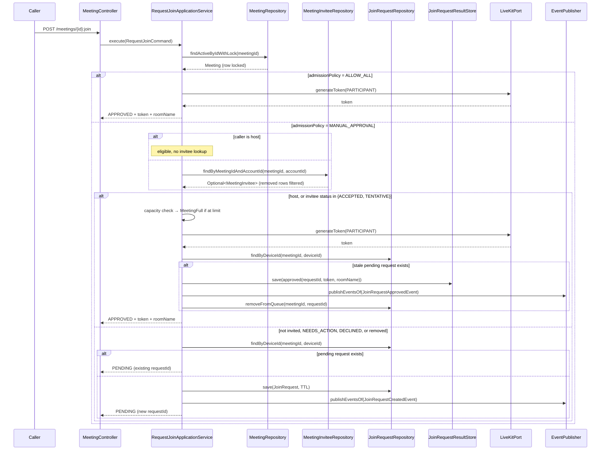

## Context

`RequestJoinApplicationService.execute` branches solely on
`meeting.getSettings().admissionPolicy()`: `ALLOW_ALL` goes to
`admitImmediately`, everything else goes to `createPendingRequest`. It never
consults `meeting_invitees`, so a `MANUAL_APPROVAL` meeting queues every caller
without exception.

Two consequences observed in the current codebase:

1. An invitee who already replied `ACCEPTED` (via the RSVP endpoints or via an
   inbound email reply) must still ask the host for permission — the host's own
   invitation carries no weight at admission time.
2. The Forge app has no separate "start meeting" endpoint; `useStartMeeting`
   (`app/static/smiski-ui/src/hooks/useMeetingMutations.ts:119`) calls the same
   `:join` operation. On a `MANUAL_APPROVAL` meeting the host therefore creates
   a pending request for themselves and must approve it before entering.

Everything needed already exists and is reused rather than reinvented:

| Need                                                    | Existing artifact                                                                                        |
| ------------------------------------------------------- | -------------------------------------------------------------------------------------------------------- |
| Invitee lookup by account, tenant- and removal-filtered | `MeetingInviteeRepository#findByMeetingIdAndAccountId` → `findByMeetingIdAndAccountIdAndRemovedAtIsNull` |
| RSVP status                                             | `InviteeStatus` (`NEEDS_ACTION`, `ACCEPTED`, `DECLINED`, `TENTATIVE`)                                    |
| Host identity                                           | `Meeting#getHostId`                                                                                      |
| Token minting for a participant                         | `admitImmediately` in the same service                                                                   |
| Terminal outcome replay for late SSE subscribers        | `JoinRequestResultStore`                                                                                 |
| Approval transition + queue removal + event             | `AcceptJoinRequestsApplicationService:149-158`                                                           |

Per `openspec/specs/api-convention/spec.md` the HTTP contract is unchanged: the
response already carries a `status` discriminator (`APPROVED` / `PENDING`) and
bypassing callers reuse the existing `APPROVED` representation. Per
`openspec/specs/db-schema/spec.md` no schema work is required — the change only
reads `meeting_invitees` and writes to existing Redis structures.

## Goals / Non-Goals

**Goals:**

- Admit the meeting host immediately on a `MANUAL_APPROVAL` meeting.
- Admit an active invitee whose RSVP status is `ACCEPTED` or `TENTATIVE`
  immediately, regardless of whether the response arrived via the REST RSVP
  endpoints or via inbound email reply.
- Leave a bypassing caller's pre-existing same-device pending request in a
  consistent terminal state so the host queue holds no stale entry and an
  already-open requester SSE stream resolves.
- Preserve capacity enforcement identically to the existing immediate-admission
  path.
- Change no HTTP contract, no database schema, and no `AdmissionPolicy` value.

**Non-Goals:**

- Reconciling a pending request created from a different device (see Risks).
- Issuing a `HOST`-role LiveKit token to the host of a scheduled meeting; the
  join path hardcodes `ParticipantRole.PARTICIPANT` and correcting it touches
  `ParticipantGrants` and `LiveKitAdapter`.
- Introducing a new `AdmissionPolicy` value such as `INVITED_ONLY`.
- Altering the host's manual accept/decline endpoints or the invitee RSVP
  endpoints.

## Decisions

### 1. Bypass eligibility: host, or active invitee in `ACCEPTED` / `TENTATIVE`

`TENTATIVE` is included alongside `ACCEPTED`: both represent an invitee who has
actively engaged with the invitation, and RFC 5545 treats `TENTATIVE` as a
positive-intent `PARTSTAT`. `NEEDS_ACTION` is excluded because silence is not
consent. `DECLINED` is excluded and, being terminal in
`InviteeStatus#canTransitionTo`, can never later become eligible — a caller who
declined and changes their mind goes through the host.

Removed invitees are excluded automatically: the repository method filters
`removed_at IS NULL`, so a soft-removed invitee is indistinguishable from a
non-invitee at this decision point. That is the desired outcome and requires no
extra branch.

_Alternatives considered:_ `ACCEPTED` only — rejected as too narrow, since
`TENTATIVE` invitees are expected attendees the host already vetted. Any
non-`DECLINED` invitee — rejected because it silently voids `MANUAL_APPROVAL`
for the entire invitee list, including people who never responded.

### 2. Eligibility lives in an `application/helper` collaborator

The decision needs both the `Meeting` aggregate (host identity) and the
`MeetingInvitee` aggregate (RSVP status), so it belongs to neither one. Placing
it in `application/helper/` follows the precedent set by
`InviteeResponseSupport`, which sits there for the same cross-aggregate reason.
The helper is a pure function over already-loaded state, keeping
`RequestJoinApplicationService` readable and the rule unit-testable in
isolation.

_Alternatives considered:_ a method on `Meeting` — rejected, `Meeting` does not
own invitees and would have to accept a foreign aggregate as a parameter. A
domain service in `domain/` — rejected as heavier than the single predicate
warrants, given the existing helper precedent.

### 3. Invitee lookup happens only on the `MANUAL_APPROVAL` path

`ALLOW_ALL` admits unconditionally, so an invitee lookup there would be a wasted
query on the hottest join path. The lookup is also skipped when the caller is
the host, since host identity alone settles eligibility.

### 4. Reconcile a same-device pending request by approving it

When a bypassing caller has a pending request for the same device, the request
is driven to its natural terminal state rather than being ignored or silently
deleted. The sequence mirrors `AcceptJoinRequestsApplicationService` exactly:
`JoinRequest#approve()` → `JoinRequestResultStore#save(approved(...))` →
`JoinRequest#registerApprovedEvent(...)` → publish → `removeFromQueue`.

This yields three properties at once: the host's pending queue self-cleans, a
requester tab already waiting on SSE receives the token instead of hanging until
TTL, and no new mechanism is introduced.

The token in the reconciliation result is the same token returned in the HTTP
response, so both delivery channels are consistent. `approvedBy` carries the
joining caller's own account id because no host action occurred;
`JoinResolvedEventConsumer` reads only `joinRequestId`, `liveKitToken`, and
`roomName`, so this value has no notification side effect.

_Alternatives considered:_ ignore the stale request — rejected, it leaves the
host queue polluted with someone already in the room. Delete it without an event
— rejected, the requester's open SSE stream would never resolve.

Ordering note: the token must be minted before the request is transitioned, so a
LiveKit failure leaves the pending request untouched and the caller can retry.

### 5. Capacity is enforced before any bypass admission

The existing `admitImmediately` capacity guard (`activeCount >= limit` →
`MeetingFull`) applies to bypassing callers too, under the same pessimistic
meeting-row lock already taken by `findActiveByIdWithLock`. A host or invitee is
not exempt from the room's participant limit, which matches today's behavior for
a host joining a full `ALLOW_ALL` meeting.

### 6. Persisted RSVP status is the single source of truth

Both `AcceptMeetingInviteeApplicationService` (REST) and
`ApplyEmailInviteeResponseApplicationService` (inbound email) write the same
`meeting_invitees.status` column via `MeetingInvitee#accept`. Reading that
column therefore makes the two response channels equivalent with no
channel-specific logic — which is precisely what the "accept via email"
requirement needs.

### Admission flow

## Risks / Trade-offs

**A pending request from a different device is not reconciled** → Accepted
limitation, not a regression. `JoinRequestRepository` offers only
`findByDeviceId`; adding account-based reconciliation would require a new Redis
index and a new port method. The stale request expires on its existing TTL and
the host may still act on it harmlessly, exactly as today. Documented as a
non-goal so it is a deliberate boundary rather than an oversight.

**`MANUAL_APPROVAL` becomes weaker for invited attendees** → Intended, and
scoped to people the host explicitly invited _and_ who explicitly responded.
Hosts who want to screen even accepted invitees are not served by this change;
if that need appears, the extension point is a new `AdmissionPolicy` value,
which `AdmissionPolicy`'s own doc comment already anticipates.

**Extra query on the `MANUAL_APPROVAL` join path** → One indexed lookup on
`(tenant_id, meeting_id, account_id)`, skipped entirely for hosts and for
`ALLOW_ALL`. The path already performs a locking meeting read and a Redis
round-trip, so the marginal cost is negligible.

**A `JoinRequestApprovedEvent` is now emitted without host action** → The
event's `approvedBy` names the joining caller rather than an approving host.
Verified safe: `JoinResolvedEventConsumer:88-91` ignores that field. Any future
consumer that attributes the approval to a human must tolerate self-approval.

**Broader test-double surface** → `RequestJoinApplicationService` grows from
five to seven constructor dependencies, breaking the existing unit test's
constructor call. Mechanical and caught at compile time; the integration test
seeds real `meeting_invitees` rows so the behavior is verified against the
actual removal and tenant filters rather than mock assumptions.
