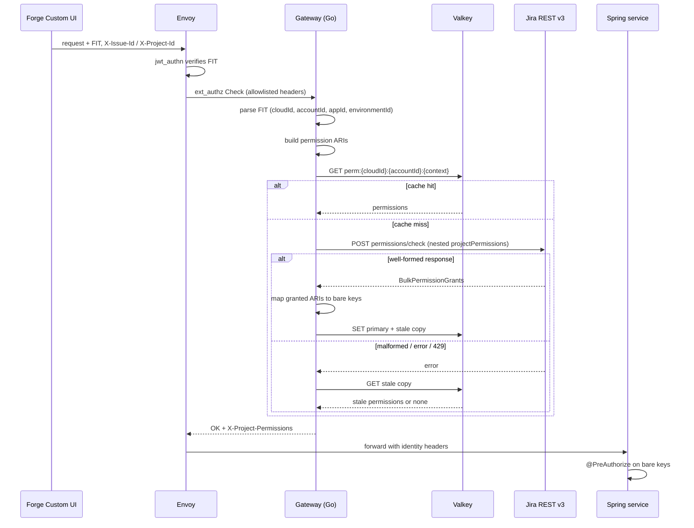

## Context

The Go authorization gateway (`services/gateway/`) sits between Envoy and the
Spring services. Envoy's `ext_authz` filter calls its gRPC `Check` method, which
resolves the caller's Jira project permissions and returns them to Envoy as the
`X-Project-Permissions` header. The Spring services bind that header to Spring
Security authorities and enforce `@PreAuthorize("hasAuthority('view-meeting'))`
and `edit-meeting` on `MeetingController`.

The gateway's Jira integration was written against a permission-check contract
that does not exist. Verified against Atlassian's published OpenAPI document
(`dac-static.atlassian.com/cloud/jira/platform/swagger-v3.v3.json`):

| Gateway assumption                                   | Actual Jira v3 schema                                                                          |
| ---------------------------------------------------- | ---------------------------------------------------------------------------------------------- |
| Request: flat `permissions`, `issueId`, `projectKey` | `accountId`, `globalPermissions[]`, `projectPermissions[]` only, `additionalProperties: false` |
| Response: `[{key, hasPermission}]`                   | `globalPermissions: [string]`, `projectPermissions: [{permission, issues, projects}]`          |
| Grant signalled by `hasPermission: true`             | No `hasPermission` field exists — presence signals the grant                                   |
| Context ids as strings                               | `issues` and `projects` are `int64`                                                            |
| Permission key `view-meeting`                        | `ari:cloud:ecosystem::extension/[appId]/[envId]/static/view-meeting`                           |

The response mismatch is the primary defect and it is silent. Go's decoder drops
unknown fields, so every `PermissionCheckResult` decodes as
`{Key: "", HasPermission: false}`, `extractGrantedPermissions` returns `nil`,
and the error is `nil`. `AuthzService.Authorize` therefore caches and returns an
empty permission set on a successful call, producing 403 on every authenticated
route while reporting success in the logs.

Existing tests do not catch this because `client_test.go` builds its `httptest`
fixtures from the same incorrect structs. The suite validates the gateway
against a mock of its own misunderstanding.
`openspec/specs/permission-checking/spec.md` documents the same incorrect
shapes, which is the upstream source of the defect.

## Goals / Non-Goals

**Goals:**

- Make the gateway's request and response conform exactly to the Jira Cloud v3
  permission-check contract.
- Eliminate the silent-failure mode: a structurally invalid Jira response must
  be an error, never an empty permission set.
- Replace `X-Project-Key` with `X-Project-Id`, since Jira accepts numeric
  project IDs and the Forge context already supplies `project.id`.
- Send correctly qualified custom permission ARIs so Jira does not reject the
  request.
- Correct `openspec/specs/permission-checking/spec.md`, the source that
  propagated the wrong contract.
- Replace the test fixtures so they fail against a wrong contract.

**Non-Goals:**

- Restoring end-to-end authorization. The `x-forge-oauth-system` token never
  reaches the gateway under `requestRemote`, and the frontend does not inject
  context headers. Tracked separately; this change is a prerequisite, not a
  complete fix.
- Changing the `X-Project-Permissions` contract or any downstream Spring
  service.
- Changing Envoy routing, JWT verification, or the caching topology.

## Decisions

### D1: Model the request as the documented nested shape

`BulkPermissionsRequestBean` sets `additionalProperties: false` and
`BulkProjectPermissions` requires `permissions`. The gateway will send a single
`projectPermissions` entry containing the permission ARIs plus exactly one of
`issues` or `projects`.

_Alternative rejected:_ keeping flat fields and relying on Jira ignoring extras.
The schema forbids it, and Jira returns `400`.

### D2: Treat presence in the response as the grant

`BulkProjectPermissionGrants` has no `hasPermission` field. Jira returns only
permissions the user holds, with `issues` / `projects` narrowed to those the
grant covers. Extraction collects `permission` from each entry, plus the
`globalPermissions` strings.

Because the response is filtered rather than exhaustive, the gateway must map
the returned ARIs back to bare manifest keys (`view-meeting`, `edit-meeting`)
before emitting `X-Project-Permissions`. The Spring services match on the bare
keys, and that contract is unchanged.

_Alternative rejected:_ inferring the grant from a non-existent boolean — the
current defect.

### D3: Distinguish "no permissions" from "malformed response"

`BulkPermissionGrants` marks both `globalPermissions` and `projectPermissions`
as required. A response missing either is malformed and must be surfaced as an
error so the stale-cache fallback engages. A well-formed response with empty
arrays is a legitimate "no permissions" answer and is cached as such.

Go cannot distinguish an absent JSON array from an empty one with a plain slice,
so decoding uses `*[]T` pointers (or an equivalent presence check) to detect
absence. This is the specific mechanism that converts today's silent failure
into a loud one.

The extracted permission set is built as an empty slice rather than a `nil` one.
`json.Marshal` renders a `nil` slice as `null`, which the cache decodes back to
`nil`, and the cache-hit condition treats `nil` as a miss — so a no-permission
user would re-query Jira on every request, defeating the caching this decision
exists to preserve.

_Alternative rejected:_ treating any empty result as failure. That would disable
caching for users who genuinely hold no permissions and hammer the Jira API.

### D4: Build the permission ARI from FIT claims

The permission key format is
`ari:cloud:ecosystem::extension/[App ID]/[Environment ID]/static/[key]`. Both
components are available in the FIT, so no extra Jira call is needed.

The FIT carries `app.id` as `ari:cloud:ecosystem::app/<appUuid>` and
`app.environment.id` as an environment ARI. Atlassian's own documentation is
internally inconsistent about the environment ARI: the property table shows
`ari:...::environment/<uuid>` (one UUID) while the full example payload shows
`ari:...::environment/<appUuid>/<envUuid>` (two). Taking the **last
slash-separated segment** yields the environment UUID under both shapes, so
extraction uses the trailing segment rather than a fixed positional index.

`Claims.App` gains an `Environment` struct to read `app.environment.id`. When
either component is absent, the gateway fails with an explicit missing-claims
error rather than emitting a malformed ARI.

_Alternative rejected (and explicitly chosen against by the user):_ resolving
keys via `GET /rest/api/3/permissions` and matching on `name`, as
`app/static/smiski-ui/src/api/meetingPermission.ts` does. That avoids depending
on ARI internals but costs an extra call. **Accepted trade-off:** D4 depends on
an ARI structure Atlassian does not guarantee. If Jira changes the format, the
gateway will receive `400 Unrecognized permission`. D6 ensures that failure is
loud and diagnosable, and the name-resolution approach remains the fallback.

### D5: Numeric context identifiers

`issues` and `projects` are `int64`. `X-Issue-Id` is already numeric.
`X-Project-Key` is replaced by `X-Project-Id`; the Forge context exposes
`project.id` (`App.tsx` `IssuePanelExtension` / `ProjectPageExtension`), so no
key-to-id lookup is required. A value that fails to parse as `int64` is a client
error and the context is rejected rather than silently dropped.

The Envoy `ext_authz` allowlist must gain `x-project-id`; headers absent from
that list never reach the gateway.

### D6: Surface Jira rejections distinctly

A `400` whose body names an unrecognised permission indicates a malformed ARI —
a deployment or format defect, not a permission denial. It is logged distinctly
from an ordinary denial so the D4 trade-off is diagnosable from logs alone.

The message is emitted through an injectable `logf` hook on the client, in the
same manner as the `wait` hook in D7. Because D6 is the mitigation that makes
D4's accepted risk tolerable, the behaviour is pinned from both sides: a test
asserts the distinct message carries the rejected identifier, and a second
asserts an ordinary `400` does not emit it.

### D7: Honour `Retry-After`

The current backoff is `attempt² × 100ms`, totalling roughly 1.4s across three
retries, and ignores `Retry-After`. When Jira returns `429` with that header,
the gateway waits the greater of the backoff and the advertised interval.

The wait belongs in the `CheckPermissions` retry loop, not in `doRequest`.
`doRequest` runs under a 2s per-attempt timeout, so a wait placed there is
truncated to that budget and a `Retry-After: 60` becomes a near-immediate retry.
Placing it in the loop bounds it by the caller's context instead, so the
interval is honoured in full or the retry is abandoned and the stale-cache
fallback engages. The delay is applied through an injectable hook so tests
assert the requested interval without sleeping for it.

Asserting the interval alone does not pin the scoping, since a stub that
discards the context cannot observe which context it was given. A separate test
therefore asserts the context arriving at the hook is the caller's, by marker
value and by deadline, so re-scoping the wait to the per-attempt timeout turns
it red.

### Authorization flow

## Risks / Trade-offs

- **ARI format is not a guaranteed contract (D4)** → Extraction uses the
  trailing segment so both documented shapes work; `400 Unrecognized permission`
  is logged distinctly (D6); name-based resolution remains the documented
  fallback.
- **`X-Project-Key` → `X-Project-Id` is breaking** → The header appears only in
  `permission-checking`; no other spec or service references it. The frontend
  does not send either header today, so nothing regresses in practice, and the
  frontend work lands with the separate transport change.
- **Correct code still yields 403 end-to-end** → The system token remains absent
  until the transport change ships. Called out in the proposal so the change is
  not mistaken for a full restoration; the silent failure is nonetheless
  removed.
- **Stricter parsing could reject responses Jira actually sends** → Only the two
  fields Atlassian marks required are enforced; unknown extra fields stay
  ignored, per the spec's forward-compatibility scenario.
- **`Retry-After` could exceed the request budget** → The wait is bounded by the
  caller's context deadline rather than the per-attempt timeout, so an
  advertised interval is either honoured in full or the retry is abandoned in
  favour of the stale cache; it is never silently truncated to the per-attempt
  budget.
- **Tests encoding the wrong schema masked this once** → Response fixtures are
  raw JSON literals taken from the published Atlassian examples, never
  marshalled from the response structs, because a fixture built from the same
  struct the client decodes cancels out tag errors instead of catching them. The
  outgoing request body is asserted on the wire as a decoded key set, since
  assertions on Go struct fields are invariant to the tags that determine the
  actual bytes.
