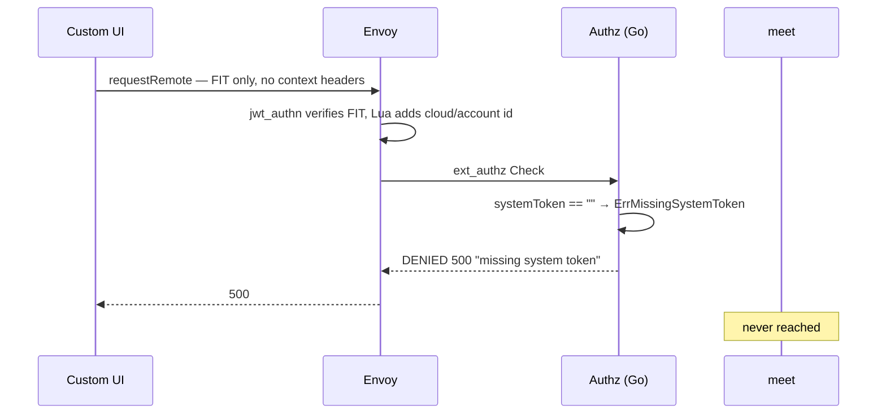
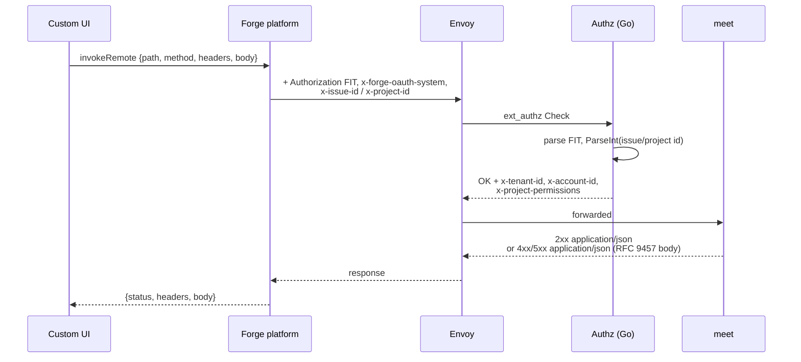

## Context

The Custom UI reaches the `meet` backend through Forge Remote. Today the
transport is `requestRemote`, chosen for latency: it goes browser → gateway
directly and attaches only the Forge Invocation Token (FIT). Atlassian documents
that it "will not include OAuth tokens, even if configured for the remote".

The Envoy gateway front-ends the backend with a three-stage pipeline —
`jwt_authn` verifies the FIT, a Lua filter derives `x-fit-cloud-id` /
`x-fit-account-id` from the claims, and `ext_authz` calls the Go authorization
service over gRPC. That service needs two inputs the app does not currently
provide:

1. `x-forge-oauth-system`, without which `checkJiraPermissions` returns
   `ErrMissingSystemToken` and the request is denied with HTTP 500
   (`services/gateway/internal/authz/service.go:165`,
   `internal/authz/server.go:69`).
2. `x-issue-id` or `x-project-id`. When both are absent, `Authorize` logs "No
   context headers present" and returns an empty permission set
   (`service.go:88-91`). Envoy already allowlists both header names, and the Lua
   filter does not strip them, so the path is open — the app simply never sends
   them.

An empty permission set propagates as an empty `X-Project-Permissions` header,
which `PermissionFilter` binds to an empty authority set, so every
`@PreAuthorize("hasAuthority('view-meeting'|'edit-meeting')")` guard in
`MeetingController` (21 endpoints) rejects with 403.

`openspec/specs/permission-checking/spec.md:782-930` already specifies both the
context headers and `appSystemToken`. The implementation never followed, so this
is spec drift being closed, not new ground.

### Current failure path

### Target path

## Goals / Non-Goals

**Goals:**

- Deliver `x-forge-oauth-system` to the gateway so the Jira permission check
  executes instead of failing closed.
- Send `x-issue-id` / `x-project-id` on every backend call, from all four
  surfaces (issue panel, project page, and the three platform-modal roots).
- Preserve the generated-SDK integration: `@smiskinext/smiski-ts` keeps its
  typing, URL building, and zod validation; only the injected transport changes.
- Preserve error fidelity end to end — `code`, `traceId`, `status`, and `detail`
  must still reach `toMeetingProblem` (`api/meetings.ts:318`).

**Non-Goals:**

- Migrating the SSE streams. Forge Remote buffers response bodies and cannot
  carry `text/event-stream`; `sseClient.ts` and `meetingEvents.ts` stay on raw
  `fetch`, and `external.fetch.client` keeps `- remote: meet-backend`.
- Changing LiveKit signalling or the `requestJira` Jira-native calls.
- Enabling `appUserToken`; the gateway reads only the system token.
- Introducing a Forge resolver function. The app remains resolver-free; only a
  `resolver.endpoint` reference is added, which requires no code.
- Correcting the two pre-existing `permission-checking` drifts (endpoints for
  tenant/notification that the manifest lacks; `${SMISKI_API_BASE_URL}` in
  `baseUrl`, which Forge's server-side egress check rejects).

## Decisions

### D1: `invokeRemote` over keeping `requestRemote`

`requestRemote` cannot carry OAuth tokens by design. The alternatives were to
have the gateway stop requiring the system token — rejected because it would
remove the Jira permission check that `project-permission-enforcement` depends
on — or to add a Forge function to proxy calls, rejected because it introduces a
resolver hop the architecture has deliberately avoided and adds latency without
solving anything `invokeRemote` does not already solve.

Accepted cost: calls are proxied through Atlassian, so latency rises and each
call is a metered invocation.

### D2: Keep the `fetch`-shaped adapter, reconstruct a `Response`

The SDK client resolves its transport as
`options.fetch ?? _config.fetch ?? globalThis.fetch` and calls it with a single
`Request`, then reads `response.ok`, `response.status`,
`response.headers.get('Content-Type')`, and `response.text()`
(`sdks/typescript/src/generated/client/client.gen.ts:100-200`). `invokeRemote`
resolves to `{ status, headers, body }` instead.

Rather than rewriting all 15 SDK call sites, the adapter converts the result
back into a `Response`. This confines the change to one file and keeps zod
validation and error mapping working unchanged.

Three contract differences must be absorbed:

| Concern | `requestRemote`        | `invokeRemote`                       | Adapter behavior                                           |
| ------- | ---------------------- | ------------------------------------ | ---------------------------------------------------------- |
| Target  | `(remoteKey, options)` | resolver endpoint of the module      | Drop `MEET_REMOTE_KEY`                                     |
| Body    | pre-stringified text   | object, Forge calls `JSON.stringify` | Parse SDK text back to an object; omit when empty          |
| Result  | WHATWG `Response`      | `{status, headers, body}`            | Rebuild a `Response` with `Content-Type: application/json` |

The SDK's own `parseAs: 'json'` branch reads `response.text()` and parses it, so
the adapter serializes `body` back to text when constructing the `Response`.

### D3: Error responses become `application/json`

`invokeRemote` rejects a non-2xx response whose `content-type` is set to
anything other than `application/json`, surfacing
`Invalid response from remote - content-type header must be set to application/json`
and discarding the body. All backend errors are `application/problem+json` today
— 120 entries in `services/meet/openapi.yaml`. Without this change every error
message degrades to a platform string and `code` / `traceId` are lost, which
would regress the `ui-backend-interaction` error-handling requirement.

Alternatives considered:

- Rewrite the media type in an Envoy Lua response filter. Rejected as chosen by
  the user; it also only covers the compose stack, since `services/k8s` fronts
  the services with Kong, so the behavior would diverge per environment.
- Accept the degraded errors. Rejected: it loses `traceId`, which is the only
  handle support has for correlating a user report to a request.

The RFC 9457 body shape is unchanged — `type`, `title`, `status`, `detail`,
`code`, `traceId`, and the `errors` array for validation failures all remain, as
does `Accept-Language` localization and the `type` URI derivation. Only the
media type differs, so `api-convention` needs a targeted amendment rather than a
rewrite of its Problem Details requirement.

Because the writers live in `services/shared`, `tenant`, `meet`, and
`notification` change together and cannot drift apart.

### D4: `resolver.endpoint` on both UI modules

`invokeRemote` takes no remote key; it resolves through the invoking module's
`resolver.endpoint`. Atlassian's frontend guide states the chain explicitly: "UI
module → endpoint → remote". The existing `endpoint: meet-endpoint` and
`remotes: meet-backend` entries stay as they are; only the two module
definitions gain the reference.

This is a breaking manifest change: editing `endpoint` entries triggers a major
version upgrade, so `forge deploy` must be followed by `forge install --upgrade`
and administrators re-consent.

### D5: Context identifiers threaded through modal payloads

The gateway parses both identifiers with `strconv.ParseInt`
(`service.go:146-158`), so a non-numeric value produces
`invalid context identifier` and a 403. Jira keys such as `SMISKI-101` are
therefore unusable, as is the synthetic `project-${key}` fallback that
`api/mappers.ts:113` builds for domain objects.

`App.tsx` already receives `extension.issue.id` but discards
`extension.project?.id` (line 157). The three modal roots run in separate
iframes whose `context.extension` carries the modal payload, so they cannot rely
on the panel's context being present. The identifiers are therefore added to the
modal context payloads alongside the `issueKey` / `projectKey` already carried,
and each surface publishes them to a small module-scoped store the adapter reads
when composing headers.

Alternatives considered: re-reading `view.getContext()` inside each modal root —
rejected because a modal iframe is not guaranteed to expose the originating
issue or project, and the failure mode is a silent 403 only reproducible on a
real site. Passing the context explicitly to all 15 SDK call sites — rejected as
a wide, easy-to-miss change.

Headers are omitted when an identifier is unknown, matching the existing
"Project without an identifier omits the header" scenario. Where the project
identifier is missing but the key is known, it is resolved once via
`requestJira GET /rest/api/3/project/{key}`.

### D6: Defensive handling of the bridge pre-release

The installed `@forge/bridge` is `6.1.0-next.8`. Its
`out/invoke-endpoint/invoke-endpoint.js` returns
`{ ...(success ? payload : error) }` — an object — where the published
documentation describes a rejected promise carrying
`Remote could not verify the Forge Invocation Token` and similar messages. The
adapter treats both shapes as failures so behavior does not depend on which form
ships.

## Risks / Trade-offs

- **Added latency from proxying** → `invokeRemote` allows 25s with no retries,
  well above the 15s per-route timeout Envoy already enforces, so the gateway
  remains the binding constraint. The SSE streams, which are the latency-
  sensitive path, are unaffected.
- **Backend calls become metered invocations** → The bridge rate-limits at 500
  calls per 25s. The only poller, `usePendingJoinRequests`, runs at 60s with
  `refetchIntervalInBackground: false`, leaving ample headroom.
- **Media-type change is cross-cutting** → Roughly 75 assertions across ~20 test
  files assert the old value, and `services/*/openapi.yaml` must be regenerated
  with `pnpm run openapi`. The compiler and test suite surface every site, and
  the body shape is untouched, so consumers parsing the body are unaffected.
- **Non-2xx responses must carry a parseable JSON body** → `invokeRemote`
  reports `cannot parse body as JSON` when a non-2xx response has no body.
  Backend errors always carry a Problem Details body, but gateway-generated
  denials must too; `buildDeniedResponse` already writes a JSON body with
  `content-type: application/json` (`server.go:119-148`), so this holds.
- **204 responses** → `ResultResponder.noContent` returns an empty 204. That is
  a 2xx, for which `invokeRemote` requires no body, and the SDK's
  `status === 204` branch yields `{}` before any parsing. No change needed.
- **Major version bump forces re-consent** → Unavoidable for
  `resolver.endpoint`. Sequenced explicitly in the migration plan below.
- **Local `vite dev` has no bridge** → `getCallBridge()` throws outside the
  Forge iframe, the same as today with `requestRemote`. `AGENTS.md` already
  documents that standalone dev cannot create or list meetings.

## Migration Plan

1. Land the backend media-type change with its tests and regenerated OpenAPI
   specs. The app still runs on `requestRemote` at this point and is unaffected,
   because the SDK reads the body without asserting the media type.
2. Land the app transport change, the context headers, and the manifest edit
   together — the app cannot function with a partial application of these three.
3. Deploy: `pnpm run deploy`, then `pnpm exec forge install --upgrade`. A tunnel
   restart does not apply manifest changes.
4. Verify against a real site: confirm gateway logs show `hasSystemToken=true`
   with a populated `issueID` or `projectID`, and that a permission-denied
   response still surfaces its `code` and `traceId` in the UI.

**Rollback:** revert the app commit and redeploy. The backend media-type change
is independently revertible and is backward compatible with `requestRemote`, so
the two commits can be rolled back separately in either order.

## Open Questions

None blocking. One item to confirm during step 4: whether `context.extension`
inside a platform-modal iframe exposes the originating issue or project. The
design does not depend on it — identifiers are passed through the modal payload
precisely so this is not load-bearing — but if the context is present it would
permit a simpler follow-up.
