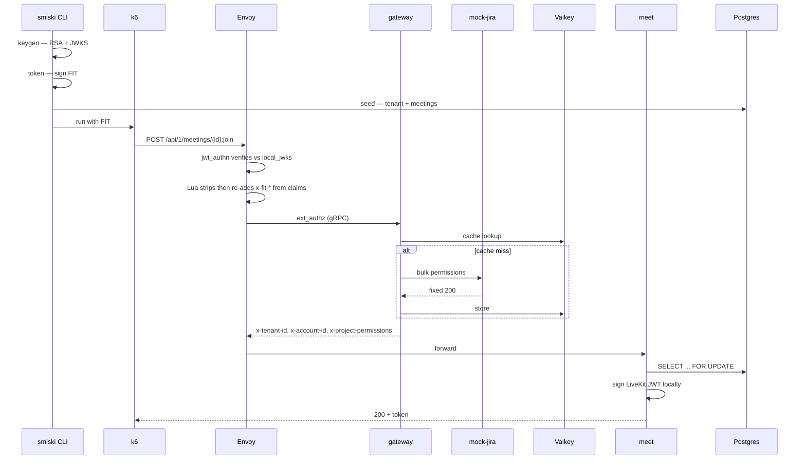
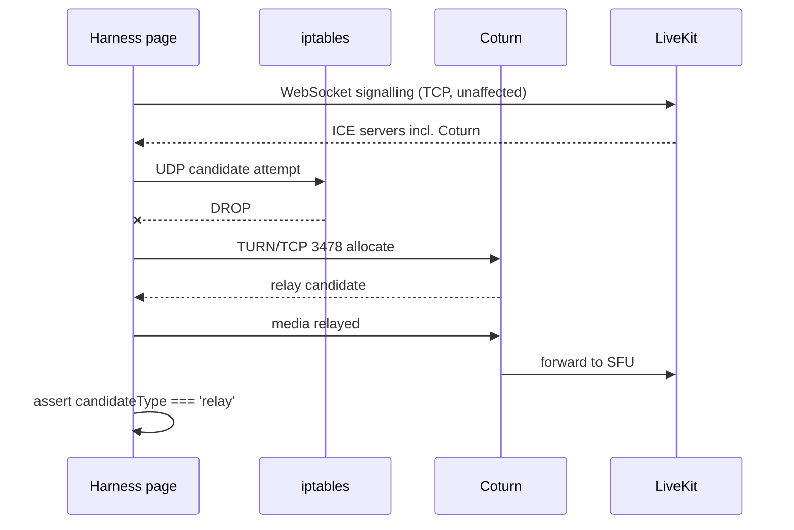

## Context

The `add-webrtc-load-test-harness` proposal requires empirical evidence for five
test cases (TC-01 … TC-05) with fixed numeric thresholds. The repository has no
measurement tooling and, more importantly, several properties that make naive
measurement produce misleading numbers.

Current state relevant to this design:

- `services/docker/` holds the dev stack: three Spring services behind Envoy, a
  Go authorization gateway, Postgres per service, Kafka, Valkey, LiveKit and a
  separate `livekit-redis`, plus an opt-in `observability` profile carrying
  Prometheus, Grafana, Loki and Alloy. It MUST NOT be modified.
- `services/test/` currently holds a byte-identical copy of that directory.
- `scripts/` declares a `smiski` CLI binary at `./src/index.ts` that does not
  exist; the toolchain (`citty`, `zx`, `tsx`, `biome`) is already installed.
- Authentication is terminated entirely at Envoy. Backend services read
  `X-Tenant-ID`, `X-Account-Id` and `X-Project-Permissions` as plain headers and
  perform no verification of their own.

Constraints:

- No modification to `services/docker/`, to any Java source, to the Go gateway,
  or to the Forge app.
- Host tooling must stay minimal — the machine has `tc` and `iptables` but no
  `lk`, `k6` or browser automation.
- Full automation is not required; combining scripted and manual steps is
  explicitly acceptable.

This design does not introduce or alter any HTTP endpoint, so
`openspec/specs/api-convention/spec.md` imposes no constraints beyond the
existing `/api/1/...` shape the harness calls. It introduces no schema change,
so `openspec/specs/db-schema/spec.md` is likewise unaffected; the seeding
command writes rows through the existing baseline schema and respects the
documented `tenants → meetings` foreign key and hash-partitioning conventions.

## Goals / Non-Goals

**Goals:**

- Produce reproducible, defensible evidence for TC-01 … TC-05 against the real
  request path, including the Envoy authentication chain.
- Keep the test stack automatically in sync with the dev stack so it cannot
  drift.
- Make the effect of the known pessimistic row lock visible rather than letting
  it silently distort TC-04.
- Emit machine-readable artifacts (CSV) suitable for direct inclusion in a
  written report.
- Fix the broken `bin.smiski` declaration as a by-product of building the CLI.

**Non-Goals:**

- Measuring against LiveKit Cloud or any hosted environment.
- Automating screen-share publication — verified impossible with `lk load-test`.
- Testing real Jira integration; the gateway's Jira dependency is mocked.
- Production-grade security for the test stack. It is local-only by construction
  and deliberately accepts locally signed tokens.
- Modifying application behavior to make tests easier to pass.

## Decisions

### D1. Test stack composes the dev stack rather than copying it

`services/test/compose.yaml` declares `name: smiski-test` and
`include: ../docker/compose.yaml`, then patches only what differs using
`!override`.

Verified experimentally: `include:` merges correctly, `!override` replaces list
values rather than appending, bind-mount paths resolve relative to the included
file, a top-level `configs:` entry can be wholly redefined by the including
file, and a distinct `name:` causes every volume and network to be prefixed
separately.

_Alternatives considered._ Keeping the copy was rejected because two 510-line
compose files plus duplicated Envoy and observability assets guarantee drift. A
minimal hand-written stack was rejected because dropping Kafka removes the
outbox evidence and dropping Envoy removes the authentication path this design
specifically wants to measure.

_Trade-off._ Overlay syntax is less obvious to a reader than a flat file, and
the test stack inherits dev-stack breakage. Both are acceptable against
guaranteed divergence.

### D2. Envoy is kept in the measured path; the JWKS source is swapped

Measurement runs through `envoy:30000`. The only change is `remote_jwks` →
`local_jwks: { filename: ... }`, pointing at a generated key file. The
`forge_jwks_cluster` becomes unused and is removed from the overlay.

Verified experimentally against Envoy v1.36 using the repository's own
`extract_claims.lua`: no token → 401; bad signature → 401; locally signed token
→ 200 with `x-fit-cloud-id`/`x-fit-account-id` derived from verified claims even
when the client sent spoofed values for both.

_Alternatives considered._ Bypassing Envoy and forging the three backend headers
works — the services trust them unconditionally — but discards RS256
verification, the Lua filter, the ext_authz gRPC hop and the gateway's Valkey
cache, all of which sit on every real request. A separate mock JWKS HTTP service
was considered and rejected once `local_jwks` proved sufficient; it would add a
container for no benefit.

_Consequence._ Signed tokens must carry the exact claim shape
`services/gateway/internal/fit/parser.go` requires: `iss`, `aud`, `principal`,
`context.cloudId`, `app.id`, `app.apiBaseUrl`, and `app.environment.id`. A
missing `app.id` or `app.environment.id` fails in `resolveARISegment`. The
`cloudId` claim must equal the seeded `meetings.tenant_id`, or Hibernate's
`@TenantId` filter yields 404.

### D3. Jira is mocked at the existing configuration boundary

A `mock-jira` container returns fixed bulk-permission responses; `JIRA_API_BASE`
— already an environment variable — points at it.

Without this, a cache miss triggers a live Jira call with a 2 second timeout,
which alone exceeds TC-04's 500 ms threshold and makes results depend on an
external network.

_Alternative considered._ Pre-warming the cache so every request hits Valkey
avoids the mock entirely, but then the cold-cache path — the slowest real
behavior — is never measured.

### D4. TC-04 runs four passes

The single stated test decomposes along two independent axes.

| Pass           | Admission policy  | Rooms | Establishes                                       |
| -------------- | ----------------- | ----- | ------------------------------------------------- |
| TC-04a-single  | `ALLOW_ALL`       | 1     | Lock-contention ceiling                           |
| TC-04a-sharded | `ALLOW_ALL`       | N     | True token throughput                             |
| TC-04b         | `MANUAL_APPROVAL` | 1     | Redis state correctness                           |
| —              | either            | —     | Each of the above runs cold-cache then warm-cache |

Rationale: under `ALLOW_ALL` every request returns a token but issues zero Redis
commands; under `MANUAL_APPROVAL` Redis is written but the response carries
`token: null`. "100% token success" and "Redis updates correctly" cannot hold in
the same run. Separately, `findActiveByIdWithLock` holds a `PESSIMISTIC_WRITE`
lock for the whole transaction, so a single-room run measures queueing.

The 500 ms threshold is asserted against the warm-cache sharded pass, which
represents steady-state operation. Other passes are recorded as context.

### D5. TURN is a standalone Coturn container using TURN/TCP

Coturn runs with `use-auth-secret`; LiveKit advertises it through
`rtc.turn_servers` with `protocol: tcp` and a matching secret.

TCP rather than UDP because TC-01 blocks all UDP — TURN/UDP on 3478 would be
blocked along with the media path. TLS is not used: LiveKit rejects self-signed
certificates for its embedded TURN, and a locally trusted CA adds setup cost
without changing what TC-01 proves.

_Alternative considered._ LiveKit's embedded `turn:` block needs a CA-signed
certificate matching `domain`, unavailable locally, and would provide no
separate container for the resource measurement the assignment requests.

_Note._ Coturn's own documentation recommends host networking because Docker
handles large UDP port ranges poorly. TURN/TCP needs only port 3478, so bridge
networking is retained for consistency with the rest of the stack; if relay
throughput proves to be a bottleneck this decision should be revisited.

### D5a. Corrections established during implementation

Three briefing assumptions proved wrong against `livekit-server` v1.9.12 and
Compose 5.1.4, and were corrected experimentally.

- **`rtc.turn_servers` has no `secret_file` field.** The server unmarshals
  strictly and exits with
  `field secret_file not found in type config.TURNServer`. Valid fields are
  `host`, `port`, `protocol`, `username`, `credential`, `secret` and `ttl`. The
  shared secret is therefore inlined via `secret`, and Coturn's
  `static-auth-secret` must carry the identical value. A mismatch surfaces only
  at join time and presents as a relay outage rather than a configuration error,
  so this pairing is a verification point in its own right.
- **`prometheus_port` is deprecated.** It still functions but logs
  `prometheus_port is deprecated, please switch prometheus.port instead` on
  every start. The nested `prometheus.port` form is used instead; both serve
  `/metrics` on the configured port.
- **`docker compose config` does not validate profile-gated services.** A
  dangling `depends_on` inside a service carrying `profiles:` exits zero unless
  the profile is selected. Validation must therefore run twice, once plainly and
  once with `COMPOSE_PROFILES=observability`, or the specification's "override
  that no longer resolves fails validation" scenario holds only for unprofiled
  services.

A fourth observation is not an error but constrains operation: both
`services/docker/.env` and `services/test/.env` are loaded, with the test file
winning on conflicting keys. The test environment file therefore carries only
deltas, and the stack still depends on `SMISKI_HOST_IP` and `CURSOR_SECRET`
being present in one of the two.

### D5b. Three silent-failure traps in the overlay

Batch 2 surfaced three defects that pass every validation command while
producing wrong behavior at runtime. Each is recorded because the failure mode,
not the fix, is what future work must guard against.

- **`${VAR:-default}` is inert for a key already present in the environment
  file.** `JIRA_API_BASE` is defined in both `.env` files, so a `:-` default
  never applied and the gateway called the real Atlassian API while the mock sat
  idle. The symptom was pure latency in the exact figure TC-04 measures — a 2
  second timeout followed by empty permissions, with no error surfaced. The
  value is now written literally. Any `:-` default for a key present in the
  development environment file carries the same trap.
- **Relative paths inside an included Compose file resolve against the including
  file's directory, so overlay assets are not mounted unless the volume is
  overridden explicitly.** The Prometheus container was reading the development
  stack's scrape configuration; `compose config`, `promtool check config` and
  startup were all silently satisfied while the new targets were simply absent
  from `/targets`. Every file under `services/test/observability/` needs its own
  mount override.
- **Prometheus does not expand environment variables in its configuration, yet
  `promtool check config` reports success regardless.** A templated port yielded
  `too many colons in address` only at scrape time. Ports in the scrape
  configuration are therefore literal, which couples them to the environment
  file by convention rather than by substitution.

The common thread is that syntactic validation cannot detect any of the three.
Verification of observability changes must therefore include reading `/targets`
on a running stack, not only validating configuration files.

### D5c. Relay traversal is blocked by an ICE address mismatch (RESOLVED in D5d)

Batch 3 exercised TC-01 end to end and found relay-only connectivity fails in
the stack as currently configured. The harness page is not at fault — the same
page connects over relay once the mismatch below is corrected, reporting
`local-candidate.candidateType === 'relay'` and driving real traffic through
Coturn (2 TCP allocations, 77 KB received, 57 KB forwarded to the peer).

The failing candidate pair, taken from `livekit-server`'s own
`ICE candidate pair stats`:

| Side           | Address              | Type             |
| -------------- | -------------------- | ---------------- |
| LiveKit local  | `192.168.0.104:7882` | `host`           |
| Browser remote | `172.21.0.7:50260`   | `relay` (Coturn) |

`requestsSent: 8`, `responsesReceived: 0`, `state: failed`.

The cause is that `services/docker/compose.yaml` starts LiveKit with
`--node-ip ${SMISKI_HOST_IP}`, so it advertises the host LAN address, while its
actual egress route toward Coturn is the container address —
`ip route get 172.21.0.7` yields `src 172.21.0.10`. Coturn installs its peer
permission for the address LiveKit advertised, so the connectivity check arrives
from an unpermitted source and is discarded in silence. Nothing logs an error on
either side; the only symptom is a candidate pair that never completes.

Verified by advertising the container address instead: relay-only then connects
in 175 ms with a relayed local candidate for every sample.

This is NOT fixable from `services/test/` alone in the obvious way, because
`--node-ip` is set in `services/docker/compose.yaml`, which this change must not
modify. Three options were considered:

- override the `livekit-server` `command:` so `--node-ip` carries the container
  address — rejected, because the address is assigned dynamically by Docker and
  is therefore unknown when the command is written
- add `--external-ip` to Coturn mapping its container address — tried and did
  NOT help on its own, because the permission is keyed on LiveKit's source
  address rather than on Coturn's advertised one
- **adopted:** pin the network and give LiveKit a static address, then remove
  the CLI flag so the value in the overlay's own configuration takes effect

### D5d. Relay fix: static container address

The command-line flag takes precedence over configuration, verified directly:
with both present, `--node-ip 192.168.0.104` wins over
`rtc.node_ip 10.99.99.99`; with the flag removed, the configured value is used.
The flag must therefore be dropped, not merely overridden in configuration.

The overlay already owns the whole `livekit_server_config` entry, so `node_ip`
is set where the rest of the media configuration already lives, rather than
restating an inherited command-line argument that would then have to track
upstream changes.

Three properties were verified experimentally before adopting this:

- `command: !override` removes an inherited argument from a service defined in
  an included file
- an including file may declare `networks.default.ipam.config.subnet` and assign
  `ipv4_address` to an inherited service
- a container started this way actually receives the pinned address

The subnet is chosen from a range unlikely to collide with other networks on a
developer machine; a collision surfaces immediately at startup as an address
conflict rather than as silent misrouting.

Because the pinned address is known before startup, no discovery step is needed
and the value can be written directly into both the network declaration and
`rtc.node_ip`, keeping the two in one file.

### D5e. The static address must be excluded from the dynamic pool

Implementing D5d surfaced a fourth property the three verified ones did not
cover: **Docker's dynamic allocator and the static assignment draw from the same
range.** Addresses are handed out upward from the start of the subnet, so with
roughly twenty other containers in this stack the chosen `.10` was taken before
`livekit-server` started. `notification-postgres` won the race and LiveKit
failed with `failed to set up container networking: Address already in use`.

The failure is loud, which is the acceptable direction, but it depends on
startup order and would therefore be intermittent. `ip_range: 10.77.0.128/25`
confines dynamic allocation to the upper half of the subnet, so the static
address sits outside the pool by construction rather than by being numerically
lucky. Measured afterwards: `inet 10.77.0.10/24` on `eth0`,
`ip route get <coturn>` yielding `src 10.77.0.10`, and the server logging
`"nodeIP": "10.77.0.10"` with no `--node-ip` argument present.

Relay-only then connected in **190 ms** on an idle room and **141 ms** against a
populated one, reporting `local-candidate.candidateType === 'relay'` for every
sample, with Coturn showing 58 allocations and 31 MB relayed. Those two counters
are process-cumulative and reset when the container restarts, so they must be
read during or immediately after a run rather than at the end of a session.

_Consequence worth recording._ The pinned address is reachable from inside the
stack but not from the host, so a browser can no longer form a direct candidate
pair with the media server. Every harness connection is relayed whether or not
the relay-only toggle is set. That is what makes TC-01 pass, and it means a run
with the toggle off is not evidence of direct connectivity — the exported
`local_candidate_type` must be read rather than inferred from the toggle. Stated
in `services/test/AGENTS.md`.

Two secondary findings from the same investigation, both already fixed in the
harness page:

- **`adaptiveStream` suppresses subscription, and therefore all inbound
  statistics.** With it enabled the client subscribes only to tracks whose video
  element it judges visible, so `isSubscribed` stays false in a background tab
  or an unsized element. No `inbound-rtp` is produced and jitter, packet loss
  and downlink bitrate all export blank while the connection looks healthy. The
  harness sets `adaptiveStream: false` and `dynacast: false` for this reason.
- **LiveKit may negotiate `publisher-only` mode with no subscriber transport at
  all.** `pcManager.subscriber` is then null, so statistics collection must
  tolerate either transport being absent rather than indexing both.

### D6. Client-side QoS uses a standalone static page, not the Forge app

The Forge app runs inside a Jira iframe and constructs its `Room` at
`app/static/smiski-ui/src/hooks/useLiveKitRoom.ts:240` with no way to inject
`rtcConfig`. Modifying it is out of scope.

The harness page is plain HTML plus `livekit-client`, served by nginx from the
test stack. It accepts a pasted token, exposes a relay-only toggle mapping to
`room.connect(url, token, { rtcConfig: { iceTransportPolicy: 'relay' } })`, a
screen-share button, and samples `getRTCStatsReport()` once per second into a
downloadable CSV.

Relay proof is `candidate-pair` → `local-candidate.candidateType === 'relay'`,
not merely a successful connection.

### D7. Metric ownership is split by what each source can observe

| Source                                 | Supplies                                                                                   |
| -------------------------------------- | ------------------------------------------------------------------------------------------ |
| LiveKit `/metrics` (`prometheus.port`) | participants, tracks, `livekit_packet_loss_percent`, `livekit_jitter_us`, `livekit_rtt_ms` |
| Browser `RTCStatsReport`               | per-client jitter, `packetsLost`, `currentRoundTripTime`, `framesDropped`, bitrate         |
| cAdvisor via Alloy                     | per-container CPU, RAM, network I/O, disk I/O                                              |
| `redis_exporter` ×2                    | Valkey and `livekit-redis` memory, separately                                              |
| k6                                     | HTTP percentiles and success rate                                                          |
| Postgres `outbox_events`               | drain latency, replacing unavailable Kafka lag                                             |

`lk load-test`'s own summary table is recorded but not used for threshold
assertions: its "Latency" column is tester-side arrival timing, and it reports
no jitter at all.

### D8. Network impairment uses `tc` and `iptables` directly

Profiles are applied inside target containers with `--cap-add=NET_ADMIN`,
verified working on this host.

| Profile       | Applied                                                                        |
| ------------- | ------------------------------------------------------------------------------ |
| `lan`         | no impairment (baseline)                                                       |
| `4g`          | `tc qdisc add dev eth0 root netem delay 60ms 20ms distribution normal loss 1%` |
| `blocked-udp` | `iptables -A OUTPUT -p udp --dport 7882 -j DROP` plus TURN/UDP 3478            |

_Alternative considered._ `pumba` is more ergonomic for container-targeted chaos
but adds a dependency for two fixed profiles. `toxiproxy` was rejected outright:
it is TCP-only and cannot touch the RTP media path.

TC-02 must run under `4g`; in an unimpaired local stack latency is around 1 ms
and a "< 200 ms" result carries no information.

### D9. The CLI is built on the existing toolchain

`scripts/src/index.ts` is created with `citty` subcommands, matching the path
`package.json` already declares. The CLI orchestrates; specialised tools
measure. k6 computes percentiles, `lk` generates SFU load, the CLI seeds data,
signs tokens, toggles impairment and collects results.

_Alternative considered._ Implementing load generation in TypeScript was
rejected — hand-rolled percentile computation is error-prone and Node's event
loop becomes the bottleneck under concurrency.

### Authenticated request flow

### Media path under TC-01

## Risks / Trade-offs

**Compose `include:` drift** → The overlay breaks if
`services/docker/compose.yaml` renames a service or config key. Mitigation:
`docker compose config` is part of the verification commands and fails loudly on
an unresolvable override.

**Locally signed FIT diverges from the real Atlassian claim shape** → A future
gateway parser change could accept the real token but reject the generated one.
Mitigation: the token generator derives its claim set from
`internal/fit/parser.go`; the shape is documented in `services/test/AGENTS.md`
next to the parser reference.

**Private key leakage** → Mitigation: keys are written to a gitignored path,
only the public JWKS is referenced by the Envoy overlay, and `gitleaks protect`
already runs pre-commit.

**Mock Jira makes gateway latency optimistic** → Reported numbers exclude real
Jira round-trip time. Mitigation: stated explicitly in the collected artifacts;
cold-cache versus warm-cache deltas expose the shape of the dependency even
though the absolute value is synthetic.

**Manual screen share is not reproducible** → TC-03's screen-share leg depends
on operator timing. Mitigation: the harness page timestamps share start and stop
into its CSV so the window can be correlated with server-side metrics.

**TURN/TCP performs worse than TURN/UDP** → TC-01's 3 second setup budget is
measured over a less favourable transport than production would use. Mitigation:
this is the stricter direction, so passing remains meaningful; the transport is
recorded alongside the result.

**Host resource contention** → Load generator and system under test share one
machine, so TC-05's CPU figures include harness overhead. Mitigation: k6 and
`lk` run as containers with their own cAdvisor series, so their usage is
separable from LiveKit's and can be subtracted.

**`spring.aot.enabled=true` freezes actuator exposure at build time** → Images
built before the metrics change expose nothing and report as down targets rather
than failing. Mitigation: `services/test/AGENTS.md` states the rebuild
requirement as a precondition, mirroring the existing dev-stack warning.

## Migration Plan

No production system is affected; this is additive local tooling.

1. Replace `services/test/compose.yaml` with the overlay and delete the
   duplicated `envoy/lua/`, `observability/loki.yaml`,
   `observability/config.alloy` and `observability/grafana/` assets the overlay
   no longer needs.
2. Add `coturn/`, `mock-jira/`, `harness/`, the Envoy and Prometheus overlays
   and `.env.example`.
3. Create `scripts/src/`, which also repairs the dangling `bin.smiski`
   declaration.
4. Validate: `docker compose config`, Envoy `--mode validate`,
   `promtool check config`, then `lint` and `typecheck` for `scripts/`.

Rollback is deletion of `services/test/` and `scripts/src/`; nothing outside
those paths changes.

## Open Questions

None. All decisions above are settled and, where they depend on tool behavior,
verified experimentally on this host.
