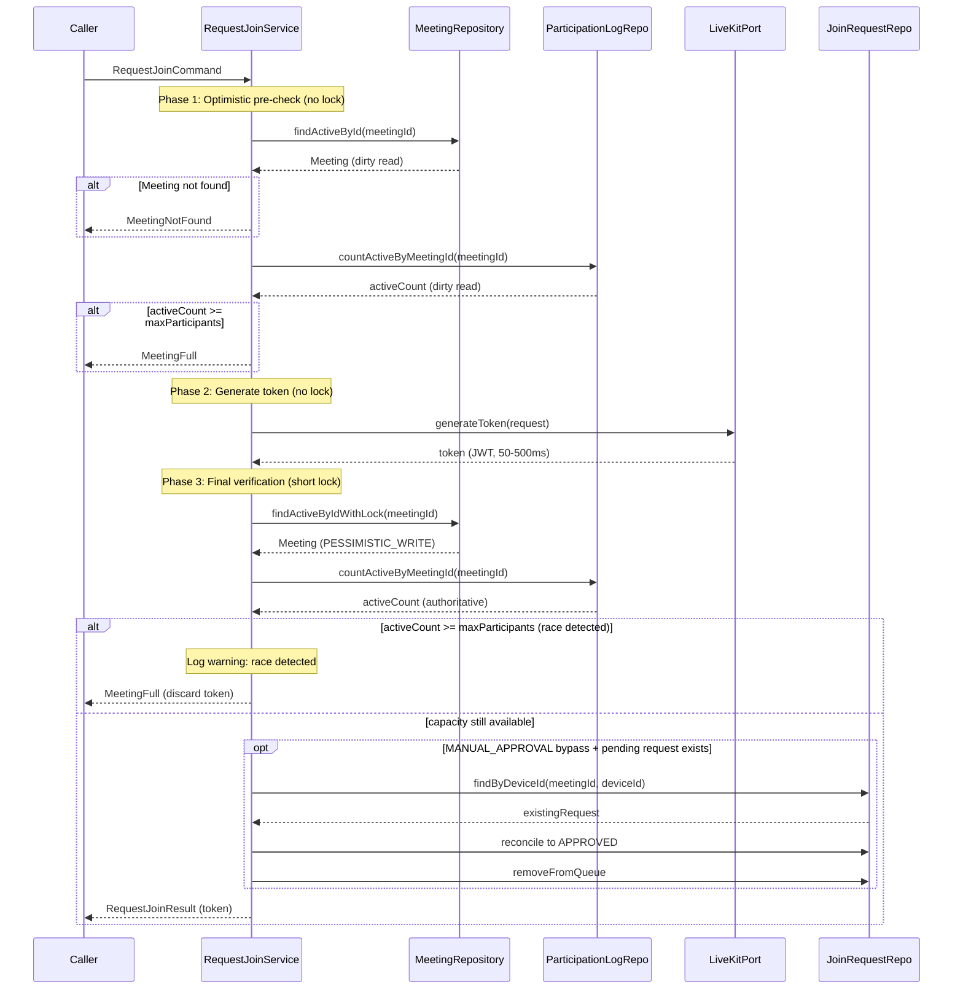

## Context

**Current State:**

`RequestJoinApplicationService` and `AcceptJoinRequestsApplicationService` both
acquire a pessimistic write lock (`PESSIMISTIC_WRITE`) on the meeting row at the
start of their transaction, then perform:

1. Capacity check (`countActiveByMeetingId` on `participation_logs`)
2. JWT token generation (CPU-bound, 50-500ms)
3. Optional Redis operations (reconcile/persist join request state)
4. Return token to caller

The lock is held for the entire duration, serializing all concurrent join
attempts to the same meeting.

**Why the lock exists:**

- Originally intended to prevent capacity overruns (more callers admitted than
  `maxParticipants`)
- Provides same-device idempotency when reconciling Redis join requests in
  MANUAL_APPROVAL bypass flow

**Why it doesn't fully protect capacity:**

- Source of truth for active participants is `participation_logs`, written by
  the `participant_joined` webhook (separate async transaction)
- Race window exists between token issuance and webhook arrival (~100-500ms)
- Two concurrent joins can both read "capacity available" before either webhook
  fires
- Current guarantee is **best-effort**, not hard

**Constraints:**

- Must preserve best-effort capacity checking (no worse than current)
- Must preserve same-device idempotency for MANUAL_APPROVAL bypass
  reconciliation
- Cannot change API contracts or response formats
- No schema changes allowed

**Stakeholders:**

- End users: expect low-latency join operations, especially under concurrent
  load
- Operations: need visibility into race occurrences

## Goals / Non-Goals

**Goals:**

- Reduce meeting row lock hold time from ~50-500ms to ~5ms
- Eliminate lock contention for concurrent joins to the same meeting
- Remove unnecessary locking from MANUAL_APPROVAL pending path (no capacity
  check needed)
- Maintain best-effort capacity guarantee (same as current behavior)
- Log race occurrences for observability

**Non-Goals:**

- Hard capacity guarantee (would require seat reservation system or DB-based
  counter, out of scope)
- Change participation logging source of truth (webhook remains authoritative)
- Modify API contracts or error response formats
- Add infrastructure metrics (Micrometer counters, etc.)
- Optimize token generation performance itself (JWT signing time unchanged)

## Decisions

### Decision 1: Three-phase approach for admission flows

**Choice:** Optimistic pre-check (no lock) → generate token (no lock) →
pessimistic final verification (short lock)

**Alternatives considered:**

- **Keep current approach**: rejected — lock contention is the core problem
- **Remove lock entirely, rely on Redis SET NX for idempotency**: rejected —
  loses same-device reconciliation guarantee in MANUAL_APPROVAL bypass flow,
  adds Redis as critical path dependency
- **Optimistic locking (JPA @Version)**: rejected — no version field exists,
  would require schema change (violates constraint), and doesn't solve token
  generation blocking issue

**Rationale:**

- Optimistic pre-check fails fast for obviously-full meetings without contention
- Token generation outside lock allows concurrent token signing
- Short final lock preserves same-device reconciliation semantics
- Trade-off: occasionally generate tokens that get discarded (acceptable —
  tokens are stateless JWTs, cheap to discard)

**Sequence diagram (RequestJoin ALLOW_ALL / MANUAL_APPROVAL bypass):**

### Decision 2: Remove lock from MANUAL_APPROVAL pending path

**Choice:** Use non-locking `findActiveById` for MANUAL_APPROVAL non-eligible
callers (pending request creation)

**Alternatives considered:**

- **Keep lock**: rejected — unnecessary (no capacity check, no Redis
  reconciliation for pending path)

**Rationale:**

- Pending path only validates meeting exists and writes Redis
- No capacity check performed (approval happens later)
- Redis `SET NX` via `findByDeviceId` already provides same-device idempotency
- Lock adds no value, only contention

### Decision 3: Add non-locking `findActiveById` repository method

**Choice:** Add `Optional<Meeting> findActiveById(UUID id)` without `@Lock`
annotation, filtering `deleted_at IS NULL`

**Alternatives considered:**

- **Reuse existing `findById` + check `deletedAt` in service**: rejected —
  couples service to deleted_at semantics, violates port abstraction
- **Use `findDetailById` (projection)**: rejected — returns read-only
  projection, cannot be used for phase 2/3 which need full aggregate

**Rationale:**

- Clean port contract: "give me an active meeting without locking"
- Mirrors existing `findActiveByIdWithLock` but without `@Lock`
- Preserves layering (domain knows nothing about JPA locking)

### Decision 4: Race handling strategy

**Choice:** When optimistic check passes but final verification fails → return
`MeetingFull` + `log.warn("Capacity race detected for meeting {}", meetingId)`

**Alternatives considered:**

- **Retry internally**: rejected — adds complexity, may loop if meeting is
  actually full
- **Return different error code for race vs genuine full**: rejected — adds API
  complexity, leaks internal optimization detail

**Rationale:**

- Simple: race looks like "meeting full" to caller (semantically correct)
- Observable: warning log allows ops to monitor race frequency
- No retry needed: caller already retries failed joins via client UX

## Risks / Trade-offs

**[Risk] Wasted token generation when race occurs**  
→ **Mitigation:** Tokens are stateless JWTs, cheap to generate and discard. Race
is expected to be rare (requires concurrent joins + capacity near limit).
Warning log allows monitoring frequency.

**[Risk] Same-device double-submit in pending path (MANUAL_APPROVAL
non-eligible) may create duplicate requests**  
→ **Mitigation:** Acceptable — Redis TTL (5 minutes) ensures duplicates expire.
`findByDeviceId` still provides soft idempotency (returns existing request if
present). Worst case: host sees duplicate in queue, only annoyance, no
functional harm.

**[Risk] Optimistic read may return stale meeting data (status, settings,
maxParticipants)**  
→ **Mitigation:** Final verification re-reads meeting under lock, authoritative.
Phase 1 stale read only affects fast-fail path (false negative: caller retries;
false positive: caught in phase 3).

**[Risk] More complex code flow (3 phases vs 1)**  
→ **Mitigation:** Clear phase separation with comments. Each phase has single
responsibility. Integration tests cover race scenarios.

**[Trade-off] Best-effort capacity remains unchanged**  
This optimization does not improve capacity guarantee accuracy (still
best-effort due to webhook-based source of truth). It only reduces lock
contention. Hard capacity would require architectural change (seat reservation,
DB counter), which is out of scope.

## Migration Plan

**Deployment:**

- Single commit, deployed as normal application release
- No schema migration required
- No configuration changes required
- Backward compatible (no API changes)

**Rollback:**

- Standard application rollback (revert commit)
- No data migration needed

**Monitoring:**

- Watch for `"Capacity race detected"` warnings in logs
- Compare P95/P99 latency for `/meetings/{id}:requestJoin` before/after
- Monitor meeting capacity-full error rate (should remain stable)

**Validation:**

- Run existing unit + integration test suites
- Manual smoke test: concurrent join attempts to same meeting (observe reduced
  latency, no errors)
- Monitor production for 24h post-deploy

## Open Questions

None. All decisions resolved during planning conversation.
