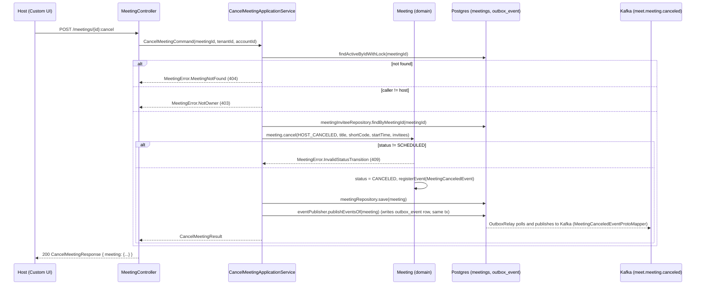
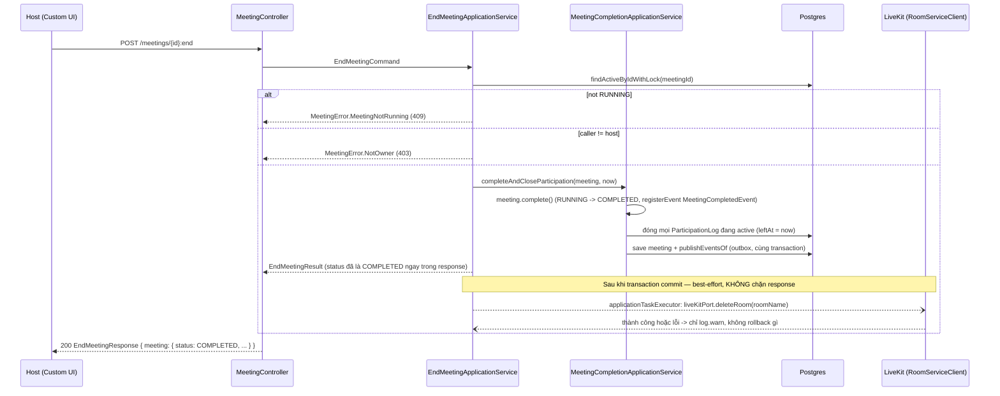
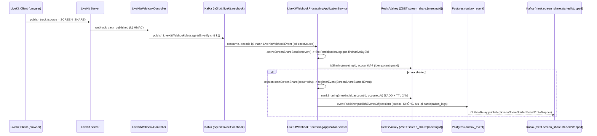
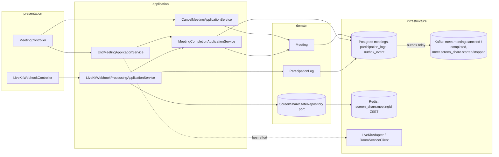

# Cancel Meeting, End Meeting, Screen-Share Tracking

Branch: `feat/meet-cancel-end-screenshare` (commit `36689d5`)
Service: `services/meet` (Spring Boot 4, hexagonal: `domain → application →
infrastructure → presentation`)

## 1. Tại sao có thay đổi này

Trước nhánh này, `meet` đã có tạo/sửa/xoá meeting, mời invitee, join-request
(manual approval), và luồng start/complete meeting chạy hoàn toàn qua webhook
LiveKit. Ba khoảng trống được đóng lại ở đây:

| Tính năng | Trạng thái trước đó |
| --- | --- |
| Cancel meeting | `Meeting.cancel()` đã tồn tại trong domain nhưng **không có gì gọi nó** — không command/use case/controller, và event `MeetingCanceledEvent` không có proto mapper nên không bao giờ lên Kafka. |
| End meeting | **Không tồn tại.** Meeting chỉ chuyển RUNNING → COMPLETED một cách bị động khi LiveKit bắn webhook `room_finished`. Host không có cách nào chủ động kết thúc ngay. |
| Screen share | Quyền publish track `screen_share` đã được cấp sẵn qua LiveKit token (client có thể bật chia sẻ màn hình mà không cần backend). Cái thiếu là **theo dõi + broadcast real-time ai đang chia sẻ** — webhook `track_published`/`track_unpublished` trước đó bị bỏ qua hoàn toàn. |

## 2. Cancel Meeting — `POST /meetings/{id}:cancel`

Host huỷ một meeting **chưa bắt đầu** (chỉ hợp lệ khi status `SCHEDULED`).

**File chính:**

- `application/command/CancelMeetingCommand.java`, `application/result/CancelMeetingResult.java`
- `application/usecase/CancelMeetingUseCase.java` (interface một dòng)
- `application/service/CancelMeetingApplicationService.java` — nơi có logic
  thật: khoá row (`findActiveByIdWithLock`), tự check quyền host (domain
  method `Meeting.cancel()` **không** tự kiểm tra quyền), build danh sách
  invitee cho email thông báo huỷ, gọi `meeting.cancel(...)`, lưu + publish.
- `application/mapper/CanceledMeetingMapper.java` — map aggregate → result.
- `presentation/response/CancelMeetingResponse.java`,
  `presentation/MeetingController.java` (method `cancel(...)`, đoạn
  `@PostMapping("/meetings/{id}:cancel")`).
- `infrastructure/messaging/MeetingCanceledEventProtoMapper.java` +
  `services/proto/.../meeting_canceled.proto` — **mảnh bị thiếu trước đây**,
  giờ domain event thật sự đi lên Kafka.

**Lỗi có thể trả về:** 400 (thiếu header `X-Account-Id`), 403 `NOT_OWNER`,
404 `MEETING_NOT_FOUND`, 409 `INVALID_STATUS_TRANSITION` (meeting không ở
trạng thái `SCHEDULED`).

## 3. End Meeting — `POST /meetings/{id}:end`

Host kết thúc một meeting **đang chạy** (`RUNNING`) ngay lập tức, thay vì chờ
mọi người rời phòng rồi LiveKit tự bắn `room_finished`.

**Điểm quan trọng nhất: dùng chung logic hoàn tất meeting với webhook.**
`MeetingCompletionApplicationService.completeAndCloseParticipation(meeting, occurredAt)`
là đoạn code được tách ra từ `LiveKitWebhookProcessingApplicationService
.handleRoomFinished` — cả hai đường (host bấm "end" **và** LiveKit tự báo
`room_finished`) đều đi qua đúng một hàm này, nên "khi nào meeting coi là
xong" chỉ định nghĩa một chỗ duy nhất. Idempotent: nếu gọi lại khi đã
`COMPLETED`, `meeting.complete()` trả về failure và hàm return sớm, không
đóng lại participation log, không publish lại event.

**LiveKit room teardown là "cố gắng tốt nhất" (best-effort):** response HTTP
trả về ngay sau khi Postgres commit (`COMPLETED` là nguồn sự thật), việc gọi
LiveKit xoá room chạy bất đồng bộ trên `applicationTaskExecutor` — nếu lỗi
(LiveKit down, network...) chỉ log cảnh báo, không làm hỏng response đã trả
cho host. Trạng thái phòng LiveKit "sống sót" thêm vài giây là vấn đề dọn dẹp,
không phải vấn đề đúng/sai dữ liệu.

**File chính:**

- `application/service/MeetingCompletionApplicationService.java` (mới, tách
  ra, dùng chung)
- `application/service/EndMeetingApplicationService.java` — check quyền host
  + status RUNNING, gọi `MeetingCompletionApplicationService`, dispatch
  teardown LiveKit bất đồng bộ.
- `infrastructure/livekit/LiveKitAdapter.java` — **implement thật**
  `deleteRoom()` (trước đây `throw new UnsupportedOperationException(...)`),
  dùng `RoomServiceClient` (SDK `io.livekit:livekit-server`).
- `infrastructure/livekit/LiveKitConfig.java` — thêm `@Bean RoomServiceClient`.
- `application/service/LiveKitWebhookProcessingApplicationService.java` —
  `handleRoomFinished` giờ chỉ còn 3 dòng, gọi thẳng
  `MeetingCompletionApplicationService`.

**Lỗi có thể trả về:** 400, 403 `NOT_OWNER`, 404 `MEETING_NOT_FOUND`, 409
`MEETING_NOT_RUNNING` (meeting chưa chạy hoặc đã kết thúc/huỷ).

## 4. Screen-share tracking (không đổi schema Postgres)

Quyền publish track `screen_share` đã có sẵn — phần này chỉ thêm **theo dõi
"ai đang chia sẻ" + báo real-time cho người khác trong phòng**. Ban đầu có
bản thiết kế lưu state vào cột mới trong `participation_logs`
(migration `V3`), nhưng theo yêu cầu **không sửa DB**, toàn bộ state hiện tại
sống trong Redis/Valkey (giống hệt cách `JoinRequestRedisRepositoryAdapter`
đang làm cho join-request) — Postgres schema của nhánh này **không đổi gì**
so với trước khi làm tính năng này.

Khi dừng share (`track_unpublished`) thì làm ngược lại: check `isSharing` ==
true → `stopScreenShare` → `clearSharing` (ZREM) → publish
`ScreenShareStoppedEvent`.

**Lưới an toàn khi mất sự kiện:** nếu participant rời phòng
(`participant_left`) mà vẫn đang ở trạng thái sharing trong Redis (ví dụ tắt
máy đột ngột, LiveKit không kịp bắn `track_unpublished`), handler
`handleParticipantLeft` tự động `clearSharing` + publish
`ScreenShareStoppedEvent` — tránh treo UI người khác ở trạng thái "đang
share" mãi mãi. Ngoài ra cả ZSET `screen_share:{meetingId}` có TTL 24h refresh
mỗi lần `markSharing`, phòng trường hợp webhook bị rơi hoàn toàn.

**Đọc trạng thái ban đầu (`GET /meetings/{id}`):** không có endpoint riêng.
`ParticipationLogRepositoryAdapter.findDistinctParticipantSummariesByMeetingId`
lấy participant list từ Postgres như cũ, sau đó gọi một lần
`screenShareStateRepository.findSharingAccountIds(meetingId)` (Redis `ZRANGE`)
để set field `screenSharing` cho những participant đang active trong phòng
(`leftAt == null`). Client mở panel lần đầu / F5 giữa chừng vẫn thấy đúng ai
đang share, không chỉ dựa vào sự kiện real-time về sau.

**File chính:**

- `domain/port/ScreenShareStateRepository.java` (port) +
  `infrastructure/persistence/ScreenShareStateRedisRepositoryAdapter.java`
  (Redis `ZSET`, không đụng Postgres).
- `domain/event/ScreenShareStartedEvent.java` /
  `ScreenShareStoppedEvent.java` — implement cả `PublishableEvent` **và**
  `SseTriggeringEvent` nên đi qua đường relay outbox nhanh (accelerated
  relay) có sẵn cho join-request, tới người xem gần như ngay lập tức thay vì
  chờ vòng poll outbox định kỳ.
- `domain/model/ParticipationLog.java` — hai method
  `startScreenShare`/`stopScreenShare` chỉ đăng ký domain event (không giữ
  state nữa — state thật nằm ở Redis, kiểm tra idempotent làm ở tầng
  application service phía trên).
- `domain/model/valueobject/LiveKitWebhookEvent.java`,
  `infrastructure/livekit/LiveKitWebhookVerifierAdapter.java`,
  `infrastructure/messaging/LiveKitWebhookMessage.java` /
  `LiveKitWebhookKafkaPublisher.java` / `LiveKitWebhookConsumer.java` — mở
  rộng để mang theo `trackSid`/`trackSource` (LiveKit proto `TrackInfo`,
  enum `TrackSource.SCREEN_SHARE`) xuyên suốt từ webhook gốc tới consumer nội
  bộ.
- `infrastructure/messaging/ScreenShareStartedEventProtoMapper.java` /
  `ScreenShareStoppedEventProtoMapper.java` +
  `services/proto/.../screen_share_started.proto` /
  `screen_share_stopped.proto`.
- `domain/projection/ParticipantSummary.java`,
  `application/result/GetMeetingResult.java`,
  `presentation/response/GetMeetingResponse.java` — thêm field
  `screenSharing` xuyên suốt chuỗi projection → result → response.

## 5. Sơ đồ tổng quan các lớp bị chạm

## 6. Test coverage

| Loại | Số lượng | Kết quả |
| --- | --- | --- |
| Unit test (`:meet:test`) | 157 | ✅ pass, 0 failure |
| Integration test (`:meet:integrationTest`, Testcontainers Postgres + Kafka + Redis thật) | 129 | ✅ pass, 0 failure |

Test mới thêm/đổi đáng chú ý:

- `CancelMeetingControllerIntegrationTest` — host huỷ thành công, non-host
  403, not-found 404, huỷ meeting đang `RUNNING` → 409.
- `EndMeetingControllerIntegrationTest` — host kết thúc thành công (kiểm tra
  status `COMPLETED` ngay trong response + `participation_logs.left_at`
  được đóng), non-host 403, not-found 404, kết thúc meeting `SCHEDULED` →
  409 `MEETING_NOT_RUNNING`.
- `LiveKitWebhookProcessingApplicationServiceTest` — thêm case
  `track_published`/`track_unpublished` (start/stop sharing, nguồn không
  phải `SCREEN_SHARE` thì bỏ qua, sid không rõ thì bỏ qua), case participant
  rời phòng khi đang share phải tự dọn Redis + publish `ScreenShareStoppedEvent`.
- `LiveKitAdapterRoomConfigTest` — 3 case mới cho `deleteRoom` (thành công,
  LiveKit trả lỗi HTTP, LiveKit throw exception) dùng Retrofit `Call` mock.
- `ParticipationLogRepositoryAdapterTest` — cập nhật để mock
  `ScreenShareStateRepository.findSharingAccountIds` thay vì đọc cột SQL.

Đã chạy bằng JDK 25 thật (`gradlew :meet:test :meet:integrationTest`), không
mock hoá Postgres/Kafka/Redis — dùng Testcontainers với Docker Desktop
container thật.

## 7. Đối chiếu với `PROJECT_CONTEXT.md`

Sau khi code xong, đối chiếu lại với `PROJECT_CONTEXT.md` (tài liệu phân
tích/thiết kế gốc của đề tài) thì đa số khớp — state machine (`Cancel` chỉ
từ `SCHEDULED`, `End` chỉ từ `RUNNING`, `Completed`/`Canceled` immutable),
tên use case (`CancelMeetingUseCase`/`EndMeetingUseCase` — trùng khớp §6.3),
cơ chế realtime qua SSE/outbox cho screen-share.

**Một điểm lệch quan trọng:** §4.5/§4.7/UC-04 của tài liệu quy định quyền
`Cancel`/`End` là permission Jira **`Edit Meeting`** (bất kỳ ai trong project
có quyền đó, không giới hạn Host — trích nguyên văn: *"không giới hạn theo
'chỉ Host mới sửa được'"*). Code hiện tại (`CancelMeetingApplicationService`,
`EndMeetingApplicationService`) chỉ check **Host** (`hostId.equals(...)`),
giống hệt pattern có sẵn ở `update`/`delete` — vì bản thân backend `meet`
**hoàn toàn chưa có** cơ chế check permission Jira nào (đã tự xác nhận trong
`app/AGENTS.md`, mục "Backend permission enforcement (not yet built)").

Quyết định (2026-07-31, đã hỏi và được xác nhận): **giữ nguyên Host-only**,
không vá riêng cho 2 API này để tránh lệch pha với `update`/`delete` còn lại
— sẽ làm chung một đợt khi backend permission enforcement (gọi Jira
`mypermissions` qua `x-forge-oauth-user` token) được xây dựng. Đã đánh dấu
`TODO(permission)` ngay tại chỗ check quyền trong cả 2
`*ApplicationService`, và trong
[api-spec-cancel-end-screenshare.md](api-spec-cancel-end-screenshare.md).

## 8. Hiện đã "chạy được" tới đâu — nói thẳng

**Đã chắc chắn đúng (có test tự động xác nhận):**

- Code compile sạch (main + test + integrationTest).
- Toàn bộ logic nghiệp vụ (domain rule, phân quyền host, transition
  status, đóng participation log, ghi outbox, JSON/JPQL mapping, Redis
  read/write) chạy đúng qua 286 test tự động, kể cả với Postgres/Kafka/Redis
  **thật** (Testcontainers), không phải mock toàn bộ.
- OpenAPI (`services/meet/openapi.yaml`) đã được sinh lại từ chính các test
  này — 2 endpoint mới và field `screenSharing` xuất hiện đúng trong spec,
  nghĩa là chuỗi controller → OpenAPI annotation → springdoc hoạt động.

**CHƯA kiểm chứng (cần bạn/ai đó làm tiếp):**

- Chưa smoke-test thủ công với LiveKit server thật + trình duyệt thật (gọi
  `:end` xong có thực sự kick hết người ra khỏi phòng LiveKit không, track
  `track_published` với source `SCREEN_SHARE` từ trình duyệt thật có đúng
  format LiveKit gửi lên như test giả lập không).
- Chưa chạy `pnpm smiski dev` full stack (Kong, LiveKit thật, Caddy) để bấm
  thử trên Jira/Custom UI thật.
- Chưa merge vào `dev`, chưa qua code review/PR, chưa deploy môi trường nào.
- `bufFormatApply`/build đầy đủ `:proto` chưa chạy được trong máy hiện tại
  (thiếu quyền tạo symlink trên Windows — hạn chế môi trường, không phải lỗi
  code); đã validate riêng 3 file `.proto` mới bằng `protoc` trực tiếp thay
  thế.

**Tóm lại:** phần backend logic đã "chạy được" theo nghĩa test tự động xanh
100% với hạ tầng thật (không mock DB/Kafka/Redis), nhưng **chưa** được xác
nhận end-to-end với LiveKit server thật hoặc trên Jira thật — hai việc đó cần
môi trường (`LIVEKIT_URL`/keys thật, Forge tunnel hoặc deploy) mà phiên làm
việc này chưa có.
