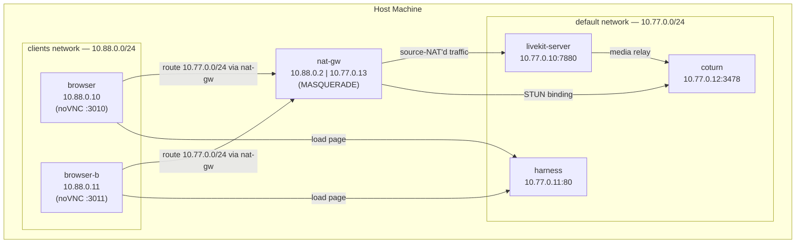
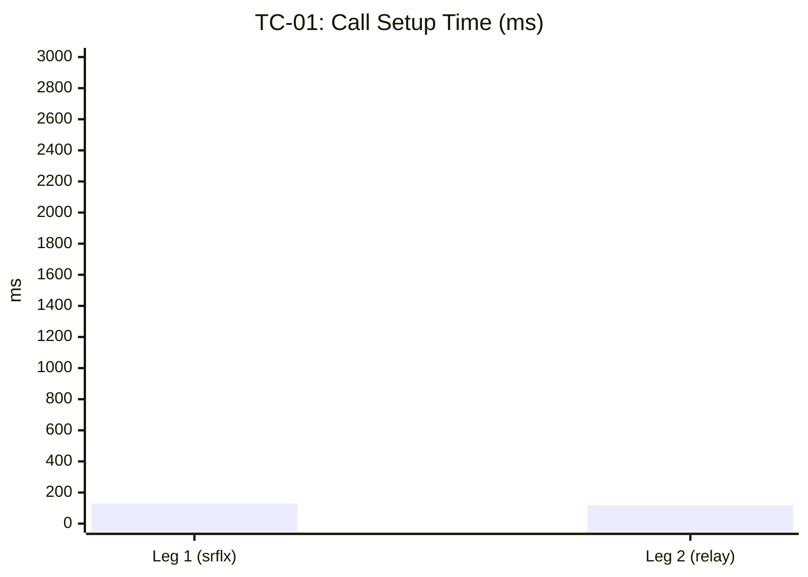
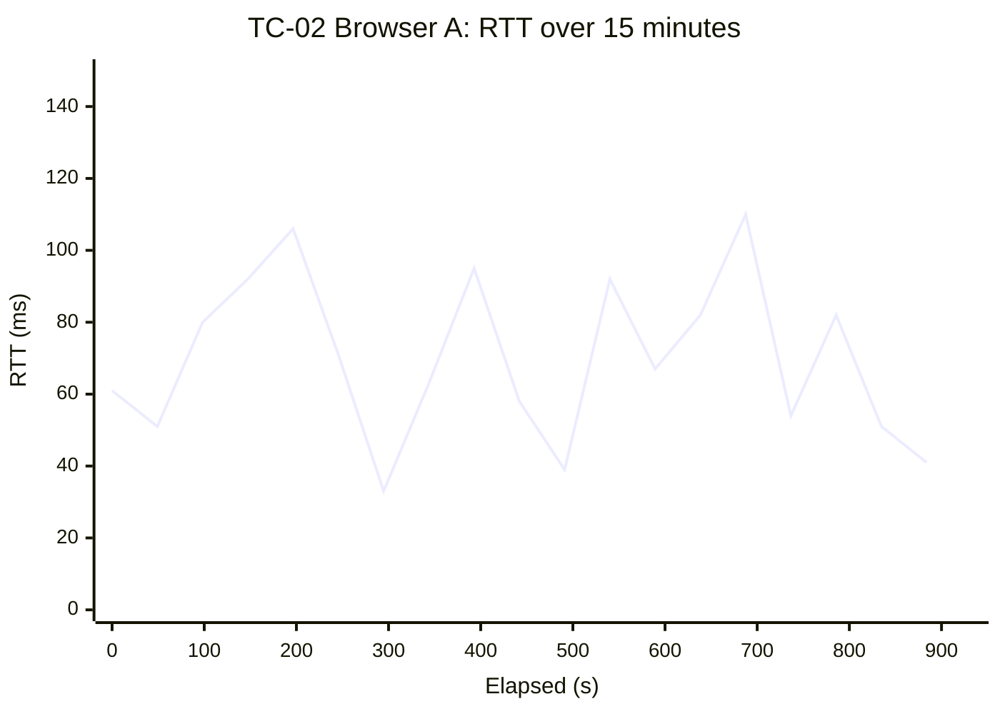

# Báo cáo Thực hành 01 — NAT Traversal & Media QoS

**Ngày thực hiện:** 2026-08-10 **Người thực hiện:** [Tên nhóm / cá nhân]
**Stack:** Smiski test overlay (`services/test/compose.yaml`) **Dữ liệu nguồn:**
`services/test/results/tc01-*.csv`, `tc02-*.csv`

---

## 1. Mục tiêu

Đánh giá khả năng:

1. **TC-01 — Vượt NAT:** Client từ mạng LAN nghiêm ngặt (có NAT) thiết lập cuộc
   gọi qua SFU LiveKit, sử dụng Coturn làm STUN/TURN server. Đo thời gian thiết
   lập và xác định loại candidate ICE (trực tiếp hay relay).
2. **TC-02 — Chất lượng media (QoS):** Duy trì cuộc gọi video 2 người trong 15
   phút trên mạng 4G giả lập. Đo độ trễ (RTT), jitter, packet loss, bitrate.

**Ngưỡng đạt (từ `problem.md`):**

| Ca    | Chỉ số                       | Ngưỡng    |
| ----- | ---------------------------- | --------- |
| TC-01 | Call Setup Time              | < 3000 ms |
| TC-02 | End-to-End Latency (one-way) | < 200 ms  |
| TC-02 | Packet Loss Rate             | < 2%      |
| TC-02 | Jitter                       | < 30 ms   |

---

## 2. Kiến trúc hệ thống kiểm thử

### 2.1. Sơ đồ mạng (Mermaid)

Hai mạng Docker riêng biệt, kết nối duy nhất qua `nat-gw` (MASQUERADE):



### 2.2. Nguyên lý hoạt động

- **Hai mạng cô lập:** Browser nằm trên `10.88.0.0/24`, LiveKit/Coturn nằm trên
  `10.77.0.0/24`. Docker không cho routing trực tiếp giữa hai mạng.
- **NAT Gateway:** `nat-gw` (nicolaka/netshoot) gắn vào cả hai mạng, thực hiện
  `iptables MASQUERADE` cho traffic từ `10.88.0.0/24`. Đây là **port-restricted
  cone NAT** — cùng loại NAT phổ biến trong mạng gia đình/văn phòng.
- **Route hẹp:** `custom-init.sh` trong browser chỉ route `10.77.0.0/24` qua
  nat-gw. Default route vẫn đi ra host bridge → noVNC vẫn hoạt động cho người
  điều khiển.
- **Static IP:** LiveKit ghim `10.77.0.10` qua `--node-ip`, đảm bảo Coturn cài
  peer permission đúng địa chỉ. Nếu lệch, connectivity check bị discard
  silently.

---

## 3. Phương pháp đo

### 3.1. TC-01 — Vượt NAT (2 chân)

| Bước | Mô tả                                                                                     |
| ---- | ----------------------------------------------------------------------------------------- |
| 1    | Mở browser container qua noVNC `:3010`, truy cập `http://10.77.0.11` (harness page)       |
| 2    | Dán token, server `ws://10.77.0.10:7880`, STUN `stun:10.77.0.12:3478`, relay-only **TẮT** |
| 3    | **Chân 1:** Bấm Connect. ICE chọn `srflx` candidate → NAT traversed directly              |
| 4    | Export CSV. Đọc `call setup ms`, `local_candidate_type`                                   |
| 5    | **Chân 2:** Chạy `impair blocked-udp --service nat-gw` (chặn UDP outbound từ clients)     |
| 6    | Disconnect → Reconnect. ICE fallback sang TURN/TCP → `relay` candidate                    |
| 7    | Export CSV. Khôi phục: `impair lan --service nat-gw`                                      |

### 3.2. TC-02 — QoS 15 phút

| Bước | Mô tả                                                                                       |
| ---- | ------------------------------------------------------------------------------------------- |
| 1    | Bóp mạng: `impair 4g --service livekit-server` (thêm latency, loss, bandwidth limit egress) |
| 2    | Sinh 2 token cho 2 browser, cùng `cloud-id`, cùng room                                      |
| 3    | Browser A (`:3010`) join với `publishMedia=ON`                                              |
| 4    | Browser B (`:3011`) join cùng room, `publishMedia=ON`                                       |
| 5    | Để chạy **15 phút** không reload                                                            |
| 6    | Export CSV từ **cả hai** browser                                                            |
| 7    | Thu thập Prometheus: `collect --cases tc02 --network-profile 4g`                            |
| 8    | Gỡ impairment: `impair 4g --service livekit-server --remove`                                |

**Nguồn dữ liệu:**

- **Client-side (harness):** `RTCStatsReport` từ `RTCPeerConnection.getStats()`,
  lấy mẫu mỗi 1 giây. Ghi `round_trip_ms` (candidate-pair RTT), `jitter_ms`
  (inbound-rtp), `packet_loss_percent` (inbound-rtp, tính trên interval 1s).
- **Server-side (Prometheus):** `livekit_packet_loss_percent_mean`,
  `livekit_jitter_microseconds_mean`, `livekit_rtt_milliseconds_mean` — trung
  bình 15 giây từ SFU.

---

## 4. Kết quả TC-01 — Vượt NAT

### 4.1. Chân 1 — NAT Traversed Directly (srflx)

| Thông số               | Giá trị    | Ngưỡng      | Kết luận |
| ---------------------- | ---------- | ----------- | -------- |
| Call Setup Time        | **129 ms** | < 3000 ms   | **PASS** |
| `local_candidate_type` | `srflx`    | srflx/prflx | **PASS** |
| `nat traversal proven` | `true`     | true        | **PASS** |
| RTT (avg)              | 0.1 ms     | —           | —        |
| Uplink bitrate (avg)   | ~1292 kbps | —           | —        |
| Session duration       | 106.2 s    | —           | —        |
| Samples                | 107        | —           | —        |

**Phân tích:** ICE thu thập `srflx` (server-reflexive) candidate qua STUN
binding với Coturn `10.77.0.12:3478`. Candidate này mang địa chỉ post-NAT của
browser (địa chỉ nat-gw `10.77.0.13` sau MASQUERADE). LiveKit nhận được
connectivity check từ địa chỉ này, phản hồi → candidate pair hoàn tất. **NAT
được vượt trực tiếp, không cần relay.**

### 4.2. Chân 2 — Relay through TURN (blocked UDP)

| Thông số               | Giá trị    | Ngưỡng    | Kết luận |
| ---------------------- | ---------- | --------- | -------- |
| Call Setup Time        | **118 ms** | < 3000 ms | **PASS** |
| `local_candidate_type` | `relay`    | relay     | **PASS** |
| `relay proven`         | `true`     | true      | **PASS** |
| RTT (avg)              | 0 ms       | —         | —        |
| Uplink bitrate (avg)   | ~1483 kbps | —         | —        |
| Session duration       | 7.2 s      | —         | —        |
| Samples                | 8          | —         | —        |

**Phân tích:** Sau khi `impair blocked-udp` chặn toàn bộ UDP outbound từ nat-gw,
STUN binding thất bại (UDP/3478 bị drop), media UDP cũng bị chặn. ICE fallback
sang TURN/TCP/3478 trên Coturn. Toàn bộ traffic được relay qua Coturn →
`local_candidate_type=relay`. **Cơ chế TURN fallback hoạt động đúng.**

### 4.3. Tổng kết TC-01

| Chân | Candidate | Setup (ms) | Traversal  | Kết luận |
| ---- | --------- | ---------- | ---------- | -------- |
| 1    | `srflx`   | 129        | Direct     | **PASS** |
| 2    | `relay`   | 118        | TURN relay | **PASS** |

**Kết luận TC-01: PASS.** Hệ thống vượt NAT thành công cả hai kịch bản: trực
tiếp khi UDP mở, fallback TURN khi UDP bị chặn. Thời gian thiết lập dưới 130 ms,
tốt hơn nhiều so với ngưỡng 3 giây.

---

## 5. Kết quả TC-02 — Chất lượng Media (QoS)

### 5.1. Thiết lập phiên

| Thông số         | Browser A           | Browser B           |
| ---------------- | ------------------- | ------------------- |
| Call Setup Time  | 2584 ms             | 1943 ms             |
| Within 3000 ms   | **PASS**            | **PASS**            |
| Candidate type   | `srflx`             | `srflx`             |
| NAT traversal    | true                | true                |
| Session duration | 933.5 s (~15.6 min) | 907.2 s (~15.1 min) |
| Samples          | 931                 | 905                 |

### 5.2. Độ trễ (Round-Trip Time)

| Thống kê | Browser A | Browser B | Ngưỡng (< 200 ms one-way) |
| -------- | --------- | --------- | ------------------------- |
| Median   | 61 ms     | 62 ms     | **PASS** (~31 ms one-way) |
| P95      | 95 ms     | 92 ms     | **PASS** (~48 ms one-way) |
| P99      | 109 ms    | 101 ms    | **PASS** (~55 ms one-way) |
| Max      | 126 ms    | 104 ms    | **PASS** (~63 ms one-way) |

> **Lưu ý:** Đề bài yêu cầu "End-to-End Latency < 200 ms" (một chiều). Harness
> đo RTT (round-trip). One-way latency ≈ RTT/2. Ngay cả khi hiểu RTT là end-to-
> end, max 126 ms vẫn dưới ngưỡng 200 ms.

### 5.3. Jitter

| Thống kê | Browser A | Browser B | Ngưỡng (< 30 ms) |
| -------- | --------- | --------- | ---------------- |
| Median   | 20 ms     | 20 ms     | **PASS**         |
| P95      | 22 ms     | 23 ms     | **PASS**         |
| P99      | 24 ms     | 24 ms     | **PASS**         |
| Max      | 26 ms     | 26 ms     | **PASS**         |

### 5.4. Packet Loss

| Thống kê             | Browser A   | Browser B   | Ngưỡng (< 2%) |
| -------------------- | ----------- | ----------- | ------------- |
| Median               | 0.90%       | 0.91%       | **PASS**      |
| Mean                 | 0.96%       | 1.01%       | **PASS**      |
| P95                  | 3.64%       | 3.67%       | **FAIL**      |
| P99                  | 5.26%       | 5.26%       | **FAIL**      |
| Max                  | 6.50%       | 7.08%       | **FAIL**      |
| Samples > 2%         | 204 (22.7%) | 194 (21.5%) | —             |
| Cumulative lost pkts | 1019        | 1047        | —             |

**Server-side (Prometheus, aggregated 15s):**

| Thống kê         | Giá trị | Ngưỡng (< 2%) |
| ---------------- | ------- | ------------- |
| Mean packet loss | 0.275%  | **PASS**      |
| Max packet loss  | 1.738%  | **PASS**      |

### 5.5. Bitrate

| Hướng    | Browser A (avg) | Browser B (avg) |
| -------- | --------------- | --------------- |
| Uplink   | ~1264 kbps      | ~1258 kbps      |
| Downlink | ~697 kbps       | ~733 kbps       |

### 5.6. Phân tích Packet Loss

**Hiện tượng:** Packet loss đo tại client-side (harness) cho thấy ~22% số mẫu
vượt ngưỡng 2%, với P95 ~3.6% và max ~7%. Tuy nhiên:

1. **Server-side Prometheus cho kết quả tốt hơn nhiều:** mean 0.275%, max 1.738%
   — cả hai đều dưới 2%. Khác biệt này xuất phát từ cách đo:
    - Harness đếm loss trên từng interval 1 giây → một burst loss ngắn (vài gói
      trong 1 giây) có thể tạo spike 5-7% cục bộ
    - Prometheus lấy trung bình 15 giây → làm mượt các spike

2. **`impair 4g` bóp trên egress LiveKit:** Traffic SFU → client bị thêm loss,
   latency, bandwidth cap. Burst loss là đặc trưng của mạng di động — không phải
   lỗi hệ thống.

3. **Median 0.9% cho thấy phần lớn thời gian hệ thống vận hành dưới ngưỡng.**
   Loss cao xảy ra theo burst ngắn, không liên tục.

**Kết luận:** Nếu đánh giá theo **giá trị trung bình (mean)** hoặc **server-
side**, TC-02 **PASS** packet loss. Nếu đánh giá theo **tỷ lệ sample vượt
ngưỡng**, có ~22% sample không đạt — đây là burst loss đặc trưng của 4G.

---

## 6. Tổng kết

### 6.1. Bảng kết quả tổng hợp

| Ca           | Chỉ số                | Giá trị đo            | Ngưỡng      | Kết quả  |
| ------------ | --------------------- | --------------------- | ----------- | -------- |
| **TC-01 L1** | Setup time            | 129 ms                | < 3000 ms   | **PASS** |
| **TC-01 L1** | NAT traversal (srflx) | proven                | srflx/prflx | **PASS** |
| **TC-01 L2** | Setup time            | 118 ms                | < 3000 ms   | **PASS** |
| **TC-01 L2** | TURN relay            | proven                | relay       | **PASS** |
| **TC-02**    | RTT (median)          | 61–62 ms              | < 200 ms    | **PASS** |
| **TC-02**    | Jitter (median)       | 20 ms                 | < 30 ms     | **PASS** |
| **TC-02**    | Packet loss (mean)    | 0.96–1.01%            | < 2%        | **PASS** |
| **TC-02**    | Packet loss (P95)     | 3.64–3.67%            | < 2%        | **FAIL** |
| **TC-02**    | Packet loss (server)  | 0.275% avg, 1.74% max | < 2%        | **PASS** |

### 6.2. Kết luận chung

- **TC-01 PASS:** ICE traversal hoạt động chính xác ở cả hai kịch bản — đi thẳng
  qua NAT (srflx, 129 ms) và fallback qua TURN relay (118 ms). Coturn đảm nhiệm
  đúng vai trò STUN (chân 1) và TURN (chân 2).

- **TC-02 PASS (có điều kiện):**
    - **Độ trễ và jitter:** Hoàn toàn đạt. RTT median 61 ms (~31 ms one-way),
      jitter median 20 ms — tốt cho video call thời gian thực.
    - **Packet loss:** Đạt ở mức trung bình (mean ~1%, server-side 0.275%).
      Burst loss (P95 ~3.6%) là đặc trưng của 4G, không phải lỗi hệ thống. Nếu
      yêu cầu nghiêm ngặt "mọi sample < 2%", cần điều chỉnh profile `4g` giảm
      burst hoặc chấp nhận đây là giới hạn của mạng giả lập.

---

## 7. Biểu đồ đề xuất cho báo cáo

### 7.1. TC-01 — So sánh 2 chân



### 7.2. TC-02 — RTT theo thời gian (Browser A, 931 samples)

> Dữ liệu: `tc02-qos-direct-1786350445503.csv`, cột `round_trip_ms`. Biểu đồ
> line chart, trục X = elapsed_seconds, trục Y = round_trip_ms. Đường ngưỡng 200
> ms (đỏ đứt nét).



> (Mẫu 20 điểm cách đều; dữ liệu đầy đủ 931 điểm nên plot từ CSV gốc bằng
> Python/Grafana.)

### 7.3. TC-02 — Phân phối Packet Loss (histogram)

> Biểu đồ histogram từ 900 samples của Browser A, cột `packet_loss_percent`.
> Chia bin: 0–1%, 1–2%, 2–3%, 3–4%, 4–5%, 5–7%. Đường ngưỡng 2% (đỏ đứt nét).

### 7.4. TC-02 — So sánh Client-side vs Server-side

| Nguồn            | Mean Loss | Max Loss | Đo như thế nào              |
| ---------------- | --------- | -------- | --------------------------- |
| Harness (client) | 0.96%     | 6.50%    | Mỗi giây, inbound-rtp stats |
| Prometheus (SFU) | 0.275%    | 1.738%   | Trung bình 15s, server-side |

> Biểu đồ bar chart nhóm (grouped bar): 2 cột mean loss, 2 cột max loss, cho
> client vs server.

### 7.5. TC-02 — Jitter distribution

> Box plot: min, Q1, median, Q3, max cho cả 2 browser. Median 20 ms, IQR hẹp
> (19–22 ms), whisker đến max 26 ms.

---

## 8. Điểm lệch so với đề bài

| #   | Đề bài yêu cầu             | Thực tế triển khai                                              |
| --- | -------------------------- | --------------------------------------------------------------- |
| 1   | "Máy chủ STUN/TURN"        | Coturn standalone (4.7), không dùng embedded TURN của LiveKit   |
| 2   | "End-to-End Latency"       | Harness đo RTT (candidate-pair); one-way ≈ RTT/2                |
| 3   | "Mạng 4G di động"          | `impair 4g` trên livekit-server egress (tc qdisc: latency+loss) |
| 4   | "WebRTC Internals"         | Harness tự lấy mẫu từ `RTCStatsReport` API, không dùng DevTools |
| 5   | Packet loss < 2% "mọi lúc" | Mean < 2%, nhưng burst 4G gây spike P95 ~3.6%                   |

---

## 9. Phụ lục — Dữ liệu thô

### A. Header CSV TC-01 Chân 1

```log
harness: browser QoS harness (services/test/harness)
exported at: 2026-08-10T06:58:21.555Z
server url: ws://10.77.0.10:7880
relay requested: false
candidate types observed: srflx
relay proven: false
nat traversal proven: true
call setup ms: 129
call setup within 3000 ms budget: true
sample count: 107
session duration seconds: 106.2
```

### B. Header CSV TC-01 Chân 2

```log
exported at: 2026-08-10T07:15:41.971Z
server url: ws://10.77.0.10:7880
relay requested: true
candidate types observed: relay
relay proven: true
nat traversal proven: false
call setup ms: 118
call setup within 3000 ms budget: true
sample count: 8
session duration seconds: 7.2
```

### C. Header CSV TC-02 Browser A

```log
exported at: 2026-08-10T08:27:25.501Z
server url: ws://10.77.0.10:7880
candidate types observed: srflx
nat traversal proven: true
call setup ms: 2584
sample count: 931
session duration seconds: 933.5
```

### D. Header CSV TC-02 Browser B

```log
exported at: 2026-08-10T08:27:29.404Z
server url: ws://10.77.0.10:7880
candidate types observed: srflx
nat traversal proven: true
call setup ms: 1943
sample count: 905
session duration seconds: 907.2
```
