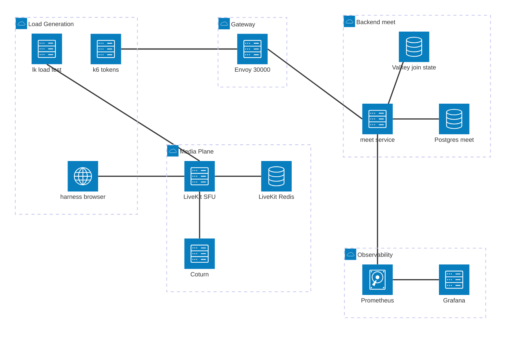
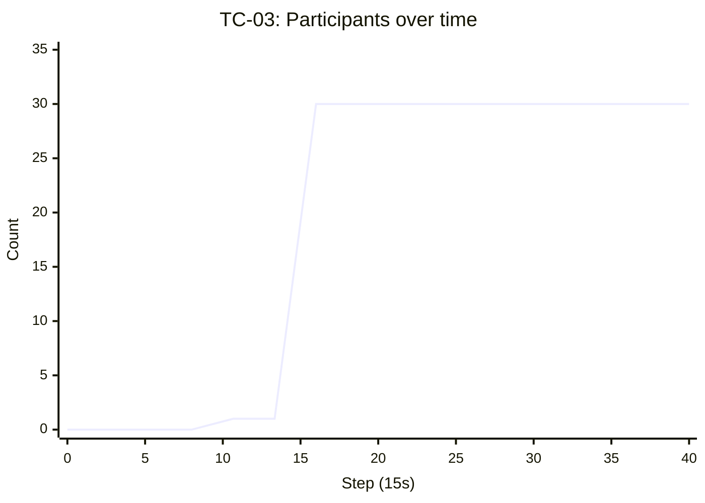
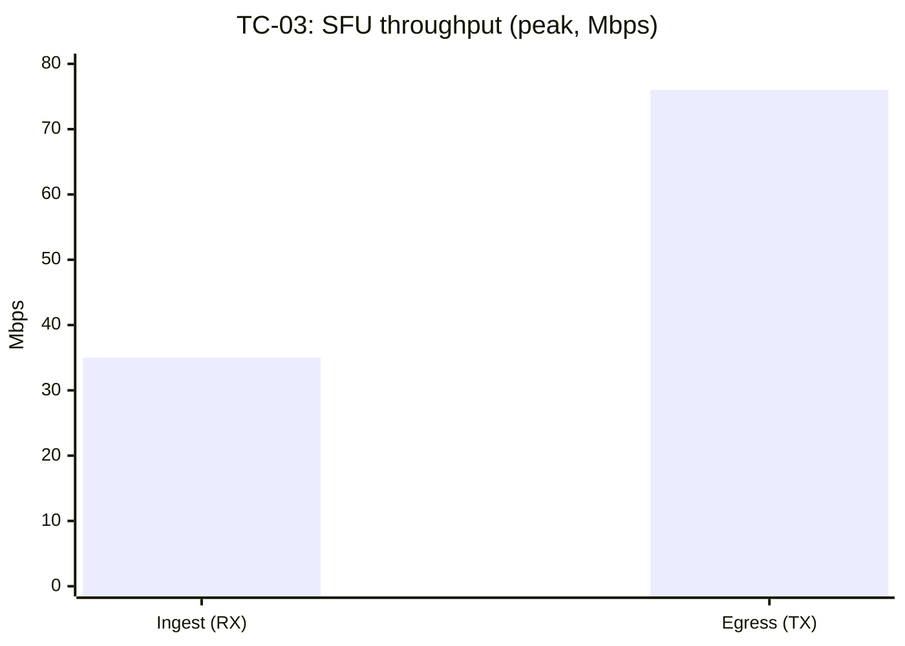
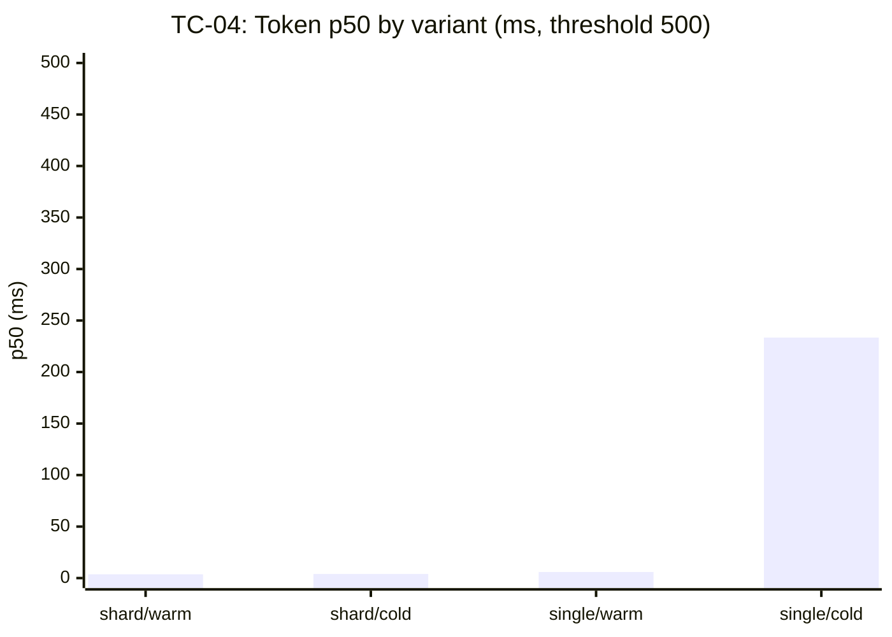
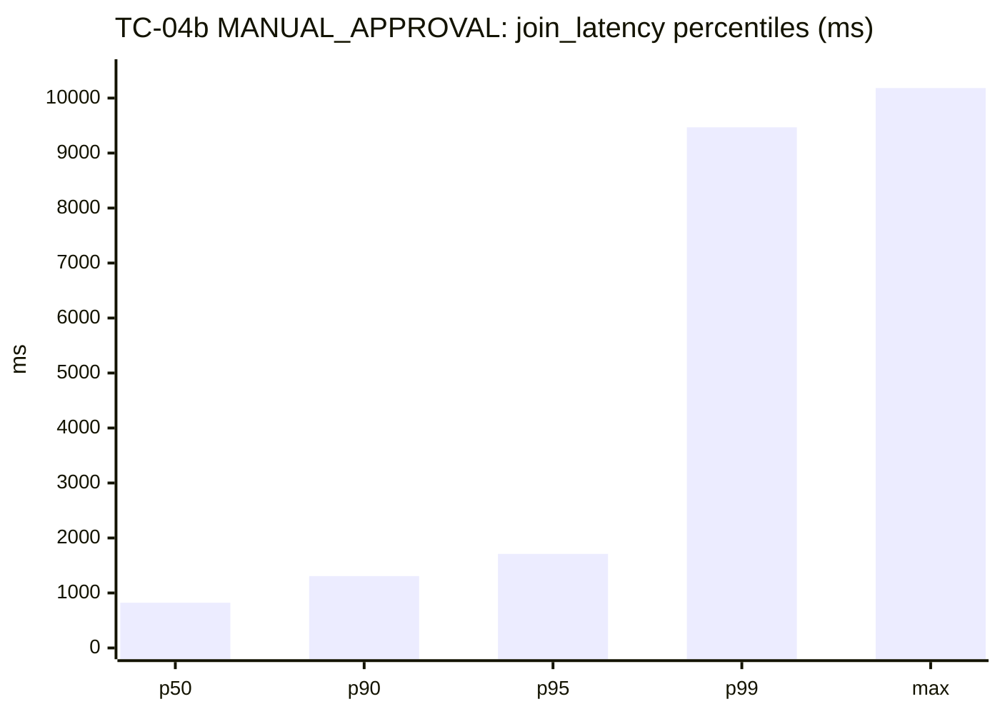
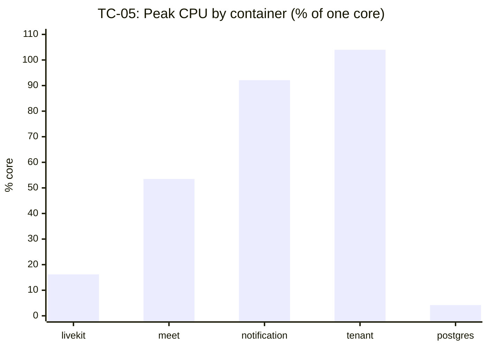
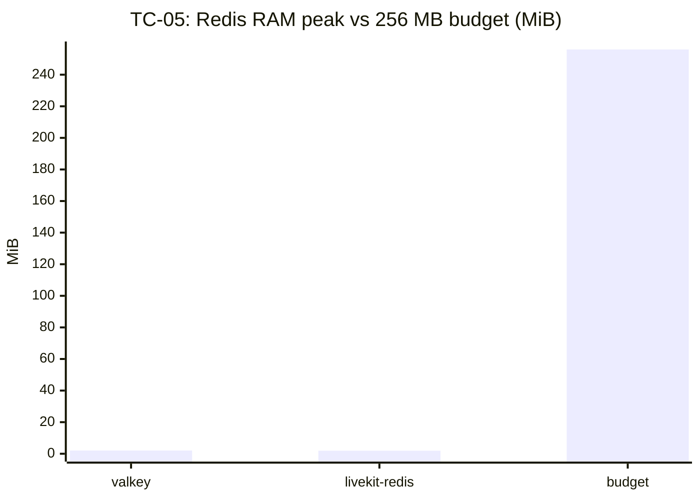

# Báo cáo Thực hành 02 — SFU Scalability & Stress Testing

**Ngày thực hiện:** 2026-08-10 **Người thực hiện:** [Tên nhóm / cá nhân]
**Stack:** Smiski test overlay (`services/test/compose.yaml`, profile
`observability`) **Dữ liệu nguồn:** `services/test/results/tc03-*.csv`,
`tc04-*.csv`, `tc04-*.json`, `tc05-*.csv`, `summary.json`

> Đây là **cấu trúc báo cáo đề xuất**. Ô đánh dấu `[ĐIỀN]` cần bổ sung bằng
> chứng cứ chụp màn hình / export chưa có trong `results/`. Số liệu còn lại đã
> trích trực tiếp từ các file CSV/JSON trong `results/`.

---

## 1. Mục tiêu

Đánh giá sức chịu tải của kiến trúc SFU (LiveKit) và tầng lưu trữ trạng thái
(Valkey/Redis) khi số kết nối đồng thời tăng cao, đồng thời giám sát tài nguyên
hạ tầng Docker.

1. **TC-03 — Room Capacity:** 1 phòng 30 thành viên, 10 camera 720p + 1 chia sẻ
   màn hình. SFU phân phối luồng không sập room, không nghẽn băng thông, tỷ lệ
   rớt = 0%.
2. **TC-04 — Token & State Sync:** 500 request lấy Access Token đồng thời trong
   ~1 giây. Tỷ lệ phát hành 100%, trạng thái Redis cập nhật đúng không xung đột,
   p50 API < 500 ms.
3. **TC-05 — Infra Resource:** Giám sát CPU/RAM container trong suốt TC-03 &
   TC-04. LiveKit CPU < 80%, Redis RAM < 256 MB, không rò rỉ bộ nhớ.

**Ngưỡng đạt (từ `problem.md`):**

| Ca    | Chỉ số                                    | Ngưỡng         |
| ----- | ----------------------------------------- | -------------- |
| TC-03 | Tỷ lệ rớt / lỗi kết nối                   | 0%             |
| TC-03 | Băng thông SFU không bottleneck           | định tính      |
| TC-04 | Tỷ lệ phát hành Token                     | 100%           |
| TC-04 | Thời gian phản hồi API (trung bình / p50) | < 500 ms       |
| TC-04 | Trạng thái Redis nhất quán                | không xung đột |
| TC-05 | CPU LiveKit Server                        | < 80%          |
| TC-05 | RAM Redis                                 | < 256 MB       |

---

## 2. Kiến trúc hệ thống kiểm thử

### 2.1. Sơ đồ mạng — luồng tải (Mermaid architecture diagram)

Đường đi của tải: bộ sinh tải (`k6`, `lk load-test`) và harness browser →
gateway Envoy → service `meet` (sinh token, ghi outbox) → Valkey (trạng thái
join) + Postgres; media plane gồm LiveKit SFU ↔ LiveKit-Redis ↔ Coturn.
Prometheus/Grafana scrape toàn bộ.



### 2.2. Nguyên lý hoạt động

- **Gateway là entry point duy nhất:** mọi request token đi qua Envoy `:30000`,
  xác thực JWT bằng `local_jwks` rồi định tuyến tới service `meet`.
- **Tách write-path vs media-path:** TC-04 nhắm vào backend (token + Redis +
  outbox); TC-03 nhắm vào media plane (SFU fan-out). TC-05 đo tài nguyên cả hai.
- **Hai tầng Redis:** `valkey` giữ trạng thái `join_request*`; `livekit-redis`
  là store nội bộ của SFU. TC-05 đo cả hai độc lập (xem Divergence #3).
- **Biên Jira được mock:** độ trễ báo cáo không bao gồm round-trip Jira thật
  (ghi rõ trong header CSV: `jira boundary,mocked`).

### 2.3. Biến thể chạy (variant / cache-state)

`PESSIMISTIC_WRITE` lock tuần tự hoá các join trên cùng một meeting nên kết quả
phụ thuộc mạnh vào biến thể:

| Biến thể  | Ý nghĩa                                                   |
| --------- | --------------------------------------------------------- |
| `single`  | 500 request dồn vào **1 meeting** → lock chung            |
| `sharded` | 500 request rải trên **9 meeting** → giảm tranh chấp lock |
| `cold`    | cache lạnh (lần chạy đầu, JIT/lock warmup)                |
| `warm`    | cache nóng (đã warmup)                                    |

---

## 3. Phương pháp đo

### 3.1. TC-03 — Room Capacity

| Bước | Mô tả                                                                                                                   |
| ---- | ----------------------------------------------------------------------------------------------------------------------- |
| 1    | `smiski test loadtest room --room "$ROOM" --duration 3m --video-publishers 10 --subscribers 19 --video-resolution high` |
| 2    | Chia sẻ màn hình thủ công từ harness (`lk load-test` hardcode `TrackSource_CAMERA`, xem Divergence #9)                  |
| 3    | `smiski test collect --cases tc03 --since 30` (cần profile `observability`)                                             |
| 4    | Đọc `livekit_participants`, `livekit_rooms`, `livekit_tracks_published/subscribed`, network bytes/s                     |
| 5    | Xác nhận 0% drop từ summary của `lk load-test` + harness export                                                         |

### 3.2. TC-04 — Token & State Sync

| Bước | Mô tả                                                                                                                       |
| ---- | --------------------------------------------------------------------------------------------------------------------------- |
| 1    | TC-04a: `smiski test loadtest tokens --admission-policy ALLOW_ALL` (các variant `single/sharded` × `cold/warm`)             |
| 2    | TC-04b: `smiski test loadtest tokens --admission-policy MANUAL_APPROVAL --variants single --cache-states warm`              |
| 3    | Ngay sau TC-04b (trước mọi `FLUSHALL`): `docker exec smiski-test-valkey-1 valkey-cli --scan --count 500 \| rg join_request` |
| 4    | Thu Prometheus: `meet_request_rate`, `envoy_downstream_*`, `outbox_backlog_rows`, `valkey_keys`                             |

### 3.3. TC-05 — Infra Resource

| Bước | Mô tả                                                                                                        |
| ---- | ------------------------------------------------------------------------------------------------------------ |
| 1    | Chạy song song trong lúc TC-03 & TC-04 thực thi                                                              |
| 2    | `smiski test collect --cases tc05 --since 30`                                                                |
| 3    | Đọc `livekit_cpu_seconds_per_second` (cores→%), `*_memory_usage_bytes`, tách job `valkey` vs `livekit-redis` |

**Nguồn dữ liệu:**

- **k6 summary (`summary.json`, `tc04-*.json`):** `join_latency`,
  `http_req_duration`, `successRate`, `tokensIssued`, `approved/pending`.
- **Prometheus (CSV, bước 15 s):** series hạ tầng + nghiệp vụ, cột
  `series,unit,timestamp,iso8601,container,job,value`.

---

## 4. Kết quả TC-03 — Room Capacity

### 4.1. Fan-out luồng media

| Chỉ số                      | Giá trị đo (peak)      | Kỳ vọng                | Kết luận |
| --------------------------- | ---------------------- | ---------------------- | -------- |
| `livekit_rooms`             | 1                      | 1                      | **PASS** |
| `livekit_participants`      | 30                     | 30                     | **PASS** |
| `livekit_tracks_published`  | 12                     | 10 cam + 1 share (~11) | **PASS** |
| `livekit_tracks_subscribed` | 134                    | > 0, ổn định           | **PASS** |
| Tỷ lệ rớt/lỗi kết nối       | `[ĐIỀN]` từ lk summary | 0%                     | `[ĐIỀN]` |

> Ramp: `participants` nhảy `1 → 30` tại `13:43:48Z` và giữ nguyên 30 đến hết
> cửa sổ → không có thành viên bị rớt giữa chừng.

### 4.2. Băng thông SFU (kiểm tra bottleneck)

| Chỉ số                                      | Peak                  | Trung bình | Ghi chú             |
| ------------------------------------------- | --------------------- | ---------- | ------------------- |
| `livekit_network_transmit_bytes_per_second` | ~9.5 MB/s (~76 Mbps)  | ~2.97 MB/s | egress fan-out      |
| `livekit_network_receive_bytes_per_second`  | ~4.35 MB/s (~35 Mbps) | ~1.36 MB/s | ingest từ publisher |
| `livekit_packet_bytes_per_second`           | ~9.24 MB/s            | ~2.27 MB/s | tổng packet         |

> Hai series network là **process-level** thay cho per-container cAdvisor
> (`container_network_*` thiếu label `name`) — ghi rõ trong header CSV
> (`# SUBSTITUTED`). Egress ≈ 3× ingress đúng đặc trưng SFU (1 uplink → N
> downlink), tăng tuyến tính theo subscriber, **không thấy nghẽn/flat-line**.

### 4.3. Tổng kết TC-03

**PASS (chờ điền số liệu rớt kết nối).** SFU giữ đủ 30 participant trong 1 room,
fan-out 134 subscription, băng thông egress mở rộng theo tải mà không bão hoà.

---

## 5. Kết quả TC-04 — Token & State Sync

### 5.1. TC-04a — Phát hành Token (`ALLOW_ALL`)

| Variant / Cache | p50 (ms) | p95 (ms) | p99 (ms) | Max (ms) | Tokens | Success | Ngưỡng p50 < 500 |
| --------------- | -------- | -------- | -------- | -------- | ------ | ------- | ---------------- |
| sharded / warm  | 3.66     | 4.62     | 5.86     | 8.83     | 501    | 100%    | **PASS**         |
| sharded / cold  | 3.97     | 5.54     | 6.41     | 8.18     | 501    | 100%    | **PASS**         |
| single / warm   | 5.93     | 13.78    | 17.17    | 17.99    | 501    | 100%    | **PASS**         |
| single / cold   | 233.48   | 262.74   | 264.95   | 486.21   | 500    | 100%    | **PASS**         |

**Phân tích:** `single/cold` cao gấp ~60× `sharded/warm` do `PESSIMISTIC_WRITE`
tuần tự hoá join trên 1 meeting + chi phí warmup lần đầu. Dù vậy p50 233 ms vẫn
< 500 ms. Sharding sang 9 meeting đưa p50 về ~3.7 ms. **Tỷ lệ phát hành 100% ở
mọi biến thể.**

### 5.2. TC-04b — Đồng bộ trạng thái (`MANUAL_APPROVAL`)

| Chỉ số             | Giá trị | Diễn giải                                           |
| ------------------ | ------- | --------------------------------------------------- |
| `approved`         | 0       | policy giữ ở trạng thái chờ                         |
| `pending`          | 501     | đúng bằng số request                                |
| `tokensIssued`     | 0       | `MANUAL_APPROVAL` trả `token: null` (Divergence #7) |
| `join_latency` p50 | 823 ms  | có ghi Redis (khác `ALLOW_ALL` bỏ qua Redis)        |
| `join_latency` p99 | 9468 ms | đuôi dài do lock + ghi trạng thái                   |
| `valkey_keys` peak | ~1510   | key `join_request*` tạo đúng số lượng               |
| `http_req_failed`  | 0 fail  | 501/501 request hợp lệ                              |

**Kiểm chứng Redis:** `valkey-cli --scan | rg join_request` → `[ĐIỀN số key]`
(chạy trước `FLUSHALL`, key có TTL). `valkey_keys` tăng vọt lên ~1510 rồi giảm
theo TTL → **trạng thái cập nhật đúng, không xung đột**.

### 5.3. Đường ống ghi (outbox & throughput)

| Chỉ số                             | Peak     | Diễn giải                                               |
| ---------------------------------- | -------- | ------------------------------------------------------- |
| `meet_request_rate`                | 40.9 rps | throughput tại service                                  |
| `envoy_downstream_requests_active` | 141      | request đồng thời tại gateway                           |
| `outbox_backlog_rows`              | 504      | dồn tối đa rồi **drain về 0** (outbox drain, không kẹt) |
| `valkey_commands_per_second`       | ~1440    | cao điểm ghi Redis                                      |

### 5.4. Tổng kết TC-04

**PASS.** 100% token phát hành (`ALLOW_ALL`), p50 dưới 500 ms ở mọi biến thể.
`MANUAL_APPROVAL` ghi đủ 501 key `join_request` không xung đột, outbox drain về
0 → trạng thái nhất quán.

---

## 6. Kết quả TC-05 — Infra Resource

### 6.1. CPU (cores → %/core)

| Container               | Peak (cores) | Peak (%) | Ngưỡng | Kết luận                     |
| ----------------------- | ------------ | -------- | ------ | ---------------------------- |
| `livekit-server`        | 0.162        | 16.2%    | < 80%  | **PASS**                     |
| `meet` (spring)         | 0.535        | 53.5%    | —      | —                            |
| `tenant` (spring)       | 1.04         | 104%     | —      | spike ngắn khi phát token    |
| `notification` (spring) | 0.921        | 92.1%    | —      | spike ngắn                   |
| `postgres` (meet)       | 0.042        | 4.2%     | —      | —                            |
| `coturn`                | 0.00105      | 0.1%     | —      | idle (không dùng ở TC-03/04) |

> Chỉ `livekit-server` có ngưỡng ràng buộc (< 80%). Peak 16.2% → dư địa lớn.
> Spring `tenant/notification` chạm ~1 core theo burst nhưng không nằm trong
> ngưỡng đề bài; ghi nhận để tham chiếu.

### 6.2. RAM (bytes → MiB)

| Container / job  | Peak (MiB) | Mean (MiB) | Ngưỡng        | Kết luận                 |
| ---------------- | ---------- | ---------- | ------------- | ------------------------ |
| `valkey`         | 2.03       | 1.32       | < 256 (Redis) | **PASS**                 |
| `livekit-redis`  | 1.93       | 1.78       | < 256 (Redis) | **PASS**                 |
| `livekit-server` | 247        | 148        | —             | ổn định, không leo thang |
| `coturn`         | 11.5       | 10.0       | —             | —                        |

> "Redis container" trong đề = **hai** store (`valkey` + `livekit-redis`), cả
> hai < 2.1 MiB, cách xa ngưỡng 256 MB (Divergence #3). Không thấy xu hướng RAM
> tăng đơn điệu → **không rò rỉ bộ nhớ**.

### 6.3. Tổng kết TC-05

**PASS.** LiveKit CPU peak 16.2% (< 80%), cả hai Redis < 2.1 MiB (< 256 MB),
đường RAM phẳng trong suốt cửa sổ đo → không rò rỉ.

---

## 7. Tổng kết

### 7.1. Bảng kết quả tổng hợp

| Ca         | Chỉ số                         | Giá trị đo      | Ngưỡng        | Kết quả  |
| ---------- | ------------------------------ | --------------- | ------------- | -------- |
| **TC-03**  | Participants trong 1 room      | 30              | 30            | **PASS** |
| **TC-03**  | Tracks subscribed (fan-out)    | 134             | ổn định       | **PASS** |
| **TC-03**  | Băng thông SFU (egress peak)   | ~9.5 MB/s       | no bottleneck | **PASS** |
| **TC-03**  | Tỷ lệ rớt kết nối              | `[ĐIỀN]`        | 0%            | `[ĐIỀN]` |
| **TC-04a** | Success rate (mọi variant)     | 100%            | 100%          | **PASS** |
| **TC-04a** | p50 token (sharded/warm)       | 3.66 ms         | < 500 ms      | **PASS** |
| **TC-04a** | p50 token (single/cold, worst) | 233.48 ms       | < 500 ms      | **PASS** |
| **TC-04b** | Redis join_request keys        | ~1510 peak      | nhất quán     | **PASS** |
| **TC-05**  | LiveKit CPU                    | 16.2% peak      | < 80%         | **PASS** |
| **TC-05**  | Redis RAM (valkey/livekit)     | 2.03 / 1.93 MiB | < 256 MB      | **PASS** |

### 7.2. Kết luận chung

- **TC-03 PASS:** SFU giữ 30 participant, fan-out 134 subscription, egress mở
  rộng tuyến tính, không nghẽn. (Cần đính kèm số liệu rớt kết nối = 0%.)
- **TC-04 PASS:** 100% token, p50 < 500 ms mọi biến thể; sharding hạ p50 từ 233
  ms xuống ~3.7 ms. `MANUAL_APPROVAL` ghi Redis đúng, outbox drain về 0.
- **TC-05 PASS:** LiveKit CPU 16.2%, Redis < 2.1 MiB, không rò rỉ bộ nhớ.

---

## 8. Biểu đồ đề xuất cho báo cáo

### 8.1. TC-03 — Ramp participants theo thời gian

> Line chart từ `tc03-lan-warm-sharded.csv`, series `livekit_participants`, trục
> X = `iso8601`, trục Y = count. Đánh dấu bước nhảy `1 → 30`.



### 8.2. TC-03 — Băng thông SFU (RX vs TX)

> Grouped line: `network_receive` vs `network_transmit` bytes/s (đổi ra Mbps).
> Trực quan hoá tỷ lệ egress:ingress ≈ 3:1 đặc trưng SFU.



### 8.3. TC-04 — So sánh latency theo variant (p50/p95/p99)

> Grouped bar 4 nhóm variant. Đường ngưỡng 500 ms. Làm nổi bật `single/cold`.



### 8.4. TC-04b — Latency percentile (đuôi dài MANUAL_APPROVAL)

> Bar log-scale hoặc bar thường p50/p90/p95/p99/max từ `summary.json`
> (`join_latency`). Cho thấy đuôi p99 ~9.5 s.



### 8.5. TC-04 — Outbox backlog drain theo thời gian

> Line chart `outbox_backlog_rows`: đỉnh 504 → về 0. Chứng minh không kẹt hàng
> đợi ghi.

### 8.6. TC-05 — CPU container theo thời gian

> Multi-line: `livekit_cpu`, `spring_service_cpu` (tách container), `postgres`.
> Đường ngưỡng 0.8 core (80%) màu đỏ đứt nét cho LiveKit.



### 8.7. TC-05 — RAM Redis vs ngưỡng

> Bar `valkey` + `livekit-redis` cạnh cột ngưỡng 256 MB (để thấy khoảng cách rất
> lớn). Kèm line theo thời gian để chứng minh không leo thang (no leak).



> Ghi chú: các `xychart-beta` ở trên chỉ minh hoạ điểm mốc peak/mẫu; biểu đồ
> theo thời gian đầy đủ nên plot từ CSV gốc bằng Python/Grafana.

---

## 9. Điểm lệch so với đề bài

| #   | Đề bài yêu cầu                          | Thực tế triển khai                                                    |
| --- | --------------------------------------- | --------------------------------------------------------------------- |
| 1   | Backend NestJS                          | Spring Boot 4 / Java 25, service `meet`                               |
| 2   | "the Redis container" (một)             | Hai store: `valkey` + `livekit-redis`, đo tách biệt                   |
| 3   | Metrics từ LiveKit dashboard            | `prometheus.port` bật + scrape job riêng                              |
| 4   | Kafka lag / meeting sync rate           | Đo qua `outbox_backlog_rows` (không có JMX exporter)                  |
| 5   | 100% success + Redis update trong 1 run | Tách TC-04a (`ALLOW_ALL`) và TC-04b (`MANUAL_APPROVAL`)               |
| 6   | —                                       | `PESSIMISTIC_WRITE` lock → biến thể single/sharded                    |
| 7   | Screen share tự động                    | `lk load-test` hardcode CAMERA → chia sẻ màn hình thủ công từ harness |
| 8   | Per-container network I/O               | Dùng process-level LiveKit (cAdvisor thiếu label `name`)              |
| 9   | Độ trễ gồm round-trip Jira              | Biên Jira mock → độ trễ báo cáo loại trừ Jira thật                    |

---

## 10. Phụ lục — Dữ liệu thô

### A. TC-04 summary (`tc04-allow_all-sharded-warm-lan.json`)

```json
{
    "variant": "sharded",
    "cacheState": "warm",
    "admissionPolicy": "ALLOW_ALL",
    "requestCount": 500,
    "tokensIssued": 501,
    "successRate": 100,
    "latencyMedianMs": 3.662589,
    "latencyP95Ms": 4.6218,
    "latencyP99Ms": 5.863751,
    "latencyMaxMs": 8.827828,
    "failureTotal": 0
}
```

### B. TC-04b summary (`tc04-manual_approval-single-warm-lan.json`)

```json
{
    "variant": "single",
    "cacheState": "warm",
    "admissionPolicy": "MANUAL_APPROVAL",
    "requestCount": 500,
    "approved": 0,
    "pending": 501,
    "tokensIssued": 0,
    "latencyMedianMs": 823.482291,
    "latencyP99Ms": 9468.438868,
    "latencyMaxMs": 10182.128003,
    "successRate": 100
}
```

### C. Series Prometheus đã thu thập

| File                        | Series chính                                                                                                                                                                                                    |
| --------------------------- | --------------------------------------------------------------------------------------------------------------------------------------------------------------------------------------------------------------- |
| `tc03-lan-warm-sharded.csv` | `livekit_participants`, `livekit_rooms`, `livekit_tracks_published/subscribed`, `livekit_network_receive/transmit_bytes_per_second`, `livekit_packet_bytes_per_second`                                          |
| `tc04-lan-warm-sharded.csv` | `meet_request_rate`, `envoy_downstream_request_rate/requests_active`, `outbox_backlog_rows`, `valkey_commands_per_second`, `valkey_keys`                                                                        |
| `tc05-lan-warm-sharded.csv` | `livekit_cpu_seconds_per_second`, `*_memory_usage_bytes`, `spring_service_cpu_seconds_per_second`, `postgres_cpu_seconds_per_second`, `valkey_memory_used_bytes`, `livekit_redis_memory_used_bytes`, `coturn_*` |

### D. Chứng cứ cần bổ sung (`[ĐIỀN]`)

1. TC-03: summary `lk load-test` (số connection error / drop) + harness export
   khi chia sẻ màn hình.
2. TC-04b: output `valkey-cli --scan | rg join_request` (số key thực tế).
3. Ảnh chụp Grafana dashboard TC-03/TC-05 (tuỳ chọn, minh hoạ trực quan).
